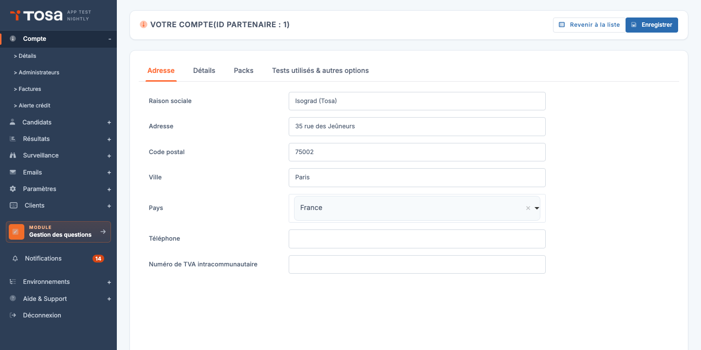
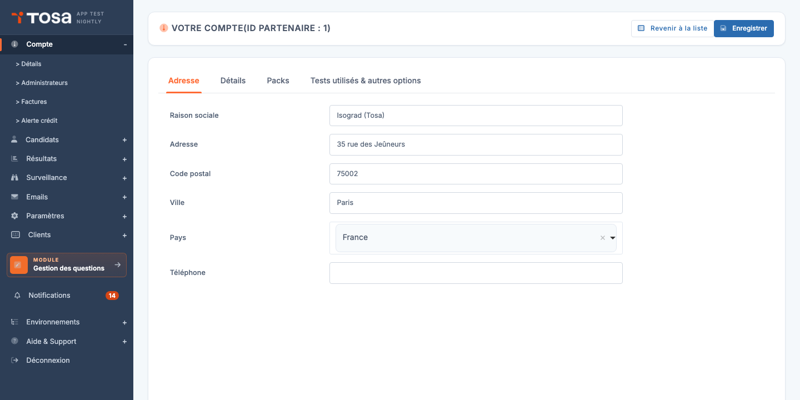
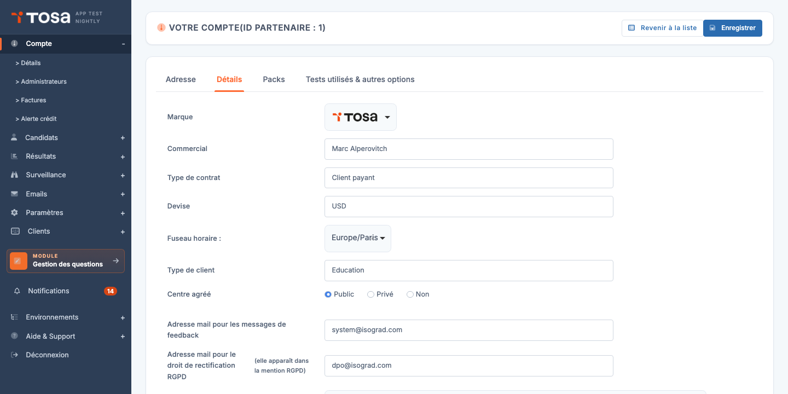
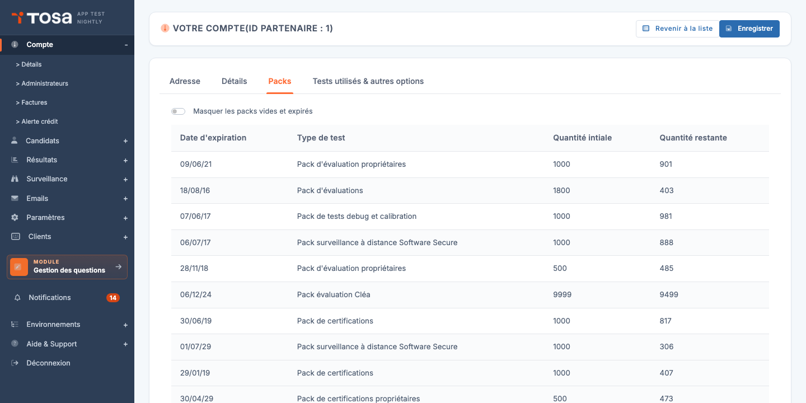
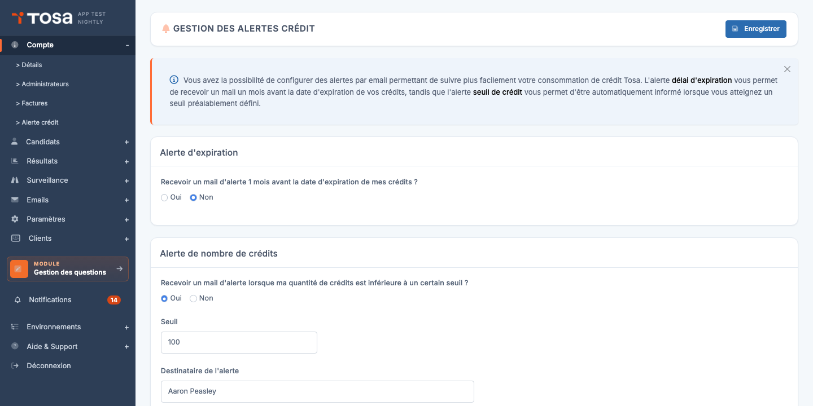

# Gestion de votre compte

Le menu **Compte** regroupe les pages relatives à votre **organisation** (raison sociale, adresse, logo), à la **gestion de vos crédits Tosa** (consultation des packs, alertes d'expiration et de seuil), et à votre **profil administrateur** (mot de passe, identifiants, langue).

Ce chapitre couvre les pages **Détails du compte** et **Alertes crédit**. La gestion des administrateurs est traitée dans son propre chapitre — voir [Gestion des administrateurs](/ai/admins/).

## Détails du compte {#details-du-compte}

Accédez à cette page via **Compte → Détails** depuis le menu de navigation, ou directement à l'URL `/clientadmin/account/CompanyUpdate`.

La page **Votre compte** est organisée en plusieurs **onglets** :

- **Adresse** — coordonnées postales et fiscales de votre organisation (raison sociale, adresse, téléphone, numéro de TVA).
- **Détails** — paramètres complémentaires : **logo** affiché sur les rapports, adresses RGPD et feedback, et selon votre profil, marque, commercial, devise et type de client.
- **Packs** — liste des packs de crédits en cours, leur quantité et leur date d'expiration.
- **Tests utilisés & autres options** — sélection des types de test activés sur le compte et autres options globales.

> 💡 **Onglets visibles selon votre profil** — Certains onglets ou champs n'apparaissent que selon le type de compte (par exemple, un onglet **CPF** apparaît pour les centres de formation français inscrits sur Mon Compte Formation). Ne vous inquiétez pas si vous n'avez pas exactement les mêmes onglets que dans la capture ci-dessus.

### Modifier les coordonnées du compte

1. Ouvrez l'onglet **Adresse** (sélectionné par défaut).

    

2. Modifiez les champs souhaités :

    - **Raison sociale** — nom légal de votre organisation.
    - **Adresse**, **Code postal**, **Ville**, **Pays** — adresse postale principale.
    - **Téléphone** — numéro de téléphone de contact.
    - **Numéro de TVA intracommunautaire** — utilisé pour la facturation des comptes européens.

3. Cliquez sur **Enregistrer** en haut à droite. Les modifications sont enregistrées immédiatement.

### Modifier le logo et les paramètres de notification

L'onglet **Détails** permet de personnaliser plusieurs éléments visibles dans vos communications avec les candidats.

- **Logo** — image (JPG ou PNG) qui apparaîtra sur les **rapports de test** envoyés aux candidats. Faites défiler la page jusqu'au bouton **Téléchargement logo**, cliquez pour ouvrir la fenêtre d'envoi, sélectionnez votre fichier et validez.
- **Adresse mail pour les messages de feedback** — adresse de contact lorsque le candidat utilise le formulaire de feedback dans la plateforme.
- **Adresse mail pour le droit de rectification RGPD** — adresse à laquelle vos candidats peuvent demander la rectification ou la suppression de leurs données personnelles. Apparaît dans la mention légale RGPD au pied de vos emails.

> 💡 **Champs distributeurs** — Si vous voyez sur cet onglet des champs comme **Marque**, **Commercial**, **Devise**, **Type de contrat**, **Type de client** ou **Centre agréé**, cela signifie que votre compte est de type distributeur ou centre agréé. Ces champs ne sont **pas modifiables par vous** ; ils sont gérés par votre interlocuteur Isograd.

> 💡 **Le logo n'apparaît pas dans les emails** — Le logo configuré ici est utilisé **uniquement dans les rapports PDF** envoyés aux candidats. Pour personnaliser l'en-tête de vos emails, utilisez la **bannière** dédiée — voir [Ajouter une bannière personnalisée](/ai/mail-templates/#ajouter-une-banniere-personnalisee).

## Packs et crédits {#packs-et-credits}

L'onglet **Packs** liste tous vos **packs de crédits Tosa** en cours, leur quantité initiale, leur quantité restante, et leur date d'expiration.

Le tableau présente, dans l'ordre, les colonnes suivantes :

| Colonne | Contenu |
|---|---|
| **Date d'expiration** | Date au-delà de laquelle les crédits seront perdus. |
| **Type de test** | Nature du pack (Pack d'évaluations, Pack de certifications, Pack surveillance à distance, etc.). |
| **Quantité initiale** | Nombre de crédits achetés à l'origine. |
| **Quantité restante** | Crédits encore disponibles à ce jour. |

Le commutateur **Masquer les packs vides et expirés** en haut du tableau permet de filtrer la vue pour ne voir que les packs encore utilisables — pratique lorsque l'historique de votre compte commence à devenir long.

### Acheter des crédits supplémentaires

Pour commander de nouveaux crédits, utilisez le bouton **Acheter des crédits de test** (visible selon votre type de contrat) ou contactez directement votre interlocuteur Isograd. Les packs achetés apparaissent automatiquement dans le tableau dès qu'ils sont mis en place sur votre compte.

> 💡 **Compte sans pack** — Si vous n'avez encore aucun pack, la plateforme affiche simplement *« Vous n'avez aucun pack de crédit en cours. »*

### Consulter le détail de la consommation

Au-delà de la liste des packs, la page **Compte → Consommation de crédits** présente la consommation détaillée par **groupe** et par **administrateur**, sur une période choisie. Cette vue est utile pour les bilans périodiques (« combien la promotion A a-t-elle consommé sur le dernier trimestre ? ») et peut être exportée vers Excel.

## Alertes crédit {#alertes-credit}

La page **Alertes crédit** (menu **Compte → Alerte crédit**, ou URL `/clientadmin/account/UpdateCreditAlerts`) permet de configurer **trois alertes par email** indépendantes pour suivre votre consommation de crédits sans avoir à venir vérifier le compte manuellement.

Les trois alertes sont :

- **Alerte d'expiration** — un email **un mois avant** la date d'expiration de vos crédits.
- **Alerte de nombre de crédits** — un email lorsque votre quantité de crédits passe **sous un seuil** que vous définissez.
- **Alerte de consommation mensuelle** — un email **chaque mois** récapitulant votre consommation du mois écoulé.

Chaque alerte est activable indépendamment via son **commutateur** dédié. Pour chacune, vous précisez le **destinataire** de l'alerte (qui n'est pas forcément vous — par exemple, le destinataire des alertes financières peut être votre responsable comptable).

### Configurer une alerte

1. Pour l'alerte qui vous intéresse, **activez le commutateur** *« Recevoir un mail d'alerte… »*. Les champs de configuration deviennent éditables.

2. Renseignez :

    - Le **destinataire** (adresse email) qui recevra l'alerte.
    - Pour l'**Alerte de nombre de crédits** uniquement : le **seuil** en nombre de crédits. Vous recevrez l'alerte dès que votre stock passe sous cette valeur.

3. Cliquez sur **Enregistrer** en haut à droite. La configuration est mise en place ; aucune action complémentaire n'est requise — la plateforme déclenchera l'envoi automatiquement quand les conditions seront remplies.

> 💡 **Recommandé** — Activez **au moins l'alerte d'expiration** et **l'alerte de seuil** pour éviter les mauvaises surprises (crédits expirés non utilisés, ou impossibilité d'inscrire un nouveau candidat parce que le compteur est tombé à zéro). L'alerte mensuelle est utile pour les comptes à fort volume.

> ⚠️ **Une seule alerte d'expiration par mois** — L'alerte d'expiration est déclenchée **une fois** par pack arrivant à échéance. Vous ne recevrez pas de relance quotidienne ; pensez à archiver l'email pour ne pas l'oublier.
