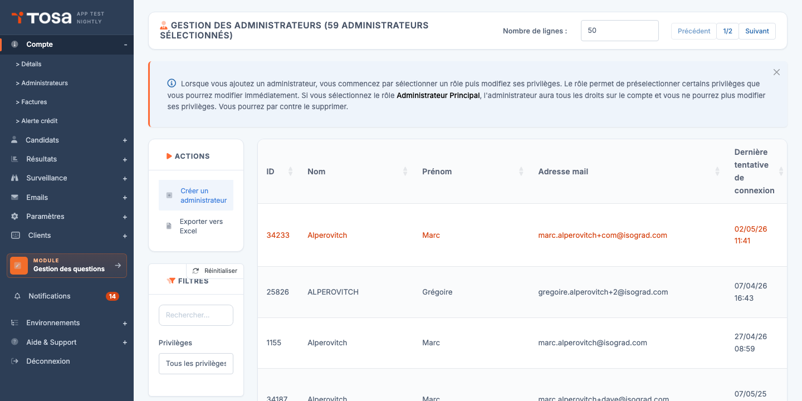
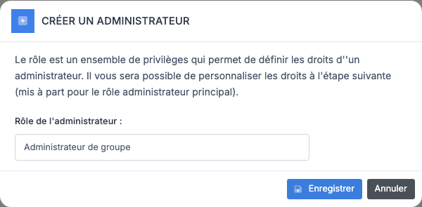
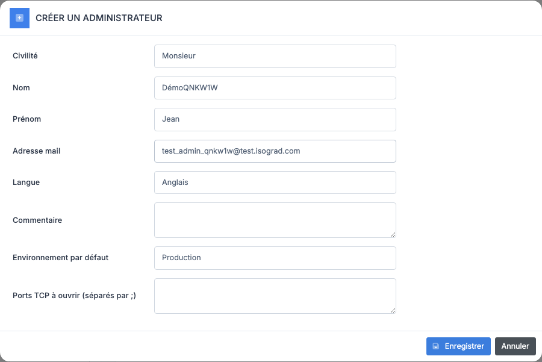
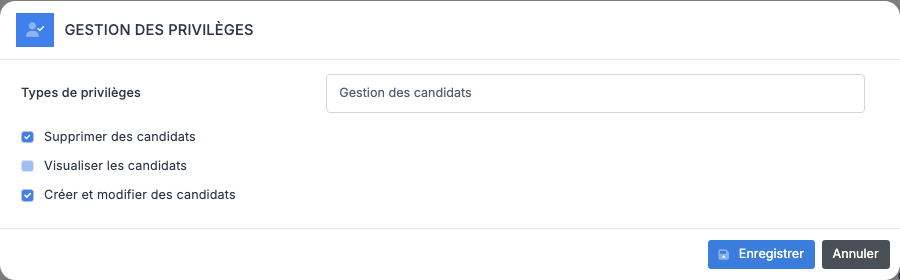
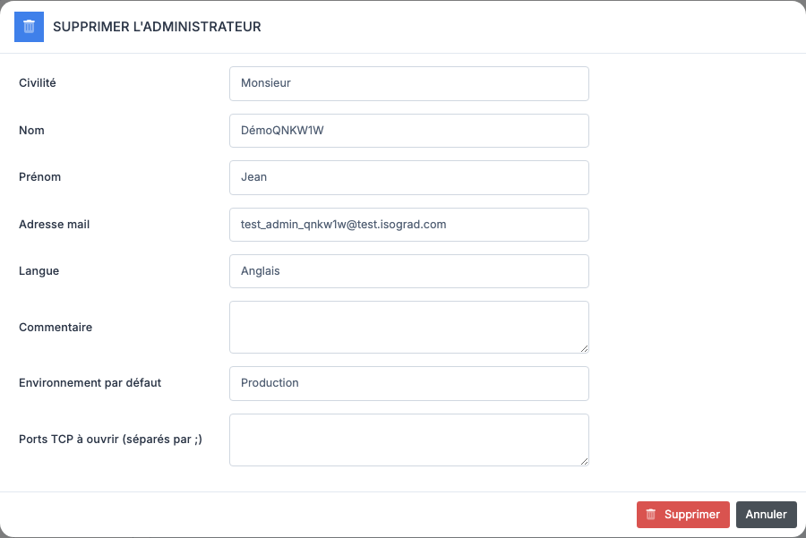

# Gestion des administrateurs

Un **administrateur** est un utilisateur disposant d'un accès à la console d'administration de votre compte. Ce chapitre décrit comment ajouter, modifier, désactiver, supprimer un administrateur, et comment ajuster finement ses privilèges sur la plateforme.

La page **Gestion des administrateurs** liste tous les administrateurs créés sur votre compte. Chaque ligne indique le **nom**, le **prénom**, l'**adresse email** et la **date de dernière tentative de connexion**. Les filtres en haut de page permettent de restreindre la liste par texte libre ou par privilège. Les boutons d'action — **Créer un administrateur** et **Exporter vers Excel** — se trouvent dans la barre d'actions en haut du tableau.

## Types d'administrateurs {#types-d-administrateurs}

La plateforme distingue deux profils principaux pour les administrateurs d'un compte client :

- **Administrateur principal** — dispose de l'ensemble des droits sur le compte : il peut gérer tous les candidats, tous les groupes, modifier les paramètres du compte, et créer ou révoquer d'autres administrateurs. Il y a en général **un seul** administrateur principal par compte.
- **Administrateur de groupe** — accès restreint aux candidats et résultats des **groupes qu'il est chargé de gérer**, ainsi qu'aux groupes publics. Idéal pour déléguer la gestion d'une promotion, d'un service ou d'un client à un responsable local sans lui ouvrir tout le compte.

Le profil est choisi au moment de la création (voir [Ajouter un administrateur](#ajouter-un-administrateur)). Au-delà du profil, les **privilèges fins** (lecture/écriture/suppression sur les candidats, les modèles d'email, les sessions, etc.) sont réglables individuellement — voir [Modifier les privilèges](#modifier-les-privileges).

## Ajouter un administrateur {#ajouter-un-administrateur}

La création d'un administrateur se fait en **deux étapes** : choix du rôle, puis saisie des coordonnées.

### Étape 1 — Choix du rôle

1. Depuis la page **Gestion des administrateurs**, cliquez sur **Créer un administrateur**.

    

2. Dans la fenêtre qui s'ouvre, choisissez le **rôle** dans la liste déroulante (Administrateur principal, Administrateur de groupe, etc.).

3. Validez. La plateforme crée immédiatement un enregistrement vide et ouvre la fenêtre de saisie des coordonnées.

### Étape 2 — Coordonnées

Remplissez les champs :

- **Civilité** — Monsieur / Madame.
- **Nom** — nom de famille.
- **Prénom** — prénom.
- **Adresse email** — sert à la fois d'identifiant de connexion et d'adresse de notification. Doit être unique sur la plateforme.
- **Langue** — langue de l'interface pour cet administrateur. Les emails système (réinitialisation de mot de passe, etc.) sont aussi envoyés dans cette langue.

Cliquez sur **Enregistrer** pour valider la création. Le nouvel administrateur apparaît immédiatement dans le tableau.

> 💡 **Mot de passe initial** — Aucun mot de passe ne vous est demandé. L'administrateur le définira lui-même via le **lien de premier accès** envoyé à son adresse email. Voir [Envoyer les identifiants](#envoyer-les-identifiants) pour renvoyer ce lien si nécessaire.

## Modifier un administrateur {#modifier-un-administrateur}

1. Sur la page **Gestion des administrateurs**, repérez la ligne de l'administrateur à modifier.

    

2. Cliquez sur l'icône **Modifier** (crayon) en bout de ligne. La fenêtre de modification s'ouvre.

    

3. Modifiez les champs souhaités (civilité, nom, prénom, adresse email, langue d'interface).

4. Cliquez sur **Enregistrer**. Les changements sont appliqués immédiatement.

> 💡 **Changer sa propre langue d'interface** — Cette même fenêtre vous permet de modifier votre **propre** langue : repérez votre ligne dans le tableau et cliquez sur l'icône **Modifier**. Après enregistrement, **reconnectez-vous** pour que le changement prenne effet (la langue est mise en cache dans la session au moment de la connexion).

## Modifier les privilèges {#modifier-les-privileges}

Les **privilèges** sont des droits fins (lecture, écriture, suppression) sur les différentes ressources de la plateforme : candidats, groupes, sessions, modèles d'email, etc. Vous pouvez les ajuster individuellement pour chaque administrateur, en plus du rôle choisi à la création.

### Procédure

1. Sur la page **Gestion des administrateurs**, repérez la ligne de l'administrateur. Cliquez sur l'icône **Privilèges** (silhouette avec coche) en bout de ligne.

    

2. La fenêtre affiche les privilèges **regroupés par catégorie** (Candidats, Sessions, Emails, Résultats, etc.). Pour chaque privilège, une case à cocher indique si l'administrateur le possède.

3. Cochez ou décochez les privilèges souhaités.

4. Cliquez sur **Enregistrer**. Les nouveaux privilèges sont actifs immédiatement.

### Lecture des privilèges

Chaque ressource expose en général trois niveaux :

- **Lecture** — l'administrateur peut consulter mais pas modifier.
- **Écriture** — l'administrateur peut créer et modifier.
- **Suppression** — l'administrateur peut supprimer des enregistrements.

Certains privilèges sont **transverses** ; par exemple *Lecture/écriture des emails d'un autre administrateur* permet à un administrateur de gérer les modèles d'email créés par ses collègues, et pas seulement les siens.

> ⚠️ **Privilèges et rôle** — Les privilèges fins **s'ajoutent** au rôle, ils ne le remplacent pas. Un Administrateur principal a déjà tous les privilèges par défaut ; la fenêtre Privilèges sert surtout à **ouvrir** des accès supplémentaires à un Administrateur de groupe.

### Filtrer par privilège

Le filtre **Tous les privilèges** en haut de la page principale permet d'isoler les administrateurs disposant d'un privilège donné. C'est utile pour, par exemple, identifier rapidement les administrateurs qui peuvent supprimer des candidats avant de revoir leurs droits.

## Désactiver et débloquer un administrateur {#desactiver-administrateur}

La désactivation **empêche un administrateur de se connecter**, sans supprimer son compte ni ses données. Il pourra être réactivé (« débloqué ») à tout moment.

### Désactiver

1. Sur la ligne de l'administrateur, cliquez sur l'icône **Désactiver** (cadenas fermé).
2. Confirmez l'action.
3. L'icône **Désactiver** est remplacée par une icône **Débloquer** (cadenas ouvert), signalant que le compte est désormais bloqué.

### Débloquer

1. Sur la ligne d'un administrateur désactivé (ou verrouillé après plusieurs tentatives de connexion infructueuses), cliquez sur l'icône **Débloquer l'administrateur**.
2. L'administrateur peut à nouveau se connecter normalement.

> 💡 **Désactivation vs suppression** — Préférez la **désactivation** lorsque vous voulez retirer temporairement l'accès — par exemple, un collaborateur en congé prolongé. Réservez la **suppression** aux comptes créés par erreur ou aux départs définitifs : la suppression est irréversible et fait perdre l'historique d'événements rattachés à l'administrateur.

> ⚠️ **Vous ne pouvez pas vous désactiver vous-même** — Le bouton Désactiver n'apparaît pas sur votre propre ligne. Pour transférer un compte, créez d'abord un nouvel administrateur principal, demandez-lui de se connecter au moins une fois, puis demandez-lui de désactiver votre ancien compte.

## Réinitialiser le 2FA {#reinitialiser-2fa}

Si l'authentification à deux facteurs (2FA) est activée sur le compte et qu'un administrateur a perdu l'accès à son application d'authentification, vous pouvez **réinitialiser son 2FA** pour qu'il le reconfigure à sa prochaine connexion.

1. Sur la ligne de l'administrateur, cliquez sur l'icône **Réinitialiser le 2FA** (icône clé).
2. Confirmez l'action.
3. À sa prochaine connexion, l'administrateur sera invité à re-scanner un QR code et à reconfigurer son application d'authentification.

> 💡 **Disponibilité** — L'icône **Réinitialiser le 2FA** n'apparaît que si l'authentification à deux facteurs est activée pour votre compte. Si vous ne la voyez pas, c'est que le compte ne l'utilise pas — il n'y a alors rien à réinitialiser.

## Envoyer les identifiants {#envoyer-les-identifiants}

Le bouton **Envoyer les identifiants** envoie à l'administrateur un email contenant un **lien de réinitialisation de mot de passe**. C'est l'action à utiliser dans deux cas :

- L'administrateur vient d'être créé et n'a pas encore reçu (ou a perdu) son lien de premier accès.
- L'administrateur ne se souvient plus de son mot de passe — plutôt que lui demander de cliquer sur « Mot de passe oublié » sur la page de connexion, vous pouvez lui pousser le lien depuis l'administration.

### Procédure

1. Sur la ligne de l'administrateur, cliquez sur l'icône **Envoyer les identifiants** (icône enveloppe).
2. La plateforme envoie immédiatement l'email — aucune confirmation supplémentaire n'est demandée.
3. Une notification de succès apparaît en haut à droite de l'écran.

> 💡 **Validité du lien** — Le lien de réinitialisation a une durée de vie limitée. Si l'administrateur ne l'utilise pas dans le délai imparti, renvoyez-en un nouveau via la même procédure.

## Supprimer un administrateur {#supprimer-un-administrateur}

1. Sur la ligne de l'administrateur, cliquez sur l'icône **Supprimer** (poubelle).
2. Une fenêtre de confirmation s'affiche.

    

3. Validez. L'administrateur est supprimé immédiatement.

> ⚠️ **Suppression définitive** — Contrairement à la désactivation, la suppression est **irréversible**. Les enregistrements rattachés à cet administrateur (par exemple les modèles d'email privés qu'il avait créés) deviennent orphelins ou sont également supprimés selon les cas. Avant de supprimer, **préférez la [désactivation](#desactiver-administrateur)** si l'objectif est seulement de couper l'accès.

> 💡 **Vous ne pouvez pas vous supprimer vous-même** — Comme pour la désactivation, le bouton Supprimer n'apparaît pas sur votre propre ligne.

## Exporter la liste {#exporter-la-liste}

Le bouton **Exporter vers Excel** dans la barre d'actions génère un fichier `.xlsx` listant tous les administrateurs **filtrés à l'écran** au moment du clic. L'export inclut, en plus des colonnes visibles, la **liste détaillée des privilèges** de chaque administrateur — une vue très utile pour auditer périodiquement qui peut faire quoi sur votre compte.
