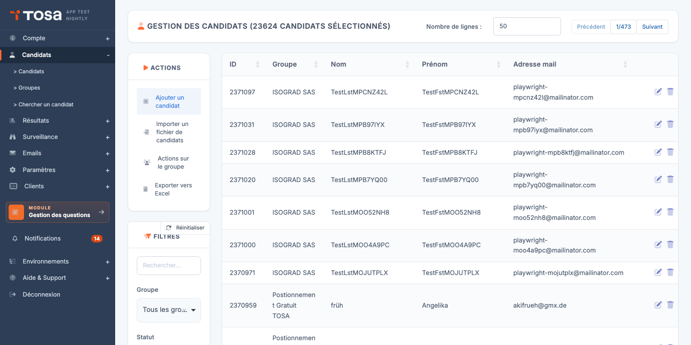
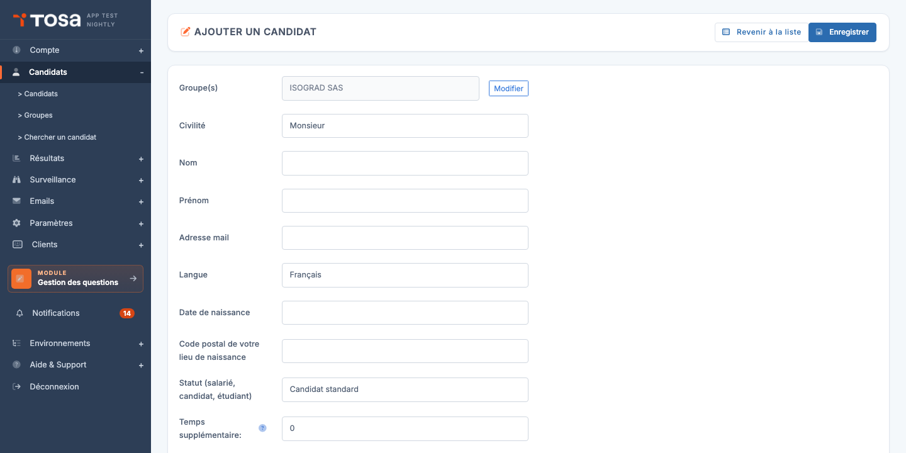
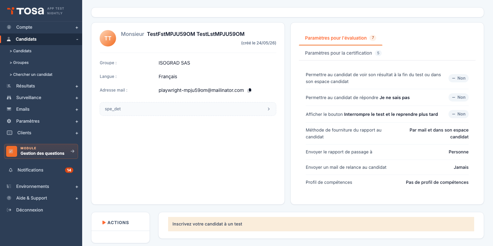
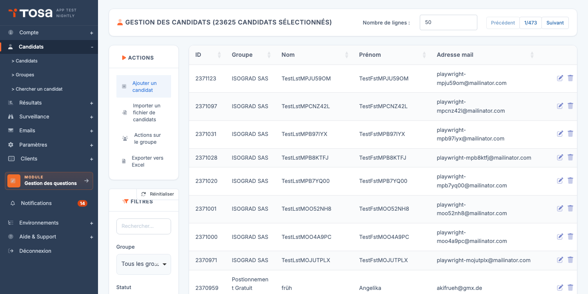

* TOC
{:toc}

# Manuel utilisateur Tosa

Bienvenue dans le manuel d'utilisation de la plateforme Tosa.

Ce manuel s'adresse aux **administrateurs de compte** : responsables formation, gestionnaires RH, coordinateurs de tests. Il décrit pas à pas les opérations courantes sur la plateforme.

> 💡 **Proof of concept** — Cette version pilote couvre uniquement le chapitre **Gestion des candidats**. Les autres chapitres seront ajoutés au fil de la validation.

## Conventions

- Les captures d'écran représentent l'interface réelle de la plateforme telle qu'elle se présente à un administrateur de compte. Elles sont générées automatiquement à partir des dernières versions du code et restent donc fidèles à ce que vous voyez à l'écran.
- Les instructions sont rédigées à l'impératif : *« Cliquez sur… »*, *« Remplissez le champ… »*.
- Les noms d'éléments d'interface (boutons, libellés de champ) reprennent strictement l'intitulé affiché par la plateforme.

# Gestion des candidats

Ce chapitre couvre l'ensemble du cycle de vie d'un candidat sur la plateforme Tosa : ajouter des candidats individuellement ou par lot, les inscrire à des tests, leur envoyer des invitations et organiser votre population en groupes.

La page **Gestion des candidats** se présente sous la forme d'un tableau listant l'ensemble de vos candidats. Les filtres en haut de page permettent de restreindre l'affichage (recherche libre, appartenance à un groupe, candidats ayant un test à passer, inclusion des archivés). Les actions principales — ajouter un candidat, importer un fichier, accéder à la gestion des groupes — se trouvent dans la barre d'actions en haut du tableau.

## Ajouter un candidat

Cette procédure permet de créer un candidat individuellement. Pour ajouter plusieurs candidats en une seule opération, reportez-vous à la section [Importer des candidats](#importer-des-candidats).

### Procédure

1. Depuis la page **Gestion des candidats**, repérez le bouton **Ajouter un candidat** dans la barre d'actions en haut du tableau.

    

2. Cliquez sur **Ajouter un candidat**. Le formulaire de saisie s'ouvre.

    

3. Remplissez les champs obligatoires :

    - **Prénom** — prénom du candidat tel qu'il apparaîtra sur les attestations.
    - **Nom** — nom du candidat.
    - **Email** — adresse à laquelle le candidat recevra ses invitations et accédera à son espace.
    - **Pays** — utilisé pour adapter la langue par défaut des emails.

4. Cliquez sur **Enregistrer**. Le candidat est créé et vous êtes automatiquement redirigé vers sa fiche d'inscription aux tests.

    

À partir de cette fiche, vous pouvez immédiatement [inscrire le candidat à un test](#inscrire-un-candidat-à-un-test) ou [lui envoyer une invitation](#envoyer-les-invitations).

> 💡 **Modification ultérieure** — Pour modifier les coordonnées d'un candidat existant, retournez sur la liste des candidats, cliquez sur l'icône **Modifier** au bout de la ligne, puis sur l'onglet **Détails du candidat**.

## Importer des candidats

L'import de candidats vous permet de créer plusieurs candidats — voire de les pré-inscrire à des tests — en une seule opération, à partir d'un fichier Excel.

### Procédure

1. Depuis la page **Gestion des candidats**, repérez le bouton **Importer un fichier de candidats** dans la barre d'actions.

    

2. Avant de préparer votre fichier, téléchargez le **modèle de fichier** depuis le lien proposé. Le modèle contient les en-têtes attendus et un exemple de ligne.

3. Remplissez le modèle avec vos candidats. Les colonnes principales :

    | Colonne | Obligatoire | Description |
    |---|---|---|
    | Prénom | Oui | Prénom du candidat. |
    | Nom | Oui | Nom du candidat. |
    | Email | Oui | Une adresse email unique par candidat. |
    | Pays | Non | Code pays (FR, BE, …) pour la langue par défaut. |
    | Groupe | Non | Nom d'un groupe auquel rattacher le candidat. Créé automatiquement s'il n'existe pas. |
    | Test | Non | Nom du sujet auquel inscrire le candidat directement à l'import. |

4. Cliquez sur **Importer un fichier de candidats**, sélectionnez votre fichier, et validez.

5. La plateforme affiche un rapport d'import : nombre de candidats créés, mis à jour, ou rejetés (avec le motif de rejet ligne par ligne).

> ⚠️ **Doublons d'email** — Si un candidat existe déjà avec la même adresse email, ses informations sont **mises à jour** plutôt que recréées. Un nouvel enregistrement n'est jamais créé pour une adresse existante.

> 💡 **Import et invitations** — L'import ne déclenche **pas** automatiquement l'envoi d'invitations. Pour envoyer les emails de connexion après import, reportez-vous à la section [Envoyer les invitations](#envoyer-les-invitations).

## Inscrire un candidat à un test

Une fois le candidat créé, vous devez l'inscrire à un ou plusieurs tests pour qu'il puisse les passer.

### Inscrire un candidat depuis sa fiche

1. Depuis la liste des candidats, cliquez sur l'icône **Modifier** de la ligne correspondante. Vous arrivez sur la page d'inscription aux tests du candidat.

    

2. Cliquez sur **Ajouter un test**.

    

3. Dans la fenêtre qui s'ouvre, choisissez le **sujet** (matière) à évaluer, puis paramétrez l'inscription :

    - **Type de test** — évaluation, certification, etc., selon les packs disponibles sur votre compte.
    - **Langue** — langue dans laquelle le test sera présenté au candidat.
    - **Date limite** (facultatif) — au-delà de cette date, le candidat ne pourra plus démarrer le test.
    - **Surveillance** (facultatif) — active la session surveillée si votre compte dispose de l'option.

4. Validez. Le test apparaît immédiatement dans le tableau d'inscriptions du candidat.

### Inscrire plusieurs candidats à la fois

Pour inscrire plusieurs candidats au même test, utilisez l'action de groupe :

1. Sur la page **Gestion des candidats**, sélectionnez les candidats à inscrire en cochant la case en début de ligne.
2. Dans le menu d'actions de groupe, choisissez **Inscrire les candidats à un test**.
3. Renseignez les paramètres du test ; ils s'appliquent à l'ensemble de la sélection.

> 💡 **Crédits** — Chaque inscription consomme un crédit du pack correspondant. Le solde restant est visible en haut de page. Pour racheter des crédits, contactez votre interlocuteur Isograd.

## Envoyer les invitations

L'envoi d'invitation par email transmet au candidat son lien de connexion personnalisé. C'est l'étape qui rend le test accessible côté candidat.

### Envoyer une invitation à un seul candidat

1. Ouvrez la fiche du candidat (depuis la liste, cliquez sur l'icône **Modifier**).

    

2. Cliquez sur **Envoyer l'email d'inscription** (ou le bouton équivalent visible dans la fiche).

3. Une fenêtre vous permet de :

    - Choisir le **modèle d'email** (langue, ton, signature) parmi ceux configurés pour votre compte.
    - **Prévisualiser** le contenu qui sera envoyé.
    - **Personnaliser** l'objet ou le corps si besoin, avant envoi.

4. Cliquez sur **Envoyer**. Le candidat reçoit immédiatement son email contenant le lien de connexion.

### Envoyer des invitations en masse

Depuis la page **Gestion des candidats** :

1. Sélectionnez les candidats à inviter (case à cocher en début de ligne).
2. Dans le menu d'actions de groupe, choisissez **Envoyer les emails d'inscription**.
3. Choisissez le modèle d'email et validez.

Tous les candidats sélectionnés reçoivent l'invitation avec leur lien personnel.

> ⚠️ **Adresses invalides** — Si l'adresse email d'un candidat est invalide ou refusée par le serveur de destination, vous le verrez dans le rapport d'envoi. Corrigez l'adresse sur la fiche du candidat puis relancez l'envoi.

> 💡 **Personnaliser les modèles d'email** — Les modèles d'email sont gérés dans le chapitre **Gestion des mails** (à venir). Vous pouvez y créer des variantes par langue, par marque, ou par type de test.

## Gérer les groupes

Les groupes vous permettent d'organiser votre population de candidats (par promotion, service, client, formation…) pour faciliter les actions en masse : inscriptions, invitations, suivi des résultats.

### Accéder aux groupes

Depuis le menu de navigation, cliquez sur **Groupes** (ou accédez à l'URL `/clientadmin/candidates/AdminGroupsWithTable`).

La page **Gestion des groupes** affiche l'ensemble de vos groupes sous forme hiérarchique. Un groupe peut contenir des sous-groupes — utile par exemple pour structurer "Promotion 2026 → Section A → Cours du soir".

### Créer un groupe

1. Cliquez sur **Ajouter un groupe** dans la barre d'actions.
2. Renseignez :

    - **Nom** du groupe.
    - **Groupe parent** (facultatif) — pour créer une hiérarchie.
    - **Couleur** ou tag (selon votre version) — pour repérer visuellement le groupe.

3. Validez.

### Ajouter un candidat à un groupe

Deux méthodes :

- **Depuis la fiche du candidat** : ouvrez la fiche, onglet **Groupes**, ajoutez le candidat aux groupes voulus.
- **Action de groupe** sur la liste des candidats : sélectionnez les candidats, puis **Ajouter à un groupe**.

### Actions de groupe

Une fois vos candidats organisés en groupes, le filtre **Groupe** de la page **Gestion des candidats** vous permet d'isoler une population et de lui appliquer une action en masse :

- Inscrire tout le groupe à un test.
- Envoyer une invitation à tout le groupe.
- Définir un mot de passe commun.
- Affecter le groupe à une session surveillée.
- Archiver le groupe (les candidats restent en base mais sont masqués par défaut).
- Supprimer les tests inscrits, ou supprimer les candidats du groupe.

> 💡 **Archivage vs suppression** — L'**archivage** est non destructif : il masque le groupe et ses candidats des listes par défaut, mais préserve l'historique des tests passés. La **suppression** est définitive — utilisez-la uniquement pour les candidats créés par erreur.

