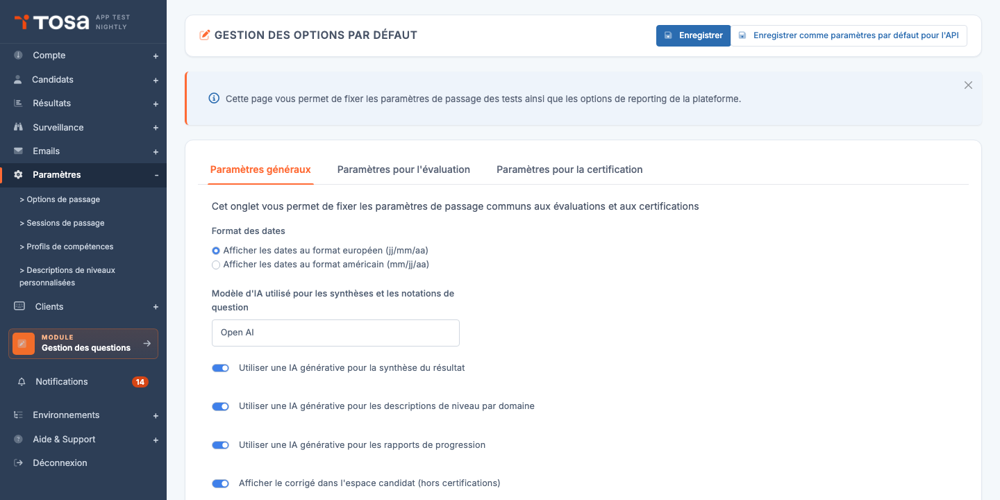
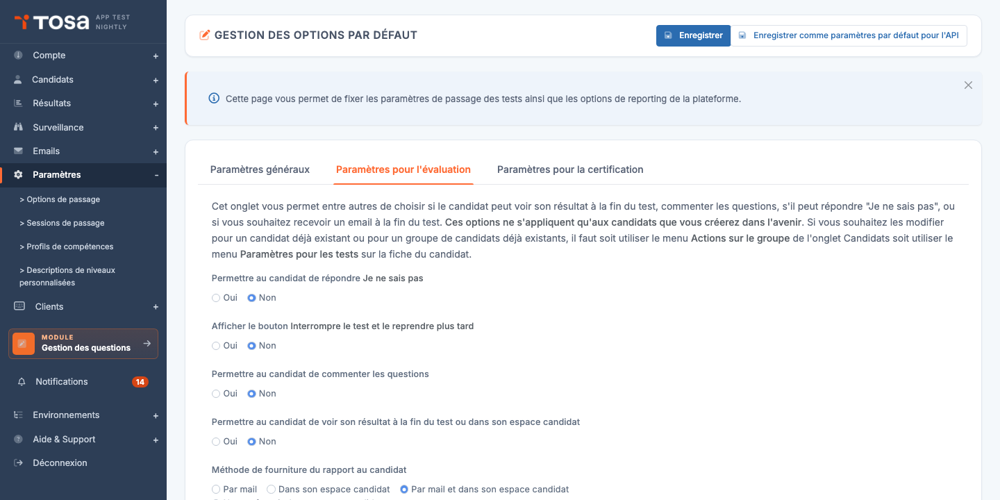
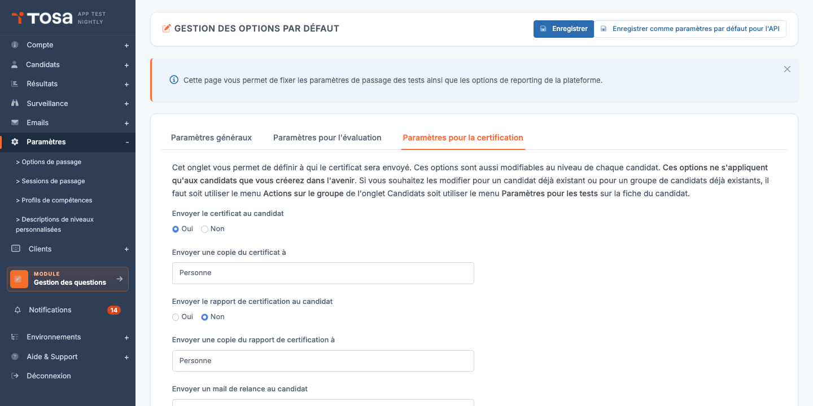

# Options par défaut

La page **Options par défaut** centralise les **paramètres de passage** appliqués à tous les tests inscrits sur votre compte. Les valeurs définies ici sont **pré-remplies** dans la fenêtre d'inscription d'un candidat à un test — vous pouvez toujours les modifier ponctuellement au cas par cas, mais les régler ici fait gagner du temps et garantit la cohérence sur l'ensemble de votre activité.

Accédez à cette page via le menu **Paramètres → Options de passage**, ou directement à l'URL `/clientadmin/parameters/UpdateDefaultOptions`.

La page est organisée en plusieurs **onglets** :

- **Paramètres généraux** — réglages communs aux évaluations **et** aux certifications.
- **Paramètres pour l'évaluation** — spécifique aux tests d'évaluation.
- **Paramètres pour la certification** — spécifique aux passages certifiants (uniquement si votre compte propose des certifications).
- **Politique de repassage** — configuration des tentatives multiples (selon votre type de compte).

> 💡 **Enregistrer** — Toutes les modifications sont appliquées en cliquant sur **Enregistrer** en haut à droite. La sauvegarde s'applique à **tous les onglets** simultanément.

> 💡 **Comme paramètres par défaut pour l'API** — Le bouton **Enregistrer comme paramètres par défaut pour l'API** (lorsqu'il est visible) applique en plus les valeurs courantes aux inscriptions créées par l'API REST. Sans ce bouton, les paramètres ne s'appliquent qu'aux inscriptions faites via l'interface.

## Paramètres généraux {#parametres-generaux}

Cet onglet regroupe les paramètres qui s'appliquent **quel que soit le type de test** :

### Format des dates

Choisissez entre :

- **Afficher les dates au format européen (jj/mm/aa)** — par défaut pour les comptes basés en Europe.
- **Afficher les dates au format américain (mm/jj/aa)** — par défaut pour les comptes basés aux États-Unis.

Le format choisi s'applique à toutes les dates affichées dans les rapports et l'interface candidat.

### Options IA générative

Selon les options activées sur votre compte, vous pouvez voir des réglages relatifs à l'usage d'IA générative pour enrichir les rapports :

- **Modèle d'IA utilisé pour les synthèses et les notations de question** — choix du moteur (Open AI, etc.) selon votre offre.
- **Utiliser une IA générative pour la synthèse du résultat** — la plateforme génère un résumé du résultat en quelques phrases.
- **Utiliser une IA générative pour les descriptions de niveau par domaine** — explicite, par domaine de compétence, ce que le score signifie.
- **Utiliser une IA générative pour les rapports de progression** — pour les rapports comparatifs entre plusieurs sessions d'un même candidat.

> ⚠️ **Activation des IA génératives** — Ces options ne sont **modifiables** que si votre compte dispose des privilèges correspondants. Si vous voyez les commutateurs mais qu'ils sont grisés, contactez votre interlocuteur Isograd pour activer la fonctionnalité.

### Corrigé pour les évaluations

- **Afficher le corrigé dans l'espace candidat (hors certifications)** — donne au candidat accès au corrigé de ses réponses dans son espace après une **évaluation**. Cette option ne s'applique pas aux certifications (le corrigé d'une certification est traité séparément, voir [Paramètres pour la certification](#parametres-certification)).

## Paramètres pour l'évaluation {#parametres-evaluation}

Cet onglet regroupe les **options de passage** des tests d'évaluation.

> ⚠️ **Périmètre d'application** — Comme l'indique le bandeau d'aide en haut de l'onglet, *« ces options ne s'appliquent qu'aux candidats que vous créerez dans l'avenir »*. Pour modifier les options d'un candidat ou d'un groupe **déjà existant**, utilisez le menu **Actions sur le groupe** de l'onglet Candidats, ou le menu **Paramètres pour les tests** sur la fiche du candidat.

### Options de passage

Pour chaque option ci-dessous, choisissez **Oui** ou **Non** :

- **Permettre au candidat de répondre « Je ne sais pas »** — ajoute un bouton dédié sur chaque question. La réponse est comptée comme incorrecte mais distinguée d'une réponse erronée dans le rapport — utile pour mesurer la confiance du candidat.
- **Afficher le bouton « Interrompre le test et le reprendre plus tard »** — autorise le candidat à mettre son test en pause. Choisissez **Non** pour forcer un passage en une seule session.
- **Permettre au candidat de commenter les questions** — affiche un champ commentaire sur chaque question. Les commentaires sont consultables a posteriori dans le rapport — utile pour collecter du feedback en phase de mise en place.
- **Permettre au candidat de voir son résultat à la fin du test ou dans son espace candidat** — choisissez **Non** si vous souhaitez **réserver l'accès aux résultats à l'administrateur** (par exemple pour un examen surveillé où le résultat doit être communiqué officiellement).

### Méthode de fourniture du rapport au candidat

Trois choix mutuellement exclusifs :

- **Par mail** — le rapport est envoyé par email dès la fin du test.
- **Dans son espace candidat** — le rapport est uniquement accessible depuis l'espace candidat connecté.
- **Par mail et dans son espace candidat** — combinaison des deux : email + accès permanent dans l'espace.

## Paramètres pour la certification {#parametres-certification}

Cet onglet n'est visible que si votre compte propose des **certifications** (typiquement les comptes Tosa).

> ⚠️ **Périmètre d'application** — Comme pour l'onglet Évaluation, ces options *ne s'appliquent qu'aux candidats que vous créerez dans l'avenir*.

### Envoi du certificat

- **Envoyer le certificat au candidat** (Oui/Non) — active l'envoi automatique du diplôme PDF au candidat dès la validation de la certification.
- **Envoyer une copie du certificat à** — adresse email d'un administrateur qui recevra une copie de chaque diplôme émis (par défaut « Personne », c'est-à-dire pas de copie).

### Envoi du rapport de certification

- **Envoyer le rapport de certification au candidat** (Oui/Non) — distinct du certificat : le rapport de certification est plus détaillé (compétences, comparaison aux niveaux attendus).
- **Envoyer une copie du rapport de certification à** — adresse administrateur pour la copie du rapport.

### Relances automatiques

- **Envoyer un mail de relance au candidat** — active l'envoi automatique d'emails de relance pour les candidats qui n'ont pas démarré leur certification. La fréquence des relances est configurée séparément sur la fiche du candidat.

## Politique de repassage {#politique-de-repassage}

L'onglet **Politique de repassage** (visible selon le type de compte) configure les règles de **tentatives multiples** pour les certifications :

- **Score minimum par matière** — score en-dessous duquel un candidat doit repasser. Au-dessus, la matière est validée.
- **Nombre maximum de tentatives** — combien de fois un candidat peut repasser une matière.
- **Délai de repassage (jours)** — temps minimum entre deux tentatives sur la même matière.

> 💡 **Bonne pratique** — Définir un délai non nul (par exemple 7 jours) entre deux tentatives évite que le candidat « brûle » ses tentatives en répondant au hasard juste après avoir échoué. Le délai laisse le temps de réviser.
