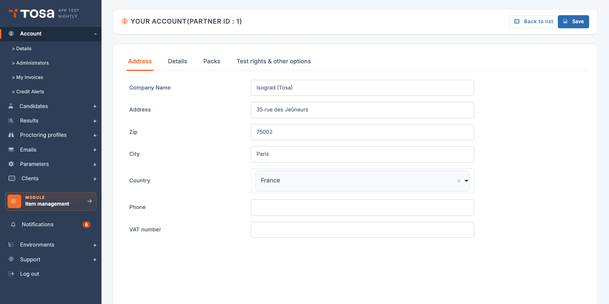
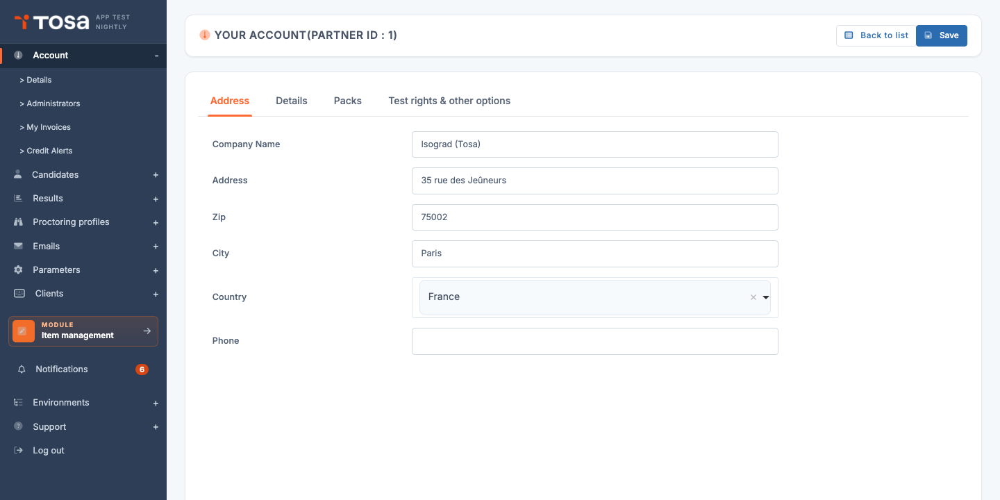
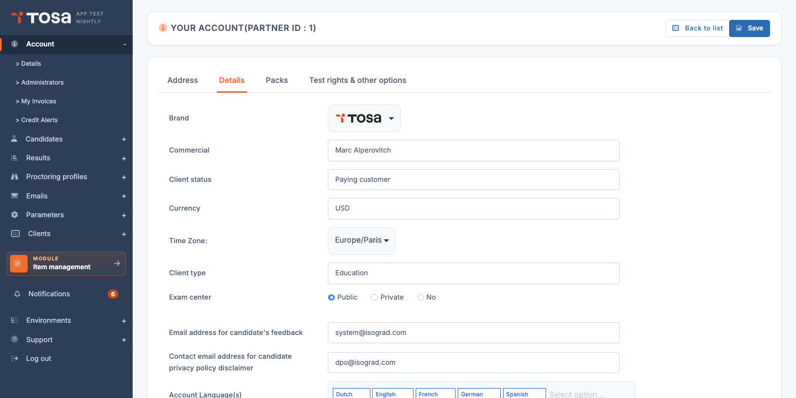
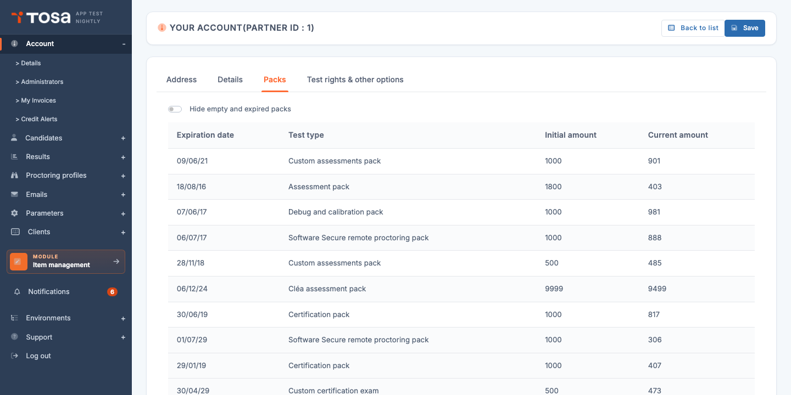
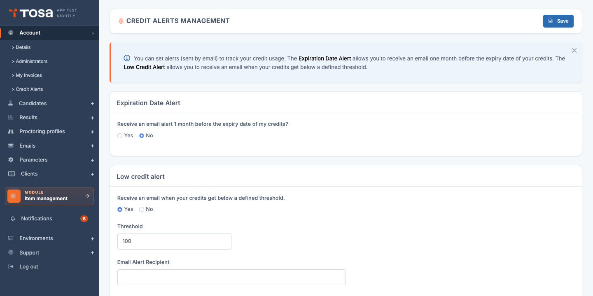

# Account management

The **Account** menu gathers the pages related to your **organization** (legal name, address, logo), to the **management of your Tosa credits** (pack overview, expiration and threshold alerts), and to your **administrator profile** (password, credentials, language).

This chapter covers the **Account details** and **Credit alerts** pages. Administrator management is covered in its own chapter — see [Administrator management](/ai/en/admins/).

## Account details {#account-details}

Access this page via **Account → Details** from the navigation menu, or directly at the URL `/clientadmin/account/CompanyUpdate`.

The **Your account** page is organized into several **tabs**:

- **Address** — postal and tax details of your organization (legal name, address, phone, VAT number).
- **Details** — additional settings: **logo** displayed on reports, GDPR and feedback email addresses, and depending on your profile, brand, sales contact, currency and customer type.
- **Packs** — list of credit packs in progress, their quantity and their expiration date.
- **Tests used & other options** — selection of test types enabled on the account and other global options.

> 💡 **Tabs visible according to your profile** — Some tabs or fields only appear depending on the account type (for example, a **CPF** tab appears for French training centers registered on Mon Compte Formation). Don't worry if you don't have exactly the same tabs as in the screenshot above.

### Edit account details

1. Open the **Address** tab (selected by default).

    

2. Edit the desired fields:

    - **Legal name** — legal name of your organization.
    - **Address**, **Postal code**, **City**, **Country** — main postal address.
    - **Phone** — contact phone number.
    - **Intra-community VAT number** — used for billing European accounts.

3. Click **Save** at the top right. Changes are saved immediately.

### Edit the logo and notification settings

The **Details** tab lets you customize several elements visible in your communications with candidates.

- **Logo** — image (JPG or PNG) that will appear on the **test reports** sent to candidates. Scroll down to the **Upload logo** button, click to open the upload window, select your file and confirm.
- **Feedback email address** — contact address used when a candidate fills in the feedback form on the platform.
- **GDPR rectification email address** — address at which your candidates can request rectification or deletion of their personal data. It appears in the GDPR legal notice at the foot of your emails.

> 💡 **Distributor fields** — If you see fields like **Brand**, **Sales contact**, **Currency**, **Contract type**, **Customer type** or **Approved center** on this tab, it means your account is of distributor or approved-center type. These fields **cannot be modified by you**; they are managed by your Isograd contact.

> 💡 **The logo does not appear in emails** — The logo configured here is used **only in the PDF reports** sent to candidates. To customize the header of your emails, use the dedicated **banner** — see [Add a custom banner](/ai/en/mail-templates/#add-a-custom-banner).

## Packs and credits {#packs-and-credits}

The **Packs** tab lists all your **Tosa credit packs** in progress, their initial quantity, their remaining quantity, and their expiration date.

The table shows, in order, the following columns:

| Column | Content |
|---|---|
| **Expiration date** | Date beyond which the credits will be lost. |
| **Test type** | Nature of the pack (Evaluation pack, Certification pack, Remote proctoring pack, etc.). |
| **Initial quantity** | Number of credits originally purchased. |
| **Remaining quantity** | Credits still available to date. |

The **Hide empty and expired packs** toggle at the top of the table lets you filter the view to only see the packs that are still usable — convenient once your account history starts to grow long.

### Purchase additional credits

To order new credits, use the **Purchase test credits** button (visible depending on your contract type) or contact your Isograd representative directly. Purchased packs appear automatically in the table as soon as they are set up on your account.

> 💡 **Account with no packs** — If you don't have any pack yet, the platform simply displays *"You have no credit pack in progress."*

### View consumption details

Beyond the list of packs, the **Account → Credit consumption** page shows detailed consumption per **group** and per **administrator**, over a chosen period. This view is useful for periodic reviews ("how much did promotion A consume over the last quarter?") and can be exported to Excel.

## Credit alerts {#credit-alerts}

The **Credit alerts** page (menu **Account → Credit alert**, or URL `/clientadmin/account/UpdateCreditAlerts`) lets you configure **three independent email alerts** to track your credit consumption without having to come back and check the account manually.

The three alerts are:

- **Expiration alert** — an email **one month before** the expiration date of your credits.
- **Credit count alert** — an email when your credit quantity drops **below a threshold** that you set.
- **Monthly consumption alert** — an email **every month** summarizing your consumption for the past month.

Each alert can be enabled independently via its dedicated **toggle**. For each one, you specify the **recipient** of the alert (who is not necessarily you — for example, the recipient of financial alerts could be your accounting manager).

### Configure an alert

1. For the alert that interests you, **enable the toggle** *"Receive an alert email…"*. The configuration fields become editable.

2. Fill in:

    - The **recipient** (email address) who will receive the alert.
    - For the **Credit count alert** only: the **threshold** in number of credits. You will receive the alert as soon as your stock drops below this value.

3. Click **Save** at the top right. The configuration is in place; no further action is required — the platform will trigger sending automatically when the conditions are met.

> 💡 **Recommended** — Enable **at least the expiration alert** and **the threshold alert** to avoid unpleasant surprises (expired unused credits, or being unable to register a new candidate because the counter has dropped to zero). The monthly alert is useful for high-volume accounts.

> ⚠️ **Only one expiration alert per month** — The expiration alert is triggered **once** per pack reaching its expiration. You will not receive daily reminders; remember to archive the email so you don't forget it.
