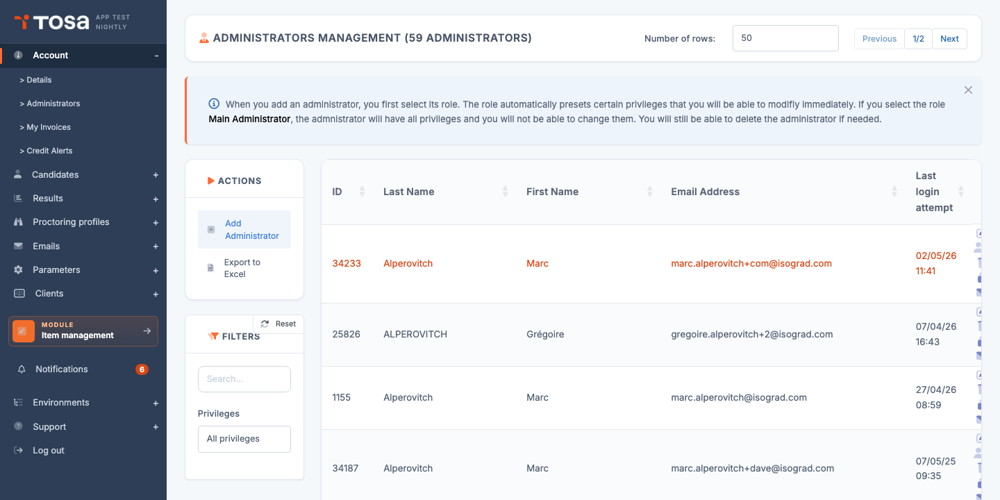
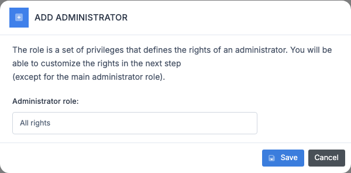
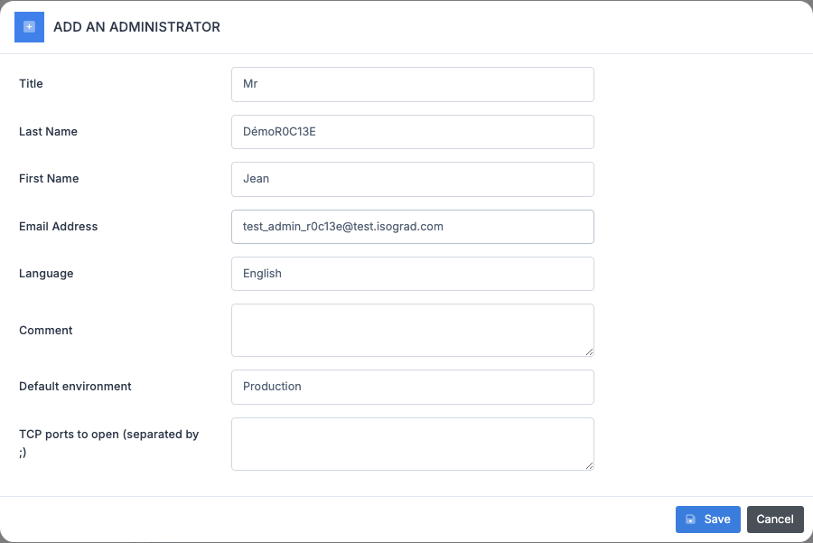
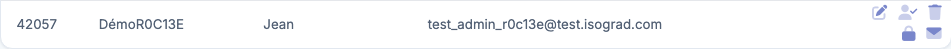
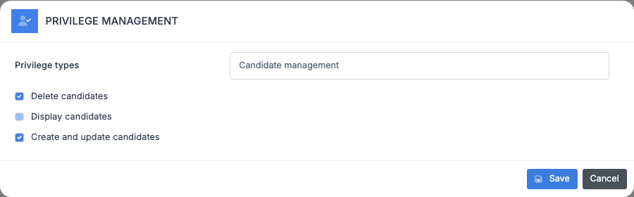
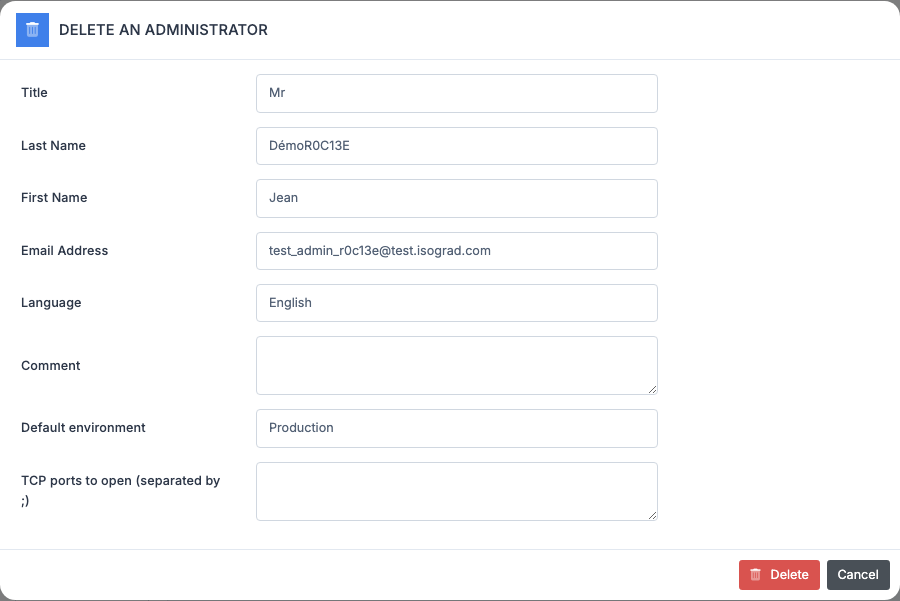

# Administrator management

An **administrator** is a user with access to the administration console of your account. This chapter describes how to add, edit, disable, delete an administrator, and how to fine-tune their privileges on the platform.

The **Administrator management** page lists all administrators created on your account. Each row indicates the **last name**, **first name**, **email address** and **date of last login attempt**. The filters at the top of the page let you narrow the list by free text or by privilege. The action buttons — **Create an administrator** and **Export to Excel** — are located in the action bar at the top of the table.

## Administrator types {#administrator-types}

The platform distinguishes two main profiles for the administrators of a customer account:

- **Main administrator** — has all the rights on the account: they can manage all candidates, all groups, modify the account settings, and create or revoke other administrators. There is generally **only one** main administrator per account.
- **Group administrator** — restricted access to the candidates and results of **the groups they are in charge of managing**, as well as to public groups. Ideal for delegating the management of a class, a department or a client to a local manager without opening the whole account to them.

The profile is chosen at the time of creation (see [Add an administrator](#add-an-administrator)). Beyond the profile, the **fine-grained privileges** (read/write/delete on candidates, email templates, sessions, etc.) are adjustable individually — see [Edit privileges](#edit-privileges).

## Add an administrator {#add-an-administrator}

Creating an administrator is done in **two steps**: choice of role, then entry of contact details.

### Step 1 — Choice of role

1. From the **Administrator management** page, click **Create an administrator**.

    

2. In the window that opens, choose the **role** from the drop-down list (Main administrator, Group administrator, etc.).

3. Confirm. The platform immediately creates an empty record and opens the contact details entry window.

### Step 2 — Contact details

Fill in the fields:

- **Title** — Mr. / Mrs.
- **Last name** — family name.
- **First name** — given name.
- **Email address** — used both as login identifier and notification address. Must be unique on the platform.
- **Language** — interface language for this administrator. System emails (password reset, etc.) are also sent in this language.

Click **Save** to confirm the creation. The new administrator appears immediately in the table.

> 💡 **Initial password** — No password is requested from you. The administrator will set it themselves via the **first-access link** sent to their email address. See [Send credentials](#send-credentials) to resend this link if needed.

## Edit an administrator {#edit-an-administrator}

1. On the **Administrator management** page, locate the row of the administrator to edit.

    

2. Click the **Edit** icon (pencil) at the end of the row. The edit window opens.

    

3. Edit the desired fields (title, last name, first name, email address, interface language).

4. Click **Save**. The changes are applied immediately.

> 💡 **Change your own interface language** — This same window lets you change your **own** language: locate your row in the table and click the **Edit** icon. After saving, **log back in** for the change to take effect (the language is cached in the session at the time of login).

## Edit privileges {#edit-privileges}

**Privileges** are fine-grained rights (read, write, delete) on the various resources of the platform: candidates, groups, sessions, email templates, etc. You can adjust them individually for each administrator, in addition to the role chosen at creation.

### Procedure

1. On the **Administrator management** page, locate the administrator's row. Click the **Privileges** icon (silhouette with a check mark) at the end of the row.

    

2. The window displays the privileges **grouped by category** (Candidates, Sessions, Emails, Results, etc.). For each privilege, a check box indicates whether the administrator has it.

3. Check or uncheck the desired privileges.

4. Click **Save**. The new privileges are active immediately.

### Reading the privileges

Each resource generally exposes three levels:

- **Read** — the administrator can view but not modify.
- **Write** — the administrator can create and modify.
- **Delete** — the administrator can delete records.

Some privileges are **cross-cutting**; for example *Read/write the emails of another administrator* allows an administrator to manage the email templates created by their colleagues, and not just their own.

> ⚠️ **Privileges and role** — Fine-grained privileges **add to** the role, they do not replace it. A Main administrator already has all privileges by default; the Privileges window is mainly used to **open up** additional access to a Group administrator.

### Filter by privilege

The **All privileges** filter at the top of the main page lets you isolate the administrators holding a given privilege. This is useful, for example, to quickly identify the administrators who can delete candidates before reviewing their rights.

## Disable and unlock an administrator {#disable-administrator}

Disabling **prevents an administrator from logging in**, without deleting their account or data. They can be re-enabled ("unlocked") at any time.

### Disable

1. On the administrator's row, click the **Disable** icon (closed padlock).
2. Confirm the action.
3. The **Disable** icon is replaced by an **Unlock** icon (open padlock), indicating that the account is now blocked.

### Unlock

1. On the row of a disabled administrator (or one locked after several unsuccessful login attempts), click the **Unlock administrator** icon.
2. The administrator can log in normally again.

> 💡 **Disabling vs deleting** — Prefer **disabling** when you want to temporarily withdraw access — for example, a colleague on extended leave. Reserve **deletion** for accounts created in error or for definitive departures: deletion is irreversible and causes loss of the event history attached to the administrator.

> ⚠️ **You cannot disable yourself** — The Disable button does not appear on your own row. To transfer an account, first create a new main administrator, ask them to log in at least once, then ask them to disable your old account.

## Reset 2FA {#reset-2fa}

If two-factor authentication (2FA) is enabled on the account and an administrator has lost access to their authentication application, you can **reset their 2FA** so they reconfigure it on their next login.

1. On the administrator's row, click the **Reset 2FA** icon (key icon).
2. Confirm the action.
3. On their next login, the administrator will be prompted to re-scan a QR code and reconfigure their authentication application.

> 💡 **Availability** — The **Reset 2FA** icon only appears if two-factor authentication is enabled for your account. If you do not see it, it means the account does not use it — there is then nothing to reset.

## Send credentials {#send-credentials}

The **Send credentials** button sends the administrator an email containing a **password reset link**. This is the action to use in two cases:

- The administrator has just been created and has not yet received (or has lost) their first-access link.
- The administrator no longer remembers their password — rather than asking them to click "Forgot password" on the login page, you can push the link to them from the admin console.

### Procedure

1. On the administrator's row, click the **Send credentials** icon (envelope icon).
2. The platform sends the email immediately — no further confirmation is requested.
3. A success notification appears at the top right of the screen.

> 💡 **Link validity** — The reset link has a limited lifetime. If the administrator does not use it within the allotted time, resend a new one via the same procedure.

## Delete an administrator {#delete-an-administrator}

1. On the administrator's row, click the **Delete** icon (trash can).
2. A confirmation window appears.

    

3. Confirm. The administrator is deleted immediately.

> ⚠️ **Permanent deletion** — Unlike disabling, deletion is **irreversible**. Records attached to this administrator (for example, the private email templates they had created) become orphaned or are also deleted depending on the case. Before deleting, **prefer [disabling](#disable-administrator)** if the goal is only to cut off access.

> 💡 **You cannot delete yourself** — As with disabling, the Delete button does not appear on your own row.

## Export the list {#export-the-list}

The **Export to Excel** button in the action bar generates an `.xlsx` file listing all administrators **filtered on screen** at the moment of the click. The export includes, in addition to the visible columns, the **detailed list of privileges** of each administrator — a very useful view for periodically auditing who can do what on your account.
