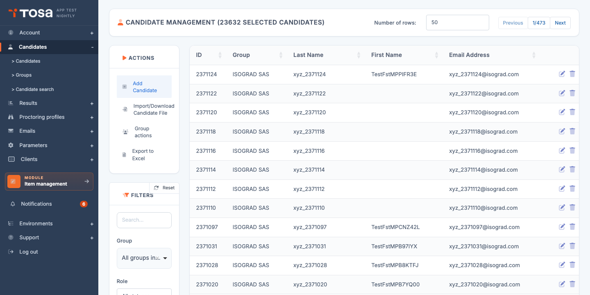
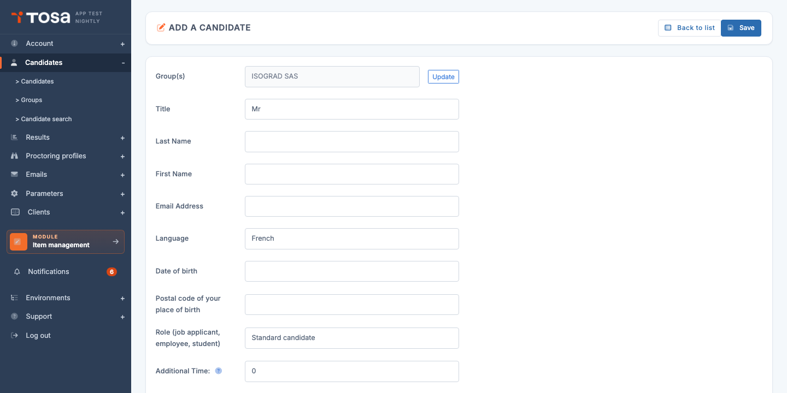
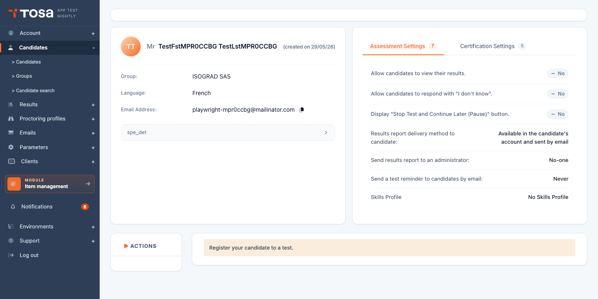
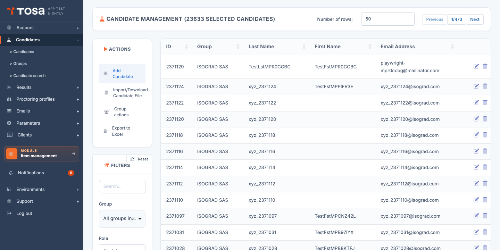
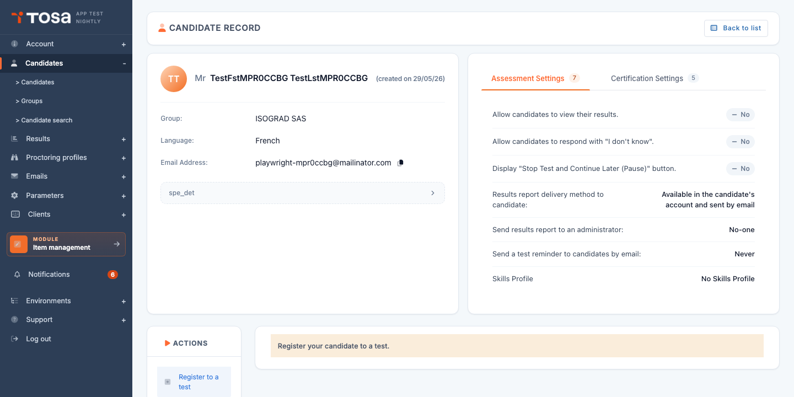
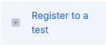
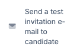
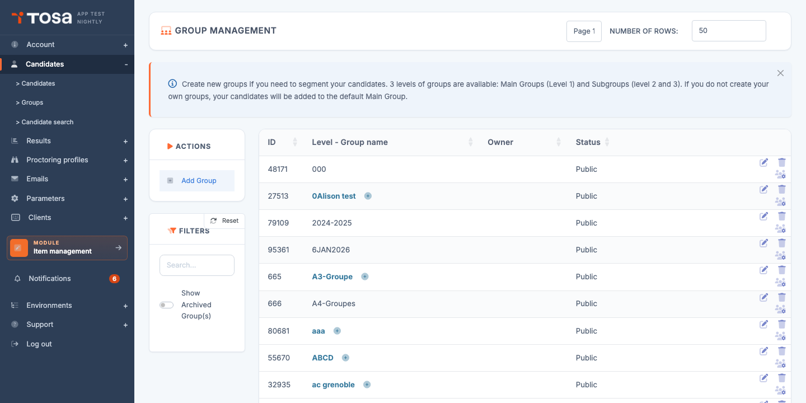

# Candidate management

This chapter covers the entire life cycle of a candidate on the Tosa platform: adding candidates individually or in bulk, registering them to tests, sending them invitations and organizing your population into groups.

The **Candidate management** page is presented as a table listing all your candidates. The filters at the top of the page let you narrow the display (free-text search, membership in a group, candidates having a test to take, inclusion of archived candidates). The main actions — add a candidate, import a file, access group management — are located in the action bar at the top of the table.

## Add a candidate {#add-a-candidate}

This procedure allows you to create a candidate individually. To add several candidates in a single operation, refer to the [Import candidates](#import-candidates) section.

### Procedure

1. From the **Candidate management** page, locate the **Add a candidate** button in the action bar at the top of the table.

    

2. Click **Add a candidate**. The entry form opens.

    

3. Fill in the required fields:

    - **First name** — first name of the candidate as it will appear on the certificates.
    - **Last name** — last name of the candidate.
    - **Email** — address at which the candidate will receive their invitations and access their workspace.
    - **Country** — used to adapt the default language of the emails.

4. Click **Save**. The candidate is created and you are automatically redirected to their test registration page.

    

From this page, you can immediately [register the candidate to a test](#register-a-candidate-to-a-test) or [send them an invitation](#send-invitations).

> 💡 **Subsequent modification** — To modify the contact details of an existing candidate, go back to the candidate list, click the **Edit** icon at the end of the row, then the **Candidate details** tab.

## Import candidates {#import-candidates}

The candidate import allows you to create several candidates — or even pre-register them to tests — in a single operation, from an Excel file.

### Procedure

1. From the **Candidate management** page, locate the **Import/Download Candidate File** button in the action bar.

    

2. Before preparing your file, download the **file template** from the link provided. The template contains the expected headers and an example row.

3. Fill in the template with your candidates. The main columns:

    | Column | Required | Description |
    |---|---|---|
    | First name | Yes | Candidate's first name. |
    | Last name | Yes | Candidate's last name. |
    | Email | Yes | A unique email address per candidate. |
    | Country | No | Country code (FR, BE, …) for the default language. |
    | Group | No | Name of a group to attach the candidate to. Created automatically if it does not exist. |
    | Test | No | Name of the subject to register the candidate to directly at import time. |

4. Click **Import/Download Candidate File**, select your file, and confirm.

5. The platform displays an import report: number of candidates created, updated, or rejected (with the rejection reason row by row).

> ⚠️ **Duplicate emails** — If a candidate already exists with the same email address, their information is **updated** rather than recreated. A new record is never created for an existing address.

> 💡 **Import and invitations** — The import does **not** automatically trigger the sending of invitations. To send the login emails after import, refer to the [Send invitations](#send-invitations) section.

## Register a candidate to a test {#register-a-candidate-to-a-test}

Once the candidate is created, you must register them to one or more tests so they can take them.

### Register a candidate from their record

1. From the candidate list, click the **Edit** icon of the corresponding row. You arrive on the candidate's test registration page.

    

2. Click **Add a test**.

    

3. In the window that opens, choose the **subject** (topic) to evaluate, then configure the registration:

    - **Test type** — evaluation, certification, etc., depending on the packs available on your account.
    - **Language** — language in which the test will be presented to the candidate.
    - **Deadline** (optional) — beyond this date, the candidate will no longer be able to start the test.
    - **Proctoring** (optional) — enables the proctored session if your account has this option.

4. Confirm. The test appears immediately in the candidate's registration table.

### Register several candidates at the same time

To register several candidates to the same test, use the group action:

1. On the **Candidate management** page, select the candidates to register by ticking the check box at the start of the row.
2. In the group actions menu, choose **Register candidates to a test**.
3. Fill in the test parameters; they apply to the entire selection.

> 💡 **Credits** — Each registration consumes one credit from the corresponding pack. The remaining balance is visible at the top of the page. To buy back credits, contact your Isograd representative.

## Send invitations {#send-invitations}

Sending the email invitation transmits the candidate's personalized login link. This is the step that makes the test accessible on the candidate's side.

### Send an invitation to a single candidate

1. Open the candidate's record (from the list, click the **Edit** icon).

    

2. Click **Send registration email** (or the equivalent button visible in the record).

3. A window allows you to:

    - Choose the **email template** (language, tone, signature) among those configured for your account.
    - **Preview** the content that will be sent.
    - **Customize** the subject or body if necessary, before sending.

4. Click **Send**. The candidate immediately receives their email containing the login link.

### Send invitations in bulk

From the **Candidate management** page:

1. Select the candidates to invite (check box at the start of the row).
2. In the group actions menu, choose **Send registration emails**.
3. Choose the email template and confirm.

All the selected candidates receive the invitation with their personal link.

> ⚠️ **Invalid addresses** — If a candidate's email address is invalid or refused by the destination server, you will see it in the send report. Correct the address on the candidate's record then resend.

> 💡 **Customize email templates** — Email templates are managed in the **Email management** chapter (forthcoming). You can create variants there by language, by brand, or by test type.

## Manage groups {#manage-groups}

Groups let you organize your candidate population (by class, department, client, training course, etc.) to make bulk actions easier: registrations, invitations, result tracking.

### Access the groups

From the navigation menu, click **Groups** (or access the URL `/clientadmin/candidates/AdminGroupsWithTable`).

The **Group management** page displays all your groups in a hierarchical form. A group can contain sub-groups — useful for example to structure "Promotion 2026 → Section A → Evening class".

### Create a group

1. Click **Add a group** in the action bar.
2. Fill in:

    - **Name** of the group.
    - **Parent group** (optional) — to create a hierarchy.
    - **Color** or tag (depending on your version) — to visually identify the group.

3. Confirm.

### Add a candidate to a group

Two methods:

- **From the candidate's record**: open the record, **Groups** tab, add the candidate to the desired groups.
- **Group action** on the candidate list: select the candidates, then **Add to a group**.

### Group actions

Once your candidates are organized into groups, the **Group** filter on the **Candidate management** page lets you isolate a population and apply a bulk action to it:

- Register the whole group to a test.
- Send an invitation to the whole group.
- Set a common password.
- Assign the group to a proctored session.
- Archive the group (the candidates remain in the database but are hidden by default).
- Delete the registered tests, or delete the candidates from the group.

> 💡 **Archiving vs deletion** — **Archiving** is non-destructive: it hides the group and its candidates from the lists by default, but preserves the history of past tests. **Deletion** is final — use it only for candidates created in error.
