# Candidate management

This chapter covers the entire life cycle of a candidate on the Tosa platform: adding candidates individually or in bulk, registering them to tests, sending them invitations and organizing your population into groups.

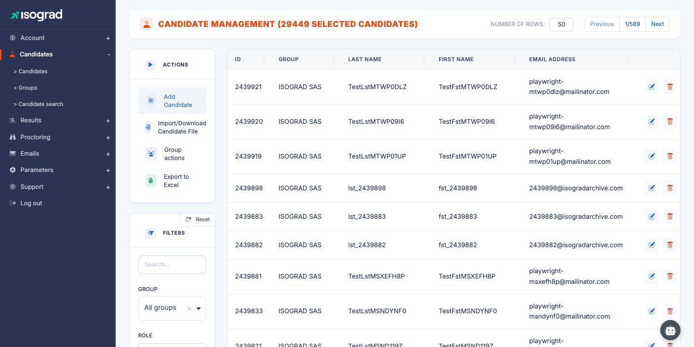

The **Candidate management** page is presented as a table listing all your candidates. The filters at the top of the page let you narrow the display (free-text search, membership in a group or sub-group, candidates having a test to take, display of the connection status, inclusion of archived candidates). The main actions — add a candidate, import a file, apply a group action, export to Excel — are located in the action bar at the top of the table.

## Add a candidate {#add-a-candidate}

This procedure allows you to create a candidate individually. To add several candidates in a single operation, refer to the [Import candidates](#import-candidates) section.

### Procedure

1. From the **Candidate management** page, locate the **Add a candidate** button in the action bar at the top of the table.

    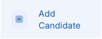

2. Click **Add a candidate**. The entry form opens.

    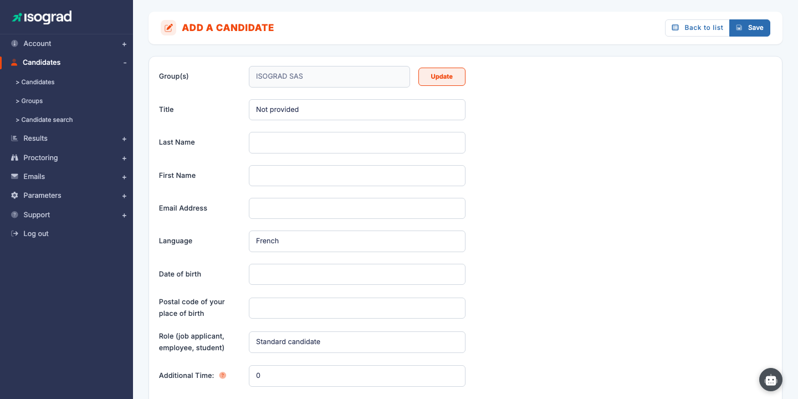

3. Fill in the required fields:

    - **First name** — first name of the candidate as it will appear on the certificates.
    - **Last name** — last name of the candidate.
    - **Email** — address at which the candidate will receive their invitations and access their workspace.
    - **Country** — used to adapt the default language of the emails.

4. Click **Save**. The candidate is created and you are automatically redirected to their test registration page.

    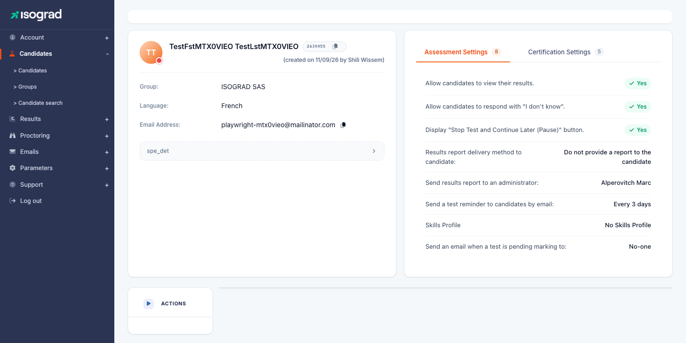

From this page, you can immediately [register the candidate to a test](#register-a-candidate-to-a-test) or [send them an invitation](#send-invitations).

> 💡 **Subsequent modification** — To modify the contact details of an existing candidate, go back to the candidate list, click the **Edit** icon at the end of the row, then the **Candidate details** tab.

## Import candidates {#import-candidates}

The candidate import allows you to create several candidates — or even pre-register them to tests — in a single operation, from an Excel file.

### Procedure

1. From the **Candidate management** page, locate the **Import/Download Candidate File** button in the action bar.

    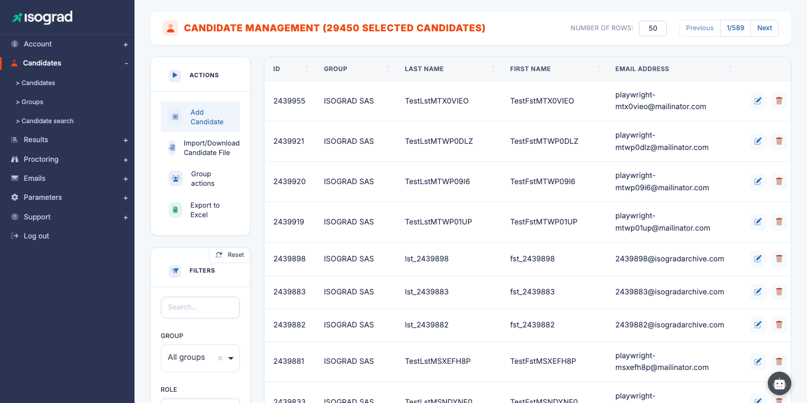

2. Before preparing your file, download the **file template** from the link provided. The template contains the expected headers and an example row.

3. Fill in the template with your candidates. The main columns:

    | Column | Required | Description |
    |---|---|---|
    | First name | Yes | Candidate's first name. |
    | Last name | Yes | Candidate's last name. |
    | Email | Yes | A unique email address per candidate. |
    | Country | No | Country code (FR, BE, …) for the default language. |
    | Group | No | Name of a group to attach the candidate to. Created automatically if it does not exist. |
    | Test | No | Name of the subject to register the candidate to directly at import time. |

4. Click **Import/Download Candidate File**, select your file, and confirm.

    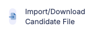

5. The platform displays an import report: number of candidates created, updated, or rejected (with the rejection reason row by row).

> ⚠️ **Duplicate emails** — If a candidate already exists with the same email address, their information is **updated** rather than recreated. A new record is never created for an existing address.

> 💡 **Import and invitations** — The import does **not** automatically trigger the sending of invitations. To send the login emails after import, refer to the [Send invitations](#send-invitations) section.

## Register a candidate to a test {#register-a-candidate-to-a-test}

Once the candidate is created, you must register them to one or more tests so they can take them. Everything happens from the **candidate's record**, which gathers their registrations and the actions that concern them.

### The candidate's record

From the candidate list, click the **Edit** icon of the corresponding row. You are also redirected there automatically after saving a new candidate.

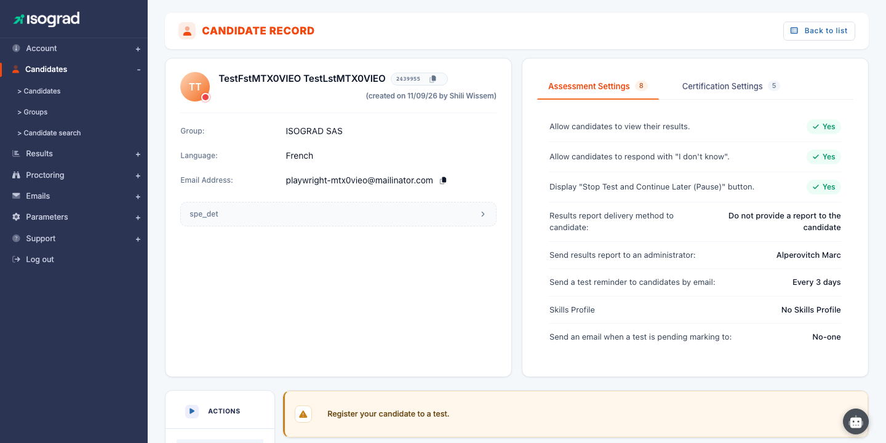

The button bar at the top of the record gathers the actions available for this candidate. Some buttons only appear depending on your privileges and your account options:

- **Register to a test** — opens the registration window described below.
- **Edit candidate details** — goes back to the contact details form (identity, email, language, groups).
- **Test parameters** — options specific to this candidate: **Assessment Settings**, **Certification Settings** (display of results, sending of reports and certificates, recipients) and, where applicable, **Configuration test parameters**. These values override, for this candidate only, the account's [default options](../default-options/).
- **Send a test invitation e-mail to candidate** — sends the invitation email (see [Send invitations](#send-invitations)).
- **Assign a temporary password** — the candidate will have to change it at their next login.
- **Anonymize** — permanently replaces the candidate's personal data.
- **Transfer** — moves the candidate to another account of your organization, when this option is enabled.

> 💡 **Tests per job** — On Isograd Testing Services accounts, the **Tests per job** button suggests, from a job title or description, a selection of recommended tests with a link to each test's description.

Below the button bar, the **planned tests table** lists all the candidate's registrations (see [below](#the-planned-tests-table)).

### Register a candidate from their record

1. Click **Register to a test**.

    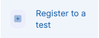

2. The **Register candidate for a test** window opens.

    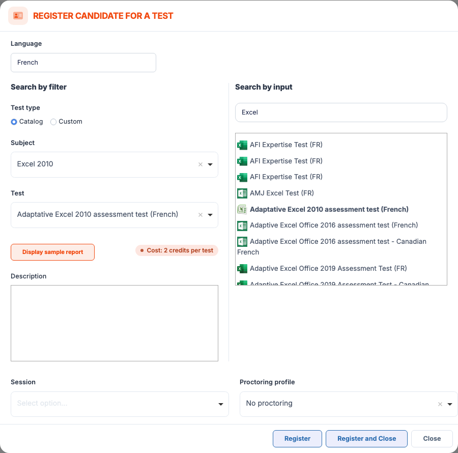

    First choose the **Language** of the test: it is preselected on the candidate's language, and the list of subjects is refreshed on every change. Then select the test in one of two ways:

    - **Search by filter** (left column) — if your account has custom tests, the **Test type** lets you switch between **Catalog** and **Custom**; then choose the **Subject**, then the **Test**.
    - **Search by input** (right column) — type at least three characters of the test name and click the desired result; the selectors on the left are set automatically.

    Once the test is chosen, its **Description** is displayed, together with the number of credits consumed where relevant, and the **Display sample report** button offers a sample report in PDF format when one exists for this test.

3. Complete, depending on your account options:

    - **Session** — attaches the registration to an existing test session (**No associated session** by default). The **Create a new session...** entry takes you directly to the session creation page; on some accounts, the session is mandatory.
    - **Proctoring profile** — **No proctoring** or one of your [proctoring profiles](../proctoring/) (full screen, remote proctoring…). For a **certification**, your account's default profile is preselected; if remote proctoring is mandatory on your account, it is applied automatically and a message says so.

4. Click **Register** to chain another registration in the same window, or **Register and Close**. The test appears immediately in the planned tests table.

> 💡 **Credit type** — If your account holds several packs valid for this test (for example a "one test per credit" pack and a "several tests per credit" pack), a **Select a credit type** window asks which one to use before registering.

> 💡 **Test already taken** — Depending on your account configuration, if the candidate has already taken this type of test, you are asked to confirm before registering them again.

### The planned tests table {#the-planned-tests-table}

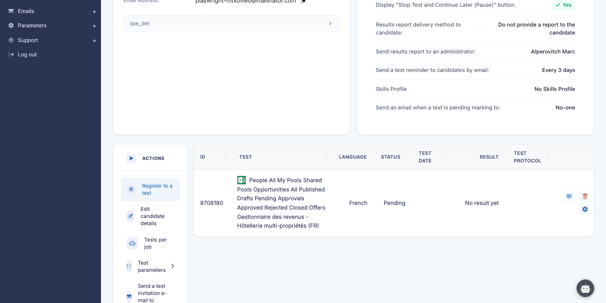

Each row is a registration: test, status (pending, started, complete, waiting for marking), session and test date where applicable. A **full screen** or **camera** icon next to the test name indicates the associated proctoring profile.

The action buttons appear when hovering over the row:

- **Delete** — removes the registration of a test that has not started; the credit is refunded. Depending on your account, the platform offers to notify the candidate of the cancellation by email.
- **Parameters** (pending test) — changes the **Session**, the **Proctoring profile** and the **Disable in-application** option without deleting the registration.

    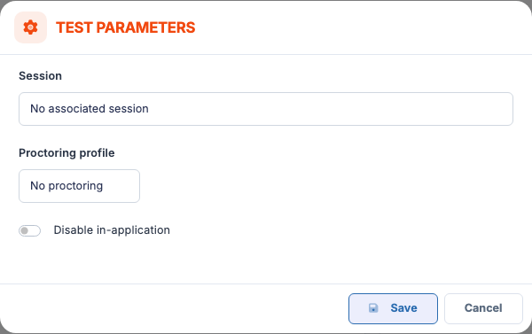

- **Administrator's comment** — an internal note attached to this registration, invisible to the candidate.
- **Change test details** (started or completed test) — depending on your privileges: adjust the end time, reset the test with or without an email to the candidate, restart or disable the in-application part.
- **Details** (completed test) — opens the detailed analysis of the test (see [Results management](../results/)); **Assign grade** appears instead for a test waiting for marking.
- **Send diploma** (completed certification) — sends the certificate to the recipients defined in the certification settings; **Add a confirmation test** is offered for a completed assessment when your account has this option.

### Register several candidates at the same time

To register several candidates to the same test, use a group action from the **Candidate management** page:

1. Filter the table on a **group** (and, if relevant, a sub-group) and leave the search field empty. The **Group actions** button then becomes a menu; without a selected group, it simply reminds you that a group must be chosen first.
2. If all the candidates of the group fit on a single page, a check box appears at the start of each row, ticked by default: untick the candidates to exclude (the header check box ticks or unticks everything). If the group spans several pages, the action applies to the whole group.
3. In the **Group actions** menu, choose **Register test(s) to all candidates in group**.
4. Fill in the test parameters (subject, language, session, proctoring profile); they apply to the entire selection. Click **Register** to chain another registration, or **Register and close**.

> 💡 **Candidates already registered** — If some candidates of the selection are already registered to this test, the platform tells you so and offers either to register all of them again, or to register only those who are not registered yet.

> 💡 **Credits** — Each registration consumes one credit from the corresponding pack (or a fraction of a credit with a "several tests per credit" pack). The balance of your packs can be checked in [Account management](../account/). To buy back credits, contact your Isograd representative.

## Send invitations {#send-invitations}

Sending the email invitation transmits the candidate's personalized login link. This is the step that makes the test accessible on the candidate's side.

### Send an invitation to a single candidate

1. Open the candidate's record (from the list, click the **Edit** icon).

    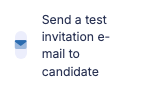

2. Click **Send a test invitation e-mail to candidate**. The **Message details** window opens.

    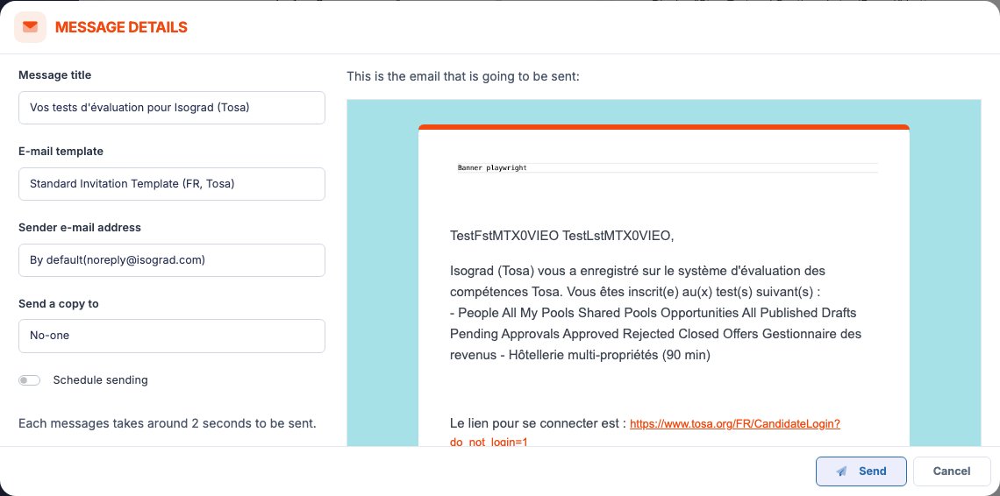

3. Fill in the left column:

    - **E-mail template** — choose among the registration templates configured for your account in the candidate's language; the title and the preview are refreshed on every change.
    - **Message title** — the subject of the email, pre-filled from the template and editable.
    - **Sender e-mail address** — visible if verified senders are configured (see [Email management](../mail-templates/)); otherwise the platform's default address is used.
    - **Send a copy to** — an administrator of your account receives a copy of the message.
    - **Schedule sending** — turn on the switch and set the **Send date** to defer the sending.

    The right column shows the exact preview of the email as it will be received. The body of the message comes from the template: to change it, edit the template in **Email management**.

4. Click **Send**. The candidate receives their email with their personal login link, and the record reloads.

> ⚠️ **Tests already sent** — If a test has already been the subject of an invitation email, the window says so with the sending date. You can still send an invitation again, for example after correcting an address.

### Send invitations in bulk

From the **Candidate management** page:

1. Filter the table on the desired group and, if the check boxes are displayed, leave only the candidates to invite ticked (see [Register several candidates at the same time](#register-a-candidate-to-a-test)).
2. In the **Group actions** menu, choose **Send registration email to all candidates in group**.
3. Choose the email template, check the subject and the message preview, then click **Send**. A confirmation recalls the number of emails about to be sent and the group concerned.

Each candidate receives the invitation with their personal link. When the action targets the whole group, only the candidates who still have a test to take are recipients.

> ⚠️ **Invalid addresses** — If a candidate's email address is invalid or refused by the destination server, you will see it in the send report. Correct the address on the candidate's record then resend.

> 💡 **Customize email templates** — Email templates are managed in the [Email management](../mail-templates/) chapter. You can create variants there by language, by brand, or by test type.

## Manage groups {#manage-groups}

Groups let you organize your candidate population (by class, department, client, training course, etc.) to make bulk actions easier: registrations, invitations, result tracking.

### Access the groups

From the navigation menu, click **Groups**.

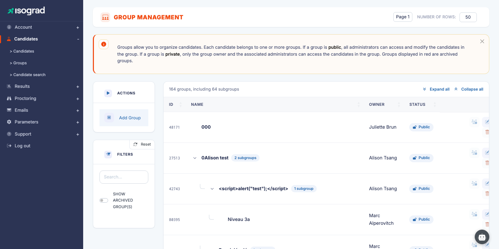

The **Group management** page displays all your groups in a hierarchical form. A group can contain sub-groups — useful for example to structure "Promotion 2026 → Section A → Evening class".

### Create a group

1. Click **Add a group** in the action bar.
2. Fill in:

    - **Name** of the group.
    - **Parent group** (optional) — to create a hierarchy.
    - **Color** or tag (depending on your version) — to visually identify the group.

3. Confirm.

### Add a candidate to a group

Two methods:

- **From the candidate's record**: open the record, **Groups** tab, add the candidate to the desired groups.
- **Group action** on the candidate list: filter on the original group, select the candidates, then **Add selected candidates to a group**. The candidates join the chosen group(s) without leaving their current group.

### Group actions

Once your candidates are organized into groups, the **Group** filter on the **Candidate management** page lets you isolate a population and apply a bulk action to it through the **Group actions** menu (how the selection works is described in [Register several candidates at the same time](#register-a-candidate-to-a-test)):

- **Set a temporary password** — the same password for the whole selection; each candidate will have to change it at their next login.
- **Register to a test**.
- **Send registration emails**.
- **Delete pending tests** — choose the test concerned among those still pending in the selection.
- **Delete candidates**.
- **Add the candidates to a group** — without removing them from their current group.
- **Assign a session or a proctoring profile to a test** — for a pending test, choose the session and, if needed, the proctoring profile.
- **Set assessment options** and **Set certification options** — display of results to the candidate, report delivery, diploma sending and recipients, applied to the whole selection. Each entry only appears if your account has the corresponding pack type.
- **Generate badges** — issuing of Credly digital badges for the eligible certifications of the selection.

> 💡 **Archiving vs deletion** — **Archiving** a group is done from the **Group management** page and is non-destructive: it hides the group and its candidates from the lists by default, but preserves the history of past tests. **Deleting** candidates is final — use it only for candidates created in error.
