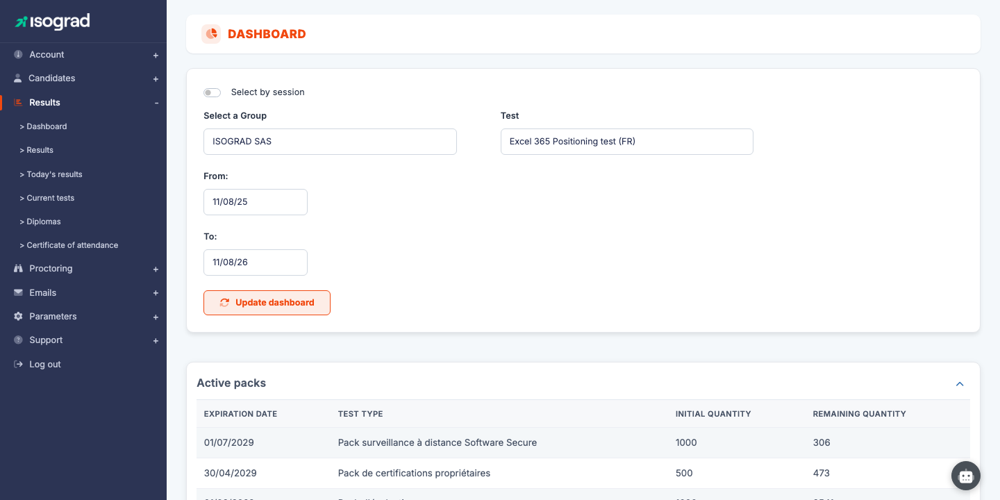
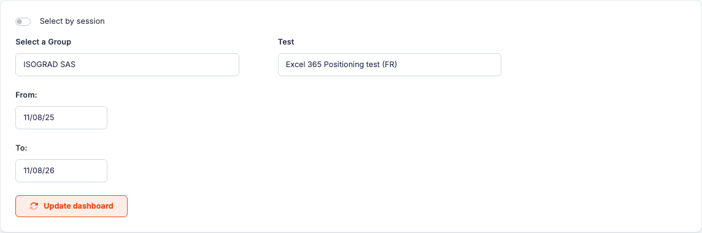
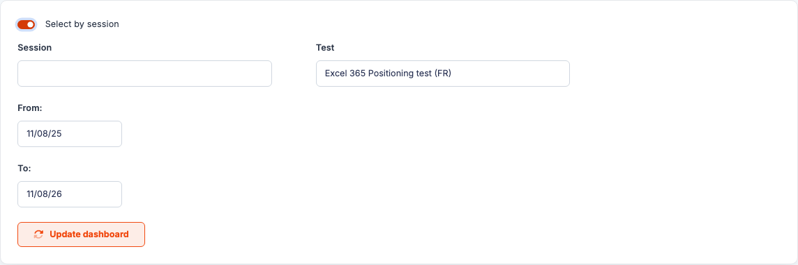
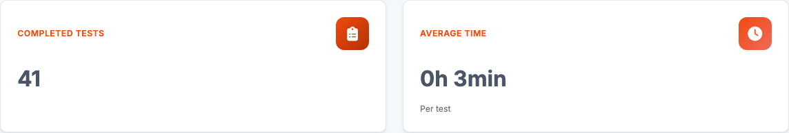
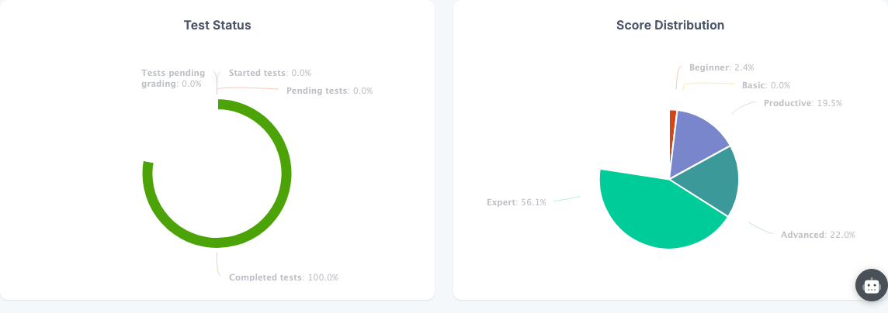
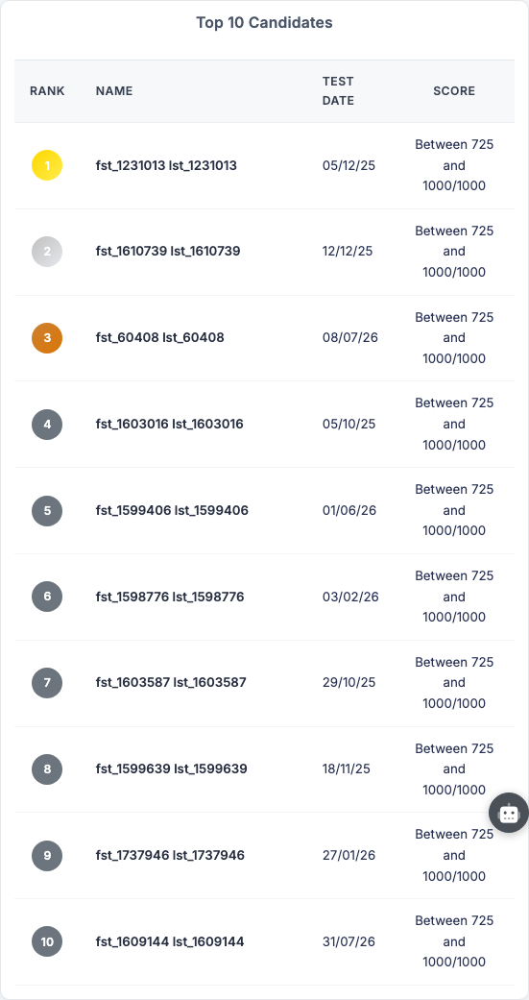
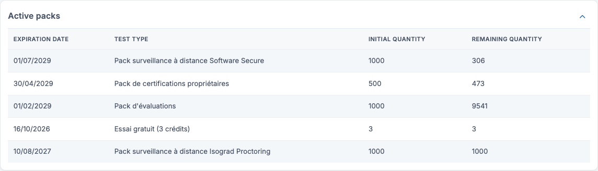

# Dashboard

The **Dashboard** gives you an at-a-glance view of a group's or a session's activity on **a given test**: number of completed tests, average completion time, breakdown by status and score level, top candidates and the state of your credit packs. It is the ideal page to monitor a testing campaign before drilling into details on the [Results](/ai/en/results/) page.

Access this page via the **Results → Dashboard** menu.

> 💡 **Only completed tests feed the metrics.** If the selected group, session or period contains no completed test, the page shows a message inviting you to adjust the filters.

## Dashboard filters {#dashboard-filters}

The panel at the top of the page determines what the dashboard aggregates:

- **Select by session** (switch) — toggles between group-based and session-based selection (see [Select by session](#select-by-session)).
- **Select a group** — the candidate group to analyse. If the group has sub-groups, a **sub-group** selector appears to narrow the selection.
- **Test** — the test to analyse. The list refreshes automatically whenever you change the group, sub-group or session: it only offers tests actually taken by the selected population.
- **Period from / to** — the completion-date interval taken into account (default: the last twelve months).

Click **Update the dashboard** to apply the filters and reload the metrics.

> 💡 Your filters are remembered: when you come back to the page, your last selection is restored.

## Select by session {#select-by-session}

If your account uses [test sessions](/ai/en/sessions/), enable the **Select by session** switch: the group selector is replaced by a **session** selector, and the test list reloads with the tests taken in the chosen session.

This mode is handy to review one specific exam session (one date, one room) rather than a whole group.

## Metrics and charts {#metrics-and-charts}

Once the filters are applied, the dashboard displays:

- **Completed tests** — the number of completed attempts in the selection.
- **Average time** — the average duration of an attempt. This card is only filled in when the completion time is measurable for the selected test (timed tests or tests without free navigation).

- **Test status** — the breakdown of all tests in the selection between *pending*, *started*, *completed* and *waiting for marking*.
- **Score distribution** — the distribution of completed tests by score level (for example Initial, Basic, Operational, Advanced, Expert for Tosa assessments).

Depending on the test and your account options, additional blocks may appear: an **invitation tracking** chart (emails sent, reminders, candidates never invited) and a **success rate per question** table.

## Top 10 candidates {#top-10-candidates}

The **Top 10** table ranks the ten best candidates of the selection — for each candidate, only their **best score** is kept:

| Column | Content |
|---|---|
| **Rank** | Position in the ranking (the first three are highlighted). |
| **Name** | Candidate identity. |
| **Test date** | Date of the attempt matching the best score. |
| **Score** | The best score achieved on the selected test. |

## Active packs {#active-packs}

At the top of the dashboard, the **Active packs** block summarises the state of your credits — the same detail as in [Account management](/ai/en/account/):

For each pack: the **expiration date**, the **test type**, the **initial quantity** and the **remaining quantity**. Expired packs appear greyed out. The block can be collapsed with the arrow at the top right.
