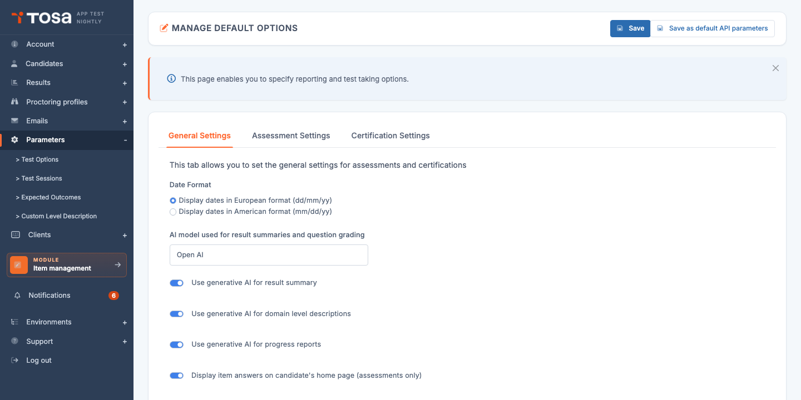
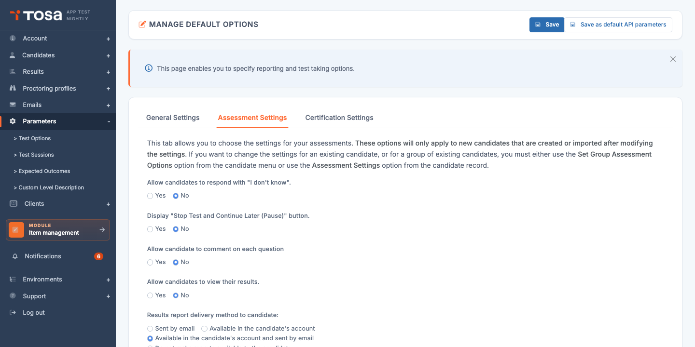
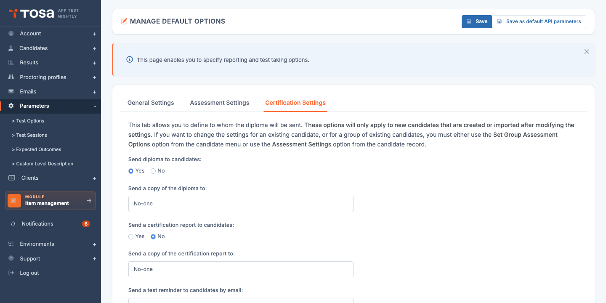

# Default options

The **Default options** page centralises the **sitting parameters** applied to every test registered on your account. The values defined here are **pre-filled** in the registration window when registering a candidate to a test — you can still change them on a case-by-case basis, but setting them here saves time and ensures consistency across your entire activity.

Open this page through the **Settings → Sitting options** menu, or directly at the URL `/clientadmin/parameters/UpdateDefaultOptions`.

The page is organised into several **tabs**:

- **General settings** — settings shared between evaluations **and** certifications.
- **Evaluation settings** — specific to evaluation tests.
- **Certification settings** — specific to certifying sittings (only if your account offers certifications).
- **Retake policy** — configuration of multiple attempts (depending on your account type).

> 💡 **Save** — All modifications are applied by clicking on **Save** at the top right. The save applies to **every tab** simultaneously.

> 💡 **As default parameters for the API** — The **Save as default parameters for the API** button (when visible) additionally applies the current values to registrations created through the REST API. Without this button, the parameters apply only to registrations made through the interface.

## General settings {#general-settings}

This tab groups the parameters that apply **regardless of the test type**:

### Date format

Choose between:

- **Display dates in European format (dd/mm/yy)** — default for accounts based in Europe.
- **Display dates in American format (mm/dd/yy)** — default for accounts based in the United States.

The chosen format applies to every date displayed in the reports and in the candidate interface.

### Generative AI options

Depending on the options enabled on your account, you may see settings related to the use of generative AI to enrich the reports:

- **AI model used for summaries and question grading** — choice of engine (Open AI, etc.) depending on your offer.
- **Use a generative AI for the result summary** — the platform generates a summary of the result in a few sentences.
- **Use a generative AI for the level-per-domain descriptions** — explains, per skill domain, what the score means.
- **Use a generative AI for the progression reports** — for comparative reports between several sessions of the same candidate.

> ⚠️ **Generative AI activation** — These options are only **editable** if your account has the corresponding privileges. If you see the toggles but they are greyed out, contact your Isograd representative to enable the feature.

### Answer key for evaluations

- **Show the answer key in the candidate area (excluding certifications)** — gives the candidate access to the answer key for their responses in their candidate area after an **evaluation**. This option does not apply to certifications (the answer key of a certification is handled separately, see [Certification settings](#certification-settings)).

## Evaluation settings {#evaluation-settings}

This tab groups the **sitting options** for evaluation tests.

> ⚠️ **Scope of application** — As the help banner at the top of the tab indicates, *"these options only apply to candidates you will create in the future"*. To change the options of an **already existing** candidate or group, use the **Group actions** menu of the Candidates tab, or the **Test parameters** menu on the candidate's record.

### Sitting options

For each option below, choose **Yes** or **No**:

- **Allow the candidate to answer "I don't know"** — adds a dedicated button on every question. The answer is counted as incorrect but distinguished from a wrong answer in the report — useful to measure the candidate's confidence.
- **Show the "Pause the test and resume later" button** — allows the candidate to pause their test. Choose **No** to force a sitting in one session.
- **Allow the candidate to comment on questions** — displays a comment field on every question. The comments can be reviewed afterwards in the report — useful to gather feedback during the rollout phase.
- **Allow the candidate to see their result at the end of the test or in their candidate area** — choose **No** if you wish to **restrict access to the results to the administrator** (for example, for a proctored exam where the result must be officially communicated).

### Method of delivering the report to the candidate

Three mutually exclusive choices:

- **By email** — the report is emailed as soon as the test is complete.
- **In their candidate area** — the report is only accessible from the logged-in candidate area.
- **By email and in their candidate area** — combination of both: email + permanent access in the candidate area.

## Certification settings {#certification-settings}

This tab is only visible if your account offers **certifications** (typically Tosa accounts).

> ⚠️ **Scope of application** — As for the Evaluation tab, these options *only apply to candidates you will create in the future*.

### Certificate sending

- **Send the certificate to the candidate** (Yes/No) — enables automatic sending of the PDF diploma to the candidate as soon as the certification is validated.
- **Send a copy of the certificate to** — email address of an administrator who will receive a copy of every issued diploma (default "Nobody", i.e. no copy).

### Certification report sending

- **Send the certification report to the candidate** (Yes/No) — distinct from the certificate: the certification report is more detailed (skills, comparison to expected levels).
- **Send a copy of the certification report to** — administrator address for the report copy.

### Automatic reminders

- **Send a reminder email to the candidate** — enables automatic sending of reminder emails for candidates who have not started their certification. The frequency of the reminders is configured separately on the candidate's record.

## Retake policy {#retake-policy}

The **Retake policy** tab (visible depending on the account type) configures the rules for **multiple attempts** on certifications:

- **Minimum score per subject** — score below which a candidate must retake. Above, the subject is validated.
- **Maximum number of attempts** — how many times a candidate can retake a subject.
- **Retake delay (days)** — minimum time between two attempts on the same subject.

> 💡 **Best practice** — Setting a non-zero delay (for example 7 days) between two attempts prevents the candidate from "burning" their attempts by answering randomly right after failing. The delay leaves time to review.
