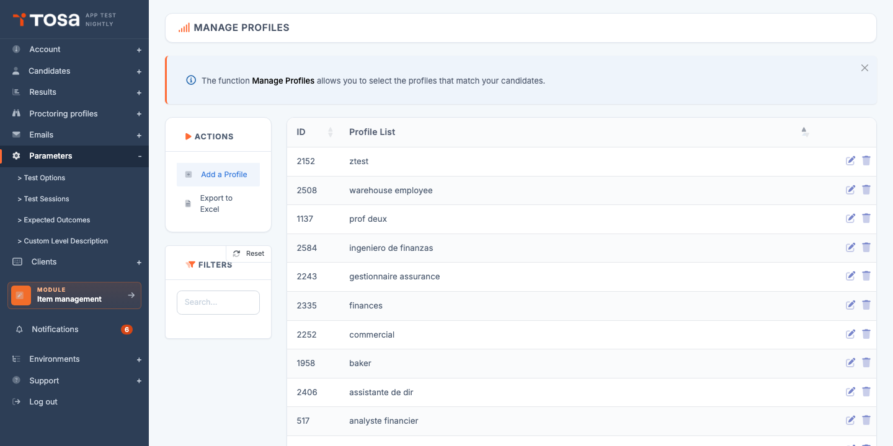
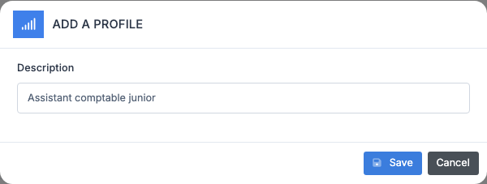
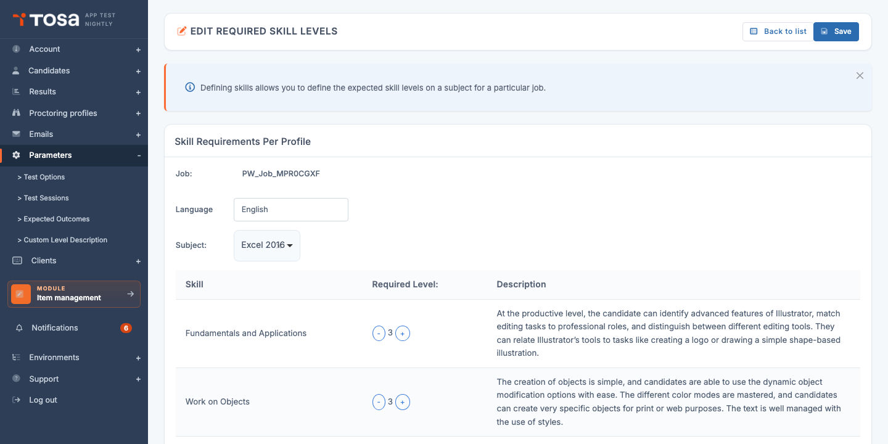
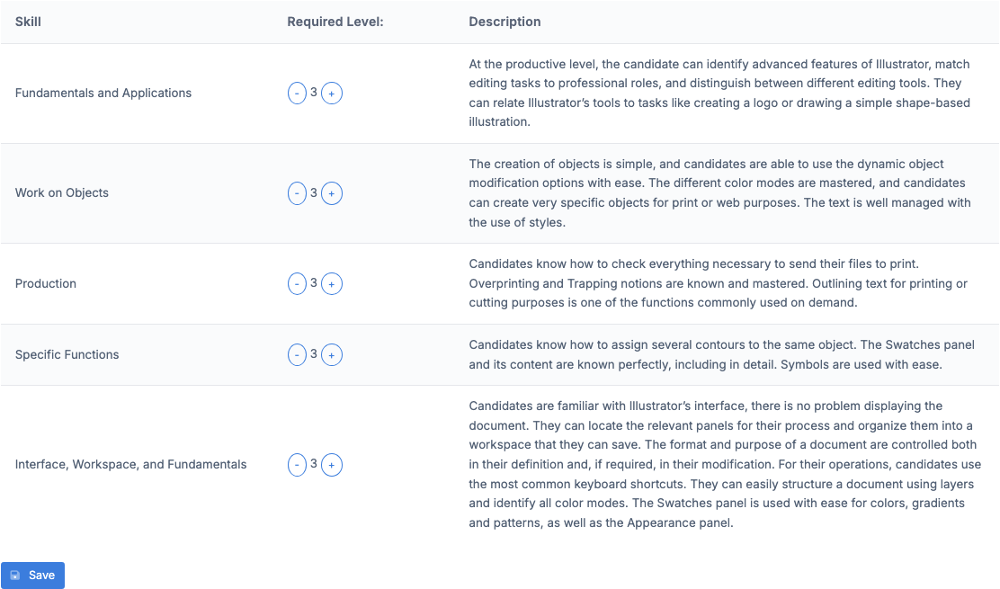
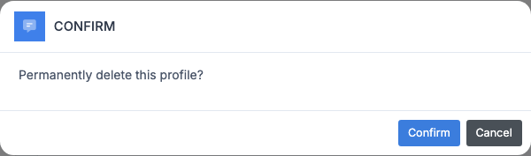

# Skill profiles

A **skill profile** (sometimes called a "job profile") is a benchmark of expectations: for a given job (for example *Administrative assistant*, *Junior accountant*, *Project manager*), you define **the expected level of mastery for every skill evaluated** by the Tosa subjects. A candidate's results can then be **compared** to this profile to visualise, skill by skill, the gap between expected and observed.

The **Profiles management** page lists every profile defined on your account. Each row shows the **identifier** and the **description** (the profile name). The **Add a profile** button creates a new profile and the **pencil** button opens the expected levels configuration page.

> 💡 **What is the practical use?** — Once a profile is defined, you can assign it to a candidate (or a group). When the candidate takes their tests, the generated report automatically compares their scores to the levels expected by the profile, and highlights the skills below the threshold. It is the reference tool for **strategic workforce planning** or **skills management** initiatives in a company.

## Create a profile {#create-a-profile}

1. From the **Profiles management** page, click on **Add a profile** in the action bar.

    

2. Enter the **description** of the profile — this is the name that will appear in the list and will be used for the assignment to candidates. Choose a meaningful label ("Junior accounting assistant", "Frontend web developer").

3. Click on **Save**. The profile is created and you are automatically redirected to its expected levels configuration page — see [Define required levels](#define-required-levels).

## Define required levels {#define-required-levels}

This is the central step: for each combination of **profile × language × subject**, you specify the expected level on each of the skills ("domains") evaluated by the subject.

The **Edit required levels** page is organised into two zones:

1. **Selection banner**:
    - **Choose a position** — the profile being edited (read-only; to edit another profile, return to the list).
    - **Language** — if the subject is available in several languages, you choose the one whose skills you want to see. Each language is configured independently.
    - **Choose a subject** — the topic to configure (Word, Excel, Python, English, etc.).
2. **"Expected skill level per profile" card** — the table of skills to configure for the selected subject.

### Reading the skills table

The table has **three columns**:

- **Skills** — name of the evaluated skill domain (for example *Tables and queries*, *Forms and reports*, *Calculation functions*).
- **Required level** — a number (from 0 to 5 depending on the subjects) flanked by two **−** and **+** buttons. This is the expected level for this profile on this skill.
- **Description** — description of the skills evaluated at this specific level. The text updates automatically when you change the level, helping you calibrate the desired threshold.

To adjust a level, click on **+** to increase or **−** to decrease. The corresponding description is displayed in real time on the right.

### Save

Once the table is adjusted, click on **Save** at the bottom of the table to persist the configuration. The save applies to the **subject and language currently selected**.

> 💡 **Working on several subjects** — To configure the same profile on several subjects, **always save before changing subject**. Switching subject without having saved would lose your modifications.

> ⚠️ **Subjects without skills** — Some subjects are not broken down into skills (for example, certain legacy tests or single-question tests). If you see the message *"There is no skill list for this subject."*, choose another subject; this subject is not configurable per profile.

## Edit an existing profile {#edit-a-profile}

1. On the **Profiles management** page, locate the profile's row and click on the **Edit** icon (pencil).
2. You land on the **Expected skill level per profile** page. Adjust the levels on each subject (see [Define required levels](#define-required-levels)).
3. To change the **name** of the profile (its description), you will have to recreate it: the description cannot be modified directly after creation.

## Delete a profile {#delete-a-profile}

1. On the profile's row, click on the **Delete** icon (trash can).
2. A confirmation window appears.

    

3. Confirm. The profile is deleted.

### Profile already assigned to candidates

If the profile has already been assigned to at least one candidate (or if skill levels are defined on it), the confirmation window **displays a warning**:

- *"This profile has been assigned to candidates and you have defined skill levels for this profile. Delete anyway?"*

Deletion remains possible — it simply detaches the profile from the affected candidates. Their historical results are not affected, but future comparisons will no longer be able to use this profile. Confirm if you wish to clean up, or cancel if you first want to transfer the candidates to another profile.

> 💡 **Best practice** — Before deleting a profile in use, create its **replacement** and **reassign** the candidates to the new profile. This prevents the candidates' history from referencing a profile that no longer exists.
