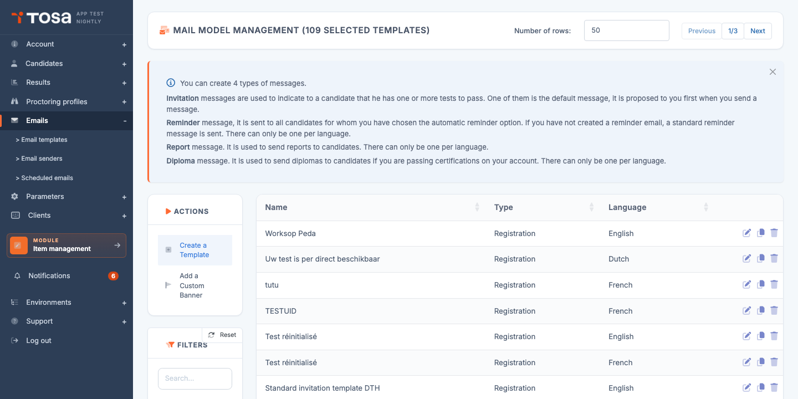
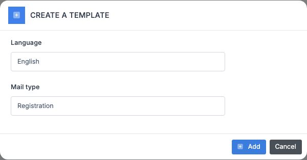
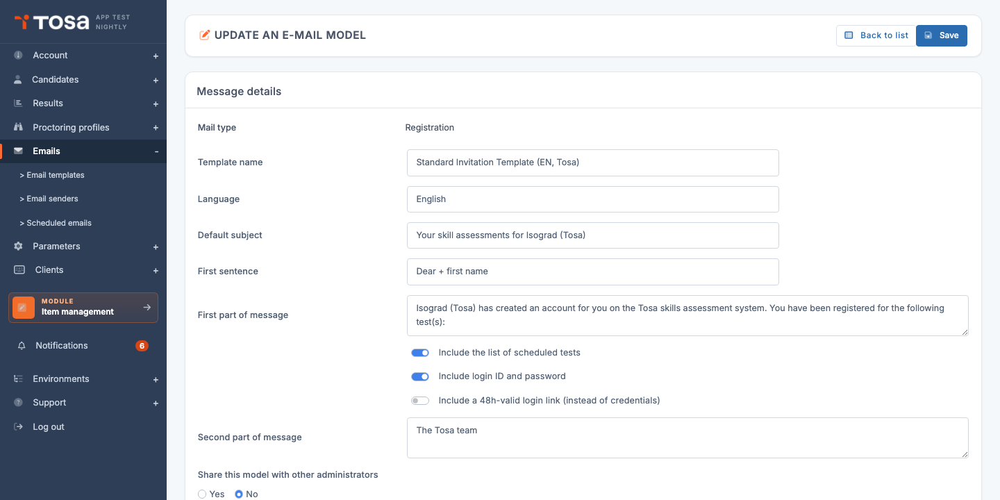
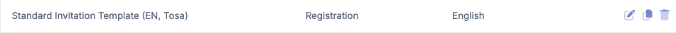
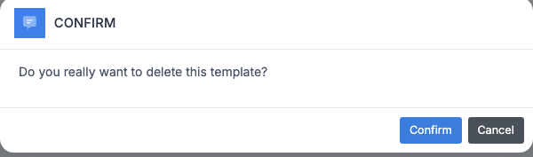
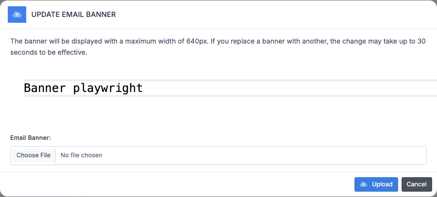
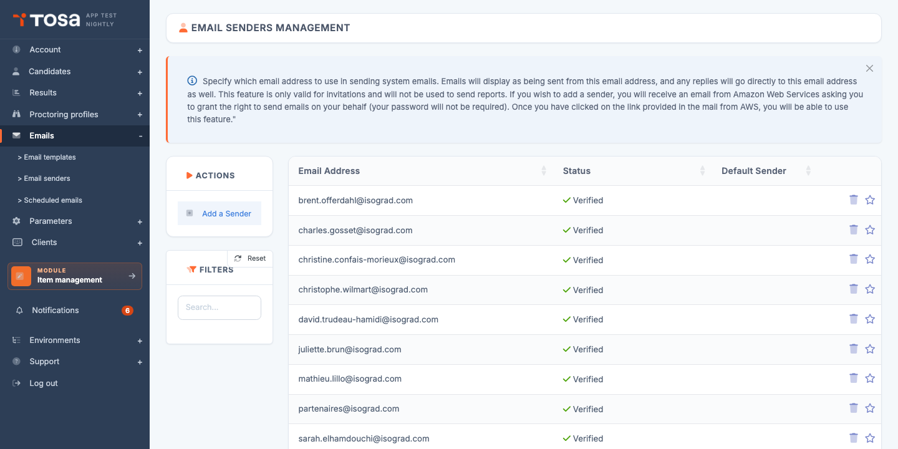
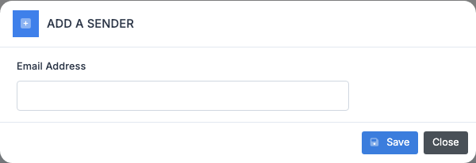
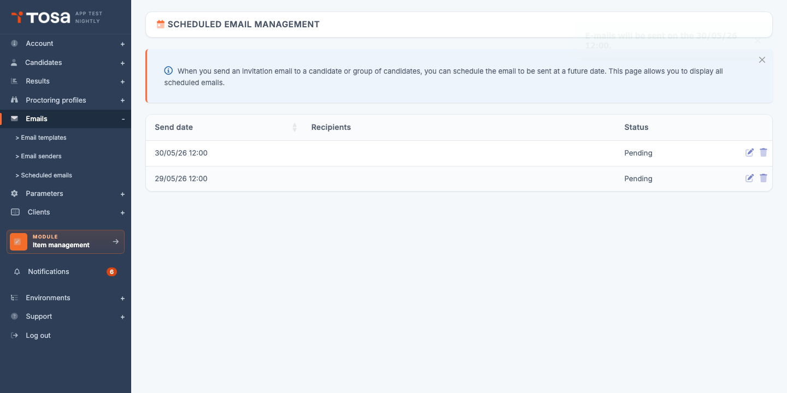
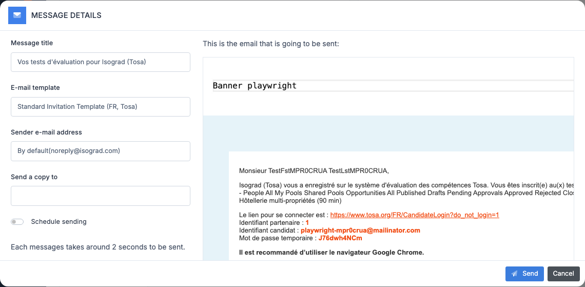

# Email management

This chapter covers everything related to emails sent from your account to candidates: the **mail templates** you customize, the **senders** (verified sending addresses), the **scheduled sendings** and the **custom banner** displayed at the top of your emails.

The **Mail templates management** page lists your email templates. Each row shows the template's **name**, its **type** (Invitation, Reminder, Report sending, Diploma sending) and its **language**. The main action buttons — **Create a template** and **Add a custom banner** — are at the top of the table.

## The four template types {#the-four-template-types}

The platform recognizes four types of messages, each with a different trigger:

- **Invitation** — sent when you (or an import) register a candidate to a test. This is the message that conveys their credentials or login link to the candidate. You can create **several invitation templates per language** (by brand, by campaign, by client). One of them is designated as the **default template** and is offered first in the sending window.
- **Reminder** — sent automatically to candidates who have not completed their test, if the automatic reminder option is enabled for their registration. Only one reminder template per language.
- **Report sending** — used to deliver result reports to candidates. Only one template per language.
- **Diploma sending** — used to send diplomas to candidates when you run certifications. Only one template per language.

> 💡 **Standard templates** — If you have not created any template for a given type, the platform sends a built-in standard message. You are therefore never blocked: creating templates lets you **customize** the content, not **authorize** it.

## Create an email template {#create-an-email-template}

### Procedure

1. From the **Mail templates management** page, click on **Create a template** in the action bar.

    

2. Choose the **type** of template from the dropdown list. Only the types **still available for your current interface language** are offered: for example, if you have already created a Reminder template in French, the "Reminder" type will no longer appear for French.

3. Confirm. The platform creates the template and takes you directly to its edit page.

    

### Template fields

The edit page is organized in two stacked cards: **Message details** (the form, captured above) followed by **Message preview** (a live preview of the email as it will be received) below.

The main fields, common to all types:

- **Template name** — internal label so you can find it in the list. Does not appear in the sent email.
- **Language** — sending language. Also determines the list of templates available in the sending window (a French template is only offered for French candidates).
- **Default message subject** — the email subject. Can still be modified at the time of each sending.
- **Opening greeting** — introductory phrase (for example *"Dear Mr. Smith"*) automatically added at the top of the message. The available content depends on the language.
- **First part of the message** — main body of the email, edited in a rich-text editor.

For **Invitation** templates only, additional fields are displayed:

- **Second part of the message** — optional text added **after** the credentials or login link.
- **Include the list of tests to take** — if enabled, the platform automatically inserts the list of registered tests in the email.
- **Include login details** — if enabled, the email contains the candidate's login and password.
- **Include a 48-hour valid login link (instead of credentials)** — if enabled, replaces login/password with a **single-use link valid for 48 hours**. This option takes precedence over the previous one.
- **Share this template with other administrators** — see [Private and public templates](#private-and-public-templates) below.

> 💡 **Live preview** — The right-hand panel displays the email as it will be received, with placeholder data (a fictitious candidate). The preview refreshes automatically when you edit a field; the **Refresh example** button forces a refresh.

### Merge tags

For the **Diploma sending** template, **tags** ("merge tags") are available to dynamically insert the test name, subject, date, score, as well as a LinkedIn sharing button:

| Tag | Inserted value |
|---|---|
| `[tst_des]` | The test name |
| `[sbj_des]` | The subject name |
| `[com_dat]` | The test date |
| `[hst_sco]` | The score obtained |
| `[linkedin]` | LinkedIn button |
| `[social_url]` | Social media sharing link |

Invitation templates use tags specific to credentials and the login link, automatically injected by the corresponding checkboxes — you do not need to insert anything manually.

## Private and public templates {#private-and-public-templates}

This distinction concerns **Invitation** templates only. The **Share this template with other administrators** toggle determines who can see and use your template:

- **Private template** (default) — only you and administrators with the *Read/write all templates* privilege see it in the list. Other administrators of your account can neither select it in the sending window nor edit it.
- **Public template** — visible and usable by every administrator of your account. Only you (or an administrator with the *Read/write all templates* privilege) can **edit** it.

> 💡 **What is the point?** — This distinction allows, for example, a training manager to prepare their own invitation template for a campaign, without seeing it diverted or modified by other administrators.

**Reminder**, **Report sending** and **Diploma sending** templates are always shared at the account level — they have no public/private toggle.

## Duplicate a template {#duplicate-a-template}

Duplication is useful to create a variant of an existing template (different language, different tone, different brand) without starting from scratch.

1. On the **Mail templates management** page, find the template to duplicate in the table. Duplication is only available for **Invitation** templates.

    

2. Click on the **Duplicate** icon at the end of the row.

3. The platform immediately creates a copy with the **same name, the same subject, the same content and the same options**, and takes you to its edit page.

4. Edit the name (and the language if needed) to distinguish the copy from the original, then save.

The duplicated template belongs to the administrator who clicked — its public/private status is carried over from the original, but you remain free to change it.

## Delete a template {#delete-a-template}

1. In the list, click on the **Delete** icon at the end of the row. The built-in **default Invitation** template has no delete button: it is protected.

2. A confirmation window appears.

    

3. Confirm. The template is deleted. Already sent emails are **not** affected; only future sendings will no longer be able to use this template.

## Add a custom banner {#add-a-custom-banner}

The banner is an image (logo, brand header) displayed **at the top of every email** sent from your account, regardless of the template.

### Procedure

1. On the **Mail templates management** page, click on **Add a custom banner** in the action bar.

    

2. Select an image file (JPG or PNG). **Maximum size: 1 MB.**

3. Confirm. The banner is applied to every template of the account.

> ⚠️ **Refresh delay** — If you replace an existing banner with another, the change may take **up to 30 seconds** to become effective (because of the CDN cache).

> 💡 **Display width** — The banner is displayed at a **maximum width of 640 pixels**. Prepare your file to this template for a sharp rendering.

The banner applies to **every type** of message (Invitation, Reminder, Report sending, Diploma sending): it is not set per template.

## Email senders {#email-senders}

A **sender** is the email address from which the platform sends your invitation messages. Your candidates will see this address as the sender; if they reply to the email, their reply will arrive directly at this address.

> 💡 **Scope** — Senders are **only** used for **invitations**. Report and diploma sendings are dispatched from a system address and are not affected by this setting.

### Why verify a sender?

To send emails to dozens of candidates in the name of your address, the platform relies on Amazon Web Services (AWS SES). AWS requires an **explicit authorization from the owner** of the address — it is an anti-spam mechanism: you cannot send emails pretending to be someone else.

### Add a sender

1. Open the **Email senders management** page from the Emails menu.

    

2. Click on **Add a sender**.

3. Enter the email address to use as sender, then confirm.

    

4. **You (or the owner of this address) will receive an email from AWS** requesting permission to send messages on behalf of this address. **No password will be requested.**

5. Click on the activation link contained in this email. You have **24 hours** to do so — beyond that, the request will have to be renewed.

6. Once the confirmation is done, the sender moves to **Verified** status in the list. It is then ready to be used.

### Default sender

You can have several verified senders (for example, one per brand or per department). One of them is designated as the **default sender** — this is the one used automatically when no other is specified.

- To designate a sender as the default, click on the **star** at the end of the row. The sender must be verified to be set as default.
- The star becomes filled when the sender is the default. Click again to remove it as the default.

### Delete a sender

1. Click on the **Delete** icon at the end of the sender's row.
2. Confirm. The sender is removed; the platform will no longer send emails from this address.

> ⚠️ **Shared address** — If an address is used as a sender on another platform account, this will be flagged. Deleting it from your account does not unregister the other account.

## Scheduled sendings {#scheduled-sendings}

When you send an invitation email to a candidate or a group, the sending window offers the option to **Schedule the sending** for a future date. All these deferred sendings accumulate in the **scheduled sendings queue**, where you can review them, edit their date or cancel them before they go out.

### Review the queue

From the Emails menu, open **Scheduled sendings management**.

Each row shows:

- The scheduled **sending date**.
- The **recipients** — the first five addresses are displayed in clear text, followed by *"+ X other(s)"* if the sending concerns more candidates.
- The **status**: **Pending** (the sending has not yet occurred) or **Sent** (the sending has gone out).

### Edit the date of a sending

Click on the **Edit sending date** icon at the end of a pending sending's row. A window lets you enter a new date and time. Confirm: the sending remains scheduled for the new date.

### Cancel a sending

Click on the **Delete** icon at the end of the row. The sending is removed from the queue and **will not be sent**. Already sent emails (**Sent** status) cannot be recalled.

> 💡 **Sending duration** — Allow approximately **2 seconds per message**. A sending to a group of 500 candidates therefore takes about 17 minutes to dispatch. This is why scheduling is useful: you can, for example, schedule a bulk sending outside business hours.

## Send an email to a candidate {#send-an-email-to-a-candidate}

Once your templates are configured, sending to a candidate is done from their record:

1. Open the candidate's record (from the **Candidates management** list, click on the **Edit** icon).
2. Click on the **Send the registration email** button.
3. In the window that opens:

    

    - Choose the **email template** among those available for the candidate's language.
    - The **subject** is pre-filled from the template; you can edit it for this sending only.
    - Optionally, enter a **CC address** in the **Send a copy to** field.
    - To defer the sending, tick **Schedule the sending** and enter the desired **sending date**. The sending will join the [scheduled sendings queue](#scheduled-sendings).

4. Confirm. If the sending is immediate, the candidate receives their email within seconds.

To send in bulk to a group, select the candidates in the **Candidates management** list, then use the group action **Send the registration emails** — the same window opens, but the sending applies to every selected candidate.
