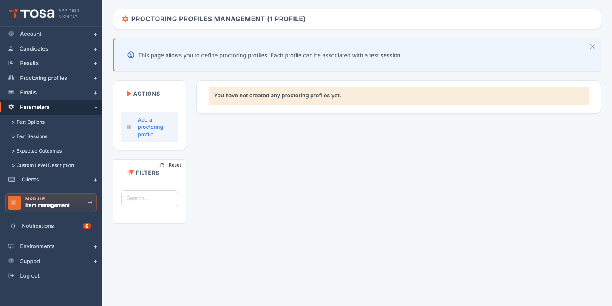
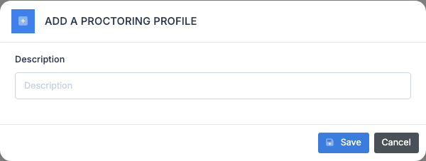
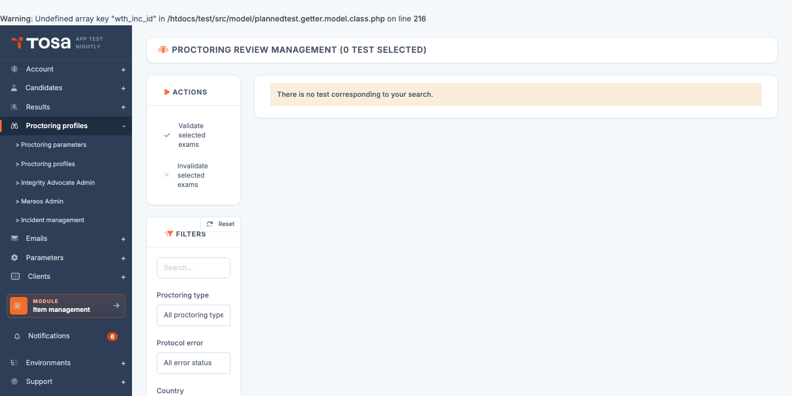

# Test proctoring

**Remote proctoring** guarantees the integrity of a test taken remotely, without an in-person invigilator. The platform offers several levels of proctoring — from mandatory full screen up to video and audio recording — together with *post-hoc* review of the detected incidents.

This chapter covers two complementary pages:

- **[Proctoring profiles](#proctoring-profiles)** — configure **how** your tests are proctored (which checks, which recordings).
- **[Proctored tests management](#proctored-tests-management)** — review **the sittings** already completed and validate or invalidate each test based on the collected evidence.

> 💡 **Availability** — Remote proctoring is an account option. If you do not see the pages described here in the menu, contact your Isograd representative to enable the feature.

## Proctoring profiles {#proctoring-profiles}

A **proctoring profile** is a set of settings that determines what the platform checks and records during the test. You can create several profiles (for example, *"Light exam"* vs *"Strict certification"*) and **attach them to [test sessions](/ai/en/sessions/)** to apply the right level of control in the right context.

Open this page through the **Proctoring → Proctoring profiles** menu, or directly at `/clientadmin/parameters/AdminProctoringParametersWithTable`.

The page lists your existing profiles. If your account is new and has no profile defined yet, you will simply see *"You have not yet created a proctoring profile."*. Each row shows the **name** of the profile and a **Default** marker for the profile used when none is explicitly chosen.

### Create a proctoring profile

Creation happens in **two steps**: name the profile, then configure its options on a dedicated page.

#### Step 1 — Name the profile

1. Click on **Add a proctoring profile** in the action bar.

    

2. Fill in the profile's **Description** — this is the label that will appear in the list and in the test sessions. Choose a meaningful name such as "Strict certification" or "Light internal exam".

3. Click on **Save**. The platform creates the profile and redirects you to its configuration page.

#### Step 2 — Configure the proctoring options

On the profile's edit page, tick the desired **proctoring options**:

| Option | Effect |
|---|---|
| **Request an ID document** | The candidate must photograph their ID document before starting. The photo is available for review afterwards. |
| **Force full screen** | The test can only be taken in full-screen mode. Exiting full screen triggers an incident. |
| **Record video** | The candidate's webcam is recorded for the duration of the test. The video is available at review time. |
| **Record audio** | The candidate's microphone is recorded (useful to detect a speaking presence). |
| **Take periodic captures** | Periodic screen and webcam captures during the test. |
| **Perform a room scan** | Before the test, the candidate makes a 360° sweep of their room with their webcam to show they are alone and that their workstation is compliant. |

Click on **Save** to persist the configuration. The profile is immediately usable in [test sessions](/ai/en/sessions/).

### Set a default profile

The **default** profile is applied automatically to every proctored test for which no profile is explicitly chosen (notably through test sessions).

1. On the profile's row, click on **Set as default proctoring profile**.
2. Confirm. The **Default** label moves to this profile; the previous default profile remains active but is no longer applied automatically.

### Edit a profile

1. On the profile's row, click on the **Edit** icon (pencil).
2. Adjust the options.
3. **Save**.

> ⚠️ **Effect on tests in progress** — Editing a profile **does not affect** tests already started or completed: only **future** tests using this profile will get the new options. Existing recordings remain those of the profile at the time of start.

### Delete a profile

1. On the profile's row, click on the **Delete** icon.
2. Confirm.

> ⚠️ **Profile in use** — A profile used in **at least one test session** cannot be deleted. The message *"This proctoring profile cannot be deleted because it is used in at least one test."* is displayed in that case. Detach the profile from the affected sessions first.

## Proctored tests management {#proctored-tests-management}

Once your tests have been taken under proctoring, this page lets you **review the detected incidents** and **validate or invalidate** each sitting based on the observed compliance.

Open this page through the **Proctoring** menu, or directly at `/clientadmin/clientresult/AdminProctoringReviewWithTable`.

Each row in the table represents **one test taken under proctoring**:

| Column | Content |
|---|---|
| **ID** | Internal identifier of the registration. |
| **Full name** | Candidate identity. |
| **Test** | Name of the subject taken. |
| **Sitting date** | Date and time of the sitting. |
| **Proctoring type** | Proctoring profile used (video, full screen, etc.). |
| **Validation status** | Current state — **Pending**, **Validated**, **Invalid**. |
| **Incident** | Number and nature of automatically detected incidents. |

### Filters

The filters panel lets you target:

- **Proctoring type** — restrict by profile used.
- **Validation status** — for example show only tests **Pending** review.
- **Incident** — for example show only tests that triggered an **Exit full screen** incident.

### Review a proctored test

The action buttons at the end of each row depend on the proctoring type and status:

- **Show the photos taken during the test** (camera icon) — opens a gallery of the screen and webcam captures taken periodically. The **Show only suspicious images** toggle filters the captures where AI has detected an anomaly (presence of another person, off-screen gaze, etc.).

    

- **Show the ID document** (silhouette icon) — displays the photo of the ID document provided by the candidate at start.
- **Protocol review comment** (magnifier icon) — for tests with an **incident**, this window details each incident, its nature, and offers a field to record the proctor's explanation or to ask the candidate for further information.

### Validate or invalidate a test

Once the review is done, you make the call:

- **Validate** (green ✓ icon) — the test is compliant. The candidate's result is finalised and the diplomas/reports are issued.
- **Invalidate** (red ✗ icon) — the test is not compliant (cheating detected, condition not met). The result is marked invalid; no diploma is issued.

For a **bulk action**, select several tests using the checkboxes at the start of the row, then use the **Validate the selected exams** or **Invalidate the selected exams** buttons in the action bar.

### Validation statuses

| Status | Meaning |
|---|---|
| **Awaiting details** | An incident has been detected (for example, exit from full screen) but no explanation has been provided yet. You must detail the reasons, or ask the candidate to do so. |
| **Detail under review** | An explanation has been entered and is awaiting review by the Isograd team (for certifications). |
| **Explanation validated** | The Isograd team has validated the explanation; the test is compliant. |
| **Validated** | The test has been validated by an account administrator. |
| **Invalid** | The test has been invalidated by an account administrator. |

### Request explanations from the candidate

For certifications with an incident, you can ask the candidate to **justify the incident**:

1. On the row, click on the **Send an ID document request** icon (or the equivalent for an incident).
2. The candidate receives an email inviting them to provide the explanation in their candidate area.
3. Once their response is submitted, the status moves to **Detail under review** and you can consult it in the **Protocol review comment** window.

> 💡 **Validation best practices** — For official certifications, be strict about incidents (exit from full screen > 60 seconds, presence of a second person in the captures). For internal corporate evaluations, you can be more lenient — proctoring remains a deterrent as much as a punitive tool.

## Enable proctoring on a test {#enable-proctoring}

Proctoring is **not** enabled item-by-item on this page: it is decided **at the time of registration** of a candidate to a test. To enable proctoring on a test:

1. Register the candidate to the test (see [Register a candidate to a test](/ai/en/candidates/#register-a-candidate-to-a-test)).
2. In the registration window, enable the **Remote proctoring** option.
3. If you want to apply a specific proctoring profile, attach the candidate to a [test session](/ai/en/sessions/) that has this profile attached.

Otherwise, the **default profile** is applied automatically.
