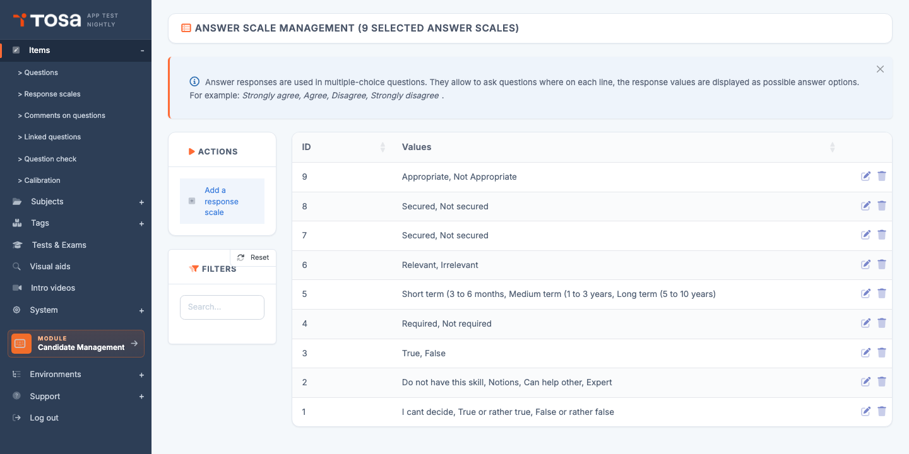
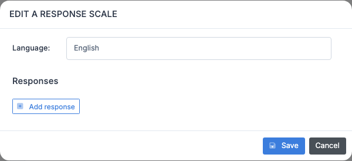

# Answer scales

An **answer scale** is a reusable set of answer options that you can attach to a question: *"Never / Rarely / Sometimes / Often / Always"*, *"Strongly disagree / Somewhat disagree / Somewhat agree / Strongly agree"*, or any other reference set you want to question a candidate against.

Scales let you **standardise** the answer options of a family of questions without retyping the labels each time. They are especially useful for behavioural questionnaires (Likert scales), self-assessments, and any survey where the same list of choices recurs.

Open the page through the menu **Questions module → Questions → Answer scales**, or directly at `/questions/AdminAnswerScalesWithTable`.

The table lists every defined scale, with its **identifier** and the list of its **values** (the options in order).

## Create a scale {#create-a-scale}

Creation is performed entirely **inside a modal** — there is no dedicated edit page.

1. From the **Answer scales management** page, click **Add a scale** in the action bar.

    

2. The **"Edit an answer scale"** modal shows:

    - A **Language** selector at the top (switch between the account's languages).
    - A **Values** area: each value has a label per language, preceded by a **reorder handle** (≡) and a position number, and followed by a delete icon.
    - An **Add a value** button to extend the list.

3. Enter the values in the desired order, in the displayed language. Then switch to the other languages to translate each label.

4. Click **Save**. The scale appears immediately in the list.

> 💡 **Minimum number of options** — A scale must have at least **two options** to be valid (a scale with a single value makes no sense). The platform blocks creation below this threshold.

## Reorder options {#reorder-options}

The order of options determines the order of presentation to the candidate. To change it:

- **Drag and drop** an option inside the modal area, or use the **up/down arrows** next to each option (depending on your interface version).
- The order is persisted on save.

> ⚠️ **Consistent ordering** — The order applies to **all languages** simultaneously: you cannot have one order in FR and another in EN. If a translation requires a culturally different order (which is rare), create two separate scales.

## Multilingual entry {#multilingual-entry}

The language selector at the top of the modal lets you enter labels in each language active on your account. Recommendations:

- **Enter the source language first** (typically French), then translate to the other languages.
- **Fill every active language** before first production rollout. A missing language will display an empty label to the candidate, which is confusing.
- **Have the same number of options** in each language: the platform does not let you have 5 options in FR and 4 in EN.

## Edit a scale {#edit-a-scale}

1. On the scale's row, click the **Edit** icon (pencil).
2. The **same modal** as for creation opens, pre-filled with the current values.
3. Adjust labels, add or remove options, reorder them.
4. Save.

> ⚠️ **Editing a scale that is in use** — If the scale is referenced by questions, your change affects **every** one of those questions. Be careful: changing the order of options on an already-used scale can disturb the analysis of historical results (an option that was in position 3 suddenly becomes position 5, which can shift statistics).

## Filters {#filters}

The **Filters** panel offers:

- **Search** — free text on the ID or on the option values. Useful to find the scale that contains *"Often"* among dozens of reference scales.

Column sorting is available by clicking the headers.

## Delete a scale {#delete-a-scale}

1. On the scale's row, click the **Delete** icon.
2. Confirm on the confirmation dialog.

> ⚠️ **Scale in use** — A scale referenced by at least one question **cannot be deleted**. The platform refuses the operation with an error message. To delete a widely used scale:
>
> 1. Identify the questions that reference it (search by scale identifier on the Questions page).
> 2. Edit those questions to point to another scale, or delete them.
> 3. Retry the deletion.

## Best practices {#best-practices}

- **One scale, one business use case** — resist the temptation to merge several different meanings into a single scale. An "Excel usage frequency" scale and a "comfort level with Excel" scale must remain separate, even if the labels look similar.
- **Odd number of options** for Likert scales where you want to offer a **neutral** position to the candidate (typically 5 or 7 levels). Prefer an **even** number (4 or 6) if you want to **force** the candidate to take a side.
- **Reuse rather than duplicate** — before creating a new scale, check whether an equivalent scale already exists. Filter by keyword to explore the reference set before adding content.
