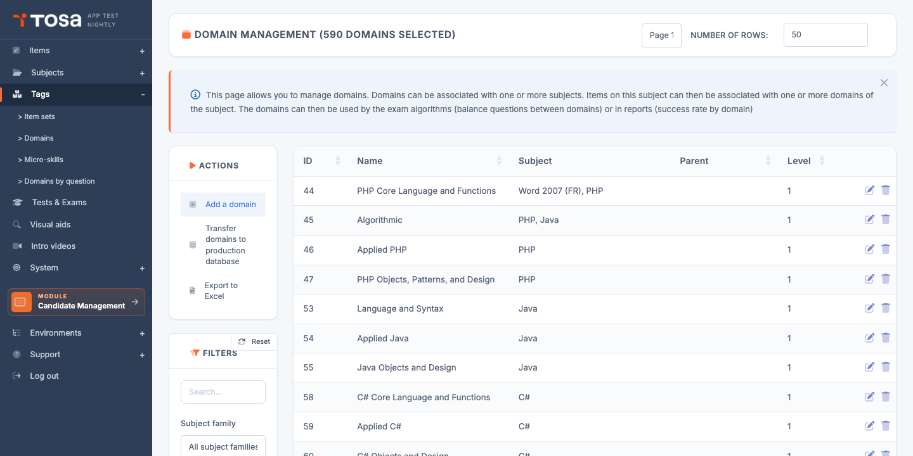
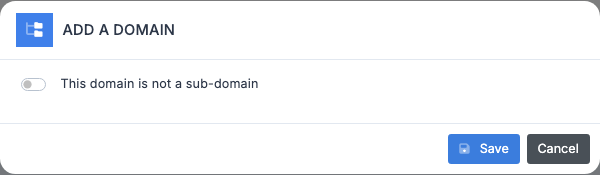
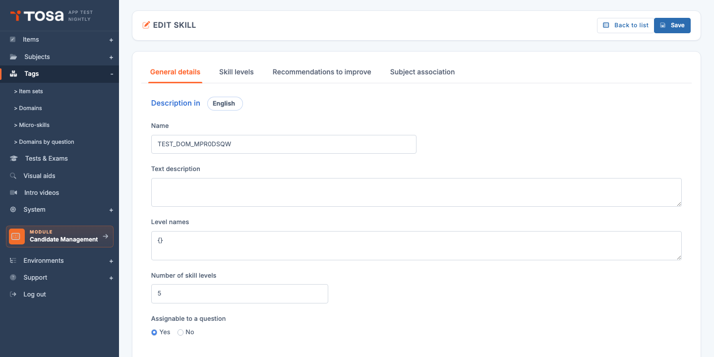
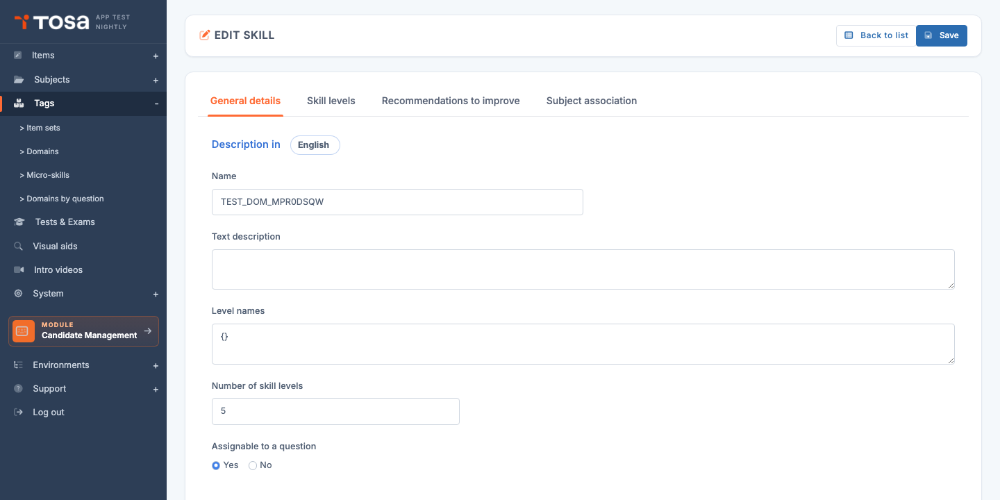

# Skill domains

A **skill domain** (often just called a *domain*) is a thematic breakdown within a subject: for *Microsoft Excel*, you will find *Formatting*, *Calculation formulas*, *Pivot tables*, *Charts*. Every question authored on the platform is attached to a domain, so candidate reports can show a score **per skill area** rather than just an overall score.

Open the page from the menu **Question Module → Categories → Domains**, or directly at `/domains/AdminDomainsWithTable`.

The table lists every defined domain, with its **ID**, its **name**, the **subject(s)** it is attached to, its **parent** (where applicable) and its **hierarchy level** (1, 2 or 3). The page title is *"Skill domain management"*.

## Domain hierarchy {#domain-hierarchy}

A domain can be placed on up to **three levels** of nesting:

| Level | Role | Example |
|---|---|---|
| **L1 — Main domain** | The top chapter. A question can be attached directly to an L1. | *Calculation formulas* |
| **L2 — Sub-domain** | Splits the L1 into more precise sub-themes. | *Mathematical functions* (child of *Calculation formulas*) |
| **L3 — Sub-sub-domain** | Finest level. Optional. | *SUMIF / COUNTIF* (child of *Mathematical functions*) |

> 💡 **When should I go down to L2 or L3?** — If you expect **at least 5–10 questions** in a sub-theme AND that sub-theme deserves a dedicated score in the report, create an L2. For fine-grained granularity (< 5 questions), stay at the L1 and use **micro-skills** instead (see next chapter).

## Create a domain {#create-a-domain}

Creation is a two-step process: a modal to pick the placement, then the edit form for the content.

### Step 1 — Creation modal

1. From the list, click **Add a domain** in the action bar.

    

2. The modal opens with the **"Main domain" switch ticked by default**: the domain will be created as an L1 (root).

3. To create an **L1**, change nothing: confirm. The domain is created and you are redirected to its edit form.

4. To create an **L2 or L3**, **untick** the switch. A first picker appears, asking for the **L1 parent** domain:

    

5. Select the L1. If that L1 already has L2 children, a **second picker** appears so you can choose whether the new domain is:
    - A **new L2** (leave the second picker empty).
    - An **L3** attached to an existing L2 (pick the L2 in the second picker).

6. Confirm. The domain is created at the right level, with the right parent, and you land on its edit form.

> 💡 **Reactive modal** — The modal calls the server (`GetDomainSelectorsAjaxScript`) on each selection to dynamically propose the relevant child picker(s). An L1 with no children offers only one picker; an L1 with children offers a second one for the L3.

### Step 2 — Edit form

On the **Edit a domain** page that opens, fill in the tabs — see [Tabs of the edit form](#tabs-of-the-edit-form).

## Tabs of the edit form {#tabs-of-the-edit-form}

The domain edit form (titled **EDIT A DOMAIN**) offers up to **four tabs**:

| Tab | Contents |
|---|---|
| **General characteristics** | Domain name and description (multilingual), number of skill levels, **"Assignable to a question"** flag, custom level names. |
| **Skill levels** | Visible only if the number of levels is greater than 0. For each level and each language, a description of what a candidate at that level can do **specifically on this domain**. Refined relative to the subject's global descriptions. |
| **Recommendations to progress** | For each level and each language, advice given to the candidate on how to progress **to the next level**. These texts appear in the *"How to progress?"* section of the report. |
| **Associate subjects** | Attach this domain to one or more subjects — see [Link a domain to a subject](#link-a-domain-to-a-subject). |

### Fields in the "General characteristics" tab

The **"Description in"** language picker at the top switches between the active languages. The fields:

- **Name** — short label for the domain, shown in reports and lists.
- **Text description** — free paragraph detailing the scope of the domain. Acts as internal documentation for question authors.
- **Level names** — optional JSON used to customise the level names (default *Level 1*, *Level 2*… ; you can rename them to *Initial*, *Basic*, *Operational*, etc.).
- **Number of skill levels** — how many mastery tiers are defined on this domain. **0** means "no levels specific to this domain" (the subject's overall score is enough). **3 to 5** is typical for domains that warrant fine-grained analysis.
- **Assignable to a question** (Yes / No) — if **Yes**, the domain can be selected as the attachment of a question, and it appears in the candidate report's skill map. If **No**, the domain only serves as an **editorial grouping** for its children (an L1 "umbrella" that does not directly carry questions, for example).

> 💡 **Reactivity** — Changing the value of the **number of skill levels** instantly updates the *Skill levels* tab: the matching fields appear or disappear without reloading the page.

## Link a domain to a subject {#link-a-domain-to-a-subject}

A domain is useful only if it is **linked to at least one subject**. The link is set up via the **Associate subjects** tab on the domain's form:

The tab shows two side-by-side lists:

- **Available subjects** (`#unused`) — every subject not linked to this domain.
- **Associated subjects** (`#used`) — the subjects currently attached.

**To link**: drag and drop a subject from **available** to **associated**. The reverse to unlink. Click **Save** at the top right to persist.

> 💡 **Filter the list** — If you have many subjects, use the filter field above each list to quickly find the subject you want.

> ⚠️ **Unlinking a domain that has questions** — If you unlink a subject from a domain **while questions exist on that pair**, those questions become orphaned. The platform shows a warning before confirmation. Confirm only if you intend to delete or reassign those questions immediately afterwards.

## Associated questions {#associated-questions}

On a domain's form, the **View associated questions** link opens the **AdminQuestionsWithTable** page **pre-filtered** on that domain. Useful to:

- Check how many questions have been authored per domain.
- Identify domains that are thin on questions and would benefit from more authoring.
- Move quickly between the pedagogical definition (the domain form) and the content (the questions).

## Filters {#filters}

The **Filters** panel offers:

- **Search** — free text on the domain's ID or name.
- **Subject family** — restricts the list to domains of subjects in a given family. Combined with search, this is the most effective tool for finding a domain in a large reference framework.

Sorting is available on each column by clicking the header.

## Delete a domain {#delete-a-domain}

1. On the domain's row, click the **Delete** icon.
2. Confirm via the **Delete** button on the confirmation page.

> ⚠️ **Domain with questions** — A domain that contains **at least one question** cannot be deleted. The platform refuses the operation with an error message. Before deletion, **transfer or delete the questions** attached to it (use the *View associated questions* link to find them).

> 💡 **L2/L3 child domains** — You also cannot delete an **L1** or **L2** domain if it has **children**. Delete the children first (bottom-up), then the parent.

## Export the list {#export-the-list}

The **Export to Excel** button in the action bar generates an `.xlsx` file listing every domain currently filtered. Useful for audits of the pedagogical reference framework or for sharing the list with external contributors.
