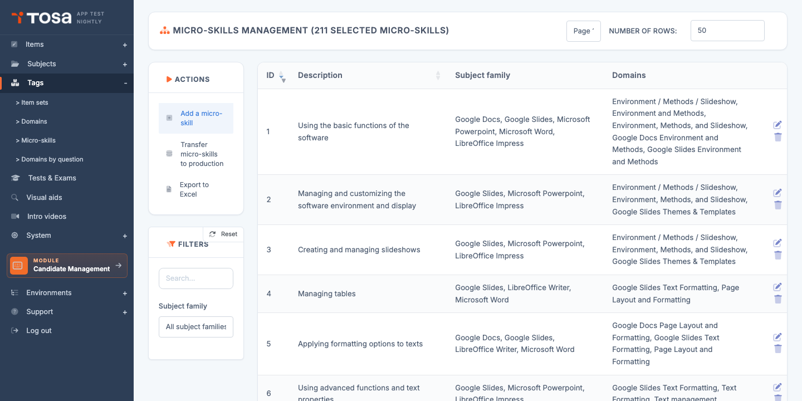
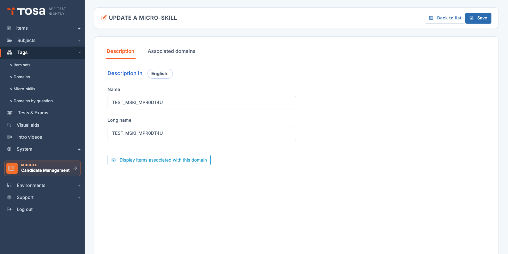

# Micro-skills

A **micro-skill** is a fine-grained skill that cuts across several level-1 domains. Where a *domain* is a broad chapter ("Calculation formulas"), a micro-skill is a much more precise item ("Mastery of date functions", "Use of absolute references").

Micro-skills are used to:

- **Tag** questions in fine detail, independently of the domain breakdown.
- Produce cross-cutting analyses: *"On which precise micro-skills did this candidate fail?"*
- Identify **coverage gaps** in the reference framework — for example, spotting micro-skills that have no (or few) authored questions.

Open the page from the menu **Question Module → Categories → Micro-skills**, or directly at `/domains/AdminMicroSkillsWithTable`.

The table lists every micro-skill, with its **ID**, its **description**, the **subject family** of the domains they are associated with, and the list of attached **domains**.

## Domain vs micro-skill {#domain-vs-microskill}

The distinction is subtle and worth clarifying:

| | **Domain** | **Micro-skill** |
|---|---|---|
| Granularity | Broad (chapter) | Fine (precise item) |
| Attachment | One subject per domain | Several domains (cross-cutting) |
| Presence in the report | Score per domain | Not shown to the candidate |
| Use | Pedagogical breakdown | Traceability tag |
| Hierarchy | Up to 3 levels (L1/L2/L3) | Flat |

> 💡 **When to use which?** — Use a **domain** when you want a breakdown visible in the candidate report. Use a **micro-skill** for internal analysis needs and to steer coverage of the reference framework.

## Create a micro-skill {#create-a-microskill}

Creation is **direct** — no pre-creation modal, unlike subjects or domains.

1. From the **Micro-skill management** page, click **Add a micro-skill** in the action bar.

2. The platform immediately creates an empty record and takes you to its edit form (`MicroSkillUpdate?is_create=1&mic_ski_id=<new_id>`).

3. Fill in the tabs — see [Tabs of the edit form](#tabs-of-the-edit-form) below.

## Tabs of the edit form {#tabs-of-the-edit-form}

The micro-skill edit form has **two tabs**:

### "Description" tab

For each language (the **"Description in"** picker at the top of the tab), two fields:

- **Name** — concise label that appears in the list and in question filters. Choose a meaningful title of about ten words at most.
- **Long name** — explanatory text detailing the scope of the micro-skill. Acts as documentation for question authors and QA reviewers.

A button **Show questions associated with this domain** opens the list of questions currently tagged with this micro-skill — useful to check coverage at a glance.

### "Associated domains" tab

This tab is structurally the most important one: it determines **in which domain(s)** the micro-skill can be used to tag questions.

The tab shows two side-by-side lists:

- **Available domains** (`#unused`) — every level-1 domain not yet associated with this micro-skill.
- **Associated domains** (`#used`) — the domains currently attached.

**To link**: drag and drop a domain from **available** to **associated**. The reverse to unlink. Click **Save** at the top right to persist.

> 💡 **Filter the list** — A filter field above each list lets you quickly find a domain once the framework grows large. Essential on accounts with several hundred domains.

> ⚠️ **Level-1 domains only** — Only **L1 domains** appear in the lists. L2 and L3 domains automatically inherit the micro-skill from their parent. This avoids the unmanageable combinatorial explosion of associating a micro-skill with dozens of sub-levels.

## Multilingual entry {#multilingual-entry}

As with domains, a micro-skill's description is multilingual: the **"Description in"** picker at the top of the Description tab lets you switch between the active languages. Fill in at least your account's default language; the other languages can be left blank if you do not have time to translate — the micro-skill remains usable, but will fall back to its default-language label.

## Filters {#filters}

The **Filters** panel offers two controls:

- **Search** — free text on the ID or the short description.
- **Subject family** — restricts the list to micro-skills associated with at least one domain of a subject in the chosen family.

Sorting is available on each column by clicking the header.

## Delete a micro-skill {#delete-a-microskill}

1. On the micro-skill's row, click the **Delete** icon.
2. Confirm via **Delete** on the confirmation page.

> 💡 **Tag lost** — Unlike domains, micro-skills can be deleted **even when questions are tagged with them**: the questions simply lose the tag but remain intact. Before deleting a widely used micro-skill, open the list of associated questions to gauge the impact.

## Export the list {#export-the-list}

The **Export to Excel** button in the action bar generates an `.xlsx` file listing every micro-skill currently filtered, along with their associated domains. Valuable for framework audits and for sharing the full mapping with external contributors.
