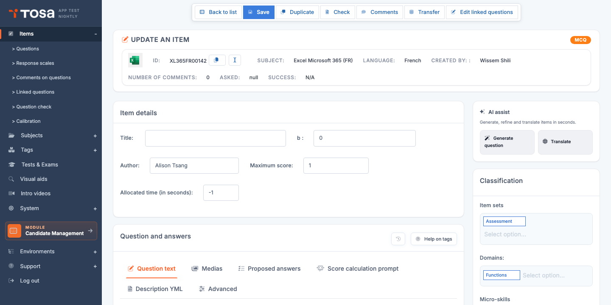
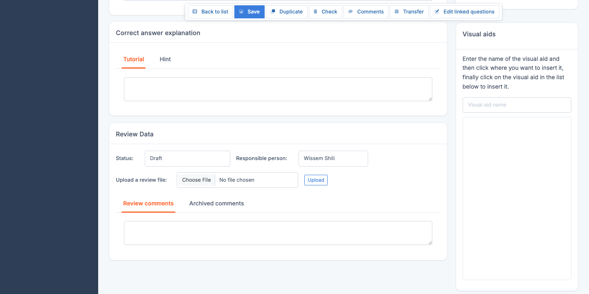

# Question editor

The **question editor** (`QuestionUpdate`) is the most heavily used tool in the Questions module — this is where you write statements, define answer options, add illustrations and visual aids, and tag each question on the skills map. Any administrator producing content for the platform spends the majority of their time on this page.

Open the editor through the **Edit** icon (pencil) on a question's row in the **[Questions](/ai/en/question-module/questions/)** page, or directly at the URL `/questions/QuestionUpdate?que_str_id=<id>`.

> 💡 **Answer type and interface** — The editor **adapts its interface** to the question's **answer type** (`ans_typ_id`). An MCQ question shows an answer-option input area; a Code question gets a syntax-highlighted code editor; a Drag-and-drop question gets an editor for draggable items. This chapter covers the common organisation **and** the per-type specifics.

## Overview {#overview}

The edit page (titled **EDIT A QUESTION**) is organised into several zones, with a badge at the top right showing the **answer type** of the current question (MCQ, Code, Drag-and-drop, etc.):

1. **Global action bar** (above the header):
    - **Back to list** — return to the Questions page.
    - **Save** — saves all modifications via AJAX.
    - **Duplicate** — creates a copy of the question.
    - **Check** — runs the editorial diagnostic on this single question (empty title, missing statement, options not marked correct, etc.).
    - **Comments** — opens the list of comments left by candidates on this question during tests.
    - **Transfer** — promotes the question from pre-production to production.
    - **Edit linked questions** — accesses any linked questions (groups of questions sharing a context).

2. **Identity banner**:
    - Subject icon + **ID** (`que_str_id`, for example `XL365FR00142`) with a **Copy** button and a **Rename identifier** button.
    - **Subject**, **Language**, **Creator** (the question's initial administrator).
    - **Number of comments**, **Taken** (number of takes), **Success** (success rate).

3. **"General characteristics" section**:
    - **Title**, **b** (IRT difficulty parameter, **editable** for manual adjustment after calibration).
    - **Inventor** (name of the question's original author, distinct from the account creator).
    - **Maximum score** (defaults to 1).
    - **Allotted time** (in seconds; `-1` means "no limit").

4. **"Question and answers" section** — the heart of editing, organised into tabs (see [Editing tabs](#editing-tabs)).

5. **"AI assist" sidebar** on the right — AI generation buttons (see [AI generation](#ai-generation)).

6. **"Classification" sidebar** on the right — question sets and domains the question is attached to (with Choices.js tags).

> 💡 **Everything on a single page** — Unlike other platform entities, the editor does not navigate between several pages. All edits are made here and saved in one click via the **Save** button at the top.

## Editing tabs {#editing-tabs}

The **Question and answers** section is organised into tabs specific to the question's content:

| Tab | Content |
|---|---|
| **Question statement** | The text shown to the candidate (rich Markdown / HTML). |
| **Media** | Insertion and management of visual aids attached to the statement. |
| **Proposed answers** | Answer options (varies by answer type — see per-type sections). |
| **Score-calculation prompt** | For AI-graded or semi-automatically graded questions: instructions given to the AI to compute the score. |
| **YML description** | Raw YAML view of the question's configuration — for advanced administrators who want to edit the data structure directly. |
| **Advanced** | Advanced options: order of options, specific behaviour, technical metadata. |

Two help buttons at the top right of this section:

- **History** (clock icon) — change history of the question.
- **Tag help** — reference for the Markdown and templating tags available in the editor.

## Common fields (title, text, illustration, tutorial) {#common-fields}

### Metadata

- **Subject** — subject the question is attached to. Determines the candidate pool that will see the question.
- **Domain** — assessed skill domain (the question's main skill). Used for the candidate report's mapping.
- **Micro-skills** — additional cross-cutting tags (see [Micro-skills](/ai/en/question-module/microskills/)).
- **Question set** — if the question is part of a coherent block (see [Question sets](/ai/en/question-module/question-sets/)).
- **Status** — *Draft*, *Under review*, *Production*. Controls the question's visibility to client accounts.
- **Owner** — editorial owner of the question.
- **Language** — set at creation, not editable. One question = one language.

### Title

The **Title** (`tit`) is a short label that appears in the *Title* column of the list and in calibration reports. **Not shown to the candidate.** Choose a **descriptive and unique** title: *"SUMIF on a filtered table"* is better than *"Excel - question 17"*.

### Question text

The **Text** (`txt`) is the statement shown to the candidate. You enter it in a rich editor that supports:

- **Markdown** — bold, italic, lists, links, code blocks. Rendering is immediate in the preview.
- **HTML formatting** for advanced cases (tables, specific CSS classes).
- **Visual aid insertion** via the dedicated button (see [Visual aids](#visual-aids-section)).
- **Direct illustration insertion** (image on the question — see [Illustration](#illustration)).

> 💡 **Markdown vs HTML** — Prefer Markdown for everyday writing. Reserve HTML for cases where Markdown is not enough (complex tables, specific formatting).

### Illustration

An **illustration** is an image attached **directly to the question** (as opposed to a visual aid, which can be shared across multiple questions). It is the main image accompanying the statement.

- To **add** an illustration, click the upload button and pick your file (PNG/JPG/SVG).
- To **change** the alternative text (alt text), type it in the dedicated field — important for accessibility and screen readers.
- To **remove** the illustration, click the **Remove illustration** button.

> 💡 **Illustration or visual aid?** — An **illustration** is specific to the question, ideal for an image that will never be reused. A **[visual aid](/ai/en/question-module/visual-aids/)** is shared across multiple questions, ideal for an Excel table or a source-code snippet shared across 10 questions of the same module.

### Tutorial

The **Tutorial** (`tut`) is a detailed explanation shown to the candidate **after** they answer, in review mode. This is the pedagogical moment: explain why the correct answer is correct, how to identify it, and which common mistake to avoid. Same format as the text (Markdown / HTML).

### Visual aids {#visual-aids-section}

You can insert one or more **visual aids** into the text or the tutorial. See the [Visual aids](/ai/en/question-module/visual-aids/) chapter for creation and management. In the question editor:

- Click the **Insert a visual aid** button in the text editor.
- Pick the visual aid from the list filtered by subject and language.
- Confirm: the reference is inserted in the text. The candidate-side rendering will show the full image/PDF.

Two variants exist:

- **Standard visual aid** — image or document directly embedded in the flow.
- **Keyboard visual aid** — image shown as an inset for keyboard or interface questions, generally smaller.

## AI generation {#ai-generation}

Depending on your account configuration, the editor offers an **AI assist** sidebar on the right of the page, with two main buttons:

- **Generate a question** — proposes a full statement (text, answer options, correct answer) from the question's metadata (subject, domain, difficulty level).
- **Translate** — translates the question's content into another language, useful to quickly produce several linguistic versions of a subject.

Depending on your interface version, other AI generation buttons may appear, targeting the **title** or the **tutorial** specifically.

> ⚠️ **AI proposes, you decide** — Generated content is a **starting point**, not a final deliverable. Always proofread and correct before saving. Quality depends on the AI model configured at the account level (see [Default options](/ai/en/default-options/#general-settings)).

> 💡 **Generation counter** — Every AI call is counted and limited by your quota. Avoid "test" generations: refine your prompt before clicking.

## Answer types — overview {#answer-types}

The platform offers about twenty answer types, grouped into families:

| Family | Types | Use case |
|---|---|---|
| **Multiple choice** | Text MCQ (`TEXT_MCQ`), Scale MCQ (`SCALE`) | Classic knowledge assessment. |
| **Free entry** | Fill in the blanks (`MULTI_INPUT`), Fill in the blanks with select (`TEXT_WITH_SELECT`), Manual marking (`MANUAL_MARKING`) | When the proposed choices would be too revealing. |
| **Manipulation** | Drag-and-drop (`DRAG_AND_DROP`), Sortable (`SORTABLE`), Link/Pairing (`LINK`), Click in area (`CLICK_IN_AREA`) | Interactive and engaging tests. |
| **Code** | Code (`CODE`), Code with stdin (`STDINCODE`), Code optimisation (`OPTIMIZATION_CODE`) | Programming-skills assessment. |
| **Office and applications** | Office remote (`MSGRAPH_OFFICE_REMOTE`), Desktop remote (`DESKTOP_REMOTE`), Local app (`LOCAL_APP`), Local or remote manipulation (`LOCAL_OR_REMOTE_APP`) | Tests on real software (Excel, Word, etc.). |
| **Keyboard entry** | Typing test (`TYPING_TST`), Typing test with correction (`TYPING_TST_WITH_COR`), Dictation (`DICTATION`, `DICTATION_AI`) | Typing speed and accuracy, dictation. |
| **Upload** | Upload with automatic grading (`UPLOAD_WITH_AUTOMATIC_GRADING`) | File submission graded by AI. |
| **Specific** | Psychometric (`PSYCHOMETRIC`), Self-assessment (`SELF_ASSESSMENT`), Transition page (`NOANSWER`) | Edge cases (personality tests, transitions). |

The following sections detail the **most common** types.

## Multiple-choice (MCQ) {#mcq}

The **Text MCQ** type (`TEXT_MCQ_ANS_TYP_ID=0`) is the most used type on the platform. The candidate sees a question and several answer options, of which **one or more** are correct.

### Editing the options

The MCQ editor exposes a list of options, each with:

- A **proposal text** field.
- A **Correct** checkbox indicating whether the option is a correct answer.
- A **Delete this option** button.

An **Add an option** button at the bottom of the list lets you grow the number of options. You can have between 2 and 8 options per question (4 is the recommended standard).

> 💡 **One or several correct answers?** — Tick **only one** **Correct** checkbox for a single-choice MCQ (the candidate can only pick one answer). Tick **several** checkboxes for a multi-choice MCQ (the candidate can pick several, and must find them all to get the question right).

### Order of options

By default, the options are shown to the candidate in **random order** on each take. If you want to force a fixed order (for example for a logic question where the order of choices carries meaning), tick the **Fixed order** option in the question's advanced options.

## Scale (Likert, T/F) {#scale-question}

The **Scale** type (`SCALE_ANS_TYP_ID=21`) presents the candidate with a question paired with a reusable **answer scale** — for example a Likert scale *"Strongly disagree / Somewhat disagree / Somewhat agree / Strongly agree"*, or a simple True/False scale.

### Editing

- **Select the scale** in the dropdown (see [Answer scales](/ai/en/question-module/answer-scales/) to manage available scales).
- The editor shows the selected scale's options and lets you tick the **correct answer** (a single checkbox ticked).

> 💡 **A correct answer even for Likert** — Even on a Likert scale (where there is no strictly correct answer), you must tick the expected option for score calculation. For purely declarative surveys, use the **Self-assessment** type instead.

## Fill in the blanks {#fill-in-the-blanks}

The **Fill in the blanks** type (`MULTI_INPUT_ANS_TYP_ID=18`) presents a text with one or more **input fields** that the candidate must fill in.

### Editing

In the question text, you insert **field markers** (typically `[input_1]`, `[input_2]`, etc.). The editor then exposes, for each marker, a configuration block:

- **Correct answer** — exact expected text.
- **Accepted variants** — other spellings or formulations also counted as correct.
- **Case sensitivity** — whether the comparison is sensitive to uppercase/lowercase.

### Fill in the blanks with select (Text-with-select)

A variant (`TEXT_WITH_SELECT_ANS_TYP_ID=10`) offers the candidate a **dropdown list** instead of a free-text field. For each blank, you define the list of options and the correct one.

## Code {#code}

The **Code** type (`CODE_ANS_TYP_ID=3`) presents the candidate with a code editor (Ace editor) where they must write a program in a given language (Python, JavaScript, etc.).

### Editing

The Code question editor exposes two distinct code blocks:

- **Verification code** (`question_programming_code`) — code executed server-side **before** or **after** the candidate's submission to validate their answer. Lets you define test cases (for example: *"if the candidate's function returns 42 for the input [1,2,3,4,5,6,7,8,9,10], the question is correct"*).
- **Solution** (`solution_code`) — reference code that correctly solves the question. Used as a model for grading and for the candidate preview.

### Language

The **programming language** is chosen via a selector. It determines the Ace editor's syntax highlighting and the server execution environment (Docker container with the corresponding interpreter).

### Variant with stdin

The **Code with stdin** type (`STDINCODE_ANS_TYP_ID=6`) adds the ability to provide a **standard input** to the candidate's program (useful for algorithmic questions where input is read from `stdin`).

### Optimisation variant

The **Code optimisation** type (`OPTIMIZATION_CODE`) requires the candidate not only to provide a correct solution, but also a **performant** one (for example in algorithmic complexity). The evaluation includes execution-time metrics.

## Drag-and-drop {#drag-and-drop}

The **Drag-and-drop** type (`DRAG_AND_DROP_ANS_TYP_ID=8`) presents the candidate with **items** to drag and drop into **target zones**.

### Editing

- Define the list of **items** (text, image, or both).
- Define the **target zones** in the background illustration (typically an image with numbered slots).
- For each item, specify the **correct target zone**.

## Sortable {#sortable}

The **Sortable** type (`SORTABLE_ANS_TYP_ID=32`) presents the candidate with a list of items to **reorder** into the correct sequence.

### Editing

- Define the list of items in the **correct** order.
- On presentation to the candidate, they will be automatically shuffled.
- The candidate must put them back into the right order.

## Link (pairing) {#link}

The **Link** type (`LINK_ANS_TYP_ID=11`) offers the candidate two columns of items they must **pair**.

### Editing

- Define two lists: **column A** and **column B**.
- Indicate which pairs are the correct associations.
- You can have 1-to-1 or 1-to-many correspondences depending on your configuration.

## Click in area {#click-in-area}

The **Click in area** type (`CLICK_IN_AREA_ANS_TYP_ID=12`) presents the candidate with an **image** on which they must click at a precise spot (a button in a screenshot, an area of a diagram, etc.).

### Editing

- Upload the target image.
- Define the **correct zone(s)** by rectangular coordinates.
- The candidate clicks: the click is considered correct if it falls within a correct zone.

## Manual marking {#manual-marking}

The **Manual marking** type (`MANUALMARKING_ANS_TYP_ID=4`) presents the candidate with a **free-form** question (essay, code, diagram) that will be **manually graded** by a marker after submission.

### Variants

- **Without document submission** — the candidate enters their answer in a simple text field.
- **With document submission** — the candidate uploads one or more documents (Word, PDF, image, code). The allowed document type is configurable.

### Editing

- Define the **prompt** (the instructions) in the question text.
- If document submission is enabled: specify the **accepted formats** and the **maximum number** of files.
- Define the **scoring grid** or **evaluation criteria** in the tutorial — to guide human markers.

See also the [Mark a test](/ai/en/results/#grade-a-test) section of the administrator manual for the marker-side correction workflow.

## Typing test {#typing}

The **Typing test** types (`TYPING_TST_ANS_TYP_ID=26`) and **Typing test with correction** (`TYPING_TST_WITH_COR_ANS_TYP_ID=31`) evaluate the candidate's typing **speed and accuracy**.

### Editing

- Enter the **reference text** the candidate must retype.
- Configure the **test duration** (in seconds).
- The score is computed from the number of correct characters per minute, with a penalty for errors.

The **with correction** variant lets the candidate **go back and correct** their errors; without correction, every keystroke is final.

## Upload with AI grading {#upload-auto-grading}

The **Upload with AI grading** type (`UPLOAD_WITH_AUTOMATIC_GRADING_ANS_TYP_ID=41`) lets the candidate **upload a file** (typically a Word/Excel document or a screenshot) which is then **analysed by AI** to automatically produce a score.

### Editing

- Specify the **expected file format**.
- Write an **analysis prompt** that guides the AI in its grading: *"Check that the document contains a table with at least 5 rows, that the first column is named 'Name', and that the formatting is consistent"*.
- Choose the **analysis mode**: strict (binary scoring) or nuanced (score out of 100 with a comment).

> ⚠️ **Non-deterministic AI grading** — AI scores can vary slightly from one take to another. Reserve this type for **formative assessments**, not high-stakes certifications. For rigorous grading, use **[Manual marking](#manual-marking)** with a human marker.

## Save, preview, delete {#final-actions}

### Save

The **Save** button at the top right of the editor stores all modifications. Saving is done via **AJAX** — no page reload, just a success toast at the top right.

> ⚠️ **Editorial lock** — While you edit, the question is **locked**: no other administrator can modify it in parallel. The lock is released automatically when you leave the page or save. If you close the browser without saving, the lock can persist for a few minutes — use the **Unlock** bulk action from the questions list to force it.

### Preview

The **Preview** button opens the question as it will appear to a candidate (rendered statement, displayed options, loaded illustrations). It is the mandatory step before any production rollout: a title that looks clear in the editor can be ambiguous once rendered on the candidate side.

### Navigate between questions

The **Previous** and **Next** buttons at the top of the page let you move to the next question of the current subject **without going back through the list**. Handy for bulk editorial reviews.

### Delete

The **Delete** button (trash can) deletes the question. Refused if the question has already been **taken by candidates** — the historical record of takes must be preserved.

> 💡 **Prefer the "Disabled" status to deletion** — To withdraw a question from circulation without losing its history, **change its status** to *Disabled* instead of deleting it. The question stays in the database, its historical takes remain analysable, but it will no longer be drawn for new candidates.

## Best practices {#best-practices}

- **A short and clean statement** — aim for ≤ 3 sentences for the question. If the statement becomes long, check whether a **visual aid** would be clearer.
- **Four options for MCQs** — this is the number that maximises discriminating difficulty without cognitively overloading the candidate.
- **Avoid artificial traps** — no double negatives, no subtle spelling differences between options. A candidate should fail because they do not know the answer, not because they misread.
- **Document the tutorial** — the tutorial is the **pedagogical value** of the question. It is what distinguishes a simple assessment from a learning tool.
- **Test before publishing** — pass the question through a colleague (or yourself via the preview) before switching it to *Production* status. Broken questions in production degrade the perceived quality.
- **Calibrate then stabilise** — leave new questions in *Under review* status for a few hundred takes to calibrate their difficulty. Once calibration is stable, switch them to *Production*.
