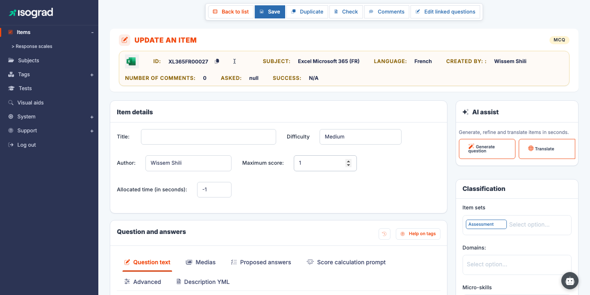
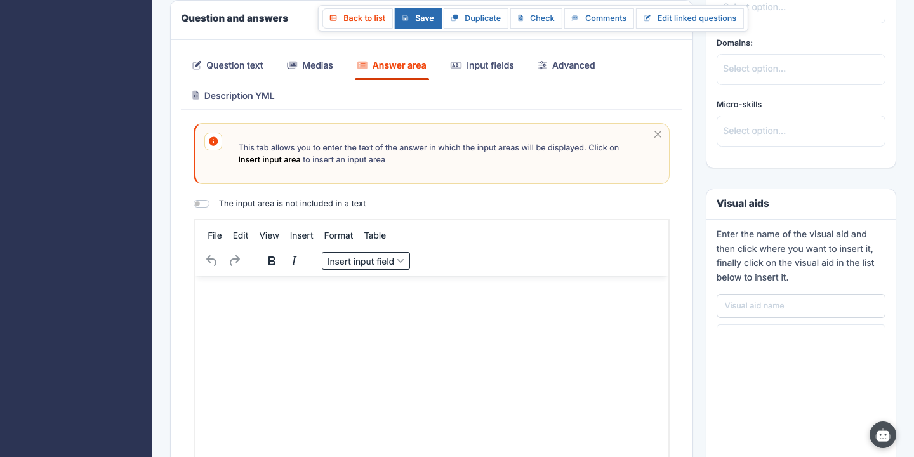
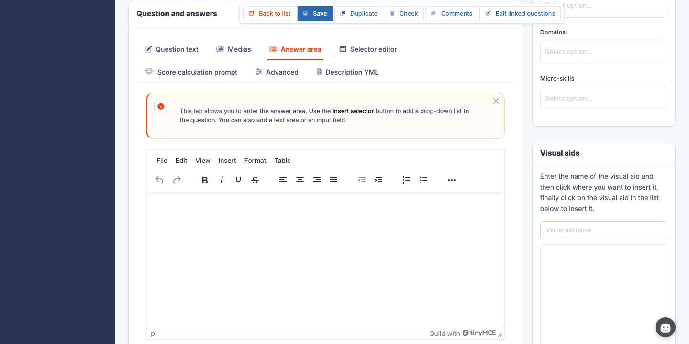
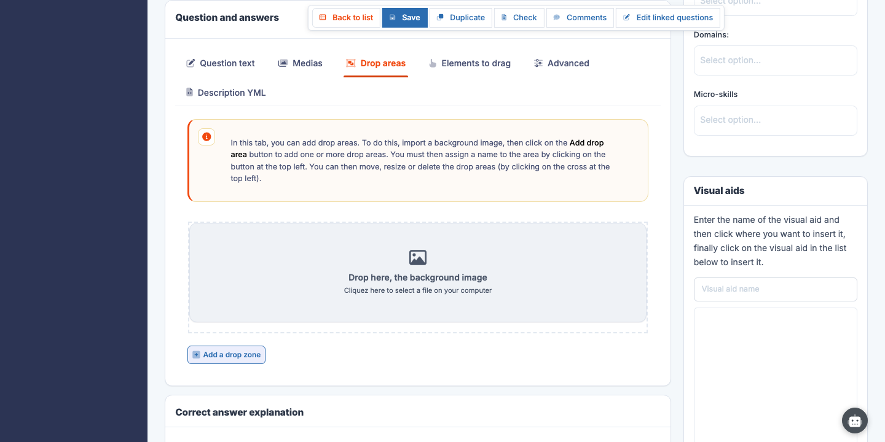
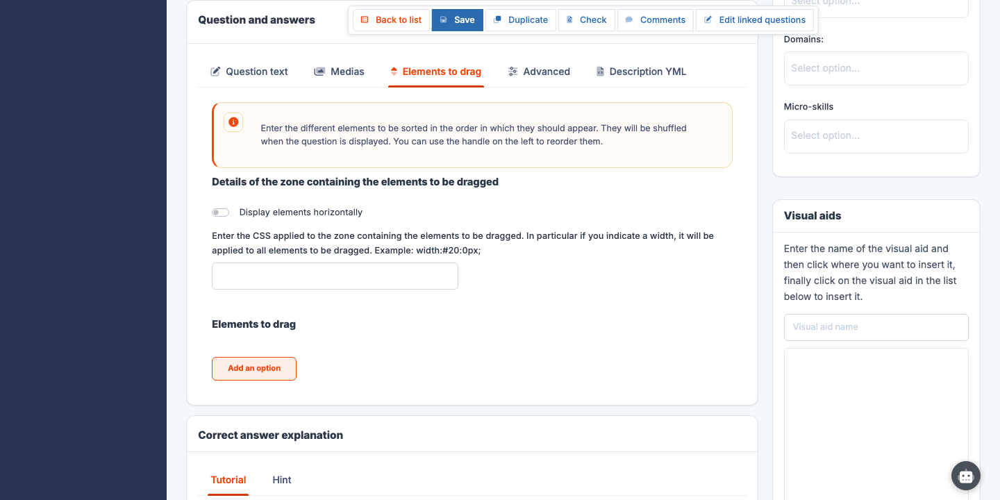
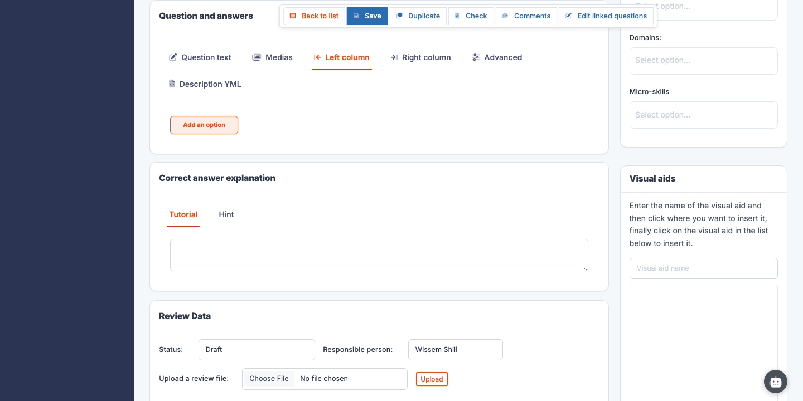
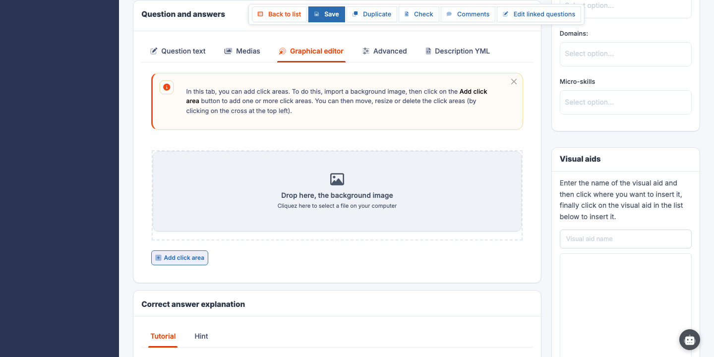
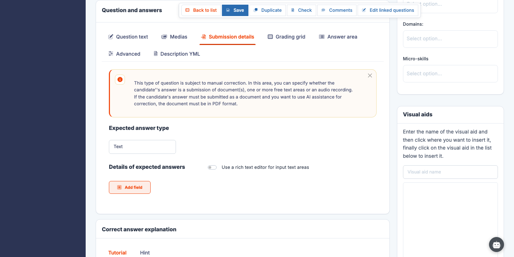
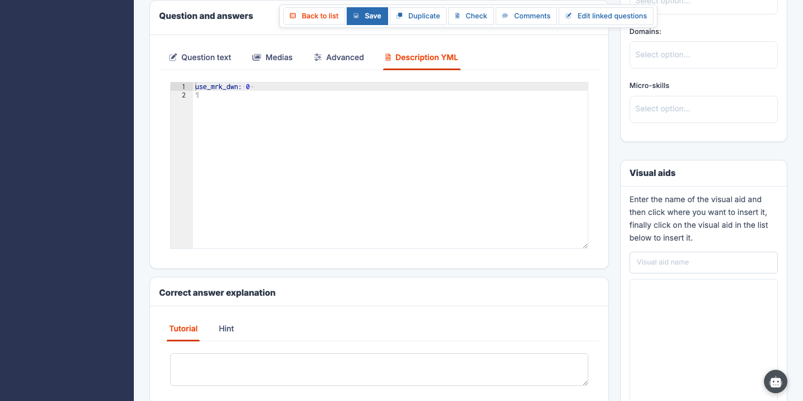
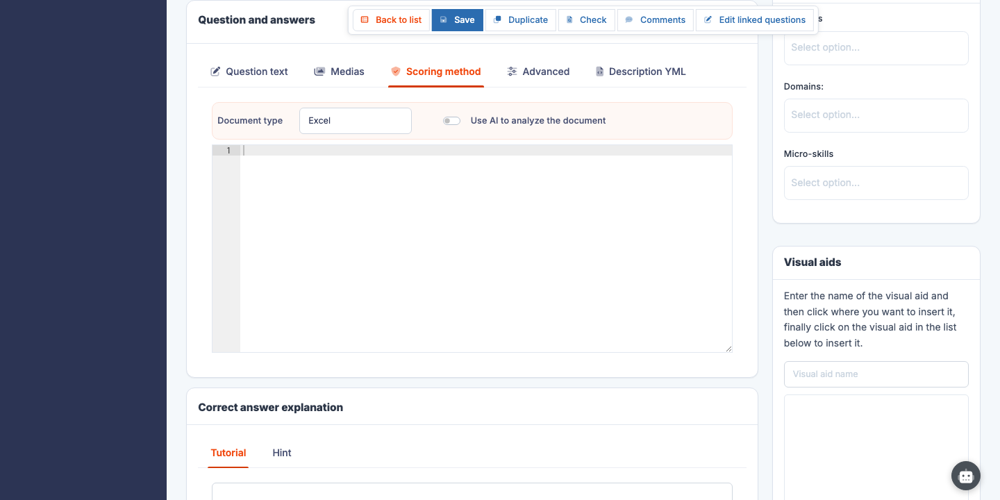

# Question editor

The **question editor** is the most heavily used tool in the Question Module — this is where you write statements, define answer options, add illustrations and visual aids, and tag each question on the skills map. Any administrator producing content for the platform spends the majority of their time on this page.

Open the editor through the **Edit** icon (pencil) on a question's row in the **[Questions](/ai/en/question-module/questions/)** page, or by clicking **Add a question** on that page.

> 💡 **Answer type and interface** — The editor **adapts its interface** to the question's **answer type**. An MCQ question shows an answer-option input area; a Drag-and-drop question gets an editor for draggable items; a Manual-marking question gets a grading grid. This chapter covers the common organisation **and** the per-type specifics.

## Overview {#overview}

The edit page (titled **Update an item**) is organised into several zones, with a badge at the top showing the **answer type** of the current question (MCQ, Click in area, etc.):

1. **Toolbar** (above the header):
    - **Previous** / **Next** — move to the previous or next question of the current list without going back through it.
    - **Back to list** — return to the Questions page.
    - **Save** — saves all modifications.
    - **Duplicate** — creates a copy of the question.
    - **Check** — runs the editorial diagnostic on this question (empty title, missing statement, options not marked correct, etc.).
    - **Comments** — opens the list of comments left by candidates on this question during tests.
    - **Preview** — opens the question as a candidate will see it.
    - **Unlock** — shown on a question in *Production* status to administrators holding the appropriate privilege; puts the question back to *Draft* in one click (see [Save, preview, delete](#final-actions)).

2. **Identity banner**:
    - Subject icon + **ID** (for example `S12Q0042`) with a **Copy** button.
    - **Subject**, **Language**, **Creator** (the administrator who created the question).
    - **Number of comments**, **Asked** (number of takes), **Success** (success rate).

3. **"Item details" section**:
    - **Title**.
    - **Difficulty** — *Easy*, *Medium* or *Hard*, set by the author. Shown in the question list and used when composing tests.
    - **Author** (the person credited for the question, distinct from the creator shown in the banner).
    - **Maximum score** (defaults to 1).
    - **Allocated time** (in seconds; `-1` means "no limit").

4. **"Question and answers" section** — the heart of editing, organised into tabs (see [Editing tabs](#editing-tabs)).

5. **"Tutorial" section** — the explanation shown to the candidate after answering (see [Tutorial](#tutorial)).

6. **Review block** — the question's **Status** and **Responsible person**, plus a file and comments for proofreading exchanges between authors.

7. **"AI assist" sidebar** on the right — AI generation buttons (see [AI generation](#ai-generation)).

8. **"Classification" sidebar** on the right — question sets and domains the question is attached to.

> 💡 **Everything on a single page** — Unlike other platform entities, the editor does not navigate between several pages. All edits are made here and saved in one click via the **Save** button at the top.

## Editing tabs {#editing-tabs}

The **Question and answers** section is organised into tabs specific to the question's content:

| Tab | Content |
|---|---|
| **Question text** | The text shown to the candidate (rich text editor). |
| **Medias** | Reference documents, media files and audio generation attached to the statement. |
| **Proposed answers** (label varies by type) | Answer options or type-specific settings — see per-type sections. |
| **Score-calculation prompt** | For AI-graded questions: instructions given to the AI to compute the score. |
| **Advanced** | Advanced options: **Mandatory answer in tests with navigation**, and for free-text questions **Lock copy/paste and selection**. |

Two help buttons at the top right of this section:

- **History** (clock icon) — change history of the question.
- **Tag help** — reference for the formatting tags available in the editor.

> 💡 **YML description tab** — A raw YAML view of the question exists for a few answer types (for example Sortable). For the other types it is not shown: use **Export to YML** on the Questions page to obtain the YAML of your questions.

## Common fields (title, text, illustration, tutorial) {#common-fields}

### Metadata

- **Subject** — subject the question is attached to. Set at creation.
- **Domains** — assessed skill domain(s), in the **Classification** panel. Used for the candidate report's skill map.
- **Item sets** — the question sets the question belongs to (see [Question sets](/ai/en/question-module/question-sets/)), in the **Classification** panel.
- **Status** — *Draft*, *Production*, etc., in the review block. Controls whether candidates can be served the question.
- **Responsible person** — administrator in charge of the question, in the review block.
- **Language** — set at creation, not editable. One question = one language.

### Title

The **Title** is a short label that appears in the *Title* column of the list and in skill reports: it represents the skill tested by the question. **Not shown to the candidate.** Choose a **descriptive and unique** title: *"Compute a sum"* is better than *"Excel - question 17"*.

### Question text

The **Text** is the statement shown to the candidate. You enter it in a rich editor that supports:

- **Markdown** — bold, italic, lists, links, code blocks. Rendering is immediate in the preview.
- **HTML formatting** for advanced cases (tables, specific CSS classes).
- **Visual aid insertion** via the dedicated search box (see [Visual aids](#visual-aids-section)).
- **Direct illustration insertion** (image on the question — see [Illustration](#illustration)).

> 💡 **Markdown vs HTML** — Prefer Markdown for everyday writing. Reserve HTML for cases where Markdown is not enough (complex tables, specific formatting).

### Illustration {#illustration}

An **illustration** is an image attached **directly to the question** (as opposed to a visual aid, which can be shared across multiple questions). It is the main image accompanying the statement.

- To **add** an illustration, click the upload button and pick your file (PNG/JPG/SVG).
- To **change** the alternative text (alt text), type it in the dedicated field — important for accessibility and screen readers.
- To **remove** the illustration, click the **Delete media** button.

> 💡 **Illustration or visual aid?** — An **illustration** is specific to the question, ideal for an image that will never be reused. A **[visual aid](/ai/en/question-module/visual-aids/)** is shared across multiple questions, ideal for an Excel table or a source-code snippet shared across 10 questions of the same module.

### Tutorial {#tutorial}

The **Tutorial** section holds the explanation shown to the candidate **after** they answer, in review mode: a **hint** and an **explanation of the correct answer**. This is the pedagogical moment: explain why the correct answer is correct, how to identify it, and which common mistake to avoid. Same format as the text.

### Visual aids {#visual-aids-section}

You can insert one or more **visual aids** into the text or the answers. See the [Visual aids](/ai/en/question-module/visual-aids/) chapter for creation and management. In the question editor:

- Type at least three characters of the visual aid's name in the **visual aid search** box on the right.
- Pick the visual aid from the results, filtered by the question's subject and language.
- The reference tag is inserted in the text. The candidate-side rendering will show the full image or document.

Three variants exist:

- **Reference document** — a document embedded in the question, or offered as a link (enable **Display PDF reference documents as a link**).
- **Visual aid shown on click** — an image that opens under a magnifying glass (in the statement or in the answers).
- **Visual aid shown in the text** — an image presented as an inset, generally smaller, typically for keyboard or interface questions.

## AI generation {#ai-generation}

The editor offers an **AI assist** sidebar on the right of the page. On a newly created question it holds two buttons:

- **Generate question** — proposes a full statement (text, answer options, correct answer) from the question's metadata (subject, domain, title). Offered for the answer types that support generation.
- **Translate** — translates the question's content into another language, useful to quickly produce several linguistic versions of a subject.

Once the question has been saved a first time, more buttons appear:

- **Improve question** — rephrases and tightens the existing statement and options.
- **Generate a title** — proposes a title from the statement.
- **Obsolescence** — assesses whether the question's content is likely to be outdated.
- **Generate tutorial** — drafts the explanation shown to the candidate after answering.

For AI-graded uploads, a **Generate code** button drafts the verification code from the statement.

> ⚠️ **AI proposes, you decide** — Generated content is a **starting point**, not a final deliverable. Always proofread and correct before saving: the AI output replaces the fields on screen but is not saved until you click **Save**. Quality depends on the AI model chosen in the **System → Select an AI** menu.

## Answer types — overview {#answer-types}

The platform offers a range of answer types, grouped into families. The exact list offered when you create a question depends on your platform configuration.

| Family | Types | Use case |
|---|---|---|
| **Multiple choice** | Text MCQ, Answer scale | Classic knowledge assessment. |
| **Answer selection** | Fill in the blanks with dropdown lists | When free text would be ambiguous to grade. |
| **Interactive questions** | Drag-and-drop, Sortable, Link, Click in area | Interactive and engaging tests. |
| **Typed answers** | Fill in the blanks with automatic or AI grading, Dictation, Typed answers with manual marking | Knowledge checks and case studies. |
| **Document or audio grading** | Upload with automatic grading | File submission graded by AI. |
| **Specific** | Transition page | Edge cases (a page between two parts of a test). |

The following sections detail the **most common** types.

## Multiple-choice (MCQ) {#mcq}

The **Text MCQ** type is the most used type on the platform. The candidate sees a question and several answer options, of which **one or more** are correct.

### Editing the options

The MCQ editor exposes a list of options, each with:

- A **proposal text** field.
- A **Correct** checkbox indicating whether the option is a correct answer.
- A **Delete this option** button.

An **Add an option** button at the bottom of the list lets you grow the number of options. You can have between 2 and 8 options per question (5 is the recommended standard).

> 💡 **One or several correct answers?** — Tick **only one** **Correct** checkbox for a single-choice MCQ (the candidate can only pick one answer). Tick **several** checkboxes for a multi-choice MCQ (the candidate can pick several, and must find them all to get the question right). Or use **one among n** (several options are correct, but the candidate only needs to pick one of them for the answer to count as correct).

### Order of options

By default, the options are shown to the candidate in **random order** on each take. If you want to force a fixed order (for example for a logic question where the order of choices carries meaning), tick the option **Do not shuffle the answers** in the question's advanced options.

## Scale (Likert, T/F) {#scale-question}

The **Scale** type presents the candidate with a question paired with a reusable **answer scale** — for example a Likert scale *"Strongly disagree / Somewhat disagree / Somewhat agree / Strongly agree"*, or a simple True/False scale.

### Editing

- **Select the scale** in the dropdown (see [Answer scales](/ai/en/question-module/answer-scales/) to manage available scales).
- The editor shows the selected scale's options and lets you tick the **correct answer** (a single checkbox ticked). To add a new scale, go to the menu **Items → Response scales**, then **Add a response scale**.

> 💡 For questions where there is no right or wrong answer, tick the option **No notion of correct answer (form, personality test…)**.

## Fill in the blanks {#fill-in-the-blanks}

The **Fill in the blanks** type presents a text with one or more **input fields** that the candidate must fill in.

### Editing

In the question text, you insert **input areas** with the **Insert an input area** button. The editor then exposes, for each area, a configuration block:

- **Correct answer** — exact expected text.
- **Accepted variants** — other spellings or formulations also counted as correct.
- **Case sensitivity** — whether the comparison is sensitive to uppercase/lowercase.

### Fill in the blanks with dropdown lists

A variant offers the candidate a **dropdown list** instead of a free-text field. For each blank, you define the list of options and the correct one.

## Drag-and-drop {#drag-and-drop}

The **Drag-and-drop** type presents the candidate with **items** to drag and drop into **target zones**.

### Editing

- Define the list of **items** (text, image, or both).
- Define the **target zones** in the background illustration (typically an image with numbered slots).
- For each item, specify the **correct target zone**.

## Sortable {#sortable}

The **Sortable** type presents the candidate with a list of items to **reorder** into the correct sequence.

### Editing

- Define the list of items in the **correct** order.
- On presentation to the candidate, they will be automatically shuffled.
- The candidate must put them back into the right order.

## Link (pairing) {#link}

The **Link** type offers the candidate two columns of items they must **pair**.

### Editing

- Define two lists: **column A** and **column B**.
- Indicate which pairs are the correct associations.
- You can have 1-to-1 or 1-to-many correspondences depending on your configuration.

## Click in area {#click-in-area}

The **Click in area** type presents the candidate with an **image** on which they must click at a precise spot (a button in a screenshot, an area of a diagram, etc.).

### Editing

- Upload the target image.
- Define the **correct zone(s)** by rectangular coordinates.
- The candidate clicks: the click is considered correct if it falls within a correct zone.

## Manual marking {#manual-marking}

The **Manual marking** type presents the candidate with a **free-form** question (essay, diagram, recording) that will be **manually graded** by a marker after submission.

### Variants

- **Without document submission** — the candidate enters their answer in a simple text field.
- **With document submission** — the candidate uploads one or more documents (audio, video, file). The allowed document type is configurable.

### Editing

- Define the **prompt** (the instructions) in the question text.
- If document submission is enabled: specify the **accepted formats** and the **maximum number** of files.
- Define the **grading grid** or the evaluation criteria — to guide human markers (the **grading grid** is shown to markers, who score each criterion you defined).

See also the [Mark a test](/ai/en/results/#grade-a-test) section of the administrator manual for the marker-side correction workflow.

## Typing test {#typing}

The **Typing test** and **Typing test with correction** types evaluate the candidate's typing **speed and accuracy**.

### Editing

- Enter the **reference text** the candidate must retype.
- Configure the **test duration** (in seconds).
- The score is computed from the number of correct characters per minute, with a penalty for errors.

The **with correction** variant lets the candidate **go back and correct** their errors; without correction, every keystroke is final.

## Upload with AI grading {#upload-auto-grading}

The **Upload with automatic grading** type lets the candidate **upload a file** (typically a Word/Excel document, a screenshot or an audio recording) which is then **analysed by AI** to automatically produce a score.

### Editing

- Specify the **expected file format**.
- Write an **analysis prompt** that guides the AI in its grading: *"Check that the document contains a table with at least 5 rows, that the first column is named 'Name', and that the formatting is consistent"*.
- Choose the **analysis mode**: strict (binary scoring) or nuanced (score out of 100 with a comment).

> ⚠️ **Non-deterministic AI grading** — AI scores can vary slightly from one take to another. Reserve this type for **formative assessments**, not high-stakes certifications. For rigorous grading, use **[Manual marking](#manual-marking)** with a human marker.

## Save, preview, delete {#final-actions}

### Save

The **Save** button at the top of the editor stores all modifications. Saving is done without reloading the page: a success notification appears at the top right.

> ⚠️ **Production questions are read-only** — Once a question's **Status** is set to *Production* and saved, the content of the editor becomes read-only: the question is being served to candidates and must stay stable. Only the **review block** stays editable. To modify the question, set its **Status** back to *Draft* there and click **Save**: the page reloads unlocked, and the question stops being served until it is put back into *Production*. Administrators holding the appropriate privilege can also click **Unlock** in the toolbar, which does the same and assigns the question to them.

### Check

The **Check** button runs the editorial diagnostic on the question: empty title or statement, no option marked correct, missing media, and so on. Run it before switching the status to *Production*.

### Preview

The **Preview** button opens the question as it will appear to a candidate (rendered statement, displayed options, loaded illustrations). It is the mandatory step before any production rollout: a statement that looks clear in the editor can be ambiguous once rendered on the candidate side.

### Navigate between questions

The **Previous** and **Next** buttons at the top of the page let you move to the neighbouring questions of the current list **without going back through the list**. Handy for bulk editorial reviews.

### Delete

The **Delete** icon on the question's row in the list deletes the question after confirmation. Deletion is refused if the question is part of the fixed question list of a **test**.

> 💡 **Prefer the "To delete" status to deletion** — To withdraw a question from circulation without losing its history, **change its status** to *To delete* instead of deleting it. The question leaves the default list (a filter lets you show these questions again), its historical takes remain analysable, and it is no longer served to new candidates.

## Best practices {#best-practices}

- **A short and clean statement** — aim for 3 sentences at most for the question. If the statement becomes long, check whether a **visual aid** would be clearer.
- **Five options for MCQs** — this is the number that maximises discriminating difficulty without cognitively overloading the candidate.
- **Avoid artificial traps** — no double negatives, no subtle spelling differences between options. A candidate should fail because they do not know the answer, not because they misread.
- **Document the tutorial** — the tutorial is the **pedagogical value** of the question. It is what distinguishes a simple assessment from a learning tool.
- **Test before publishing** — pass the question through a colleague (or yourself via the preview) before switching it to *Production* status. Broken questions in production degrade the perceived quality.
