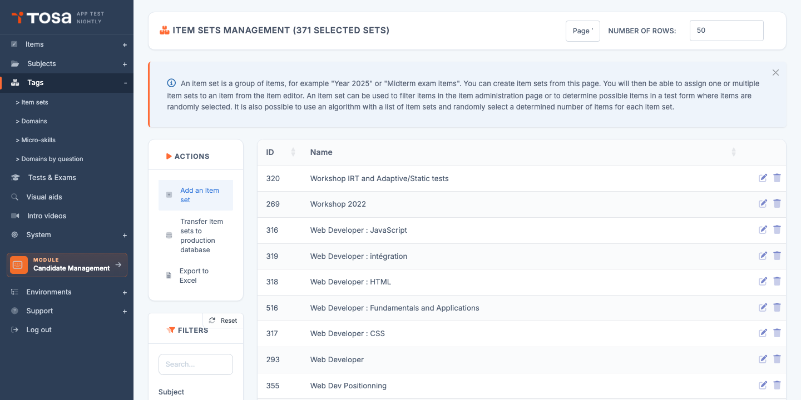
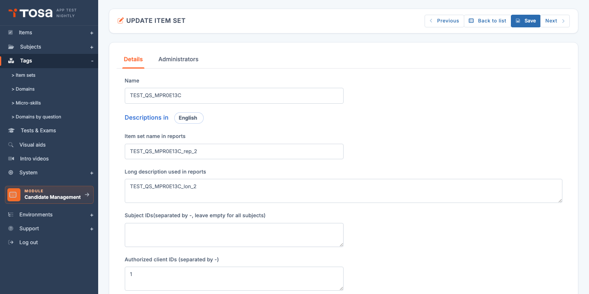

# Question sets

A **question set** groups a coherent set of questions that you want to **keep together** when composing test forms: a multi-question exercise on the same context, a series of questions inherited from a third-party supplier, a thematic module reusable from one test form to another.

Open the page from the menu **Question Module → Categories → Question sets**, or directly at `/questionsets/AdminQuestionSetsWithTable`.

The table lists every defined set, with its **ID** and its **name**. The filters let you narrow down by text or include archived sets.

## Why use a question set? {#why-use-a-set}

Question sets address several needs:

- **Presentation consistency** — a set of questions on the same Excel table should be shown to the candidate as a coherent block, not scattered among unrelated questions.
- **Reusability** — a thematic module prepared once can be re-injected into several test forms (assessment, certification, positioning) without duplicating the questions.
- **Editorial origin** — a set can represent an **external commission** (questions purchased from a partner), with its own independent life cycle.
- **Grouped maintenance** — editing the comment or description of a set propagates to all its questions.

> 💡 **Set vs domain** — A *domain* is a **pedagogical** breakdown (skills assessed). A *set* is an **organisational** breakdown (editorial grouping). A question belongs to a single domain but can be part of either no set or a single one.

## Create a question set {#create-a-set}

Creation is **direct** — no pre-creation modal.

1. From the **Question set management** page, click **Create a question set** in the action bar.

2. The platform creates an empty record and takes you to the edit form (`QuestionSetUpdate?que_set_id=<new_id>`).

3. Fill in the tabs and save — see [Tabs of the edit form](#tabs-of-the-edit-form) below.

## Tabs of the edit form {#tabs-of-the-edit-form}

The edit form (titled **UPDATE A QUESTION SET**) offers **two tabs**:

### "General characteristics" tab

- **Name** — internal label for the set, shown in the list and used to find it when composing a test form.

Below this field, a multilingual block (the **"Descriptions in"** picker at the top, with the current language) with two fields per language:

- **Question set name in reports** — short label that appears in the candidate's report to flag the questions belonging to this set. For example *"Exercise: Sales data synthesis"*.
- **Long description used in reports** — more detailed text, displayed in the report next to the name.

Lower down, two **attachment** fields:

- **Associated subject IDs** — free text in the form `12-45-89` (IDs separated by hyphens). **Leave blank** to make the set usable on **all** subjects; fill in a list to restrict it to specific subjects.
- **Authorized client IDs** — free text in the form `1-2-3` (client account IDs). Lets you **reserve** this set for one or more specific client accounts — useful for confidential modules or modules commissioned by a specific client. Set to `1` for the current account only.

Lower still (depending on screen resolution, you may need to scroll):

- **Archived** — switch. An archived set remains usable in existing test forms but no longer appears in the default list or in composition pickers.
- **Comment** — free text for internal use. Documentation for authors: *"Set commissioned from XYZ Consulting, delivered June 2025"*.

### "Administrators" tab

List of administrators allowed to see and edit this set — same logic as the matching tab on a [subject](/ai/en/question-module/subjects/#authorized-administrators) form:

- Tick the authorized administrators.
- Untick to revoke.
- Use the **Filter** field to quickly find an administrator in a long list.

> 💡 **Editorial segmentation** — Useful when you want to restrict editing of a sensitive set (for example a module under NDA from a partner) to a small team.

## Add questions to a set {#add-questions-to-a-set}

Unlike domains, questions **are not attached** to a set from the set's form. The link is made from the **question's form**: open the question editor, and in its classification tab, select the set it should belong to.

A question can belong to **a single set** (or to none). To move a question from one set to another, change its attachment from its own form.

> 💡 **Check the contents of a set** — From the set list, a **View associated questions** link opens the **AdminQuestionsWithTable** page pre-filtered on the current set. This is the fastest way to see at a glance which questions make up a set.

## Filters {#filters}

The **Filters** panel offers:

- **Search** — free text on the set name.
- **Include archived** — switch (`filter_is_arc`). Off by default; enable to show sets marked as archived.

Sorting is available on each column by clicking the header.

## Archive vs delete {#archive-vs-delete}

To take a set out of circulation without losing its contents, you have two options:

- **Archive** (`is_arc=1`) — recommended for obsolete sets still referenced in production test forms. The set disappears from the default list and composition pickers, but remains functional for the test forms that use it. Reversible at any time.
- **Delete** — irreversible. Possible only if **no question** is attached to the set. If questions are linked, the platform blocks the deletion and shows an error message (`qset_cantdel`).

### Deletion procedure

1. On the set's row, click the **Delete** icon.
2. Confirm via the **Delete** button on the confirmation page.

> ⚠️ **Prefer archiving** — Unless you know the set was created by mistake and is unused, **archive rather than delete**. You keep the ability to reactivate the set and to trace its editorial history.
