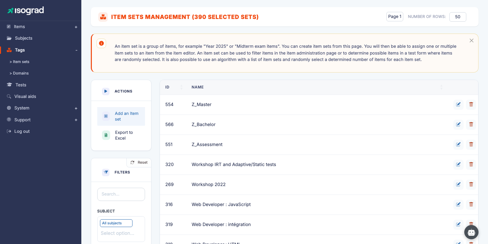
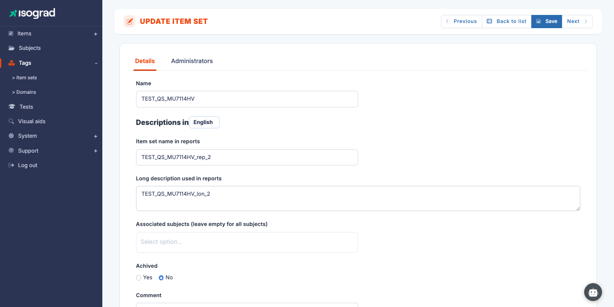

# Question sets

A **question set** (called an *item set* on the English interface) groups a coherent set of questions that you want to **keep together** when composing tests: a multi-question exercise on the same context, a series of questions inherited from a third-party supplier, a thematic module reusable from one test to another.

Open the page from the menu **Tags → Item sets**.

The table lists every defined set, with its **ID** and its **name**. Archived sets are greyed out when displayed.

## Why use a question set? {#why-use-a-set}

Question sets address several needs:

- **Composition of tests** — when a test draws its questions at random, the question sets are one of the criteria available to define the pool.
- **Reusability** — a thematic module prepared once can be re-injected into several tests without duplicating the questions.
- **Editorial origin** — a set can represent an **external commission** (questions purchased from a partner), with its own independent life cycle.
- **Reporting** — the set's report name and description can be shown in the candidate report next to the questions it contains.

> 💡 **Set vs domain** — A *domain* is a **pedagogical** breakdown (skills assessed). A *set* is an **organisational** breakdown (editorial grouping). A question belongs to one domain but can be part of several sets.

## Create a question set {#create-a-set}

Creation is **direct** — no pre-creation dialog.

1. From the **Question set management** page, click **Add an Item set** in the action bar.

2. The platform creates an empty record and takes you to the edit form (page **Update item set**).

3. Fill in the tabs and save — see [Tabs of the edit form](#tabs-of-the-edit-form) below.

> ⚠️ **Empty sets** — The set exists as soon as you click the button. If you leave the form without saving, an unnamed set remains in the list.

## Tabs of the edit form {#tabs-of-the-edit-form}

### "Details" tab

- **Name** — internal label for the set, shown in the list and used to find it when composing a test.

Below this field, a multilingual block (the **"Descriptions in"** picker at the top, with the current language) with two fields per report language:

- **Question set name in reports** — short label that appears in the candidate's report to flag the questions belonging to this set. For example *"Exercise: Sales data synthesis"*.
- **Long description used in reports** — more detailed text, displayed in the report next to the name.

Lower down:

- **Associated subjects (leave empty for all subjects)** — multi-select. **Leave blank** to make the set usable on **all** subjects; pick subjects to restrict it. A question can only be added to a set whose subjects include the question's subject.
- **Archived** (Yes / No) — an archived set remains usable in existing tests but no longer appears in the default list.
- **Comment** — free text for internal use, for example the origin of the set or its delivery date.
- **Add questions to this item set** — button shown to main administrators, see [Add questions to a set](#add-questions-to-a-set).
- **Display items using this item set** — link opening the **Questions** page pre-filtered on this set, in a new tab.

### "Administrators" tab

It lists the administrators of the account who work in the Question Module without the privilege to see **all** question sets; tick the ones allowed to see and edit this set:

- Tick the authorized administrators.
- Untick to revoke.
- Use the **Filter** field to quickly find an administrator in a long list.

You do not appear in this list: the set stays visible to you as long as you created it.

> 💡 **Editorial segmentation** — Useful when you want to restrict editing of a sensitive set (for example a module under NDA from a partner) to a small team.

## Add questions to a set {#add-questions-to-a-set}

There are two ways to attach questions to a set:

- **From the question editor** — in the **Classification** panel of a question, pick the set(s) it belongs to in the **Item sets** field. This is the everyday method.
- **From the set's form** (main administrators) — click **Add questions to this item set**, paste the **question IDs separated by spaces** in the dialog, then save. Every question must belong to one of the set's subjects, otherwise the platform refuses it.

> 💡 **Check the contents of a set** — From the set's form, the **Display items using this item set** link opens the **Questions** page pre-filtered on the current set. This is the fastest way to see at a glance which questions make up a set.

## Filters {#filters}

The **Filters** panel offers:

- **Search** — free text on the set name.
- **Subject** — restricts the list to the sets associated with the selected subject(s).
- **Display archived item sets** — switch, off by default; enable to show sets marked as archived.

Sorting is available on each column by clicking the header.

## Archive vs delete {#archive-vs-delete}

To take a set out of circulation without losing its contents, you have two options:

- **Archive** — recommended for obsolete sets still referenced in tests. Set **Archived** to *Yes* on the set's form. The set disappears from the default list but remains functional for the tests that use it. Reversible at any time.
- **Delete** — irreversible. Possible only if **no question** is attached to the set. If questions are linked, the platform blocks the deletion and shows the message "You can not delete an item set because it is used by some items".

### Deletion procedure

1. On the set's row, click the **Delete** icon.
2. Confirm via the **Delete** button on the page that opens.

> ⚠️ **Prefer archiving** — Unless you know the set was created by mistake and is unused, **archive rather than delete**. You keep the ability to reactivate the set and to trace its editorial history.
