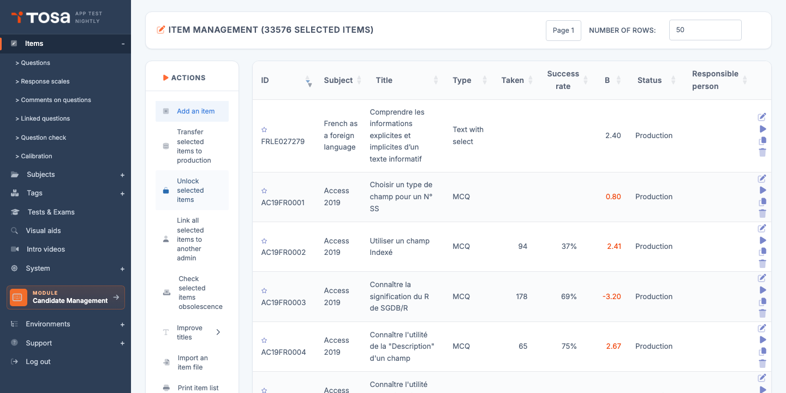
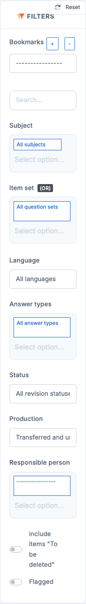
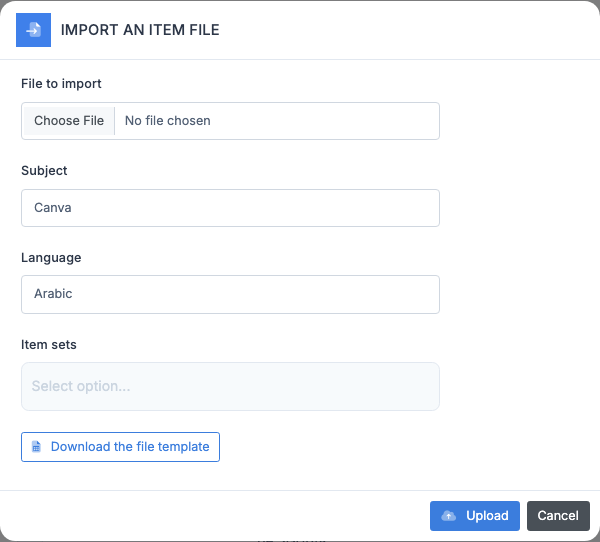
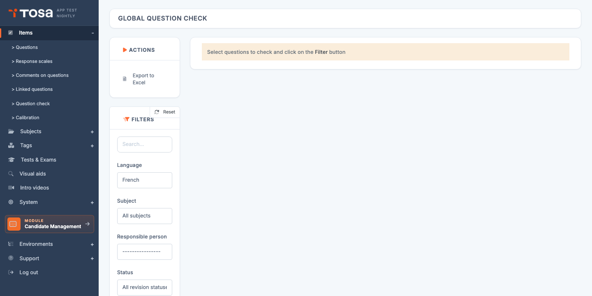

# Questions

The **Questions management** page is the **nerve centre** of the Questions module: this is where you find every question authored on the platform, where you filter them along several dimensions (subject, domain, status, owner, etc.), and from where you launch the **editor** to create or modify a question.

The detailed behaviour of the editor itself is covered in the [Question editor](/ai/en/question-module/question-editor/) chapter.

Open the page through the menu **Questions module → Questions**, or directly at `/questions/AdminQuestionsWithTable`.

The table shows the following columns:

| Column | Content |
|---|---|
| **ID** | Text identifier of the question (`que_str_id`, for example `AC19FR0001`). The ☆ before the ID is the star/favorite button. |
| **Subject** | Subject the question is attached to. |
| **Title** | Short label of the question. |
| **Type** | Answer type: MCQ, Fill in the blanks, Code, Manipulation, etc. |
| **Taken** | Number of times the question has already been served to candidates. |
| **Success** | Success rate (%) — percentage of candidates who answered correctly. |
| **B** | **Difficulty index** from the IRT (Item Response Theory) model — the higher the value, the harder the question. A **negative** value indicates an easy question, **positive** a hard one. |
| **Status** | Editorial state: *Draft*, *Under review*, *Production*, etc. |
| **Owner** | Administrator in charge of maintaining the question. |

> 💡 **Sub-pages of the Questions menu** — The **Questions** menu in the sidebar also gives access to: **Answer scales**, **Comments on questions**, **Linked questions**, **Question verification** and **Calibration**. These sub-pages are documented in their dedicated chapters.

## Filters {#filters}

The **Filters** panel is very comprehensive — it is the main tool for exploring a large reference base (several thousand questions per subject).

### Basic filters

- **Search** — free text (on the question ID, the title, or content fragments).
- **Subject** — Choices.js multi-select. Restrict to one or more subjects.
- **Language** — the question's language.
- **Answer type** — MCQ (single / multiple choice), Code, Manipulation, True/False, Essay, etc.
- **Question status** — *Draft*, *Under review*, *Active*, *Disabled*. Lets you filter the editorial pipeline.

### Advanced filters

These filters only become usable **after a subject has been selected** (they need the context of a subject to populate their options):

- **Domain** — restrict to questions attached to a given domain of the selected subject.
- **Question set** — restrict to questions belonging to a given set.
- **Owner** — restrict to questions under a given administrator's responsibility.

### Reset

The **Reset** button at the top of the panel restores all filters to their default values and reloads the full table.

## Search favorites {#search-favorites}

**Favorites** let you memorise a **combination of filters** you use often and recall it in one click — for example *"All Excel 365 questions in Draft status assigned to me"*.

### Create a favorite

1. Apply the desired filters (subject, status, owner, etc.).
2. Click **Save as favorite** in the favorites bar.
3. Enter a name for the favorite (for example `Excel-Drafts-Marie`).
4. Confirm. The favorite appears in the favorites dropdown.

### Use a favorite

In the **Favorites** selector, pick the desired favorite. The page reloads with the memorised filters applied automatically.

### Delete a favorite

Select the favorite, then click **Delete favorite**. The favorite is removed from the selector.

> 💡 **Personal favorites** — Favorites are **specific to your administrator account**: they are not shared with other authors. If you want to share a view, just share its URL — applied filters are reflected in the query string.

## Star a question {#star-a-question}

On the **Title** column of each row, a **star icon** lets you flag a question to find it again quickly later:

- **Click the star** to add the question to your personal favorites (the star switches to an active/filled state).
- **Click again** to remove it.

Starred questions can then be filtered through a dedicated filter (or spotted at a glance via their filled star in any list).

> 💡 **Difference with search favorites** — Starring **a question** saves an **individual question**. A **search favorite** saves a **combination of filters**. The two mechanisms are complementary.

## Row actions {#row-actions}

Each row of the table presents several action buttons at the end of the row:

- **Edit** (pencil) — opens the question's edit page. See [Question editor](/ai/en/question-module/question-editor/).
- **Preview** (Play icon) — opens the **preview** of the question as it will appear to a candidate (statement, options, visual aid). Lets you validate visually without starting a real test.
- **Duplicate** — creates a copy of the question and opens its edit page. The copy inherits everything (statement, answers, parameters) but gets a new `id`.
- **Delete** — deletes the question. Refused if the question has already been taken by candidates.

## Bulk actions (ACTIONS panel) {#bulk-actions}

The **ACTIONS** panel on the left of the page offers several operations applicable to **several questions** at once (selected via the checkboxes at the start of each row):

- **Add a question** — opens the editor to create a new question.
- **Transfer selected questions to production** — promotes the selected questions from the pre-production environment to production. Reserved for strategic operations (subject overhaul, new wave of calibrated questions).
- **Unlock selected questions** — releases the editorial lock placed by another administrator on the selected questions (useful when someone has gone on leave with questions still locked).
- **Reassign questions to another admin** — changes the owner ("Owner") for several questions at once. Handy when transferring an editorial portfolio.
- **Check obsolescence of selected questions** — runs an automatic diagnostic to detect questions that are too old, never taken, or with an aberrant failure rate.
- **Improve titles** — semi-automatic tool to rephrase or standardise the titles of several questions at once (via generative AI depending on your configuration).
- **Import a questions file** — see [Import questions](#import-questions) below.

> ⚠️ **Transfer to production is irreversible** — Check the selected questions carefully before triggering the transfer: once in production, they are immediately available to real client accounts.

## Import questions {#import-questions}

Import lets you create several questions in a single operation through an Excel file.

1. Click **Import a questions file** in the action bar.

    

2. Fill in:

    - **Subject** the imported questions will be attached to.
    - **Language** of the questions.
    - **Question set** (optional) — the set to which every imported question will be attached as a batch.
    - **Excel file** — pick your file in the expected format.

3. Click **Import**. The server processes the file and redirects to the questions list, reporting the number of questions created and any line-by-line errors.

> 💡 **File template** — Download the **Excel template** via the link in the import window. It lists the expected columns: statement, answer options, correct answer, domain, level, etc. The format depends on the type of questions to import.

## Export to Excel {#export-to-excel}

The **Export to Excel** button in the action bar generates an `.xlsx` file listing every question currently filtered. Handy for reference-base audits, editorial reviews, or sharing with external contributors.

## Preview a question {#preview-a-question}

The **Preview** button (Play icon) on each row opens the question as it will be presented to the candidate:

- The rendered **statement** (HTML, math, code, image, etc.).
- The **answer options** or the input area, depending on the question type.
- Any **visual aid** (image, PDF) attached.

You can interact with the question (click options, enter code, manipulate) to verify behaviour. **No result is saved** — it is a dry run.

> 💡 **When to use it?** — Always preview after editing a question to check the candidate-side rendering. It is also indispensable during editorial review to validate quality before switching the status to *Active*.

## Question verification {#question-verification}

The **Question verification** page (URL: `/questions/CheckAllQuestionsWithTable`) is a **diagnostic tool** that identifies questions showing editorial anomalies on a given subject — for example: no correct answer marked, missing options, incomplete translation, visual aid file referenced but missing, etc.

### Usage

1. Open the page through a dedicated link or directly at the URL above.
2. Select the **subject** in the filter.
3. Click the verification button: the server scans every question of the subject and lists those exhibiting a problem.
4. The table shows, for each problematic question: **ID**, **Title**, **Author**, **Diagnosis** (the nature of the problem).

5. Click the **ID** or the **Title** to open the question's editor and fix it.

> 💡 **Quality routine** — Run this verification **at every major editorial review** or before a transfer to production. It is the most efficient tool for catching oversights (option not marked correct, missing translation).

### Export the report

The **Export to Excel** button retrieves the full list of detected issues for distribution to your authoring team.

## Best practices {#best-practices}

- **Filter before acting** — on a large reference base, manipulating the full list is pointless. First narrow the scope with filters (subject + status + owner at minimum).
- **Use favorites for recurring views** — the "drafts to finish" view consulted every week is worth its own favorite.
- **Prefer preview to opening the editor** when you just want to *check* a question: the editor takes longer to load.
- **Run verification before publishing** — a subject transferred to production with broken questions degrades the perceived quality of the platform.
