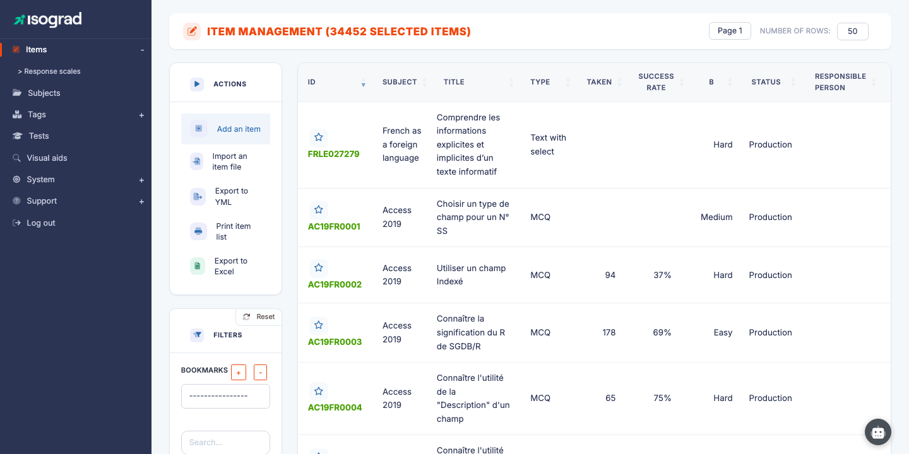
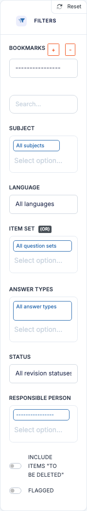
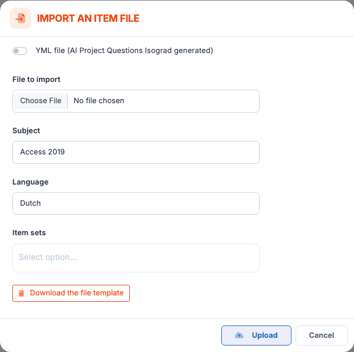

# Questions

The **Item management** page is the **nerve centre** of the Question Module: this is where you find every question authored on your platform, where you filter them along several dimensions (subject, domain, status, responsible person, etc.), and from where you launch the **editor** to create or modify a question.

The detailed behaviour of the editor itself is covered in the [Question editor](/ai/en/question-module/question-editor/) chapter.

Open the page through the menu **Items**.

The table shows the following columns:

| Column | Content |
|---|---|
| **ID** | Text identifier of the question (for example `S12Q0001`). The ☆ before the ID is the star button. Questions in *Production* status are highlighted. |
| **Subject** | Subject the question is attached to. |
| **Title** | Short label of the question. |
| **Type** | Answer type: MCQ, Fill in the blanks, Drag-and-drop, etc. |
| **Taken** | Number of times the question has already been served to candidates. |
| **Success rate** | Success rate (%) — percentage of candidates who answered correctly. |
| **B** | The difficulty level set by the author: *Easy*, *Medium* or *Hard*. |
| **Status** | Editorial state of the question — see [Question statuses](#question-statuses). |
| **Responsible person** | Administrator in charge of the question. |

> ⚠️ **No subject yet?** — If no subject is available to you, the page opens a dialog *"No subject available"*: you must create at least one subject before creating questions. The dialog's button takes you to the **Subjects** page.

## Question statuses {#question-statuses}

Every question carries a **status** that drives its life cycle:

- **Draft** — the status of every new question (created, duplicated or imported). The question can be edited freely and is **not** served to candidates.
- Intermediate review statuses (for example *To be verified*) let you organise proofreading between authors.
- **Production** — the question is **available to candidates** in the tests that select it. A question in Production is **read-only** in the editor.

The status is changed from the **review block** at the bottom of the editor (field **Status**), then saved. To edit a Production question again, set its status back to *Draft* in that block and save; the review block stays editable on a locked question. Administrators holding the appropriate privilege can also **unlock** it from the editor toolbar.

## Filters {#filters}

The **Filters** panel is very comprehensive — it is the main tool for exploring a large question bank.

### Basic filters

- **Bookmarks** — selector of saved filter combinations, see [Bookmarks](#search-favorites).
- **Search** — free text (on the question ID, the title, or content fragments).
- **Subject** — multi-select. Restrict to one or more subjects.
- **Language** — the question's language.
- **Question set** — multi-select. The badge next to the field toggles between **(OR)** (questions in any selected set) and **(AND)** (questions in all of them).
- **Answer type** — MCQ, Fill in the blanks, Drag-and-drop, Manual marking, etc.
- **Status** — *Draft*, *Production*, etc. Lets you filter the editorial pipeline.
- **Responsible person** — restrict to questions under a given administrator's responsibility.
- **Include items "To be deleted"** — switch; off by default.
- **Flagged** — switch; shows only the questions you have starred.

### Domain filter

The **Domain** filter only appears **after a single subject has been selected**: it needs the subject to list its domains.

### Reset

The **Reset** button at the top of the panel restores all filters to their default values and reloads the full table.

## Bookmarks {#search-favorites}

**Bookmarks** let you memorise a **combination of filters** you use often and recall it in one click — for example *"All Excel questions in Draft status assigned to me"*.

### Create a bookmark

1. Apply the desired filters (subject, status, responsible person, etc.).
2. Click the **+** button next to the **Bookmarks** selector.
3. Enter a name for the bookmark (for example `Excel-Drafts-Marie`).
4. Confirm. The bookmark appears in the selector.

### Use a bookmark

In the **Bookmarks** selector, pick the desired bookmark. The page reloads with the memorised filters applied automatically.

### Delete a bookmark

Select the bookmark, then click the **−** button. The bookmark is removed from the selector.

> 💡 **Personal bookmarks** — Bookmarks are **specific to your administrator account**: they are not shared with other authors.

## Star a question {#star-a-question}

In the **ID** column of each row, a **star icon** lets you flag a question to find it again quickly later:

- **Click the star** to mark the question (the star switches to a filled state).
- **Click again** to remove the marker.

Starred questions can then be listed with the **Flagged** filter.

> 💡 **Difference with bookmarks** — Starring **a question** flags an **individual question**. A **bookmark** saves a **combination of filters**. The two mechanisms are complementary.

## Row actions {#row-actions}

Each row of the table presents several action buttons at the end of the row:

- **Edit** (pencil) — opens the question's edit page. See [Question editor](/ai/en/question-module/question-editor/).
- **Preview** (Play icon) — opens the question as it will appear to a candidate (statement, options, media). Lets you validate visually without starting a real test.
- **Duplicate** — opens a dialog where you choose the **subject**, the **answer type** and the **language** of the copy, then creates it and opens its edit page. The copy starts in *Draft* status.
- **Delete** — deletes the question. Shown to administrators allowed to modify the question. Refused if the question is used in the fixed question list of a **test**.

## Action bar {#bulk-actions}

The action bar at the top of the page offers:

- **Add an item** — opens a dialog asking for the **subject**, the **answer type** and the **language**, then creates the question and opens the editor.
- **Import an item file** — see [Import questions](#import-questions) below.
- **Export to YML** — downloads the questions currently filtered as a YAML file (up to 500 questions; beyond 100 questions the download is a zip archive split into parts). Useful for backups or for working on questions with an AI assistant.
- **Print item list** — generates a printable version of the questions ticked in the table (100 at most).
- **Export to Excel** — see [Export to Excel](#export-to-excel).

## Import questions {#import-questions}

Import lets you create several questions in a single operation.

1. Click **Import an item file** in the action bar.

    

2. Fill in:

    - **Subject** the imported questions will be attached to.
    - **Language** of the questions.
    - **Question set(s)** to which every imported question will be attached.
    - **File to import** — an Excel file in the expected format. Download the **file template** via the link in the window: one row per multiple-choice question with its title, statement, up to ten options, the correct option numbers, its domains and its maximum score.

3. Click **Import**. The server processes the file, then the list is filtered on the imported subject, language and sets and reports the number of questions created.

> 💡 **YAML files** — Switch on **YML file** in the window to import a YAML document instead of an Excel file, for example one produced with an AI assistant following the platform's question format. The YAML importer handles every answer type. A question already in *Production* cannot be overwritten by an import.

All imported questions start in **Draft** status.

## Export to Excel {#export-to-excel}

The **Export to Excel** button in the action bar generates an `.xlsx` file listing every question currently filtered, including their domains. Handy for reference-base audits, editorial reviews, or sharing with external contributors.

## Preview a question {#preview-a-question}

The **Preview** button (Play icon) on each row opens the question as it will be presented to the candidate:

- The rendered **statement** (formatting, images, media).
- The **answer options** or the input area, depending on the question type.
- Any **visual aid** or **reference document** attached.

You can interact with the question (click options, enter text, manipulate) to verify behaviour. **No result is saved** — it is a dry run.

> 💡 **When to use it?** — Always preview after editing a question to check the candidate-side rendering. It is also indispensable during editorial review to validate quality before switching the status to *Production*.

## Best practices {#best-practices}

- **Filter before acting** — on a large question bank, manipulating the full list is pointless. First narrow the scope with filters (subject + status + responsible person at minimum).
- **Use bookmarks for recurring views** — the "drafts to finish" view consulted every week is worth its own bookmark.
- **Prefer preview to opening the editor** when you just want to *check* a question: the editor takes longer to load.
- **Check before publishing** — use the **Check** button of the editor on each question before switching it to *Production*: it catches the usual oversights (option not marked correct, empty statement).
