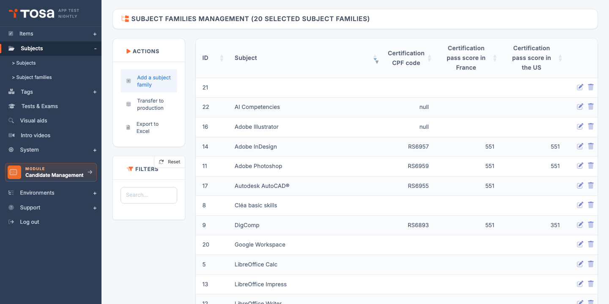
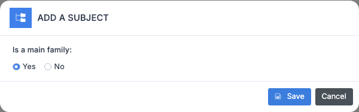
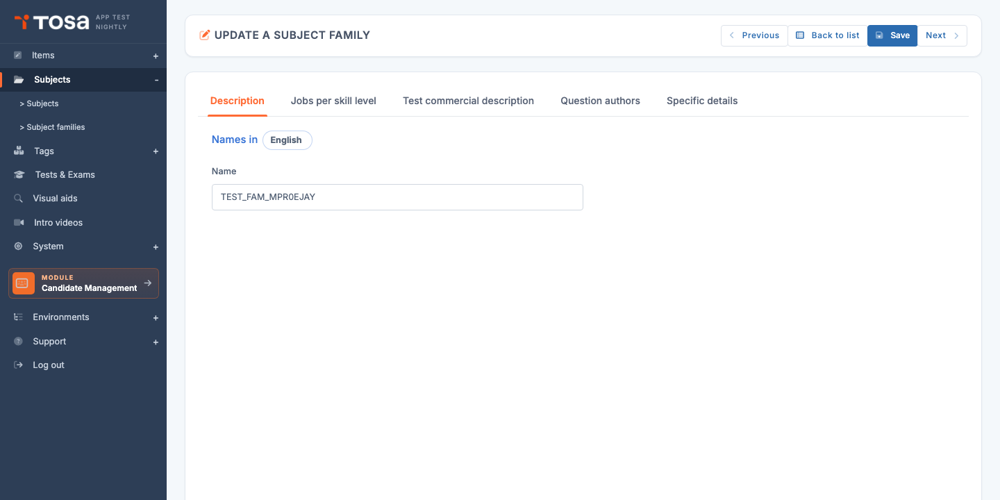

# Subject families

A **subject family** groups several subjects under one banner. For example, the *Microsoft Excel* family groups *Excel 2016*, *Excel 2019*, *Excel 365*; the *Adobe Illustrator* family groups the various versions of the software. It is the parent organisational unit of the subject.

Open the page from the menu **Question Module → Subjects → Subject families**, or directly at `/subjects/AdminSubjectFamiliesWithTable`.

The table lists every defined family, with its **ID**, **name**, **CPF code** (where applicable) and its **minimum certification scores** for France and the United States.

## Main families and secondary families {#main-vs-secondary}

The platform distinguishes **two types** of family, identified by the `is_pri` flag:

- **Secondary family** (`is_pri=0`) — a simple grouping of subjects. Only one thing to configure: the **name** in each language.
- **Main family** (`is_pri=1`) — a pivot family that **shares its settings** with all its child subjects: jobs per level, test commercial descriptions, author credits, and certification parameters (CPF code, minimum score, Credly badges, "High-level test" flag).

The choice between main and secondary depends on the nature of the subjects being grouped. A family of **official certifications** (Tosa Excel, Tosa Word) is typically **main** because all its child subjects share the same CPF code and the same level grid. A **purely organisational** family ("Internal HR tests"), which only files away independent subjects, is **secondary**.

> 💡 **How do I know whether a family is main?** — Open its edit form: a main family shows **5 tabs** (Description, Jobs, Tests, Experts, Specific); a secondary family has only one tab, **Description**.

## Create a family {#create-a-family}

1. From the **Subject family management** page, click **Add a family** in the action bar.

    

2. Enter:

    - The **Name** of the family (single- or multilingual depending on your needs).
    - The **Main family** switch to flip to a main family if you want the extra tabs.

3. Confirm. The family is created and you are redirected to its edit form.

> ⚠️ **Changing the type later** — The main/secondary status **can be changed after creation**, but this affects the consistency of the child subjects: switching to secondary discards the shared parameters (jobs, commercial descriptions). Conversely, switching to main requires filling in all those parameters to activate their propagation to the child subjects.

## Tabs of the family form {#tabs-of-the-family-form}

### Secondary family — a single tab

A secondary family has only the **Description** tab: Name (single- or multilingual) and Long name. Save and you are done.

### Main family — five tabs

The edit page (titled **EDIT A SUBJECT FAMILY**) shows the following tabs:

| Tab | Contents |
|---|---|
| **Description** | Name and Long name of the family (a **"Names in"** language picker at the top lets you switch between the active languages). |
| **Jobs per level** | For each level (1 to 5) × each language, a list of matching jobs. This information **propagates to every child subject**: no need to redefine it at the subject level. |
| **Test commercial description** | For each language, three texts (card snippet, long description, short description) used on public pages and in catalogues. **Shared across all child subjects**. |
| **Question authors** | Credit line for the family's authors and experts — appears in every report for candidates who took a subject from the family. **Shared across all child subjects**. |
| **Specific details** | Certification parameters: CPF code (Mon Compte Formation), minimum certifying score for France and the United States, "High-level test" flag (HGH), presentation screenshots, Credly badges. |

> 💡 **Why at the family level and not at the subject?** — Rather than duplicating the commercial descriptions on Excel 2016, Excel 2019, Excel 365, we centralise them on the *Microsoft Excel* family — a single place to maintain when the wording changes.

## CPF code and certification {#cpf-and-certification}

The **Specific** tab of a main family offers the fields related to official certification:

- **CPF code** — unique code assigned by France Compétences to the certification. This is the code that users of **Mon Compte Formation** find in the catalogue. Without a CPF code, the family cannot be presented as CPF-eligible.
- **Minimum certifying score — France** — minimum score (out of 1000) below which the candidate does not earn certification, in line with France Compétences rules. For example, 351/1000.
- **Minimum certifying score — USA** — equivalent for the US market.
- **High-level test** — switches the family to high-level certification, which changes the diploma issued (special mention, upgraded design).
- **Credly badges** — identifiers of the digital badges issued on the Credly platform for certified candidates. One badge per level (Basic, Operational, Advanced, Expert).
- **Presentation screenshot** — image used on catalogue pages to illustrate the family.

> ⚠️ **Editing after going live** — Changing the CPF code or the minimum scores after the family has already delivered certifications **does not invalidate** past certifications. Future candidates, however, are assessed under the new rules.

## Delete a family {#delete-a-family}

1. On the family's row, click the **Delete** icon.
2. Confirm.

> ⚠️ **Family with subjects** — A family that contains at least one **subject** cannot be deleted. The platform blocks the operation with an error message. Before deletion, **remove or move** the child subjects to another family.

## Transfer to production {#transfer-to-production}

As with subjects, the **Transfer families to production** button in the action bar lets you promote a family from pre-production to production. The whole bundle — the family and its subjects, questions, test forms — is transferred in a single operation.

Reserved for strategic changes (creation of a new CPF certification, overhaul of a reference framework). For point fixes (adding a question), go through the transfer at the subject level.
