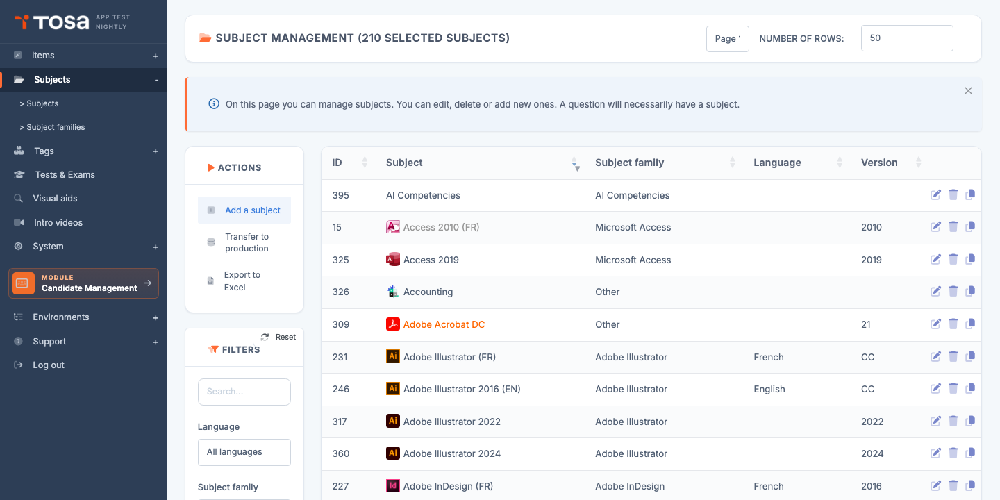
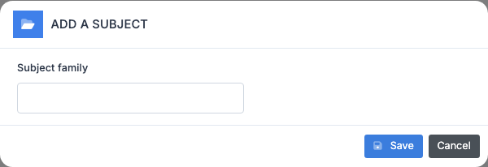
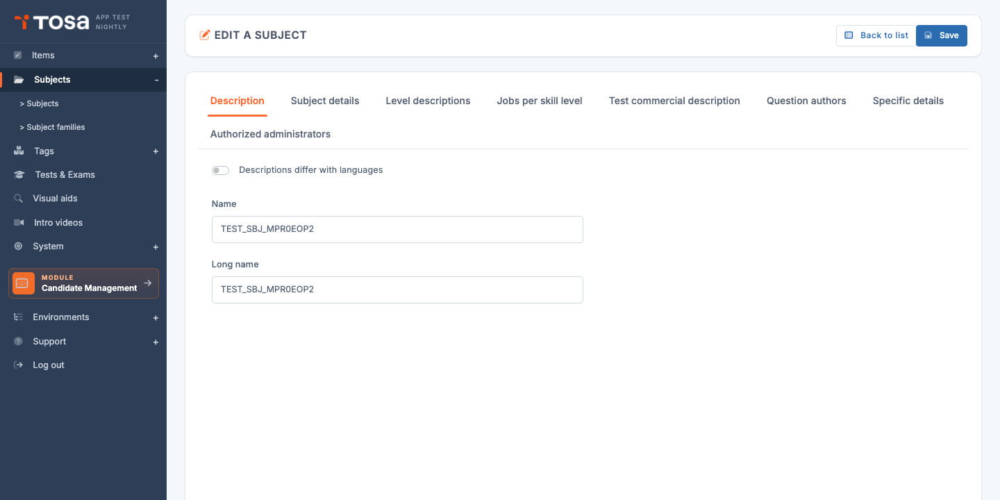
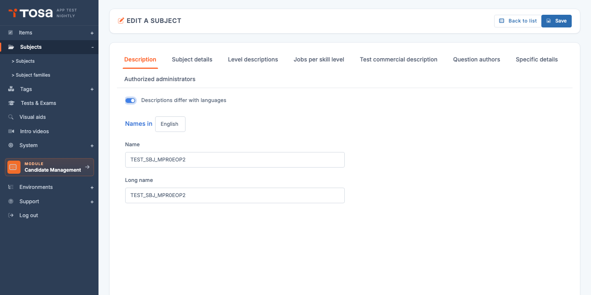
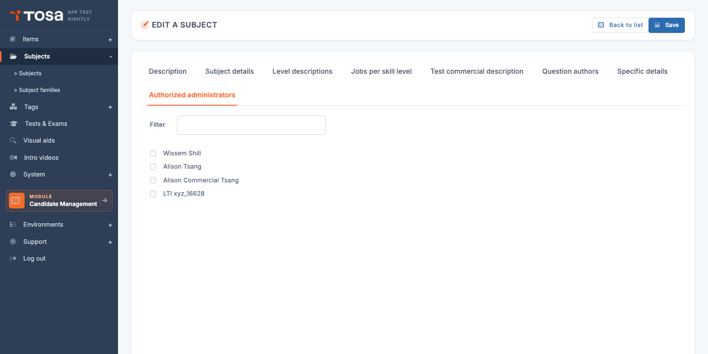

# Subjects

A **subject** is the central assessable content area of the platform: *Excel 2016*, *Python*, *English B2*. Every question, every domain, every test form is attached to a subject. This chapter covers the subject list, subject creation, and the multi-tab edit form that lets you configure everything — from the test's commercial name to the administrators allowed to see the subject.

Open the page from the menu **Question Module → Subjects**, or directly at `/subjects/AdminSubjectsWithTable`.

The table lists every available subject, with its **ID**, **name**, **subject family**, **language** and **version**. The filters at the top of the page let you narrow down by free text, language or family.

## Create a subject {#create-a-subject}

Creating a subject is a two-step process: a minimal dialog to choose the **subject family**, then the edit form to configure everything else.

### Step 1 — Choose the family

1. From the **Subject management** page, click **Add a subject** in the action bar.

    

2. In the dialog that opens, select the **subject family** the new subject belongs to (Office, Programming, etc.).

3. Confirm. The platform creates an empty subject and takes you directly to its edit form.

### Step 2 — Fill in the essential fields

On the edit form (page **SubjectUpdate**), start by filling in:

- The **name** of the subject (tab **Description**).
- The **subject details** (tab **Subject details**): subject type, reference language, public/archived status, version.

The subject appears in the list as soon as you save. You can then come back later to fill in the remaining tabs.

> 💡 **Empty vs published subject** — A subject created without questions or complete settings remains **unpublished** by default (the **Public** checkbox is off). Candidates and client account administrators will not see it until you explicitly publish it.

## Tabs of the subject form {#tabs-of-the-subject-form}

The edit form (page **EDIT A SUBJECT**) is organised into **eight tabs**:

| Tab | Contents |
|---|---|
| **Description** | Subject name and Long name (single- or multilingual depending on the switch). |
| **Subject details** | Type (Standard, Programming, Remote, …), TOS and ITS group, reference language, Public/Archived status, presence of micro-skills, version, icon. |
| **Level descriptions** | For each level from 1 to 5 and each language, a description of what a candidate at that level can do. |
| **Jobs per level** | For each level × language, a list of jobs corresponding to that skill level. Used to surface career pathways in candidate reports. |
| **Test commercial description** | For each language, three texts (card snippet, long description, short description) used on public pages and in catalogues. |
| **Question authors** | Credit line for the subject's authors and experts, displayed in reports — one text per language. |
| **Specific details** | Fields visible only for certain types: for example, the associated programming language for Programming subjects, or the remote application command for Remote subjects. |
| **Authorized administrators** | List of administrators allowed to see and edit this subject. |

> ⚠️ **Save between tabs** — The **Save** button at the top right saves the **entire** form. You can therefore fill in several tabs and save just once. However, **switching tabs without saving discards unsaved changes** — remember to save before moving on to another subject.

## Multilingual {#multilingual}

For each subject, you choose whether the **name** and the **description** should be identical across all the account's languages, or customised per language.

The switch **Different descriptions in each language** (`has_mul_nam`) toggles between the two modes:

- **Off (default)** — a single **Name** field and a single **Long name** field, shared across all languages.
- **On** — one block per language (FR / EN / DE / NL / ES / IT / EL / AR depending on your offering) with a Name and Long name specific to each language.

> 💡 **When to enable?** — Multilingual mode is useful for subjects whose commercial name differs by country (for example, a certification test with a different local acronym). For the vast majority of technical subjects (Excel, Python), a single name is enough.

The **other tabs** (Level descriptions, Jobs per level, Commercial description, Authors) are **always multilingual**: you fill in one description per language, regardless of the `has_mul_nam` setting.

## Levels and jobs per level {#levels-and-jobs}

The Tosa platform scores candidates on a **5-level scale** (Initial / Basic / Operational / Advanced / Expert, depending on the subject). Two tabs let you document these levels:

### Level descriptions

The **Level descriptions** tab provides, for each language, one text per level (1 to 5) describing what a candidate at that level **can do**. These descriptions appear in every candidate's report: *"Level 3 — The candidate can build simple pivot tables…"*.

Take care over these descriptions: they are the main information the candidate receives about what their score means.

### Jobs per level

The **Jobs per level** tab provides, for each language and each level, a list of **jobs** that correspond: *"Level 4 — Management controller, Junior financial analyst"*. This information is shown in reports to give the candidate a professional projection.

Recommended format: a comma-separated list of jobs, aligned with the job reference frameworks of your market.

## Test commercial description {#test-commercial-description}

The **Test commercial description** tab provides three texts per language, used on public catalogue pages (`isograd.com`, `tosa.org`) and in invitation emails:

- **Card description** (`its_tst_des[car]`) — a few words for the catalogue thumbnail.
- **Long description** (`its_tst_des[lon]`) — detailed descriptive paragraph.
- **Short description** (`its_tst_des[sho]`) — tagline.

Fill these texts in only if the subject is intended to be sold through the public catalogues. For an internal or proprietary subject, they can be left blank.

## Question authors {#question-authors}

The **Question authors** tab contains a single free-text field per language: the **credit line for the authors and experts** who designed the subject. This text appears at the foot of every candidate report: *"Subject designed by Prof. Jean Dupont, University of Paris"*.

Useful for editorial traceability and for crediting external contributors.

## Type-specific details {#type-specific-details}

The **Specific details** tab shows fields that **depend on the subject type** (`typ_id`) configured in the *Subject details* tab:

- **Programming** (`typ_id=1`) — shows the **Associated programming language** field (Python, JavaScript, …). Determines the execution environment for code questions.
- **Remote** (`typ_id=2`) — shows the **Remote application command** field (the invocation path for the remotely controlled application, for example Excel or Word installed on a VDI).
- **Standard** (`typ_id=3` or `4`) — the tab is empty; no specific parameter is required.

Changing the type **dynamically hides or reveals** the fields: no need to reload the page.

## Authorized administrators {#authorized-administrators}

The **Administrators** tab lists every administrator allowed to see and edit this subject. By default, a new subject is visible to administrators with the **Read/write all subjects** privilege.

- Tick the box next to a name to **authorize** that administrator on the subject.
- Untick to **revoke** their access.
- Use the **Filter** field above the list to quickly find an administrator in a long list.

> 💡 **Editorial segmentation** — This feature is useful when you have several production teams: each team sees only its own subjects. Unchecking it for all external admins ensures that a subject still being drafted is not visible before validation.

## Duplicate a subject {#duplicate-a-subject}

Duplication creates a **new subject** from an existing one, copying all its configuration (name, descriptions, levels, jobs, etc.). It is the fastest way to start a closely related subject (for example, a new version of Excel from the previous one).

1. On the source subject's row in the list, click the **Duplicate** icon.
2. Confirm. The platform creates a copy with the suffix "(copy)" and takes you to its edit form.
3. **Rename** the copy immediately to avoid confusion, then adjust the fields as needed.

> ⚠️ **Questions are not duplicated** — Duplicating a subject **copies its configuration** but **not the questions** attached to it. The duplicated subject therefore starts with zero questions — it is up to you to write them or transfer them afterwards.

## Delete a subject {#delete-a-subject}

1. On the subject's row, click the **Delete** icon (trash can).
2. Confirm the deletion in the dialog that appears.

> ⚠️ **Subjects with questions** — A subject that contains at least one **question** cannot be deleted. The platform shows an error message ("Cannot delete this subject because it contains questions") and the deletion is cancelled. Before deleting, remove or archive the questions attached to the subject.

> 💡 **Prefer archiving** — For an obsolete subject whose history you want to preserve, do not delete it: **archive** it via the *Subject details* tab (**Archived** checkbox). The subject disappears from default lists but remains viewable, and old reports continue to work.

## Export the list {#export-the-list}

The **Export to Excel** button in the action bar generates an `.xlsx` file listing every subject currently filtered on screen. Useful for periodic reviews or for sharing the list with external contributors.

## Transfer subjects to production {#transfer-to-production}

The **Transfer subjects to production** button in the action bar opens a wizard that lets you **promote** a subject from the pre-production environment to public production. This is the step that makes the subject (and its questions and test forms) available to real client accounts.

Follow the wizard to select the subject(s) to transfer, confirm the preflight checks (presence of a minimum number of calibrated questions, complete description in each active language, etc.), then validate the transfer.

> ⚠️ **Sensitive action** — A subject transferred to production becomes immediately visible to client accounts. Check meticulously before confirming: an incomplete or unreviewed subject can reach candidates.
