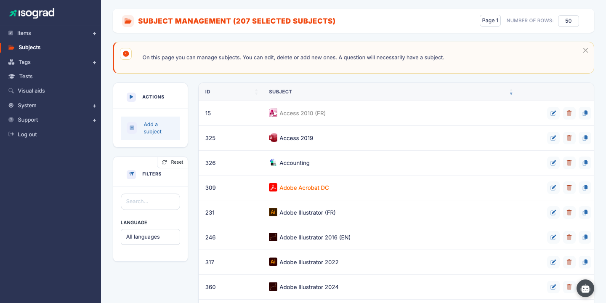
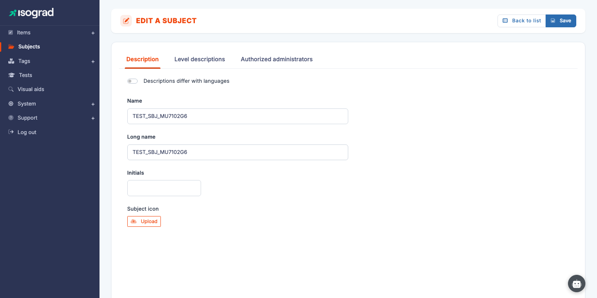
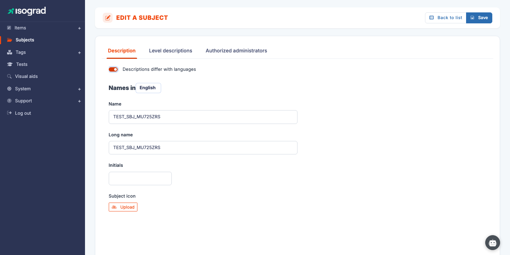
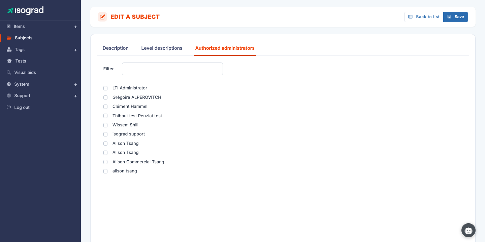

# Subjects

A **subject** is the central assessable content area of your platform: *Excel*, *Python*, *Internal safety procedures*. Every question, every domain and every test is attached to a subject. This chapter covers the subject list, subject creation, and the three-tab edit form that lets you name the subject, describe its skill levels and choose which administrators may work on it.

Open the page from the menu **Subjects**.

The table lists every subject you are allowed to see, with its **ID** and its **name**, preceded by its icon (or coloured initials when no icon has been uploaded). The **Search** filter on the left narrows the list by name; the **Language** filter can stay on *All languages*, since subjects are not tied to a language on your platform.

> 💡 **Who sees which subjects?** — A main administrator sees every subject of the account. Other administrators see only the subjects they have been authorised on (see [Authorized administrators](#authorized-administrators)), plus the subjects they created themselves.

## Create a subject {#create-a-subject}

1. From the **Subject management** page, click **Add a subject** in the action bar.

2. The platform immediately creates an empty subject and opens its edit form (page **Edit a subject**).

3. Fill in at least the **name** in the **Description** tab, then click **Save** at the top right.

The subject appears in the list as soon as it has been created. You can come back later to complete the other tabs.

> ⚠️ **Empty subjects** — The subject is created the moment you click **Add a subject**, before you have typed anything. If you leave the form without saving, an unnamed subject remains in the list: open it to name it, or delete it from the list.

> 💡 **Visibility** — A subject is usable straight away: as soon as it exists, it can receive questions and be chosen when creating a test. There is no separate publication step.

## Tabs of the subject form {#tabs-of-the-subject-form}

The edit form is organised into **three tabs**:

| Tab | Contents |
|---|---|
| **Description** | Subject name and long name (single- or multilingual depending on the switch), initials and icon. |
| **Level descriptions** | For each level from 1 to 5 and each report language, a description of what a candidate at that level can do. |
| **Authorized administrators** | List of administrators allowed to see and edit this subject. |

> ⚠️ **Save between tabs** — The **Save** button at the top right saves the **entire** form. You can therefore fill in several tabs and save just once. However, leaving the page without saving discards unsaved changes — remember to save before moving on to another subject.

## Description, multilingual mode and icon {#multilingual}

The **Description** tab holds the identity of the subject.

### Name and long name

The switch **Descriptions differ with languages** toggles between two modes:

- **Off (default)** — a single **Name** field and a single **Long name** field, shared across all the languages of your account.
- **On** — one block per language of your account (heading **Names in**, with a language picker), with a Name and a Long name specific to each language.

The languages offered are those enabled for your account (see the *Account management* chapter of the administrator manual).

> 💡 **When to enable?** — Multilingual mode is useful when candidates take tests in several languages and the subject must be named in each of them. For a subject used in a single language, a single name is enough.

### Initials

The **Initials** field (two characters at most) defines the letters shown on the subject's coloured badge in lists and reports when no icon has been uploaded. Left empty, the platform uses the first two letters of the name.

### Subject icon

The **Subject icon** block lets you upload an image (PNG, JPG, GIF or SVG) that replaces the initials badge everywhere the subject is displayed. Click **Upload** and pick the file; a preview appears once the upload is complete. Use the delete button next to the preview to remove the icon and go back to initials.

## Level descriptions {#level-descriptions}

The platform can score candidates on a **5-level scale**. The **Level descriptions** tab provides, for each report language, one text per level (1 to 5) describing what a candidate at that level **can do**.

These descriptions are optional. When they are filled in, they appear in the candidate's report as a summary of the level reached: *"Level 3 — The candidate can build simple pivot tables…"*.

Take care over these descriptions: they are the main information the candidate receives about what their score means.

> 💡 **Levels per domain** — You can refine these descriptions domain by domain in the **Skill levels** tab of each [domain](/ai/en/question-module/domains/#tabs-of-the-edit-form).

## Authorized administrators {#authorized-administrators}

The **Authorized administrators** tab lists the administrators of your account who work in the Question Module without having the privilege to see **all** subjects. Tick the ones allowed to see and edit this subject.

- Tick the box next to a name to **authorize** that administrator on the subject.
- Untick to **revoke** their access.
- Use the **Filter** field above the list to quickly find an administrator in a long list.
- Administrators whose login has been disabled are shown greyed out.

> 💡 **Editorial segmentation** — This feature is useful when you have several authoring teams: each team sees only its own subjects. Main administrators and administrators holding the "all subjects" privilege are not listed here because they always see every subject.

> 💡 **Your own access** — You do not appear in this list: saving never removes your own access to the subject.

## Duplicate a subject {#duplicate-a-subject}

Duplication creates a **new subject** from an existing one, copying its configuration (names, long names, initials, icon and level descriptions). It is the fastest way to start a closely related subject.

1. On the source subject's row in the list, click the **Duplicate** icon.
2. The platform creates the copy and takes you to its edit form.
3. **Rename** the copy immediately: it carries the same name as the original, which is confusing in lists.

> ⚠️ **Questions and administrators are not duplicated** — Duplicating a subject **copies its configuration** but **not the questions** attached to it, nor the list of authorized administrators. The duplicated subject therefore starts with zero questions.

## Delete a subject {#delete-a-subject}

1. On the subject's row, click the **Delete** icon (trash can).
2. On the page that opens, click the **Delete** button to confirm.

> ⚠️ **Subjects with questions** — A subject that contains at least one **question** cannot be deleted. The platform shows an error message ("This subject cannot be deleted because it is used by questions") and the deletion is cancelled. Before deleting, remove the questions attached to the subject.

> 💡 **Who can delete?** — A subject can be deleted by a main administrator or by an administrator authorized on that subject.
