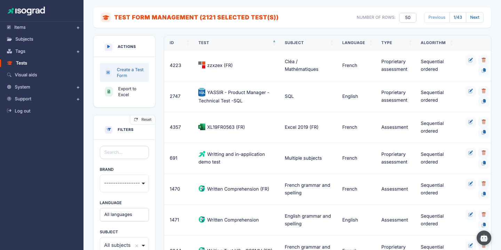
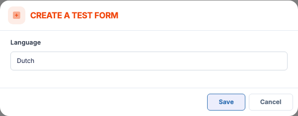
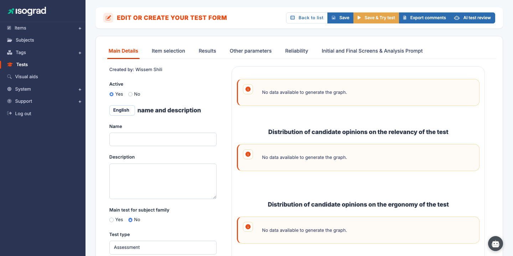

# Tests (test forms)

A **test** — technically called a *"test form"* (`test_form`) in the code and audit reports — is the final assembly that becomes passable by a candidate. It is the junction point where you take a **selection of questions** from a subject, apply a **drawing algorithm**, set **parameters** (duration, number of questions, proctoring, etc.), and obtain a deliverable usable by a client account.

Every test booked for a candidate on the platform — whether an assessment, a certification or a positioning test — is defined by one of these forms.

Open the page through the menu **Questions module → Tests & Exams**.

The table (titled **TEST MANAGEMENT**) lists every test, with its **identifier**, **name**, **subject**, **language**, **type**, **algorithm** and **geographic visibility** (Worldwide by default, or restricted to certain countries/regions).

## Concepts {#concepts}

### Form types

Each form has a **type** (`typ_id`) that determines its purpose:

| Type | Use |
|---|---|
| **Proprietary assessment** | Continuous-assessment test, without certifying value. The most common format. |
| **Form** | The questionnaire is a format designed to collect information from candidates: profile, experience, motivations, preferences, professional context, etc. |
| **Test series** | A sequence of several tests grouped together and offered to the candidate in a defined order, within one and the same session. |

The type drives the platform's behaviour both on the candidate side (presentation, diploma generation) and on the administrator side (taking restrictions, available options).

### Drawing algorithm

A form does not directly contain the list of questions to ask — it defines **an algorithm** that selects questions at the start of each session. Common algorithms:

- **Adaptive** — the algorithm adjusts question difficulty based on the candidate's answers (note: the questions must be calibrated beforehand).
- **Sequential** — N questions drawn in order or at random from a pool (a list, a question set, a domain...).

Each algorithm has its own parameters (length, domain pool, level distribution) configured on the **Algorithm** tab.

## Create a form {#create-a-test}

Creation goes through a pre-selection modal (subject, language, type), followed by the edit page.

1. From the **Test forms management** page, click **Create a form** in the action bar.

    

2. Choose:

    - **Subject** — the topic the form assesses.
    - **Language** — language presented to the candidate.
    - **Type** — Assessment, form, etc. (see [Form types](#concepts)).

3. Confirm. The platform creates the form and takes you to its edit page.

## Test creation tabs {#tabs-advanced-mode}

The edit page (titled **CREATE OR EDIT A TEST**) offers five tabs:

| Tab | Content |
|---|---|
| **General characteristics** | Active test (Yes/No), name, description, test type, language, difficulty level, test statistics (over the last 12 months of taking) |
| **Question selection** | Algorithm, subject |
| **Results** | Report structure. |
| **Other parameters** | Test duration, behaviour on interruption, miscellaneous technical options. |
| **Start and end messages visible to the candidate** | Customisation of the intro and end messages. |

> 💡 **Action buttons** — In addition to the **Save** button, the header offers **Save & try your test** (launches the test for yourself as a preview) and **Export comments** (retrieves the comments left by candidates on the questions of this test).

> 💡 **Lite mode** — In some environments (`is_cus_env`), the **Description** tab is not shown separately: its fields are inlined inside the **General characteristics** tab.

## Edit a form {#edit-a-test}

1. On the form's row, click the **Edit** icon (pencil).
2. Navigate between the tabs and adjust the desired values.
3. Click **Save** at the top right.

> ⚠️ **Forms in production** — Editing a form **already used** by active candidates can affect their experience. For deep changes (algorithm, structure), prefer creating a **new form** or **duplicating** the existing one to keep a record of the historically used version.

## Duplicate a form {#duplicate-a-test}

Duplication is the fastest tool for creating a variant of an existing form (another language, a local adjustment, a "lite" version).

1. On the row of the form to duplicate, click the **Duplicate** icon.
2. The platform creates a copy with the "(copy)" suffix and takes you to its edit page.
3. **Rename** the copy to avoid confusion and adjust the parameters.

> 💡 **Duplication preserves** — the algorithm selection, proctoring parameters, descriptions, intro and feedback messages. It does not duplicate the **questions** themselves (forms reference them by filter, not by fixed list).

## Delete a form {#delete-a-test}

1. On the form's row, click the **Delete** icon.
2. Confirm on the confirmation page.

> ⚠️ **Form used by candidates** — A form referenced by **test bookings** (completed or in progress) cannot be deleted. Prefer **archiving** through the status field on the General tab: the form becomes invisible to new bookings but remains functional for historical tests.

## Filters {#filters}

The **Filters** panel offers:

- **Search** — free text on the name or the ID.
- **Language** — by form language.
- **Subject** — by associated subject.

Column sorting is available by clicking the headers.

## Export the list {#export-the-list}

The **Export to Excel** button in the action bar generates an `.xlsx` file listing every form currently filtered. Valuable for periodic test catalogue reviews.
