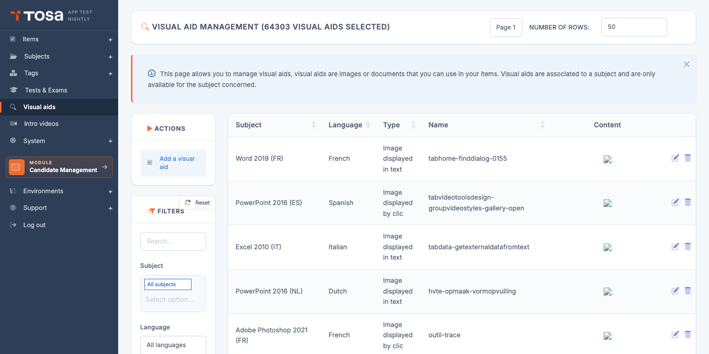
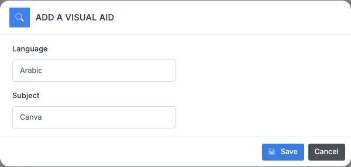
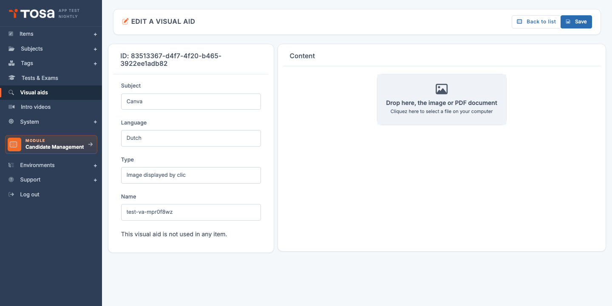

# Visual aids

A **visual aid** is an **illustration file** (image, PDF, Office document, etc.) that you can attach to one or more questions to give the candidate the material they need to answer: an Excel table to analyse, a diagram to interpret, a code snippet to debug, a text to read.

Visual aids are managed **centrally** on the platform: you declare them once, upload them, then reference them from questions by their identifier. This design lets you:

- **Reuse** the same image across multiple questions without duplicating it.
- **Update** a file in a single place, with immediate propagation to every question that uses it.
- **Guarantee linguistic consistency**: a visual aid is attached to a language, so the French version of a question displays the French table and the English version the English one.

Open the page through the menu **Questions module → Visual aids**, or directly at `/visualaid/AdminVisualAidsWithTable`.

The table lists every visual aid, with its **subject**, **language**, **type**, **name** and a preview of the **image** when applicable.

## Accepted file formats {#accepted-formats}

The platform accepts the following extensions:

| Category | Extensions |
|---|---|
| Images | `jpg`, `jpeg`, `png`, `gif`, `bmp`, `svg` |
| Office documents | `doc`, `docx`, `xlsx` |
| PDF | `pdf` |
| Data | `yml`, `pbix` (Power BI) |
| Archive | `zip` |

Files whose extension is not in this list are **rejected on the browser side**, before being sent to the server.

> 💡 **Size limit** — The maximum file size depends on your server configuration (typically a few megabytes). For large files (Power BI, big PDFs), make sure the end user will be able to download them in an acceptable time — a proctored test will not wait for a slow connection.

## Create a visual aid {#create-a-visual-aid}

Creation is done in **two steps**: declare the metadata (language + subject), then upload the file.

### Step 1 — Declaration

1. From the **Visual aid management** page, click **Add a visual aid** in the action bar.

    

2. In the modal, choose:

    - The **language** of the visual aid. A visual aid is **single-language**: if you need the same illustration in several languages, create one visual aid per language.
    - The **subject** the visual aid is attached to. Used to filter the list and guide authors.

3. Confirm. The platform creates a record and redirects you to its edit page.

### Step 2 — Metadata and upload

On the edit page (titled **EDIT A VISUAL AID**), the screen is split into two columns:

**Left column — Metadata**:

- The **identifier** (UUID) of the visual aid, shown at the top.
- **Subject** — read-only (set at creation).
- **Language** — read-only (set at creation).
- **Type** — visual aid category (Image, Reference document, etc.). Editable.
- **Name** — internal label. **Warning**: the name is **slugified** server-side (spaces → dashes, accents removed, etc.); it also becomes the **stored file name**, which makes it visible to candidates if they ever inspect the HTML. Keep it sober.
- An information line indicates **where the visual aid is used**: *"This visual aid is not used in any question."* if empty, or the count/list of questions that reference it.

> ⚠️ **Subject and language are locked** — If you picked the wrong subject or language at creation, delete the visual aid and recreate it — you can no longer change them here.

**Right column — Content**:

A drop zone displays *"Drop the image or PDF document here"* / *"Click here to select a file from your computer"*.

- **Drag and drop** the file into the zone, or
- **Click** the zone to open your system's file picker.

Once the file is chosen, the upload starts automatically. If the extension is valid, the preview appears in the zone:

- For an **image**, you see the thumbnail.
- For a **PDF**, an embedded preview (iframe) or an *"Open in a new tab"* link.
- For other formats (Office, archive, etc.), only a download link is shown.

> 💡 **Replacing a file** — Simply drop a new file in the zone: it replaces the previous one. The new version is immediately available to every question that references this visual aid.

## Use a visual aid in a question {#use-in-a-question}

From the question editor, you reference a visual aid by inserting it via the insertion menu. The question then stores the **file path** or its **identifier**, which is resolved at display time on the candidate side.

A visual aid can be referenced from:

- The question's **statement** (`question.txt`).
- The **answer options** (`question.ans`).
- The question's **specific parameters** (`question.spe_det`, for example for manipulation questions).

> 💡 **Check usage** — A visual aid's edit page shows at the bottom of the left column **whether the aid is used** in any question. To explore the questions involved, open the **Questions** page and filter by subject.

## Filters {#filters}

The **Filters** panel offers:

- **Search** — free text on the (slugified) name or the ID.
- **Type** — by visual aid type (Image, Document, etc.).

Sorting is available on each column.

## Delete a visual aid {#delete-a-visual-aid}

1. On the visual aid's row, click the **Delete** icon.
2. Confirm on the confirmation page.

> ⚠️ **Visual aid referenced by questions** — If the **file name** of the visual aid is referenced in the text, answers or specific parameters of **at least one question**, deletion is **refused** with the error message `visa_cantd`. Before deleting:
>
> 1. Identify the questions that use the aid (via the Questions page, filtered by subject).
> 2. Edit those questions to point to another aid or remove the reference.
> 3. Retry the deletion.

## Best practices {#best-practices}

- **Name your visual aids clearly**: `sales-table-2024-en` rather than `image1`. The file name becomes public in the rendered HTML — an evocative name avoids confusion and eases debugging.
- **Compress your images** before uploading: a candidate page that loads 10 images of 5 MB each is unusable on a mobile connection. Target: 200 KB per JPG image.
- **Keep PDFs to a strict minimum**. A complex PDF consumes a lot on the browser side and may make the test inaccessible to candidates running an older browser.
- **One visual aid per language**: do not mix languages in the same image. A screenshot of Excel in English is not suitable for the French version of the test.
