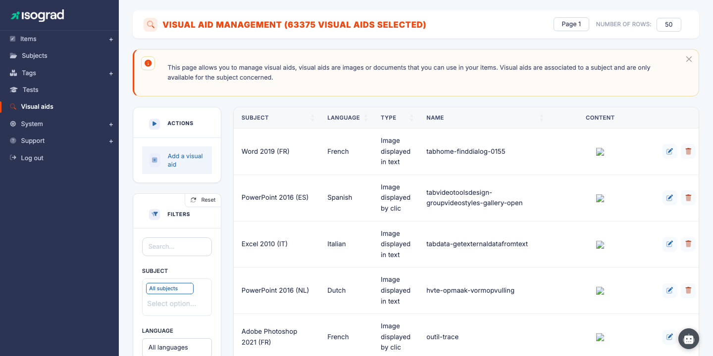
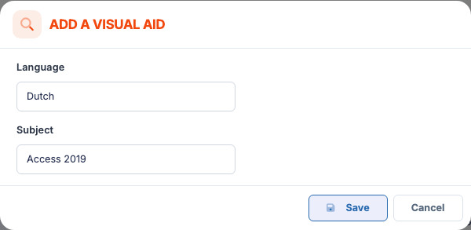
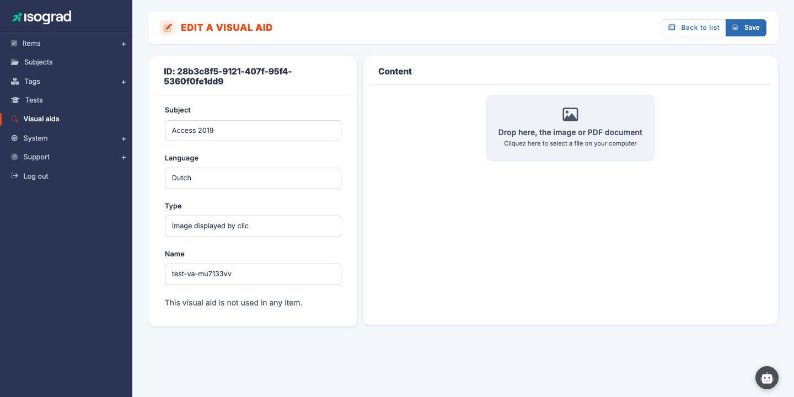

# Visual aids

A **visual aid** is an **illustration file** (image, PDF, Office document, etc.) that you can attach to one or more questions to give the candidate the material they need to answer: an Excel table to analyse, a diagram to interpret, a code snippet to debug, a text to read.

Visual aids are managed **centrally** on the platform: you declare them once, upload them, then reference them from questions by their name. This design lets you:

- **Reuse** the same image across multiple questions without duplicating it.
- **Update** a file in a single place, with immediate propagation to every question that uses it.
- **Guarantee linguistic consistency**: a visual aid is attached to a language, so the French version of a question displays the French table and the English version the English one.

Open the page through the menu **Visual aids**.

The table lists every visual aid, with its **subject**, **language**, **type**, **name** and a preview of its **content** when it is an image.

## Accepted file formats {#accepted-formats}

The platform accepts the following extensions:

| Category | Extensions |
|---|---|
| Images | `jpg`, `jpeg`, `png`, `gif`, `bmp`, `svg` |
| Office documents | `doc`, `docx`, `xlsx` |
| PDF | `pdf` |
| Data | `yml`, `pbix` (Power BI) |
| Archive | `zip` |

Files whose extension is not in this list are **rejected on the browser side**, before being sent to the server.

> 💡 **Size** — The file is uploaded directly to the storage service, so there is no strict size limit. Still, for large files (Power BI, big PDFs), make sure the candidate will be able to download them in an acceptable time — a proctored test will not wait for a slow connection.

## Create a visual aid {#create-a-visual-aid}

Creation is done in **two steps**: declare the language and the subject, then name the aid and upload the file.

### Step 1 — Declaration

1. From the **Visual aid management** page, click **Add a visual aid** in the action bar.

    

2. In the dialog, choose:

    - The **language** of the visual aid, among the languages of your account. A visual aid is **single-language**: if you need the same illustration in several languages, create one visual aid per language.
    - The **subject** the visual aid is attached to. Used to filter the list and to offer the aid in the editor of the questions of that subject.

3. Click **Save**. The platform creates a record and redirects you to its edit page.

### Step 2 — Metadata and upload

On the edit page, the screen is split into two columns:

**Left column — Metadata**:

- The **identifier** of the visual aid, shown at the top.
- **Subject** — read-only (set at creation).
- **Language** — read-only (set at creation).
- **Type** — the way the aid is shown to the candidate: **Image** (inline in the text), **Image with magnifying glass** (opens on click), **Reference document** (a document embedded or offered as a link), **Keyboard** (a keyboard image, not attached to a subject).
- **Name** — internal label. **Warning**: the name is **simplified** on save (spaces become dashes, accents are removed, etc.); it also becomes the **stored file name**, which makes it visible to candidates if they ever inspect the page. Keep it sober.
- An information line indicates **where the visual aid is used**: *"This visual aid is not used in any question."* if empty, or the list of question identifiers that reference it.

> ⚠️ **Subject and language are locked** — If you picked the wrong subject or language at creation, delete the visual aid and recreate it — you can no longer change them here.

**Right column — Content**:

A drop zone displays *"Drop the image or PDF document here"* / *"Click here to select a file from your computer"*.

- **Drag and drop** the file into the zone, or
- **Click** the zone to open your system's file picker.

The **name** and **type** must be filled in before the upload. Once the file is chosen, the upload starts automatically. If the extension is valid, the preview appears in the zone:

- For an **image**, you see the thumbnail.
- For a **PDF**, an embedded preview.
- For other formats (Office, archive, etc.), only a download link is shown.

A **Delete content** button under the preview removes the file while keeping the record.

> 💡 **Replacing a file** — Simply drop a new file in the zone: it replaces the previous one. The new version is immediately available to every question that references this visual aid.

## Use a visual aid in a question {#use-in-a-question}

From the question editor, the **visual aid search** box on the right lists the aids of the question's subject and language: type at least three characters of the name, then click the aid to insert its **reference tag** in the statement or in an answer. The candidate-side rendering resolves the tag into the image or document.

A visual aid can be referenced from:

- The question's **statement**.
- The **answer options**.
- The question's **specific parameters**, for some interactive types.

> 💡 **Check usage** — A visual aid's edit page shows at the bottom of the left column **the questions that use it**. Open the **Questions** page and search for those identifiers to explore them.

## Filters {#filters}

The **Filters** panel offers:

- **Search** — free text on the name.
- **Subject** — multi-select on the subject the aid is attached to.
- **Language** — the aid's language.
- **Type** — Image, Image with magnifying glass, Reference document, Keyboard.

Sorting is available on each column.

## Delete a visual aid {#delete-a-visual-aid}

1. On the visual aid's row, click the **Delete** icon.
2. Confirm on the page that opens.

> ⚠️ **Visual aid referenced by questions** — If the visual aid is referenced in the text, answers or specific parameters of **at least one question**, deletion is **refused** with the message "You cannot delete a visual aid used in questions". Before deleting:
>
> 1. Identify the questions that use the aid (listed on its edit page).
> 2. Edit those questions to point to another aid or remove the reference.
> 3. Retry the deletion.

## Best practices {#best-practices}

- **Name your visual aids clearly**: `sales-table-2024-en` rather than `image1`. The file name becomes public in the rendered page — an evocative name avoids confusion and eases debugging.
- **Compress your images** before uploading: a candidate page that loads 10 images of 5 MB each is unusable on a mobile connection. Target: 200 KB per JPG image.
- **Keep PDFs to a strict minimum**. A complex PDF consumes a lot on the browser side and may make the test inaccessible to candidates running an older browser.
- **One visual aid per language**: do not mix languages in the same image. A screenshot of Excel in English is not suitable for the French version of the test.
