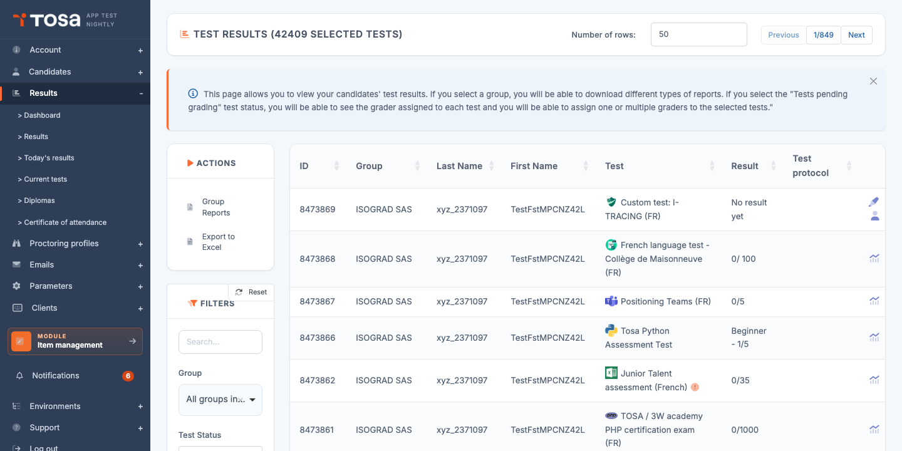
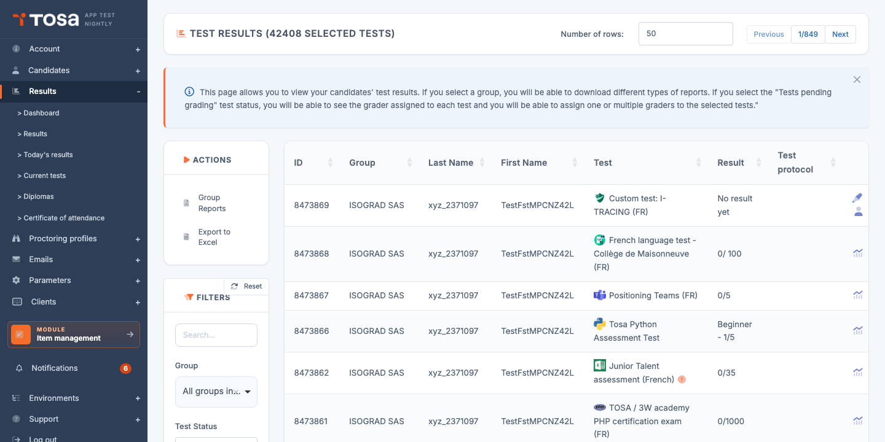
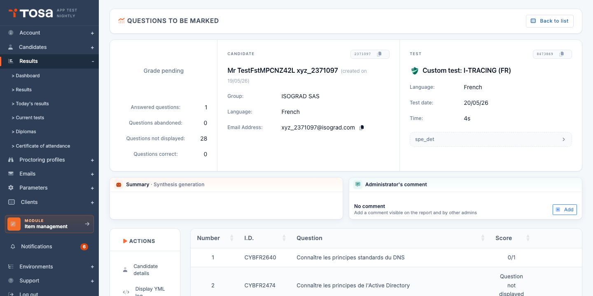
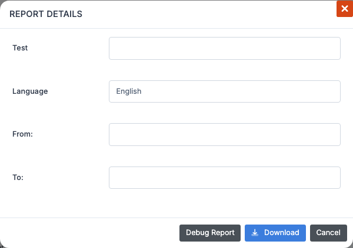

# Results management

The **Test Results** page is the dashboard for your account's activity: every test **completed**, **in progress** or **to be taken** by your candidates is listed here, along with their scores and access to the detailed reports. It is also the page from which you **download reports** and **certificates**, individually or in bulk, and from which you trigger automatic sending to candidates.

Open this page through the **Results** menu, or directly at the URL `/clientadmin/AdminResultsWithTable`.

Each row in the table represents **one test registration for a candidate**. The default columns are:

| Column | Content |
|---|---|
| **ID** | Internal identifier of the registration. |
| **Group** | The group the candidate belongs to. |
| **Last name** / **First name** | Candidate identity. |
| **Test** | Subject name and test type (evaluation, certification, positioning). |
| **Result** | Score obtained (depending on status). If the test is not finished, displays *"No result yet"*. For tests pending manual grading, this column becomes **Grader**. |
| **Protocol** | Indicators related to the sitting: remote proctoring, integrity, etc. (depending on the test options). |

The **action buttons at the end of each row** depend on the test status (see [Row actions](#row-actions) below).

> 💡 **Related sub-pages** — The **Results** menu in the sidebar offers several specialized views:
> - **Dashboard** — aggregated metrics (number of completed tests, average duration, score distribution) for a group or a session.
> - **Today's results** — a filtered version of the table showing only today's sittings.
> - **Tests in progress** — tests started but not yet completed.
> - **Certificates** — a dedicated view of validated certifications, with diploma downloads.
> - **Sitting attestation** — generation of official test sitting attestations.

## Filters and search {#filters-and-search}

The **Filters** panel to the left of the table lets you target a sub-population of tests:

- **Search** — free text: candidate's last name, first name, email address, test name, identifier.
- **Test status** — restricts the display to a specific status (see [Test statuses](#test-statuses)).
- **Test type** — evaluation, certification, free, positioning, etc.
- **Group** — one group at a time. Selecting a group **enables the group report actions** (bulk report downloads) — see [Group reports](#group-reports).
- **Session** — restricts to tests attached to a given test session.
- **Include archived groups** (toggle) — by default, candidates belonging to archived groups are hidden. Enable to see them.

The **Reset** button at the top of the panel returns all filters to their default values.

## Test statuses {#test-statuses}

The **Test status** filter offers several values that correspond to the stages of a test's life:

- **To be taken** — the candidate has been registered but has not yet started the test.
- **In progress** — the candidate has started the test and has not finished it. The test remains startable as long as it is not marked as completed.
- **Completed** — the candidate has submitted their answers. The score is calculated and the report is available.
- **Pending grading** — for subjects containing manually graded questions (essay, code), the test is submitted but requires a grader's intervention.
- **Cancelled** — the registration was cancelled before the candidate took the test. The credit is refunded to the account.

> 💡 **"Pending grading"** — When you filter on this status, the **Score** column is replaced by **Grader**: this is the administrator in charge of the grading. See [Grade a test](#grade-a-test) below.

## Row actions {#row-actions}

The action buttons visible at the end of each row depend on the test status and on your account privileges:

- **Analysis** (magnifier or details icon) — opens the detailed result analysis page: score per skill, duration per question, difficulty curve.
- **Grade** (grading icon) — for tests pending grading, opens the question-by-question grading interface.
- **Assign to a grader** (silhouette icon) — assigns an administrator of your account as the test's grader.
- **Download the certificate** (diploma icon) — available for validated certifications: generates the PDF diploma.

## Group reports {#group-reports}

Once a **group is selected** in the filter, several bulk actions become available in the **Group reports** dropdown menu at the top of the table:

- **Download the group report** — a single PDF summarizing the results of every candidate in the group for a given test (comparison, ranking, overall statistics).
- **Download the group progression report** — for groups who have taken **two** tests on the same subject (initial test + final test), generates a report comparing the evolution.
- **Download all individual reports** — a ZIP containing one PDF per candidate.
- **Download all individual progression reports** — a ZIP with one progression report per candidate.
- **Download all certificates** — a ZIP with one diploma per certified candidate in the group.
- **Send each candidate their report** — triggers sending each candidate's report by email to their address.
- **Send each candidate their certificate** — same for validated certifications.
- **Download the skills file** — a detailed Excel export of skill levels per candidate (useful for HR analyses).

### Selecting the test and the period

When you click on one of the actions above, a window opens letting you specify:

- The **test** concerned (if the group has taken several different subjects).
- The **language** of the report.
- The **period** (start / end date) — restricts to tests taken within this interval.

Confirm, and the report is generated. For long operations (bulk reports), the platform displays a message *"Your request has been registered. You will receive an email within 24 hours."* and the file is sent to you as soon as it is ready.

> ⚠️ **Group required** — As long as no group is selected, the **Reports** button displays a warning prompting you to pick a group and clear the search field. Bulk reports cannot be generated for your entire account in one go.

## View result detail {#view-result-detail}

The **Analysis** button (detail icon) on the row of a completed test opens the **analysis page**, which displays:

- The **overall score** and the **distribution per skill** (chart).
- The **total duration** and the average duration per question.
- The **question-by-question detail**: the candidate's answer, the correct answer, the time spent.
- The option to **download the PDF report** or the **certificate** (if applicable).

For adaptive tests (where difficulty adjusts to answers), the analysis also includes the **calibration curve** tracing the candidate's progression.

## Grade a test {#grade-a-test}

Tests that contain **manually graded questions** (free-form writing, code to analyse, etc.) land in the **Pending grading** status once submitted. An administrator must assign a grade before the final result is calculated.

### Assign a grader

1. Filter the list on the **Pending grading** status.
2. Tick one or more tests to assign.
3. Click on **Assign the tests to one or more graders**.

    > 💡 If you select several graders, the tests will be distributed evenly between them.

4. Confirm. The tests are assigned and the **Grader** column updates with the name of the assigned administrator.

### Grade

1. Click on the **Grade** icon at the end of the row of a test assigned to you.
2. The platform opens the grading interface. For each manually graded question, you see the **candidate's answer** and a **grade field** to fill in, along with an optional comment field.
3. Confirm each question, then save the whole set. The overall score is recalculated and the test moves to **Completed** status.

## Export to Excel {#export-to-excel}

The **Export to Excel** button in the action bar generates an `.xlsx` file listing every result **currently filtered** on screen. In addition to the visible columns, the export includes extra information such as the **external identifier** (if configured), the candidate's **email address** and the **administration comments**.

Useful for:

- Producing a quarterly review in flat Excel format.
- Cross-referencing results with other HR or training data.
- Archiving results outside the platform.

> 💡 **Data volume** — If your filter covers more than a few hundred rows, the export may take several seconds to generate. The platform triggers the download as soon as the file is ready.

## Remote proctoring {#remote-proctoring}

A row showing the **camera** icon corresponds to a test taken **under remote proctoring**. To review the recordings (captures, video, ID document) and validate or invalidate each sitting, refer to the chapter [Test proctoring](/ai/en/proctoring/).
