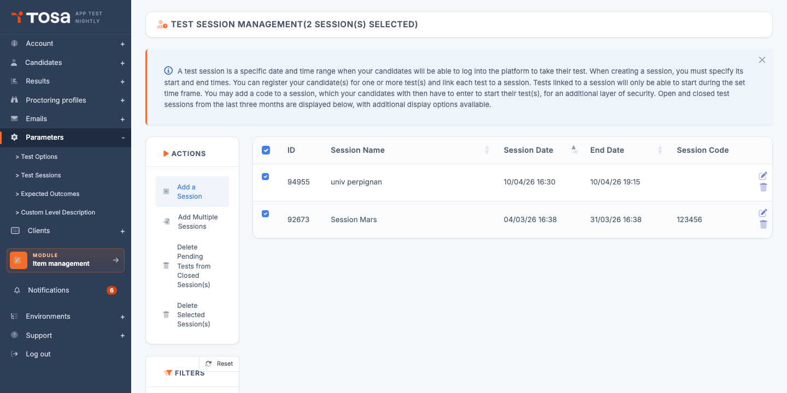
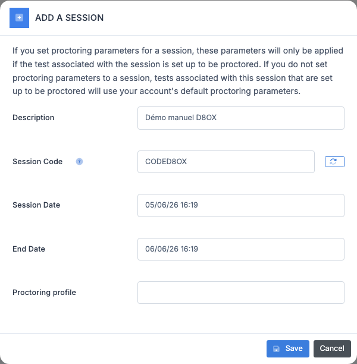
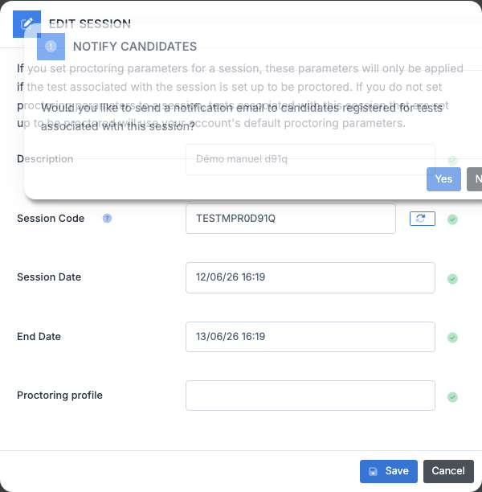
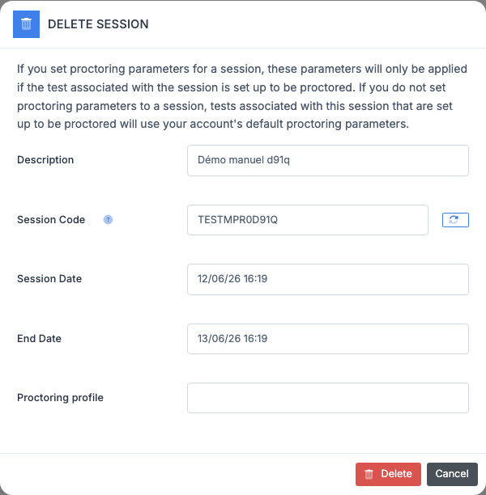
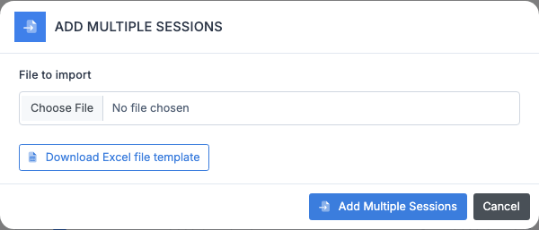

# Test session management

A **test session** is a time window (start date and time, end date and time) during which your candidates may start their test. It is the main tool to **frame** a test: proctored in person, scheduled on a precise slot, or simply protected by a code shared on the day.

The **Test session management** page lists all the sessions defined on your account. Each row shows the **name**, the **start date**, the **end date** and the **session code** (if any).

> 💡 **Default display** — The platform displays by default the **current** sessions and those **ended less than 3 months ago**. Older sessions remain in the database but are hidden from the list. The display options at the bottom of the filter panel let you include older sessions or hide past sessions.

## What is a session for {#what-is-a-session-for}

When you register a candidate to a test, you can **associate them with a session**. The consequences:

- The candidate can **start** the test only within the session's time window. Before the start date, the test appears but remains locked; after the end date, it is no longer accessible.
- If the session has a **code**, the candidate must enter it to start their test — the examiner communicates it at the appropriate moment, which adds a layer of security against premature starts.

You can also **assign an entire group** to a session in a single action from the **Candidate management** page (see [Group actions](/ai/en/candidates/#manage-groups)). This is the usual way to organize an examination day for a class or a training session.

> 💡 **Without a session** — A registration **without a session** means the candidate can start their test at any time once they have received their invitation. Sessions are therefore only useful if you want to **frame** the attempt in time.

## Create a session {#create-a-session}

### Procedure

1. From the **Test session management** page, click **Create a session** in the action bar.

    

2. Fill in the fields:

    - **Description** — label that will appear in the list (column *Session name*) and in the candidate registration form. Choose a meaningful name ("Promotion 2026 — session of 03/14").
    - **Session code** (optional) — password that the candidates will have to enter to start their test. To be communicated **only on the day of the session**. The regeneration button to the right of the field suggests a random code.
    - **Start date** and **End date** — window during which the tests attached to this session can be started. Enter using the `DD/MM/YY HH:MM` format.
    - **Proctoring profile** (optional) — select a proctoring profile to apply its settings to the **proctored** tests attached to this session. See the note below.

3. Click **Save**. The session appears immediately in the table.

> 💡 **Proctoring profile** — This setting only affects **tests configured to be proctored**. If the test associated with the session is not configured as proctored, the profile has no effect. Conversely, if you leave this field empty for a session containing proctored tests, they use the **default proctoring profile** of your account.

> ⚠️ **Consistent dates** — The platform checks that the end date is after the start date and that the format is valid. An incorrect entry displays a message at the top of the form; the session is not created until the fields are valid.

## Edit a session {#edit-a-session}

1. On the session's row, click the **Edit** icon (pencil) at the end of the row. The edit window opens, pre-filled with the current values.

2. Adjust the desired fields (name, code, dates).

3. Click **Save**.

### Notification of registered candidates

If the session already has registered candidates and you change the dates, the platform **automatically** offers to send a notification email to the affected candidates:

- **Yes** — sends an email to all candidates registered to the tests attached to this session, informing them of the new slot.
- **No** — the session is modified silently, with no email.

> 💡 **When to notify?** — Always notify if you **bring forward** the date or if you **shorten** the window — the candidates must be informed. For a simple **postponement** of a few minutes or a minor adjustment, you can choose not to send an email to avoid flooding inboxes.

## Delete a session {#delete-a-session}

### Delete a single session

1. On the session's row, click the **Delete** icon (trash can).

    

2. Confirm. The session is deleted immediately.

The tests that were associated with this session remain registered to the candidates — they simply become **without a session**, and therefore startable at any time. If you also want to delete these tests, see [Delete tests from past sessions](#delete-tests-past-sessions) below.

### Delete multiple sessions at once

1. Check the boxes at the start of the row to select the sessions to delete.
2. Click **Delete the selected sessions** in the action bar.
3. Confirm. All the checked sessions are deleted in one operation.

> ⚠️ **Permanent deletion** — As everywhere on the platform, deletion is irreversible. To keep the history of a past session without seeing it in the list, simply let it age: beyond 3 months after the end date, it automatically disappears from the default display.

## Import multiple sessions {#import-sessions}

The import allows you to create several sessions in a single operation from an Excel file — useful at the start of the year to enter the entire exam calendar.

### Procedure

1. From the action bar, click **Import a session file**.

    

2. Click the **Download the template** link to retrieve the expected Excel file. The template contains an `Import` sheet with the columns:

    | Column | Description |
    |---|---|
    | `des` | Session name |
    | `psw` | Session code (optional) |
    | `dat_sta_day`, `dat_sta_month`, `dat_sta_year`, `dat_sta_hour`, `dat_sta_min` | Start date, split into columns |
    | `dat_end_day`, `dat_end_month`, `dat_end_year`, `dat_end_hour`, `dat_end_min` | End date, split into columns |

3. Fill in the template, one session per row.

4. Come back to the platform, click **Choose a file** in the import window, select your filled-in Excel, then confirm.

5. The platform displays a report listing the sessions created, updated or rejected with their reason.

> 💡 **Update vs creation** — If a session in the file has the **same name** as an existing session, its dates and code are **updated** rather than a duplicate being created. This is convenient for re-importing a corrected file.

## Delete tests from past sessions {#delete-tests-past-sessions}

Over time, your account may accumulate **untaken tests** attached to sessions whose end date has passed. The platform exposes a bulk action to clean them up at once.

1. Click **Delete tests from past sessions** in the action bar.
2. Confirm. All **pending** tests (never started) whose session has ended are unregistered from the affected candidates.

> ⚠️ **Scope** — This action does **not** touch tests that have been **started**, **completed** or **cancelled**. Nor does it touch the sessions themselves — only the pending test registrations that were attached to them. The credits consumed at registration are returned to the account.

## Filters and display {#filters-and-display}

The **Filters** panel to the left of the list offers several settings to target which sessions to display:

- **Search** — free text. Filters the list on the session name or code.
- **Do not display past sessions** — hides all sessions whose end date is before now. Useful during the year to only see upcoming sessions.
- **Display sessions ended more than 3 months ago** — disabled by default. Enable it to reveal the older history (for example to find a session from 6 months ago).

The table is **sortable**: click the column header to switch between ascending and descending sort. The default sort is by session name.
