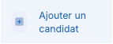
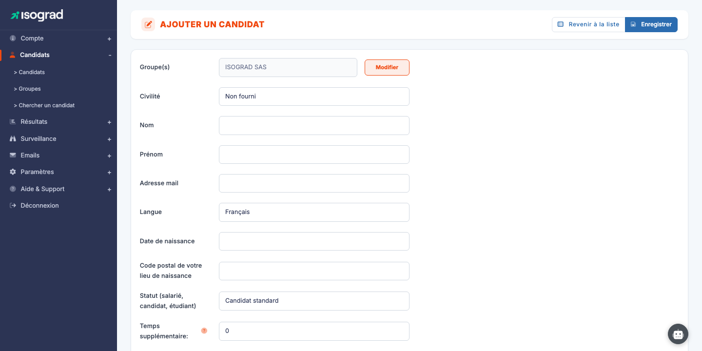
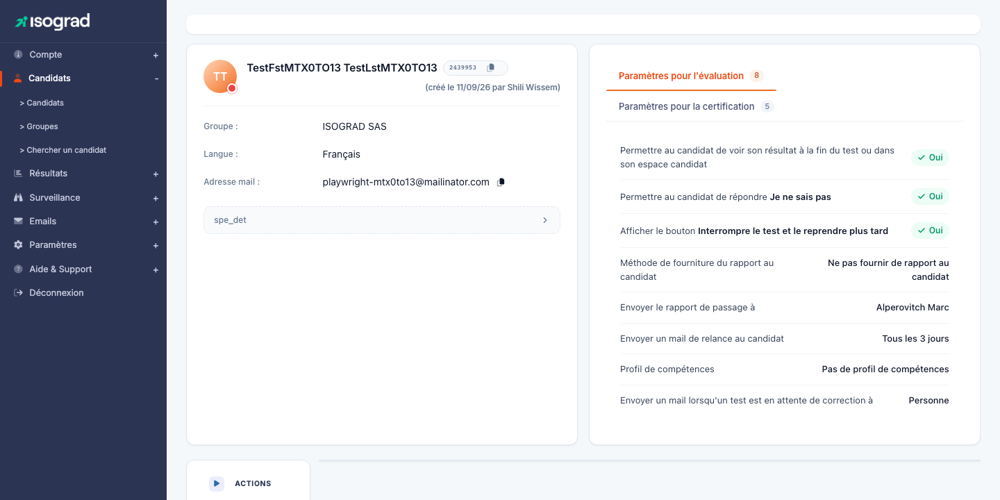
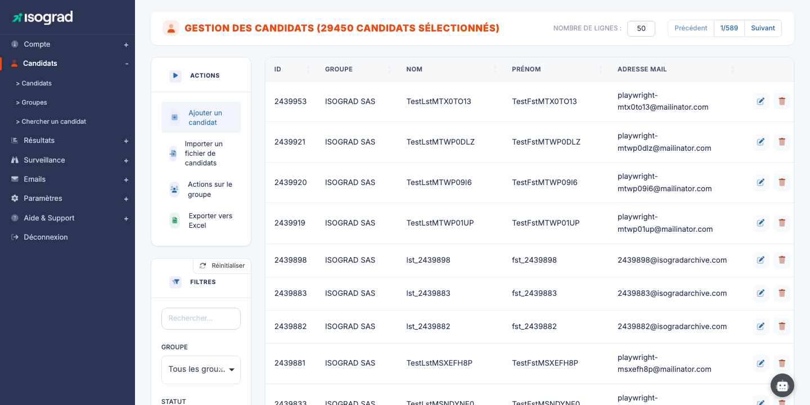
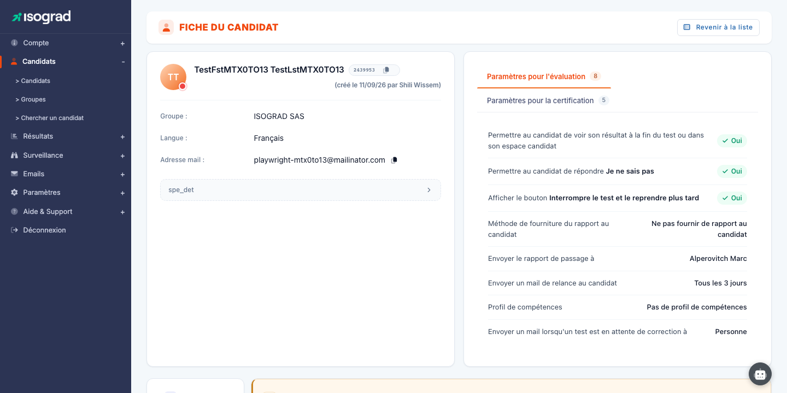
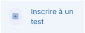
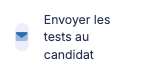
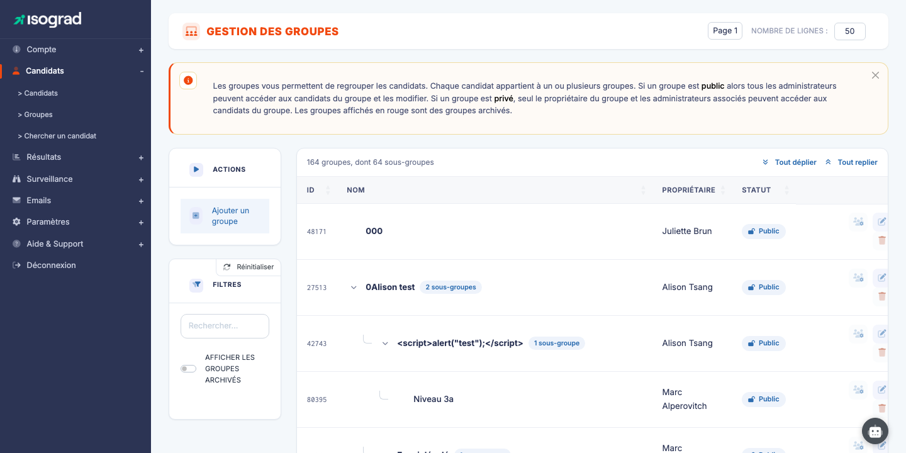

# Gestion des candidats

Ce chapitre couvre l'ensemble du cycle de vie d'un candidat sur la plateforme Tosa : ajouter des candidats individuellement ou par lot, les inscrire à des tests, leur envoyer des invitations et organiser votre population en groupes.

La page **Gestion des candidats** se présente sous la forme d'un tableau listant l'ensemble de vos candidats. Les filtres en haut de page permettent de restreindre l'affichage (recherche libre, appartenance à un groupe ou sous-groupe, candidats ayant un test à passer, affichage du statut de connexion, inclusion des archivés). Les actions principales — ajouter un candidat, importer un fichier, appliquer une action de groupe, exporter vers Excel — se trouvent dans la barre d'actions en haut du tableau.

## Ajouter un candidat {#ajouter-un-candidat}

Cette procédure permet de créer un candidat individuellement. Pour ajouter plusieurs candidats en une seule opération, reportez-vous à la section [Importer des candidats](#importer-des-candidats).

### Procédure

1. Depuis la page **Gestion des candidats**, repérez le bouton **Ajouter un candidat** dans la barre d'actions en haut du tableau.

    

2. Cliquez sur **Ajouter un candidat**. Le formulaire de saisie s'ouvre.

    

3. Remplissez les champs obligatoires :

    - **Prénom** — prénom du candidat tel qu'il apparaîtra sur les attestations.
    - **Nom** — nom du candidat.
    - **Email** — adresse à laquelle le candidat recevra ses invitations et accédera à son espace.
    - **Pays** — utilisé pour adapter la langue par défaut des emails.

4. Cliquez sur **Enregistrer**. Le candidat est créé et vous êtes automatiquement redirigé vers sa fiche d'inscription aux tests.

    

À partir de cette fiche, vous pouvez immédiatement [inscrire le candidat à un test](#inscrire-un-candidat-a-un-test) ou [lui envoyer une invitation](#envoyer-les-invitations).

> 💡 **Modification ultérieure** — Pour modifier les coordonnées d'un candidat existant, retournez sur la liste des candidats, cliquez sur l'icône **Modifier** au bout de la ligne, puis sur l'onglet **Détails du candidat**.

## Importer des candidats {#importer-des-candidats}

L'import de candidats vous permet de créer plusieurs candidats — voire de les pré-inscrire à des tests — en une seule opération, à partir d'un fichier Excel.

### Procédure

1. Depuis la page **Gestion des candidats**, repérez le bouton **Importer un fichier de candidats** dans la barre d'actions.

    

2. Avant de préparer votre fichier, téléchargez le **modèle de fichier** depuis le lien proposé. Le modèle contient les en-têtes attendus et un exemple de ligne.

3. Remplissez le modèle avec vos candidats. Les colonnes principales :

    | Colonne | Obligatoire | Description |
    |---|---|---|
    | Prénom | Oui | Prénom du candidat. |
    | Nom | Oui | Nom du candidat. |
    | Email | Oui | Une adresse email unique par candidat. |
    | Pays | Non | Code pays (FR, BE, …) pour la langue par défaut. |
    | Groupe | Non | Nom d'un groupe auquel rattacher le candidat. Créé automatiquement s'il n'existe pas. |
    | Test | Non | Nom du sujet auquel inscrire le candidat directement à l'import. |

4. Cliquez sur **Importer un fichier de candidats**, sélectionnez votre fichier, et validez.

    

5. La plateforme affiche un rapport d'import : nombre de candidats créés, mis à jour, ou rejetés (avec le motif de rejet ligne par ligne).

> ⚠️ **Doublons d'email** — Si un candidat existe déjà avec la même adresse email, ses informations sont **mises à jour** plutôt que recréées. Un nouvel enregistrement n'est jamais créé pour une adresse existante.

> 💡 **Import et invitations** — L'import ne déclenche **pas** automatiquement l'envoi d'invitations. Pour envoyer les emails de connexion après import, reportez-vous à la section [Envoyer les invitations](#envoyer-les-invitations).

## Inscrire un candidat à un test {#inscrire-un-candidat-a-un-test}

Une fois le candidat créé, vous devez l'inscrire à un ou plusieurs tests pour qu'il puisse les passer.

### Inscrire un candidat depuis sa fiche

1. Depuis la liste des candidats, cliquez sur l'icône **Modifier** de la ligne correspondante. Vous arrivez sur la page d'inscription aux tests du candidat.

    

2. Cliquez sur **Ajouter un test**.

    

3. Dans la fenêtre qui s'ouvre, choisissez le **sujet** (matière) à évaluer, puis paramétrez l'inscription :

    - **Type de test** — évaluation, certification, etc., selon les packs disponibles sur votre compte.
    - **Langue** — langue dans laquelle le test sera présenté au candidat.
    - **Date limite** (facultatif) — au-delà de cette date, le candidat ne pourra plus démarrer le test.
    - **Surveillance** (facultatif) — active la session surveillée si votre compte dispose de l'option.

4. Validez. Le test apparaît immédiatement dans le tableau d'inscriptions du candidat.

### Inscrire plusieurs candidats à la fois

Pour inscrire plusieurs candidats au même test, utilisez une action de groupe depuis la page **Gestion des candidats** :

1. Filtrez le tableau sur un **groupe** (et, le cas échéant, un sous-groupe) et laissez le champ de recherche vide. Le bouton **Actions de groupe** devient alors un menu ; sans groupe sélectionné, il rappelle simplement qu'un groupe doit d'abord être choisi.
2. Si tous les candidats du groupe tiennent sur une seule page, une case à cocher apparaît en début de ligne, cochée par défaut : décochez les candidats à exclure (la case d'en-tête coche ou décoche tout). Si le groupe s'étend sur plusieurs pages, l'action s'applique à l'ensemble du groupe.
3. Dans le menu **Actions de groupe**, choisissez **Inscrire tous les candidats du groupe à un test**.
4. Renseignez les paramètres du test (sujet, langue, session, profil de surveillance) ; ils s'appliquent à l'ensemble de la sélection. Cliquez sur **Inscrire** pour enchaîner une autre inscription, ou sur **Inscrire et fermer**.

> 💡 **Candidats déjà inscrits** — Si certains candidats de la sélection sont déjà inscrits à ce test, la plateforme vous le signale et vous propose soit de les réinscrire tous, soit de n'inscrire que ceux qui ne le sont pas encore.

> 💡 **Crédits** — Chaque inscription consomme un crédit du pack correspondant. Le solde restant est visible en haut de page. Pour racheter des crédits, contactez votre interlocuteur Isograd.

## Envoyer les invitations {#envoyer-les-invitations}

L'envoi d'invitation par email transmet au candidat son lien de connexion personnalisé. C'est l'étape qui rend le test accessible côté candidat.

### Envoyer une invitation à un seul candidat

1. Ouvrez la fiche du candidat (depuis la liste, cliquez sur l'icône **Modifier**).

    

2. Cliquez sur **Envoyer l'email d'inscription** (ou le bouton équivalent visible dans la fiche).

3. Une fenêtre vous permet de :

    - Choisir le **modèle d'email** (langue, ton, signature) parmi ceux configurés pour votre compte.
    - **Prévisualiser** le contenu qui sera envoyé.
    - **Personnaliser** l'objet ou le corps si besoin, avant envoi.

4. Cliquez sur **Envoyer**. Le candidat reçoit immédiatement son email contenant le lien de connexion.

### Envoyer des invitations en masse

Depuis la page **Gestion des candidats** :

1. Filtrez le tableau sur le groupe voulu et, si les cases à cocher sont affichées, ne laissez cochés que les candidats à inviter (voir [Inscrire plusieurs candidats à la fois](#inscrire-un-candidat-a-un-test)).
2. Dans le menu **Actions de groupe**, choisissez **Envoyer les emails d'inscription à tous les candidats du groupe**.
3. Choisissez le modèle d'email, vérifiez l'objet et l'aperçu du message, puis cliquez sur **Envoyer**. Une confirmation rappelle le nombre d'emails qui vont partir et le groupe concerné.

Chaque candidat reçoit l'invitation avec son lien personnel. Lorsque l'action porte sur le groupe entier, seuls les candidats ayant encore un test à passer sont destinataires.

> ⚠️ **Adresses invalides** — Si l'adresse email d'un candidat est invalide ou refusée par le serveur de destination, vous le verrez dans le rapport d'envoi. Corrigez l'adresse sur la fiche du candidat puis relancez l'envoi.

> 💡 **Personnaliser les modèles d'email** — Les modèles d'email sont gérés dans le chapitre **Gestion des mails** (à venir). Vous pouvez y créer des variantes par langue, par marque, ou par type de test.

## Gérer les groupes {#gerer-les-groupes}

Les groupes vous permettent d'organiser votre population de candidats (par promotion, service, client, formation…) pour faciliter les actions en masse : inscriptions, invitations, suivi des résultats.

### Accéder aux groupes

Depuis le menu de navigation, cliquez sur **Groupes**.

La page **Gestion des groupes** affiche l'ensemble de vos groupes sous forme hiérarchique. Un groupe peut contenir des sous-groupes — utile par exemple pour structurer "Promotion 2026 → Section A → Cours du soir".

### Créer un groupe

1. Cliquez sur **Ajouter un groupe** dans la barre d'actions.
2. Renseignez :

    - **Nom** du groupe.
    - **Groupe parent** (facultatif) — pour créer une hiérarchie.
    - **Couleur** ou tag (selon votre version) — pour repérer visuellement le groupe.

3. Validez.

### Ajouter un candidat à un groupe

Deux méthodes :

- **Depuis la fiche du candidat** : ouvrez la fiche, onglet **Groupes**, ajoutez le candidat aux groupes voulus.
- **Action de groupe** sur la liste des candidats : filtrez sur le groupe d'origine, sélectionnez les candidats, puis **Ajouter un groupe aux candidats du groupe**. Les candidats rejoignent le ou les groupes choisis sans quitter leur groupe actuel.

### Actions de groupe

Une fois vos candidats organisés en groupes, le filtre **Groupe** de la page **Gestion des candidats** vous permet d'isoler une population et de lui appliquer une action en masse via le menu **Actions de groupe** (le fonctionnement de la sélection est décrit dans [Inscrire plusieurs candidats à la fois](#inscrire-un-candidat-a-un-test)) :

- **Attribuer un mot de passe temporaire** — le même mot de passe pour toute la sélection ; chaque candidat devra le changer à sa prochaine connexion.
- **Inscrire à un test**.
- **Envoyer les emails d'inscription**.
- **Supprimer les tests non commencés** — choisissez le test concerné parmi ceux encore en attente dans la sélection.
- **Supprimer les candidats**.
- **Ajouter un groupe aux candidats** — sans les retirer de leur groupe actuel.
- **Assigner une session ou un profil de surveillance à un test** — pour un test en attente, choisissez la session et, si besoin, le profil de surveillance.
- **Définir les options d'évaluation** et **Définir les options de certification** — affichage des résultats au candidat, livraison des rapports, envoi des diplômes et destinataires, appliqués à toute la sélection. Chaque entrée n'apparaît que si votre compte dispose du type de pack correspondant.
- **Générer des badges** — émission des badges numériques Credly pour les certifications éligibles de la sélection.

> 💡 **Archivage vs suppression** — L'**archivage** d'un groupe se fait depuis la page **Gestion des groupes** et est non destructif : il masque le groupe et ses candidats des listes par défaut, mais préserve l'historique des tests passés. La **suppression** des candidats est définitive — utilisez-la uniquement pour les candidats créés par erreur.

