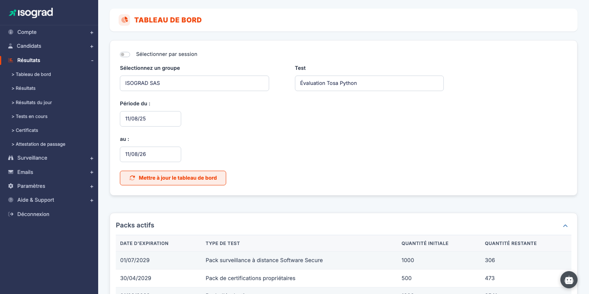
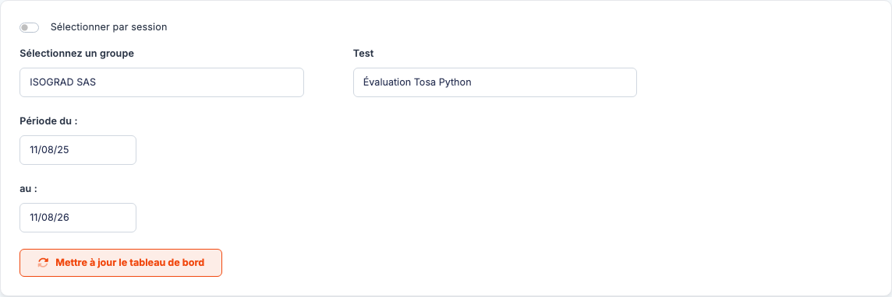
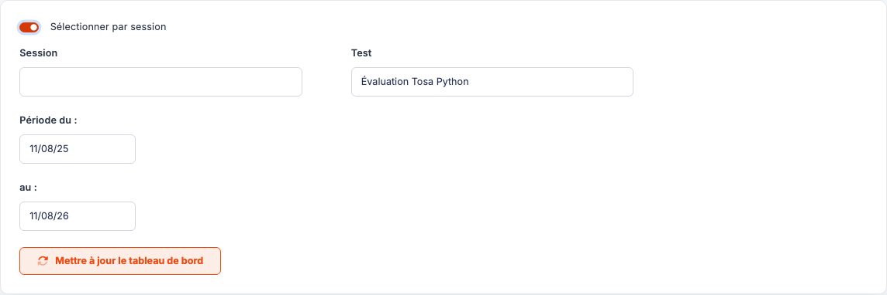
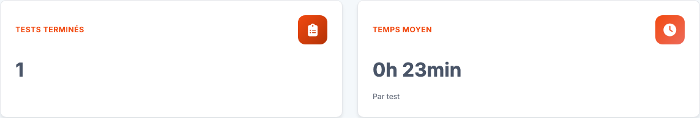
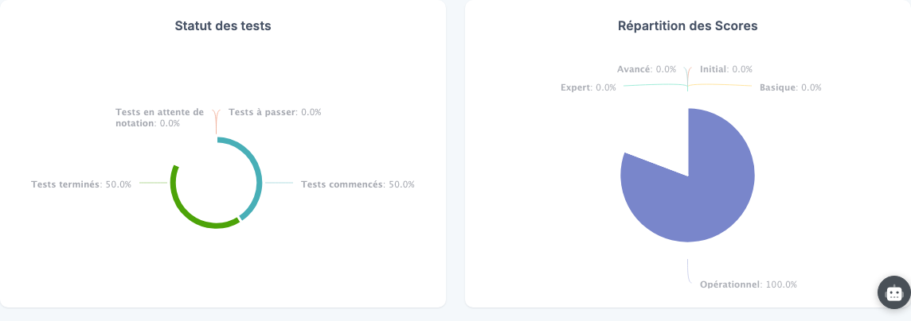
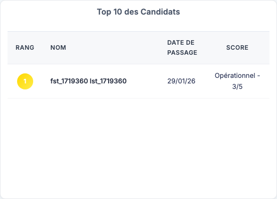
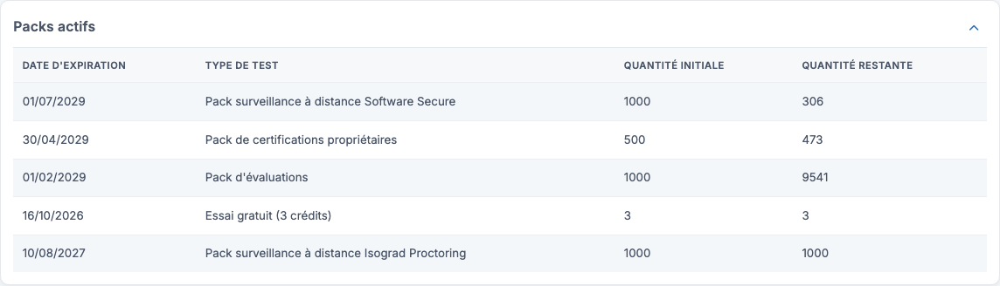

# Tableau de bord

Le **Tableau de bord** offre une vue synthétique de l'activité d'un groupe ou d'une session sur **une évaluation donnée** : nombre de tests terminés, temps moyen de passage, répartition par statut et par niveau de score, meilleurs candidats et état de vos packs de crédits. C'est la page idéale pour suivre une campagne de tests d'un coup d'œil, avant de plonger dans le détail via la page [Résultats](/ai/fr/results/).

Accédez à cette page via le menu **Résultats → Tableau de bord**.

> 💡 **Seuls les tests terminés alimentent les métriques.** Si le groupe, la session ou la période sélectionnés ne contiennent aucun test terminé, la page affiche un message vous invitant à modifier les filtres.

## Filtres du tableau de bord {#filtres-du-tableau-de-bord}

Le panneau en haut de page détermine ce que le tableau de bord agrège :

- **Sélectionner par session** (commutateur) — bascule entre la sélection par groupe et la sélection par session (voir [Sélection par session](#selection-par-session)).
- **Sélectionnez un groupe** — le groupe de candidats à analyser. Si le groupe a des sous-groupes, un sélecteur de **sous-groupe** apparaît pour affiner la sélection.
- **Test** — l'évaluation à analyser. La liste se met à jour automatiquement à chaque changement de groupe, de sous-groupe ou de session : elle ne propose que les tests réellement passés par la population sélectionnée.
- **Période du / au** — l'intervalle de dates de passage pris en compte (par défaut : les douze derniers mois).

Cliquez sur **Mettre à jour le tableau de bord** pour appliquer les filtres et recharger les métriques.

> 💡 Vos filtres sont mémorisés : en revenant sur la page, vous retrouvez votre dernière sélection.

## Sélection par session {#selection-par-session}

Si votre compte utilise les [sessions de passage](/ai/fr/sessions/), activez le commutateur **Sélectionner par session** : le sélecteur de groupe laisse place à un sélecteur de **session**, et la liste des tests se recharge avec les évaluations passées dans la session choisie.

Ce mode est pratique pour faire le bilan d'une session d'examen précise (une date, une salle) plutôt que d'un groupe entier.

## Métriques et graphiques {#metriques-et-graphiques}

Une fois les filtres appliqués, le tableau de bord affiche :

- **Tests terminés** — le nombre de passages terminés sur la sélection.
- **Temps moyen** — la durée moyenne d'un passage. Cette carte n'est renseignée que si le temps de passage est mesurable pour l'évaluation sélectionnée (tests chronométrés ou sans navigation libre).

- **Statut des tests** — la répartition de tous les tests de la sélection entre *à passer*, *commencés*, *terminés* et *en attente de notation*.
- **Répartition des scores** — la distribution des tests terminés par niveau de score (par exemple Initial, Basique, Opérationnel, Avancé, Expert pour les évaluations Tosa).

Selon l'évaluation et les options de votre compte, des blocs supplémentaires peuvent apparaître : un graphique de **suivi des invitations** (emails envoyés, relances, candidats jamais invités) et un tableau du **taux de succès par question**.

## Top 10 des candidats {#top-10-des-candidats}

Le tableau **Top 10** classe les dix meilleurs candidats de la sélection — pour chaque candidat, seul son **meilleur score** est retenu :

| Colonne | Contenu |
|---|---|
| **Rang** | Position dans le classement (les trois premiers sont mis en couleur). |
| **Nom** | Identité du candidat. |
| **Date du test** | Date du passage correspondant au meilleur score. |
| **Score** | Le meilleur score obtenu sur l'évaluation sélectionnée. |

## Packs actifs {#packs-actifs}

En haut du tableau de bord, le bloc **Packs actifs** récapitule l'état de vos crédits — le même détail que dans [Gestion de votre compte](/ai/fr/account/) :

Pour chaque pack : la **date d'expiration**, le **type de test**, la **quantité initiale** et la **quantité restante**. Les packs expirés apparaissent grisés. Le bloc peut être replié via la flèche en haut à droite.
