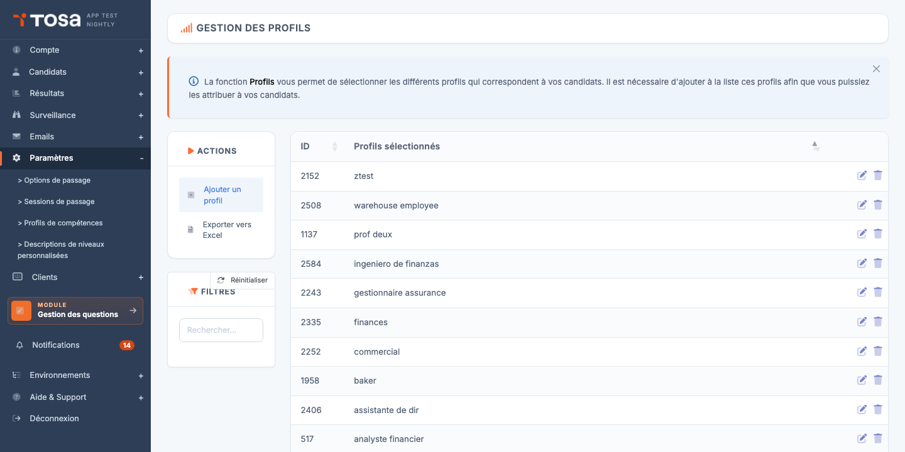
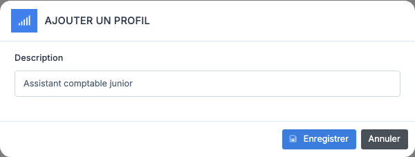
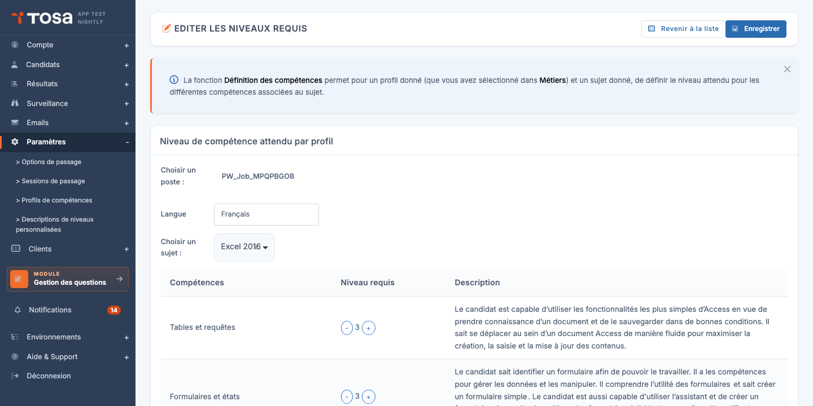
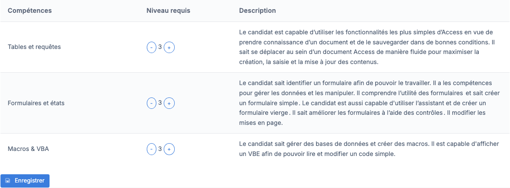
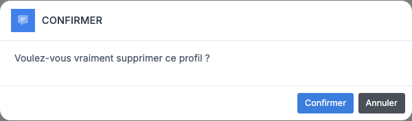

# Profils de compétences

Un **profil de compétences** (parfois appelé « profil métier ») est un référentiel attendu : pour un métier donné (par exemple *Assistant administratif*, *Comptable junior*, *Chef de projet*), vous définissez **le niveau de maîtrise attendu sur chaque compétence évaluée** par les sujets Tosa. Les résultats d'un candidat peuvent ensuite être **comparés** à ce profil pour visualiser, compétence par compétence, l'écart entre l'attendu et l'observé.

La page **Gestion des profils** liste l'ensemble des profils définis sur votre compte. Chaque ligne indique l'**identifiant** et la **description** (le nom du profil). Le bouton **Ajouter un profil** crée un nouveau profil et le bouton **crayon** ouvre la page de configuration des niveaux attendus.

> 💡 **À quoi cela sert concrètement ?** — Une fois un profil défini, vous pouvez l'attribuer à un candidat (ou à un groupe). Lorsque le candidat passe ses tests, le rapport généré compare automatiquement ses scores aux niveaux attendus par le profil, et met en évidence les compétences sous le seuil. C'est l'outil de référence pour les démarches **GPEC** ou de **gestion des compétences** en entreprise.

## Créer un profil {#creer-un-profil}

1. Depuis la page **Gestion des profils**, cliquez sur **Ajouter un profil** dans la barre d'actions.

    

2. Saisissez la **description** du profil — c'est le nom qui apparaîtra dans la liste et qui sera utilisé pour l'attribution aux candidats. Choisissez un libellé parlant (« Assistant comptable junior », « Développeur web frontend »).

3. Cliquez sur **Enregistrer**. Le profil est créé et vous êtes automatiquement redirigé vers sa page de configuration des niveaux attendus — voir [Définir les niveaux requis](#definir-les-niveaux-requis).

## Définir les niveaux requis {#definir-les-niveaux-requis}

C'est l'étape centrale : pour chaque combinaison **profil × langue × sujet**, vous précisez le niveau attendu sur chacune des compétences (« domaines ») évaluées par le sujet.

La page **Editer les niveaux requis** est organisée en deux zones :

1. **Bandeau de sélection** :
    - **Choisir un poste** — le profil en cours d'édition (lecture seule ; pour éditer un autre profil, retournez à la liste).
    - **Langue** — si le sujet est disponible dans plusieurs langues, vous choisissez celle dont vous voulez voir les compétences. Chaque langue est paramétrée indépendamment.
    - **Choisir un sujet** — la matière à paramétrer (Word, Excel, Python, Anglais, etc.).
2. **Carte « Niveau de compétence attendu par profil »** — le tableau des compétences à configurer pour le sujet sélectionné.

### Lecture du tableau des compétences

Le tableau présente **trois colonnes** :

- **Compétences** — nom du domaine de compétence évalué (par exemple *Tables et requêtes*, *Formulaires et états*, *Fonctions de calcul*).
- **Niveau requis** — un chiffre (de 0 à 5 selon les sujets) entouré de deux boutons **−** et **+**. C'est le niveau attendu pour ce profil sur cette compétence.
- **Description** — descriptif des compétences évaluées à ce niveau précis. Le texte se met à jour automatiquement quand vous changez le niveau, ce qui vous aide à calibrer le seuil souhaité.

Pour ajuster un niveau, cliquez sur **+** pour augmenter ou **−** pour diminuer. La description correspondante s'affiche en temps réel à droite.

### Sauvegarder

Une fois le tableau ajusté, cliquez sur **Enregistrer** au pied du tableau pour persister la configuration. La sauvegarde s'applique au **sujet et à la langue actuellement sélectionnés**.

> 💡 **Travailler sur plusieurs sujets** — Pour configurer le même profil sur plusieurs sujets, **enregistrez systématiquement avant de changer de sujet**. Changer de sujet sans avoir enregistré perdrait vos modifications.

> ⚠️ **Sujets sans compétences** — Certains sujets ne sont pas découpés en compétences (par exemple, certains tests historiques ou tests à question unique). Si vous voyez le message *« Il n'y a pas de liste de compétence pour ce sujet. »*, choisissez un autre sujet ; ce sujet n'est pas paramétrable par profil.

## Modifier un profil existant {#modifier-un-profil}

1. Sur la page **Gestion des profils**, repérez la ligne du profil et cliquez sur l'icône **Modifier** (crayon).
2. Vous arrivez sur la page **Niveau de compétence attendu par profil**. Ajustez les niveaux sur chaque sujet (voir [Définir les niveaux requis](#definir-les-niveaux-requis)).
3. Pour modifier le **nom** du profil (sa description), vous devrez le recréer : la description n'est pas modifiable directement après création.

## Supprimer un profil {#supprimer-un-profil}

1. Sur la ligne du profil, cliquez sur l'icône **Supprimer** (poubelle).
2. Une fenêtre de confirmation s'affiche.

    

3. Validez. Le profil est supprimé.

### Profil déjà attribué à des candidats

Si le profil a déjà été attribué à au moins un candidat (ou si des niveaux de compétence sont définis dessus), la fenêtre de confirmation **affiche un avertissement** :

- *« Ce profil a été attribué à des candidats et vous avez défini des niveaux de compétence pour ce profil. Supprimer tout de même ? »*

La suppression reste possible — elle décroche simplement le profil des candidats concernés. Leurs résultats historiques ne sont pas affectés, mais les comparaisons futures ne pourront plus utiliser ce profil. Validez si vous souhaitez nettoyer, ou annulez si vous voulez d'abord transférer les candidats vers un autre profil.

> 💡 **Bonne pratique** — Avant de supprimer un profil utilisé, créez son **remplaçant** et **réattribuez** les candidats au nouveau profil. Cela évite que l'historique des candidats référence un profil qui n'existe plus.
