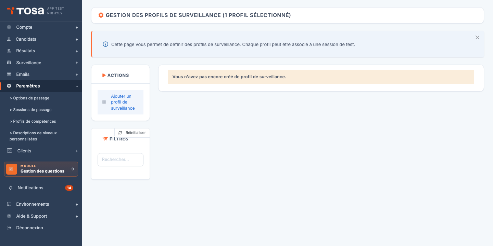
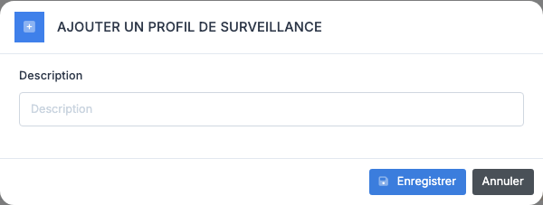
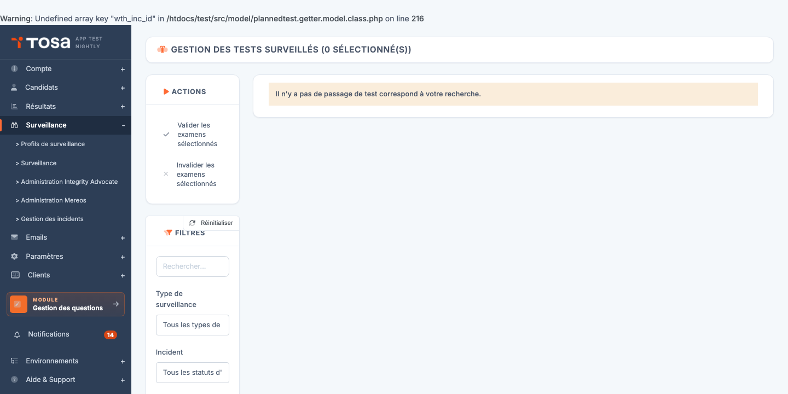

# Surveillance des tests

La **surveillance à distance** (« proctoring ») permet de garantir l'intégrité d'un test passé à distance, sans surveillant physique en présentiel. La plateforme propose plusieurs niveaux de surveillance — du plein écran obligatoire jusqu'à l'enregistrement vidéo et audio — et la revue *a posteriori* des incidents détectés.

Ce chapitre couvre deux pages complémentaires :

- **[Profils de surveillance](#profils-de-surveillance)** — configurez **comment** vos tests sont surveillés (quelles vérifications, quels enregistrements).
- **[Gestion des tests surveillés](#gestion-des-tests-surveilles)** — examinez **les passages** déjà effectués et validez ou invalidez chaque test à partir des éléments collectés.

> 💡 **Disponibilité** — La surveillance à distance est une option du compte. Si vous ne voyez pas les pages décrites ici dans le menu, contactez votre interlocuteur Isograd pour activer la fonctionnalité.

## Profils de surveillance {#profils-de-surveillance}

Un **profil de surveillance** est un jeu de réglages qui détermine ce que la plateforme vérifie et enregistre pendant le test. Vous pouvez créer plusieurs profils (par exemple, *« Examen léger »* vs *« Certification stricte »*) et les **associer à des [sessions de passage](/ai/sessions/)** pour appliquer le bon niveau de contrôle au bon contexte.

Accédez à cette page via le menu **Surveillance → Profils de surveillance**, ou directement à `/clientadmin/parameters/AdminProctoringParametersWithTable`.

La page liste vos profils existants. Si votre compte est neuf et n'a encore aucun profil défini, vous verrez simplement *« Vous n'avez pas encore créé de profil de surveillance. »*. Chaque ligne indique le **nom** du profil et un repère **Par défaut** pour le profil utilisé quand aucun n'est explicitement choisi.

### Créer un profil de surveillance

La création se fait en **deux étapes** : nommer le profil, puis configurer ses options sur une page dédiée.

#### Étape 1 — Nommer le profil

1. Cliquez sur **Ajouter un profil de surveillance** dans la barre d'actions.

    

2. Renseignez la **Description** du profil — c'est le libellé qui apparaîtra dans la liste et dans les sessions de passage. Choisissez un nom parlant comme « Certification stricte » ou « Examen interne léger ».

3. Cliquez sur **Enregistrer**. La plateforme crée le profil et vous redirige vers sa page de configuration.

#### Étape 2 — Configurer les options de surveillance

Sur la page d'édition du profil, cochez les **options de surveillance** souhaitées :

| Option | Effet |
|---|---|
| **Demander un document d'identité** | Le candidat doit photographier sa pièce d'identité avant de démarrer. La photo est consultable a posteriori dans la revue. |
| **Forcer le plein écran** | Le test ne peut être passé qu'en mode plein écran. Une sortie du plein écran génère un incident. |
| **Enregistrer la vidéo** | La webcam du candidat est enregistrée pendant tout le test. La vidéo est consultable à la revue. |
| **Enregistrer l'audio** | Le micro du candidat est enregistré (utile pour détecter une présence parlante). |
| **Prendre des captures régulières** | Captures d'écran périodiques de l'écran et de la webcam pendant le test. |
| **Effectuer un scan de la pièce** | Avant le test, le candidat fait un tour à 360° de sa pièce avec sa webcam pour montrer qu'il est seul et que son poste de travail est conforme. |

Cliquez sur **Enregistrer** pour persister la configuration. Le profil est immédiatement utilisable dans les [sessions de passage](/ai/sessions/).

### Définir un profil par défaut

Le profil **par défaut** est appliqué automatiquement à tous les tests surveillés pour lesquels aucun profil n'est explicitement choisi (notamment via les sessions de passage).

1. Sur la ligne du profil, cliquez sur **Définir comme profil de surveillance par défaut**.
2. Confirmez. L'étiquette **Par défaut** se déplace vers ce profil ; l'ancien profil par défaut reste actif mais n'est plus appliqué automatiquement.

### Modifier un profil

1. Sur la ligne du profil, cliquez sur l'icône **Modifier** (crayon).
2. Ajustez les options.
3. **Enregistrer**.

> ⚠️ **Effet sur les tests en cours** — La modification d'un profil **n'affecte pas** les tests déjà démarrés ou terminés : seuls les **futurs** tests qui utiliseront ce profil auront les nouvelles options. Les enregistrements existants restent ceux du profil au moment du démarrage.

### Supprimer un profil

1. Sur la ligne du profil, cliquez sur l'icône **Supprimer**.
2. Confirmez.

> ⚠️ **Profil utilisé** — Un profil utilisé dans **au moins une session de passage** ne peut pas être supprimé. Le message *« Ce profil de surveillance ne peut pas être supprimé car il est utilisé dans au moins un test. »* s'affiche dans ce cas. Détachez d'abord le profil des sessions concernées.

## Gestion des tests surveillés {#gestion-des-tests-surveilles}

Une fois vos tests passés sous surveillance, cette page vous permet de **revoir les incidents détectés** et de **valider ou invalider** chaque passage en fonction de la conformité observée.

Accédez à cette page via le menu **Surveillance**, ou directement à `/clientadmin/clientresult/AdminProctoringReviewWithTable`.

Chaque ligne du tableau représente **un test passé sous surveillance** :

| Colonne | Contenu |
|---|---|
| **ID** | Identifiant interne de l'inscription. |
| **Nom complet** | Identité du candidat. |
| **Test** | Nom du sujet passé. |
| **Date de passage** | Date et heure du passage. |
| **Type de surveillance** | Profil de surveillance utilisé (vidéo, plein écran, etc.). |
| **Statut de validation** | État actuel — **En attente**, **Validé**, **Non valide**. |
| **Incident** | Nombre et nature des incidents détectés automatiquement. |

### Filtres

Le panneau de filtres permet de cibler :

- **Type de surveillance** — restreindre par profil utilisé.
- **Statut de validation** — par exemple ne voir que les tests **En attente** de revue.
- **Incident** — par exemple ne voir que les tests ayant déclenché un incident **Sortie de plein écran**.

### Examiner un test surveillé

Les boutons d'action en bout de ligne dépendent du type de surveillance et du statut :

- **Afficher les photos prises pendant le test** (icône caméra) — ouvre une galerie des captures d'écran et de webcam prises périodiquement. Le commutateur **Afficher uniquement les images suspectes** filtre les captures où une IA a détecté une anomalie (présence d'une autre personne, regard hors écran, etc.).

    

- **Afficher la pièce d'identité** (icône silhouette) — affiche la photo de la pièce d'identité fournie par le candidat au démarrage.
- **Commentaire de revue du protocole** (icône loupe) — pour les tests avec **incident**, cette fenêtre détaille chaque incident, sa nature, et offre un champ pour saisir l'explication du surveillant ou pour demander des informations au candidat.

### Valider ou invalider un test

Une fois la revue effectuée, vous tranchez :

- **Valider** (icône ✓ verte) — le test est conforme. Le résultat du candidat est officialisé et les diplômes/rapports sont émis.
- **Invalider** (icône ✗ rouge) — le test n'est pas conforme (triche détectée, condition non respectée). Le résultat est marqué invalide ; aucun diplôme n'est émis.

Pour une **action en masse**, sélectionnez plusieurs tests via les cases en début de ligne, puis utilisez les boutons **Valider les examens sélectionnés** ou **Invalider les examens sélectionnés** dans la barre d'actions.

### Statuts de validation

| Statut | Signification |
|---|---|
| **En attente de détails** | Un incident a été détecté (par exemple, sortie du plein écran) mais aucune explication n'a encore été fournie. Vous devez détailler les raisons, ou demander au candidat de le faire. |
| **Détail en cours de validation** | Une explication a été saisie et est en attente d'examen par l'équipe Isograd (pour les certifications). |
| **Explication validée** | L'équipe Isograd a validé l'explication ; le test est conforme. |
| **Validé** | Le test a été validé par un administrateur du compte. |
| **Non valide** | Le test a été invalidé par un administrateur du compte. |

### Demander des explications au candidat

Pour les certifications avec incident, vous pouvez demander au candidat de **justifier l'incident** :

1. Sur la ligne, cliquez sur l'icône **Envoyer une demande de pièce d'identité** (ou l'équivalent pour un incident).
2. Le candidat reçoit un email l'invitant à fournir l'explication dans son espace.
3. Une fois sa réponse soumise, le statut passe à **Détail en cours de validation** et vous pouvez la consulter dans la fenêtre **Commentaire de revue du protocole**.

> 💡 **Bonnes pratiques de validation** — Pour les certifications officielles, soyez exigeant sur les incidents (sortie de plein écran > 60 secondes, présence d'une seconde personne sur les captures). Pour les évaluations internes en entreprise, vous pouvez être plus souple — la surveillance reste un outil dissuasif autant que punitif.

## Activer la surveillance sur un test {#activer-surveillance}

La surveillance ne s'active **pas** à la pièce sur cette page : elle est décidée **au moment de l'inscription** d'un candidat à un test. Pour activer la surveillance sur un test :

1. Inscrivez le candidat au test (voir [Inscrire un candidat à un test](/ai/candidates/#inscrire-un-candidat-a-un-test)).
2. Dans la fenêtre d'inscription, activez l'option **Surveillance à distance**.
3. Si vous voulez appliquer un profil de surveillance précis, associez le candidat à une [session de passage](/ai/sessions/) à laquelle ce profil est rattaché.

À défaut, le **profil par défaut** s'applique automatiquement.
