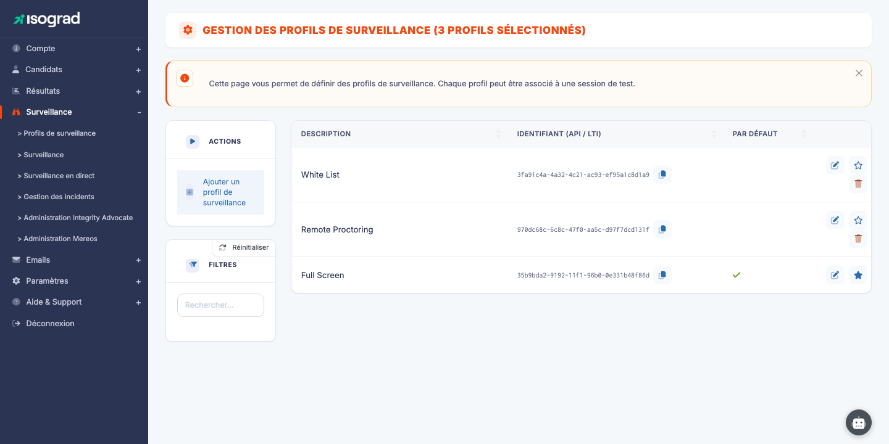
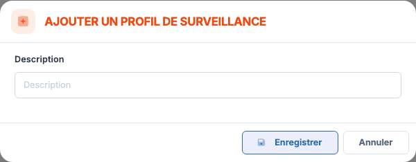
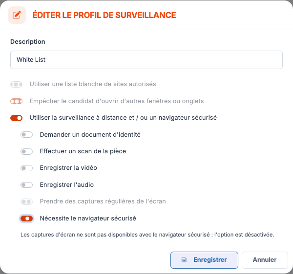
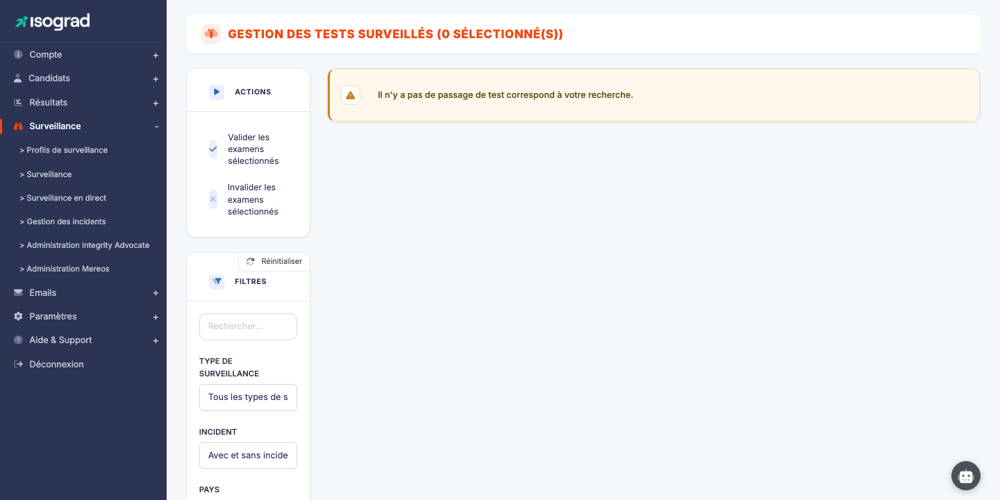
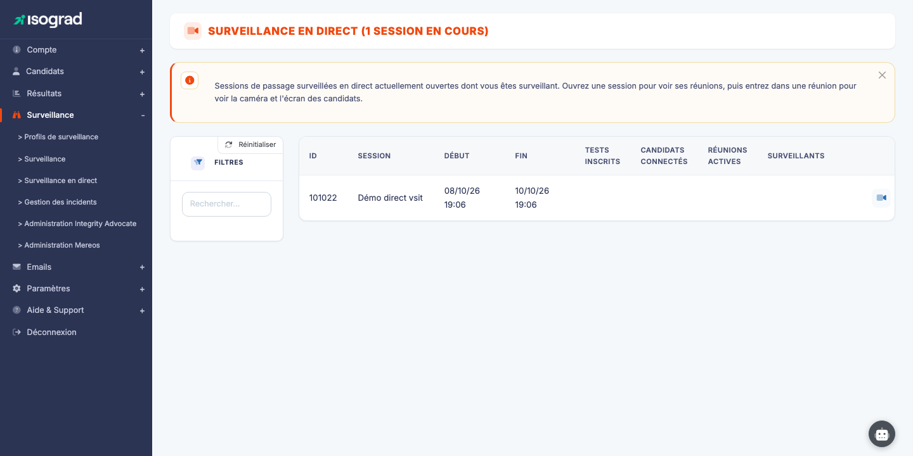
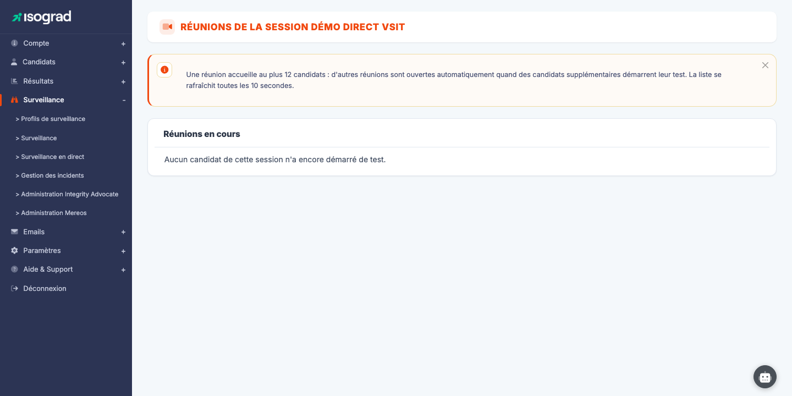

# Surveillance des tests

La **surveillance à distance** (« proctoring ») permet de garantir l'intégrité d'un test passé à distance, sans surveillant physique en présentiel. La plateforme propose plusieurs niveaux de surveillance — du plein écran obligatoire jusqu'à l'enregistrement vidéo et audio — et la revue *a posteriori* des incidents détectés.

Ce chapitre couvre trois pages complémentaires :

- **[Profils de surveillance](#profils-de-surveillance)** — configurez **comment** vos tests sont surveillés (quelles vérifications, quels enregistrements).
- **[Gestion des tests surveillés](#gestion-des-tests-surveilles)** — examinez **les passages** déjà effectués et validez ou invalidez chaque test à partir des éléments collectés.
- **[Surveillance en direct](#surveillance-en-direct)** — suivez **en temps réel** la caméra et l'écran des candidats d'une session de passage.

> 💡 **Disponibilité** — La surveillance à distance est une option du compte. Si vous ne voyez pas les pages décrites ici dans le menu, contactez votre interlocuteur Isograd pour activer la fonctionnalité.

## Profils de surveillance {#profils-de-surveillance}

Un **profil de surveillance** est un jeu de réglages qui détermine ce que la plateforme vérifie et enregistre pendant le test. Vous pouvez créer plusieurs profils (par exemple, *« Examen léger »* vs *« Certification stricte »*) et les **associer à des [sessions de passage](/ai/fr/sessions/)** pour appliquer le bon niveau de contrôle au bon contexte.

Accédez à cette page via le menu **Surveillance → Profils de surveillance**.

La page liste vos profils existants. Si votre compte est neuf et n'a encore aucun profil défini, vous verrez simplement *« Vous n'avez pas encore créé de profil de surveillance. »*. Chaque ligne indique le **nom** du profil et un repère **Par défaut** pour le profil utilisé quand aucun n'est explicitement choisi.

### Créer un profil de surveillance

La création se fait en **deux étapes** : nommer le profil, puis configurer ses options dans la fenêtre d'édition qui s'ouvre automatiquement.

#### Étape 1 — Nommer le profil

1. Cliquez sur **Ajouter un profil de surveillance** dans la barre d'actions.

    

2. Renseignez la **Description** du profil — c'est le libellé qui apparaîtra dans la liste et dans les sessions de passage. Choisissez un nom parlant comme « Certification stricte » ou « Examen interne léger ».

3. Cliquez sur **Enregistrer**. La plateforme crée le profil et ouvre aussitôt la fenêtre d'édition de ses options.

#### Étape 2 — Configurer les options de surveillance

Dans la fenêtre d'édition du profil, cochez les **options de surveillance** souhaitées :

| Option | Effet |
|---|---|
| **Demander un document d'identité** | Le candidat doit photographier sa pièce d'identité avant de démarrer. La photo est consultable a posteriori dans la revue. |
| **Forcer le plein écran** | Le test ne peut être passé qu'en mode plein écran. Une sortie du plein écran génère un incident. |
| **Enregistrer la vidéo** | La webcam du candidat est enregistrée pendant tout le test. La vidéo est consultable à la revue. |
| **Enregistrer l'audio** | Le micro du candidat est enregistré (utile pour détecter une présence parlante). |
| **Prendre des captures régulières de l'écran** | Captures d'écran périodiques de l'écran et de la webcam pendant le test. |
| **Effectuer un scan de la pièce** | Avant le test, le candidat fait un tour à 360° de sa pièce avec sa webcam pour montrer qu'il est seul et que son poste de travail est conforme. |
| **Nécessite le navigateur sécurisé** | Le test ne peut être passé que dans **Safe Exam Browser**, un navigateur d'examen qui verrouille le poste du candidat. Voir [la section dédiée](#navigateur-securise) ci-dessous. |

Cliquez sur **Enregistrer** pour persister la configuration. Le profil est immédiatement utilisable dans les [sessions de passage](/ai/fr/sessions/).

### Le navigateur sécurisé (Safe Exam Browser) {#navigateur-securise}

L'option **Nécessite le navigateur sécurisé** impose le passage du test dans **Safe Exam Browser (SEB)**, un navigateur d'examen gratuit (Windows et macOS) qui verrouille le poste pendant toute la durée du test : le candidat ne peut ni changer d'application, ni ouvrir d'autres sites, ni utiliser le copier-coller vers l'extérieur.

Côté candidat, le parcours est le suivant :

1. Il installe **Safe Exam Browser** une seule fois sur sa machine (le lien de téléchargement lui est proposé au lancement du test).
2. Quand il démarre un test qui exige le navigateur sécurisé, la plateforme lui fait télécharger un **fichier d'examen personnel** (`.seb`). En l'ouvrant, SEB se lance directement sur son test, déjà connecté à son compte.
3. La plateforme vérifie **à chaque page** que le test se déroule bien dans SEB — il est impossible de démarrer dans SEB puis de continuer dans un navigateur classique.
4. À la fin du test, SEB se ferme automatiquement.

Selon le contenu du test, SEB autorise automatiquement ce qui est nécessaire — et uniquement cela : les applications requises par les questions à dépôt de fichier (par exemple **Excel** pour une question de classeur à compléter), ou la navigation vers le site d'exercice pour les tests **WordPress**. Aucune autre application ni aucun autre site ne sont accessibles.

Règles d'interaction avec les autres options du profil :

- Activer le navigateur sécurisé **coche et verrouille « Forcer le plein écran »** (le verrouillage est garanti par SEB lui-même) et **désactive la liste blanche de sites** (le filtrage des sites est intégré au navigateur sécurisé).
- **Captures d'écran** — les captures régulières de l'écran ne sont **pas disponibles** avec le navigateur sécurisé, quel que soit le système : l'option **Prendre des captures régulières de l'écran** est décochée et grisée, et une note l'explique sous les options. L'enregistrement **audio et vidéo** fonctionne normalement.

    

- Décocher **Utiliser la surveillance à distance** remet à zéro toutes ses options, y compris le navigateur sécurisé.

> ⚠️ **Contenus vidéo sous Windows** — Safe Exam Browser pour Windows ne lit pas les vidéos au format MP4/H.264. Si votre test contient des vidéos dans ce format, contactez votre interlocuteur Isograd avant d'activer le navigateur sécurisé.

### Définir un profil par défaut

Le profil **par défaut** est appliqué automatiquement à tous les tests surveillés pour lesquels aucun profil n'est explicitement choisi (notamment via les sessions de passage).

1. Sur la ligne du profil, cliquez sur **Définir comme profil de surveillance par défaut**.
2. Confirmez. L'étiquette **Par défaut** se déplace vers ce profil ; l'ancien profil par défaut reste actif mais n'est plus appliqué automatiquement.

### Modifier un profil

1. Sur la ligne du profil, cliquez sur l'icône **Modifier** (crayon).
2. Ajustez les options.
3. **Enregistrer**.

> ⚠️ **Effet sur les tests en cours** — La modification d'un profil **n'affecte pas** les tests déjà démarrés ou terminés : seuls les **futurs** tests qui utiliseront ce profil auront les nouvelles options. Les enregistrements existants restent ceux du profil au moment du démarrage.

### Supprimer un profil

1. Sur la ligne du profil, cliquez sur l'icône **Supprimer**.
2. Confirmez.

> ⚠️ **Profil utilisé** — Si le profil est associé à des tests, une **seconde confirmation** vous indique leur nombre : après la suppression, ces tests sont considérés comme **non surveillés** (les tests en attente sont recrédités de leur crédit de surveillance). La suppression est **refusée** dans deux cas : si votre compte n'a aucun pack de crédits de surveillance permettant ce recrédit, ou si le profil est utilisé par une [session surveillée en direct](#surveillance-en-direct) qui n'est pas terminée.

## Gestion des tests surveillés {#gestion-des-tests-surveilles}

Une fois vos tests passés sous surveillance, cette page vous permet de **revoir les incidents détectés** et de **valider ou invalider** chaque passage en fonction de la conformité observée.

Accédez à cette page via le menu **Surveillance**.

Chaque ligne du tableau représente **un test passé sous surveillance** :

| Colonne | Contenu |
|---|---|
| **ID** | Identifiant interne de l'inscription. |
| **Nom complet** | Identité du candidat. |
| **Test** | Nom du sujet passé. |
| **Date de passage** | Date et heure du passage. |
| **Type de surveillance** | Profil de surveillance utilisé (vidéo, plein écran, etc.). |
| **Statut de validation** | État actuel — **En attente**, **Validé**, **Non valide**. |
| **Incident** | Nombre et nature des incidents détectés automatiquement. |

### Filtres

Le panneau de filtres permet de cibler :

- **Type de surveillance** — restreindre par profil utilisé.
- **Statut de validation** — par exemple ne voir que les tests **En attente** de revue.
- **Incident** — par exemple ne voir que les tests ayant déclenché un incident **Sortie de plein écran**.

### Examiner un test surveillé

Les boutons d'action en bout de ligne dépendent du type de surveillance et du statut :

- **Afficher les photos prises pendant le test** (icône caméra) — ouvre une galerie des captures d'écran et de webcam prises périodiquement. Le commutateur **Afficher uniquement les images suspectes** filtre les captures où une IA a détecté une anomalie ; le bloc **Motifs relevés par l'IA** liste alors les motifs détectés avec leur nombre d'occurrences (visage peu visible, second appareil ou écran, document à portée de main, conversation avec un tiers, écouteurs, autre personne présente, autre onglet ou application actif…) et un clic sur un motif fait défiler jusqu'à la première image concernée.

    <!-- Capture à régénérer (nécessite un test surveillé avec photos sur l'environnement) :
     -->

- **Afficher la pièce d'identité** (icône silhouette) — affiche la photo de la pièce d'identité fournie par le candidat au démarrage.
- **Commentaire de revue du protocole** (icône loupe) — pour les tests avec **incident**, cette fenêtre détaille chaque incident, sa nature, et offre un champ pour saisir l'explication du surveillant ou pour demander des informations au candidat. Pour un test passé dans une session [surveillée en direct](#surveillance-en-direct), elle affiche aussi les signalements des surveillants (*Signalé par*), les messages échangés et les écoutes ou conversations audio.

### Valider ou invalider un test

Une fois la revue effectuée, vous tranchez :

- **Valider** (icône ✓ verte) — le test est conforme. Le résultat du candidat est officialisé et les diplômes/rapports sont émis.
- **Invalider** (icône ✗ rouge) — le test n'est pas conforme (triche détectée, condition non respectée). Le résultat est marqué invalide ; aucun diplôme n'est émis.

Pour une **action en masse**, sélectionnez plusieurs tests via les cases en début de ligne, puis utilisez les boutons **Valider les examens sélectionnés** ou **Invalider les examens sélectionnés** dans la barre d'actions.

### Statuts de validation

| Statut | Signification |
|---|---|
| **En attente de détails** | Un incident a été détecté (par exemple, sortie du plein écran) mais aucune explication n'a encore été fournie. Vous devez détailler les raisons, ou demander au candidat de le faire. |
| **Détail en cours de validation** | Une explication a été saisie et est en attente d'examen par l'équipe Isograd (pour les certifications). |
| **Explication validée** | L'équipe Isograd a validé l'explication ; le test est conforme. |
| **Validé** | Le test a été validé par un administrateur du compte. |
| **Non valide** | Le test a été invalidé par un administrateur du compte. |

### Demander des explications au candidat

Pour les certifications avec incident, vous pouvez demander au candidat de **justifier l'incident** :

1. Sur la ligne, cliquez sur l'icône **Envoyer une demande de pièce d'identité** (ou l'équivalent pour un incident).
2. Le candidat reçoit un email l'invitant à fournir l'explication dans son espace.
3. Une fois sa réponse soumise, le statut passe à **Détail en cours de validation** et vous pouvez la consulter dans la fenêtre **Commentaire de revue du protocole**.

> 💡 **Bonnes pratiques de validation** — Pour les certifications officielles, soyez exigeant sur les incidents (sortie de plein écran > 60 secondes, présence d'une seconde personne sur les captures). Pour les évaluations internes en entreprise, vous pouvez être plus souple — la surveillance reste un outil dissuasif autant que punitif.

## Surveillance en direct {#surveillance-en-direct}

La **surveillance en direct** complète la surveillance à distance enregistrée : pendant une **session de passage** surveillée en direct, des **surveillants** de votre compte voient en temps réel la **caméra** et l'**écran** de chaque candidat, peuvent lui écrire, lui parler, l'avertir, signaler un incident ou arrêter son test — comme dans une salle d'examen.

### Prérequis

- Votre compte utilise la **surveillance à distance Isograd** (sinon la fonctionnalité n'apparaît pas).
- Un **profil de surveillance** à distance Isograd avec **Enregistrer la vidéo** coché : c'est le seul type de profil compatible.
- Les surveillants disposent du privilège **Surveiller en direct les sessions de passage** (voir [Modifier les privilèges](/ai/fr/admins/#modifier-les-privileges)). Un surveillant ne voit que les sessions dont il est surveillant, sauf s'il a aussi le privilège **Voir toutes les sessions surveillées en direct**.
- Une [session de passage](/ai/fr/sessions/#creer-une-session) créée avec le commutateur **Surveillance en direct** activé, son profil de surveillance et ses surveillants. Le profil de la session est **imposé à tous les tests** qui lui sont rattachés.

### Les sessions en cours

Accédez à cette page via le menu **Surveillance → Surveillance en direct**.

La page liste les sessions surveillées en direct **actuellement ouvertes** (entre leur date de début et leur date de fin) dont vous êtes surveillant, avec pour chacune le nombre de **tests inscrits**, de **candidats connectés**, de **réunions actives** et la liste des **surveillants**. Le champ **Rechercher** filtre la liste sur le nom ou l'identifiant de la session. Cliquez sur **Voir les réunions** (icône caméra) en bout de ligne pour ouvrir la session.

### Les réunions d'une session

Les candidats d'une session sont répartis automatiquement en **réunions** d'au plus douze candidats : une nouvelle réunion s'ouvre d'elle-même quand des candidats supplémentaires démarrent leur test. Chaque carte indique le nombre de candidats connectés, le nombre de surveillants présents et l'heure d'ouverture ; la liste se rafraîchit toutes les dix secondes. Tant qu'aucun candidat n'a démarré de test, la page indique simplement qu'aucune réunion n'est en cours. Cliquez sur **Entrer dans la réunion** pour rejoindre une réunion.

### Dans la réunion

Dans la réunion, chaque candidat apparaît avec sa **caméra** et son **écran** ; cliquez sur une carte pour l'**agrandir**. Aucun son n'est transmis par défaut : le micro du candidat est requis mais n'est pas enregistré. Pour chaque candidat, vous disposez des actions suivantes :

| Action | Effet |
|---|---|
| **Messages** | Ouvre une conversation écrite avec le candidat ; les messages sont conservés avec le test. |
| **Écouter** / **Parler** | Ouvre une écoute ou une conversation audio avec le candidat. Une seule conversation audio à la fois par réunion ; elle s'arrête automatiquement après dix minutes. |
| **Avertir** | Affiche un message de votre choix sur l'écran du candidat pendant vingt secondes. |
| **Signaler** | Enregistre un **incident** avec votre description ; il apparaît ensuite dans la revue du test (voir ci-dessus). |
| **Arrêter** / **Reprendre** | Interrompt le test du candidat, qui est renvoyé à sa liste de tests, puis le reprend en lui rendant le temps écoulé pendant l'arrêt — la même action que depuis la fiche du candidat. |

Les boutons **Changer de réunion** et **Quitter la réunion** en haut de page permettent de passer à une autre réunion de la session ou de sortir.

> 💡 **Trace dans la revue** — Tout ce qui se passe en direct est conservé avec le test : les messages échangés, les écoutes et conversations audio, les avertissements et les signalements apparaissent dans la fenêtre **Commentaire de revue du protocole** de la page **Gestion des tests surveillés**, avec le nom du surveillant.

## Activer la surveillance sur un test {#activer-surveillance}

La surveillance ne s'active **pas** à la pièce sur cette page : elle est décidée **au moment de l'inscription** d'un candidat à un test. Pour activer la surveillance sur un test :

1. Inscrivez le candidat au test (voir [Inscrire un candidat à un test](/ai/fr/candidates/#inscrire-un-candidat-a-un-test)).
2. Dans la fenêtre d'inscription, activez l'option **Surveillance à distance**.
3. Choisissez le **profil de surveillance** à appliquer dans la liste ; à défaut, le **profil par défaut** s'applique automatiquement.

Si le candidat est inscrit sur une [session surveillée en direct](#surveillance-en-direct), le profil de la session est imposé : le sélecteur est verrouillé et un message l'indique.
