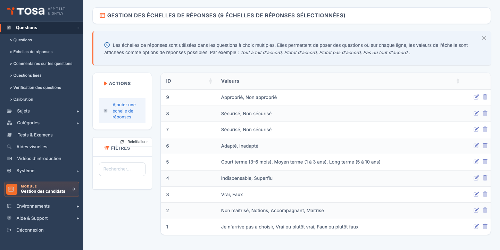
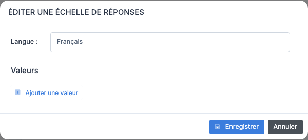

# Échelles de réponse

Une **échelle de réponse** est un jeu d'options de réponse réutilisable que vous pouvez attacher à une question : *« Jamais / Rarement / Parfois / Souvent / Toujours »*, *« Pas du tout d'accord / Plutôt pas d'accord / Plutôt d'accord / Tout à fait d'accord »*, ou tout autre référentiel sur lequel vous voulez interroger un candidat.

Les échelles permettent de **normaliser** les options de réponse d'une famille de questions sans recopier les libellés à chaque rédaction. Elles sont particulièrement utiles pour les questionnaires de comportement (échelles de Likert), les autoévaluations, et tout questionnaire où la même liste de choix se répète.

Accédez à la page via le menu **Module Questions → Questions → Échelles de réponse**, ou directement à `/questions/AdminAnswerScalesWithTable`.

Le tableau liste toutes les échelles définies, avec leur **identifiant** et la liste de leurs **valeurs** (les options dans l'ordre).

## Créer une échelle de réponse {#creer-une-echelle}

La création se fait entièrement **dans un modal** — il n'y a pas de page d'édition dédiée.

1. Depuis la page **Gestion des échelles de réponse**, cliquez sur **Ajouter une échelle** dans la barre d'actions.

    

2. Le modal **« Éditer une échelle de réponses »** présente :

    - Un sélecteur **Langue** en haut (basculez entre les langues du compte).
    - Une zone **Valeurs** : chaque valeur a un libellé par langue, précédé d'une **poignée de réordonnancement** (≡) et d'un numéro de position, suivi d'une icône de suppression.
    - Un bouton **Ajouter une valeur** pour étendre la liste.

3. Saisissez les valeurs dans l'ordre voulu, dans la langue affichée. Basculez ensuite vers les autres langues pour traduire chaque libellé.

4. Cliquez sur **Enregistrer**. L'échelle apparaît immédiatement dans la liste.

> 💡 **Minimum d'options** — Une échelle doit avoir au moins **deux options** pour être valide (une échelle à une seule valeur n'a pas de sens). La plateforme bloque la création en-dessous de ce seuil.

## Réordonner les options {#reordonner-les-options}

L'ordre des options détermine l'ordre de présentation au candidat. Pour le modifier :

- **Glissez-déposez** une option dans la zone du modal, ou utilisez les **flèches haut/bas** à côté de chaque option (selon votre version d'interface).
- L'ordre est mémorisé à la sauvegarde.

> ⚠️ **Cohérence d'ordre** — L'ordre s'applique à **toutes les langues** simultanément : vous ne pouvez pas avoir un ordre différent en FR et en EN. Si la traduction implique de réordonner culturellement (ce qui est rare), créez deux échelles distinctes.

## Saisie multilingue {#saisie-multilingue}

Le sélecteur de langue en haut du modal vous permet de saisir les libellés dans chacune des langues actives sur votre compte. Recommandations :

- **Saisissez la langue source en premier** (typiquement le français), puis traduisez vers les autres langues.
- **Renseignez toutes les langues actives** avant la première mise en production. Une langue manquante affichera un libellé vide au candidat, ce qui est déroutant.
- **Comptez le même nombre d'options** dans chaque langue : la plateforme ne permet pas d'avoir 5 options en FR et 4 en EN.

## Modifier une échelle {#modifier-une-echelle}

1. Sur la ligne de l'échelle, cliquez sur l'icône **Modifier** (crayon).
2. Le **même modal** que pour la création s'ouvre, pré-rempli avec les valeurs actuelles.
3. Ajustez les libellés, ajoutez ou supprimez des options, réordonnez-les.
4. Enregistrez.

> ⚠️ **Modification d'une échelle utilisée** — Si l'échelle est référencée par des questions, la modification affecte **toutes** ces questions. Soyez prudent : changer l'ordre des options sur une échelle déjà utilisée peut perturber l'analyse des résultats historiques (une option qui était en position 3 devient soudainement en position 5, ce qui peut décaler les statistiques).

## Filtres {#filtres}

Le panneau **Filtres** propose :

- **Rechercher** — texte libre sur l'ID ou les valeurs des options. Pratique pour trouver l'échelle qui contient *« Souvent »* parmi des dizaines de référentiels.

Le tri par colonne est disponible en cliquant sur les en-têtes.

## Supprimer une échelle {#supprimer-une-echelle}

1. Sur la ligne de l'échelle, cliquez sur l'icône **Supprimer**.
2. Confirmez sur la fenêtre de confirmation.

> ⚠️ **Échelle utilisée** — Une échelle référencée par au moins une question **ne peut pas être supprimée**. La plateforme refuse l'opération avec un message d'erreur. Pour supprimer une échelle largement utilisée :
>
> 1. Identifiez les questions qui la référencent (recherche par identifiant d'échelle sur la page Questions).
> 2. Modifiez ces questions pour pointer vers une autre échelle, ou supprimez-les.
> 3. Réessayez la suppression.

## Bonnes pratiques {#bonnes-pratiques}

- **Une échelle, un usage métier** — résistez à la tentation de fusionner plusieurs sens différents dans une seule échelle. Une échelle « fréquence d'utilisation d'Excel » et une échelle « niveau d'aisance avec Excel » doivent rester distinctes même si les libellés sont proches.
- **Nombre d'options impair** pour les échelles de Likert où vous voulez offrir une position **neutre** au candidat (typiquement 5 ou 7 niveaux). Préférez un nombre **pair** (4 ou 6) si vous voulez **forcer** le candidat à se positionner d'un côté ou de l'autre.
- **Réutilisez plutôt que dupliquer** — avant de créer une nouvelle échelle, recherchez si une échelle équivalente existe déjà. Filtrez par mot-clé pour explorer le référentiel avant d'ajouter du contenu.
