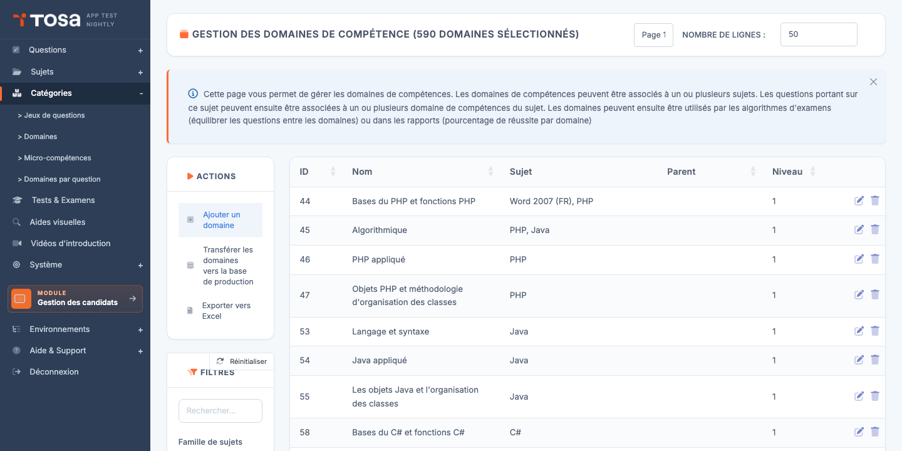
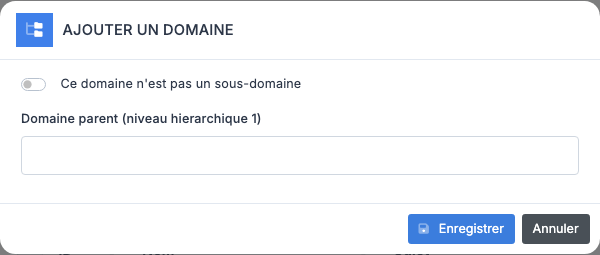
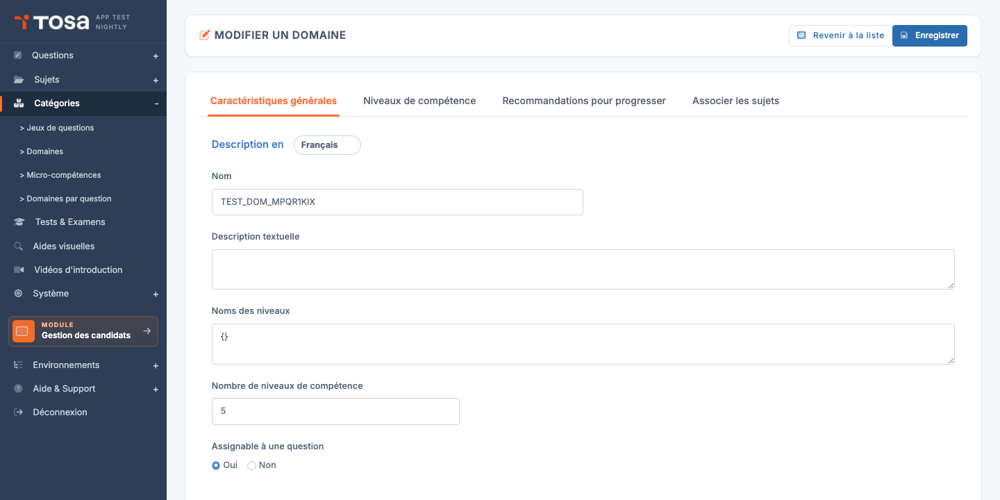
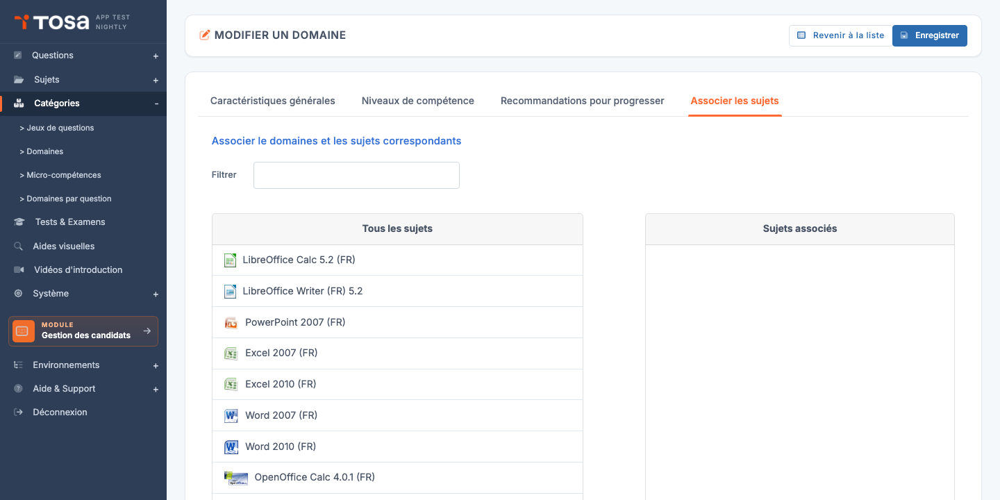

# Domaines de compétence

Un **domaine de compétence** (souvent appelé simplement *domaine*) est un découpage thématique au sein d'un sujet : pour *Microsoft Excel*, on trouvera *Mise en forme*, *Formules de calcul*, *Tableaux croisés dynamiques*, *Graphiques*. Chaque question rédigée sur la plateforme est rattachée à un domaine, ce qui permet aux rapports candidats de présenter un score **par compétence** et non seulement un score global.

Accédez à la page via le menu **Module Questions → Catégories → Domaines**, ou directement à `/domains/AdminDomainsWithTable`.

Le tableau liste tous les domaines définis, avec leur **identifiant**, leur **nom**, le ou les **sujets** auxquels ils sont rattachés, leur **parent** (le cas échéant) et leur **niveau hiérarchique** (1, 2 ou 3). Le titre de la page est *« Gestion des domaines de compétence »*.

## Hiérarchie des domaines {#hierarchie-des-domaines}

Un domaine peut être placé sur **trois niveaux** d'imbrication maximum :

| Niveau | Rôle | Exemple |
|---|---|---|
| **L1 — Domaine principal** | Le grand chapitre. Une question peut être attachée directement à un L1. | *Formules de calcul* |
| **L2 — Sous-domaine** | Découpe le L1 en sous-thèmes plus précis. | *Fonctions mathématiques* (enfant de *Formules de calcul*) |
| **L3 — Sous-sous-domaine** | Niveau le plus fin. Optionnel. | *SOMME.SI / NB.SI* (enfant de *Fonctions mathématiques*) |

> 💡 **Quand descendre en L2 ou L3 ?** — Si vous prévoyez **au moins 5-10 questions** dans un sous-thème ET que ce sous-thème mérite un score dédié dans le rapport, créez un L2. Pour les granularités fines (< 5 questions), restez au L1 et utilisez plutôt les **micro-compétences** (voir chapitre suivant).

## Créer un domaine {#creer-un-domaine}

La création se fait en deux étapes : un modal pour choisir le rattachement, puis la fiche d'édition pour le contenu.

### Étape 1 — Modal de création

1. Depuis la liste, cliquez sur **Ajouter un domaine** dans la barre d'actions.

    

2. Le modal s'ouvre avec le **commutateur « Domaine principal » coché par défaut** : le domaine sera créé en L1 (racine).

3. Pour créer un **L1**, ne changez rien : validez. Le domaine est créé et vous êtes redirigé sur sa fiche d'édition.

4. Pour créer un **L2 ou L3**, **décochez** le commutateur. Un premier sélecteur apparaît, vous demandant le domaine **L1 parent** :

    

5. Sélectionnez le L1. Si ce L1 a déjà des enfants L2, un **deuxième sélecteur** apparaît pour choisir si le nouveau domaine est :
    - Un **nouveau L2** (laissez le second sélecteur vide).
    - Un **L3** rattaché à un L2 existant (choisissez le L2 dans le second sélecteur).

6. Validez. Le domaine est créé au bon niveau, avec le bon parent, et vous arrivez sur sa fiche d'édition.

> 💡 **Modal réactif** — Le modal interroge le serveur (`GetDomainSelectorsAjaxScript`) à chaque sélection pour proposer dynamiquement le ou les sélecteurs enfants. Un L1 sans enfants ne propose qu'un seul sélecteur ; un L1 avec enfants en propose un second pour le L3.

### Étape 2 — Fiche d'édition

Sur la page **Modifier un domaine** qui s'ouvre, complétez les onglets — voir [Onglets de la fiche domaine](#onglets-de-la-fiche-domaine).

## Onglets de la fiche domaine {#onglets-de-la-fiche-domaine}

La fiche d'édition d'un domaine (titre **MODIFIER UN DOMAINE**) propose jusqu'à **quatre onglets** :

| Onglet | Contenu |
|---|---|
| **Caractéristiques générales** | Nom et description du domaine (multilingue), nombre de niveaux de compétence, indicateur **« Assignable à une question »**, noms personnalisés des niveaux. |
| **Niveaux de compétence** | Visible uniquement si le nombre de niveaux est supérieur à 0. Pour chaque niveau et chaque langue, descriptif de ce que sait faire un candidat à ce niveau **sur ce domaine spécifiquement**. Affiné par rapport aux descriptions globales du sujet. |
| **Recommandations pour progresser** | Pour chaque niveau et chaque langue, conseils donnés au candidat pour progresser **vers le niveau suivant**. Ces textes apparaissent dans la section *« Comment progresser ? »* du rapport. |
| **Associer les sujets** | Rattache ce domaine à un ou plusieurs sujets — voir [Associer un domaine à un sujet](#associer-un-domaine-a-un-sujet). |

### Champs de l'onglet « Caractéristiques générales »

Le sélecteur de langue **« Description en »** en haut bascule entre les langues actives. Les champs :

- **Nom** — libellé court du domaine, affiché dans les rapports et listes.
- **Description textuelle** — paragraphe libre détaillant le périmètre du domaine. Sert de documentation interne pour les rédacteurs de questions.
- **Noms des niveaux** — JSON optionnel pour personnaliser le nom des niveaux (par défaut *Niveau 1*, *Niveau 2*… ; vous pouvez les renommer en *Initial*, *Basique*, *Opérationnel*, etc.).
- **Nombre de niveaux de compétence** — combien de paliers de maîtrise sont définis sur ce domaine. **0** signifie « pas de niveaux propres au domaine » (le score global du sujet suffit). **3 à 5** est typique pour les domaines qui méritent une analyse fine.
- **Assignable à une question** (Oui / Non) — si **Oui**, le domaine peut être choisi comme rattachement par une question, et il apparaît dans la cartographie des rapports candidats. Si **Non**, le domaine sert uniquement de **regroupement éditorial** pour ses enfants (un L1 « chapeau » qui ne porte pas de questions directement, par exemple).

> 💡 **Réactivité** — Changer la valeur du **nombre de niveaux de compétence** met à **jour instantanément** l'onglet *Niveaux de compétence* : les champs correspondants apparaissent ou disparaissent sans rechargement de la page.

## Associer un domaine à un sujet {#associer-un-domaine-a-un-sujet}

Un domaine n'est utile que s'il est **rattaché à au moins un sujet**. L'association se fait via l'onglet **Associer les sujets** de la fiche du domaine :

L'onglet propose deux listes côte à côte :

- **Sujets disponibles** (`#unused`) — tous les sujets non associés à ce domaine.
- **Sujets associés** (`#used`) — les sujets actuellement rattachés.

**Pour associer** : glissez-déposez un sujet de **disponibles** vers **associés**. L'inverse pour désassocier. Cliquez **Enregistrer** en haut à droite pour persister.

> 💡 **Filtrer la liste** — Si vous avez beaucoup de sujets, utilisez le champ de filtre au-dessus de chaque liste pour trouver rapidement le sujet voulu.

> ⚠️ **Désassocier un domaine avec des questions** — Si vous désassociez un sujet d'un domaine **alors que des questions existent rattachées à ce couple**, ces questions deviennent orphelines. La plateforme affichera un avertissement avant validation. Confirmez seulement si vous comptez supprimer ou réattribuer ces questions dans la foulée.

## Questions associées {#questions-associees}

Sur la fiche d'un domaine, le lien **Voir les questions associées** ouvre la page **AdminQuestionsWithTable** **pré-filtrée** sur ce domaine. Pratique pour :

- Vérifier le nombre de questions rédigées par domaine.
- Identifier les domaines pauvres en questions, qui mériteraient des rédactions supplémentaires.
- Naviguer rapidement entre la définition pédagogique (la fiche domaine) et le contenu (les questions).

## Filtres {#filtres}

Le panneau **Filtres** propose :

- **Rechercher** — texte libre sur l'ID ou le nom du domaine.
- **Famille de sujets** — restreint la liste aux domaines des sujets d'une famille donnée. Combiné avec la recherche, c'est l'outil le plus efficace pour retrouver un domaine dans un référentiel volumineux.

Le tri est disponible sur chaque colonne en cliquant sur l'en-tête.

## Supprimer un domaine {#supprimer-un-domaine}

1. Sur la ligne du domaine, cliquez sur l'icône **Supprimer**.
2. Confirmez via le bouton **Supprimer** sur la page de confirmation.

> ⚠️ **Domaine avec questions** — Un domaine qui contient **au moins une question** ne peut pas être supprimé. La plateforme refuse l'opération avec un message d'erreur. Avant suppression, **transférez ou supprimez les questions** rattachées (utilisez le lien *Voir les questions associées* pour les retrouver).

> 💡 **Domaines L2/L3 enfants** — Vous ne pouvez pas non plus supprimer un domaine **L1** ou **L2** s'il a des **enfants**. Supprimez d'abord les enfants (du plus bas au plus haut), puis le parent.

## Exporter la liste {#exporter-la-liste}

Le bouton **Exporter vers Excel** dans la barre d'actions génère un fichier `.xlsx` listant tous les domaines actuellement filtrés. Utile pour les audits du référentiel pédagogique ou pour transmettre la liste à des contributeurs externes.
