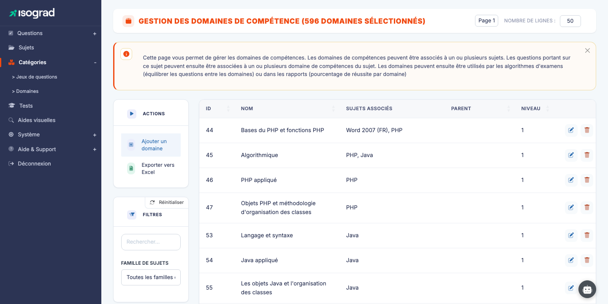
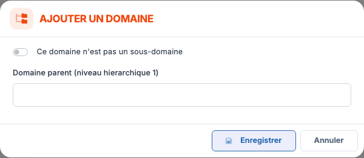
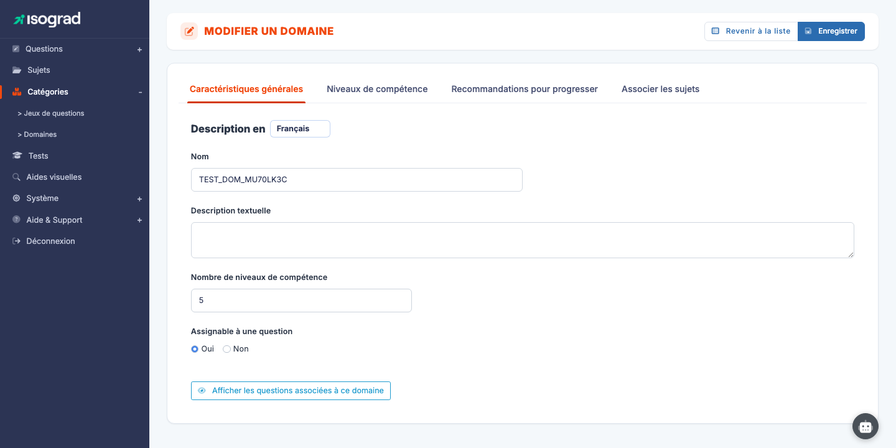
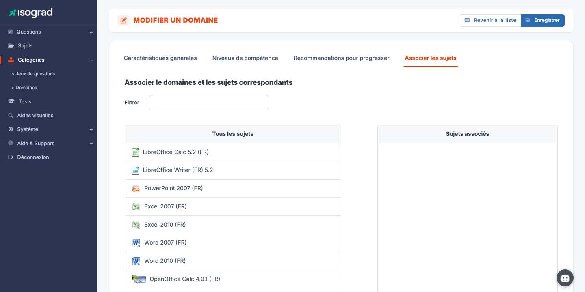

# Domaines de compétence

Un **domaine de compétence** (souvent appelé simplement *domaine*) est un découpage thématique au sein d'un sujet : pour *Microsoft Excel*, on trouvera *Mise en forme*, *Formules de calcul*, *Tableaux croisés dynamiques*, *Graphiques*. Chaque question rédigée sur la plateforme est rattachée à un domaine, ce qui permet aux rapports candidats de présenter un score **par compétence** et non seulement un score global.

Accédez à la page via le menu **Catégories → Domaines**.

Le tableau liste tous les domaines définis, avec leur **identifiant**, leur **nom**, le ou les **sujets** auxquels ils sont rattachés, leur **parent** (le cas échéant) et leur **niveau hiérarchique** (1, 2 ou 3).

## Hiérarchie des domaines {#hierarchie-des-domaines}

Un domaine peut être placé sur **trois niveaux** d'imbrication maximum :

| Niveau | Rôle | Exemple |
|---|---|---|
| **L1 — Domaine principal** | Le grand chapitre. Une question peut être attachée directement à un L1. | *Formules de calcul* |
| **L2 — Sous-domaine** | Découpe le L1 en sous-thèmes plus précis. | *Fonctions mathématiques* (enfant de *Formules de calcul*) |
| **L3 — Sous-sous-domaine** | Niveau le plus fin. Optionnel. | *SOMME.SI / NB.SI* (enfant de *Fonctions mathématiques*) |

> 💡 **Quand descendre en L2 ou L3 ?** — Si vous prévoyez **au moins 5-10 questions** dans un sous-thème ET que ce sous-thème mérite un score dédié dans le rapport, créez un L2. Pour les granularités plus fines (moins de 5 questions), restez au L1.

## Créer un domaine {#creer-un-domaine}

La création se fait en deux étapes : une fenêtre pour choisir le rattachement, puis la fiche d'édition pour le contenu.

### Étape 1 — Fenêtre de création

1. Depuis la liste, cliquez sur **Ajouter un domaine** dans la barre d'actions.

    

2. La fenêtre s'ouvre avec le commutateur **Ce domaine n'est pas un sous-domaine** coché par défaut : le domaine sera créé en L1 (racine).

3. Pour créer un **L1**, ne changez rien : validez. Le domaine est créé et vous êtes redirigé vers sa fiche d'édition.

4. Pour créer un **L2 ou L3**, **décochez** le commutateur. Un premier sélecteur apparaît, demandant le **domaine parent (niveau hiérarchique 1)** :

    

5. Sélectionnez le L1. Si ce L1 a déjà des enfants L2, un **second sélecteur** apparaît pour choisir si le nouveau domaine est :
    - Un **nouveau L2** (laissez le second sélecteur vide).
    - Un **L3** rattaché à un L2 existant (choisissez le L2 dans le second sélecteur).

6. Validez. Le domaine est créé au bon niveau, avec le bon parent, et vous arrivez sur sa fiche d'édition.

> 💡 **Sélecteurs et filtre de la liste** — Les sélecteurs de parent ne proposent que les domaines correspondant au filtre **Famille de sujets** sélectionné dans la liste. Laissez ce filtre sur sa valeur par défaut pour voir tous les domaines.

### Étape 2 — Fiche d'édition

Sur la page **Modifier un domaine** qui s'ouvre, renseignez les onglets — voir [Onglets de la fiche](#onglets-de-la-fiche-domaine).

## Onglets de la fiche {#onglets-de-la-fiche-domaine}

La fiche d'édition d'un domaine propose jusqu'à **quatre onglets** :

| Onglet | Contenu |
|---|---|
| **Caractéristiques générales** | Nom et description textuelle du domaine (par langue), nombre de niveaux de compétence, indicateur **« Assignable à une question »**. |
| **Niveaux de compétence** | Affiché uniquement si le nombre de niveaux est supérieur à 0. Pour chaque niveau et chaque langue, description de ce que sait faire un candidat de ce niveau **spécifiquement sur ce domaine**. Affine les descriptions globales du sujet. |
| **Recommandations pour progresser** | Pour chaque niveau et chaque langue, conseils donnés au candidat pour passer **au niveau suivant**. Ces textes apparaissent dans le rapport. Vide si le nombre de niveaux est 0. |
| **Associer les sujets** | Affiché pour les **domaines principaux (L1) uniquement**. Rattachement de ce domaine à un ou plusieurs sujets — voir [Associer un domaine à un sujet](#associer-un-domaine-a-un-sujet). Les sous-domaines héritent des sujets de leur domaine principal. |

### Champs de l'onglet « Caractéristiques générales »

Le sélecteur de langue **« Description en »** en haut bascule entre les langues de rapport. Les champs :

- **Nom** — libellé court du domaine, affiché dans les rapports et les listes. Obligatoire dans la langue courante.
- **Description textuelle** — paragraphe libre détaillant le périmètre du domaine. Sert de documentation interne aux rédacteurs de questions.
- **Domaine parent** et **Domaine principal** — rappels en lecture seule affichés sur les sous-domaines.
- **Nombre de niveaux de compétence** — combien de paliers de maîtrise sont définis sur ce domaine (0 à 8). **0** signifie « pas de niveaux spécifiques à ce domaine » (le score global du sujet suffit). **3 à 5** est typique pour les domaines qui méritent une analyse fine.
- **Assignable à une question** (Oui / Non) — si **Oui**, le domaine peut être choisi comme rattachement d'une question et apparaît dans la cartographie de compétences du rapport candidat. Si **Non**, le domaine ne sert que de **regroupement éditorial** pour ses enfants (un L1 « chapeau » qui ne porte pas directement de questions, par exemple).

> 💡 **Réactivité** — Modifier la valeur du **nombre de niveaux de compétence** met instantanément à jour les onglets *Niveaux de compétence* et *Recommandations* : les champs correspondants apparaissent ou disparaissent sans recharger la page.

> 💡 **Langues** — Le sélecteur de langue de la fiche domaine liste les langues de rapport de la plateforme. Vous n'avez besoin de renseigner que les langues réellement utilisées par vos candidats.

## Associer un domaine à un sujet {#associer-un-domaine-a-un-sujet}

Un domaine n'est utile que s'il est **associé à au moins un sujet**. L'association se fait via l'onglet **Associer les sujets** de la fiche d'un domaine principal :

L'onglet présente deux listes côte à côte :

- **Tous les sujets** — tous les sujets non associés à ce domaine.
- **Sujets associés** — les sujets actuellement rattachés.

**Pour associer** : glissez-déposez un sujet de **Tous les sujets** vers **Sujets associés**. L'inverse pour dissocier. Cliquez sur **Enregistrer** en haut à droite pour persister.

> 💡 **Filtrer la liste** — Si vous avez beaucoup de sujets, utilisez le champ de filtre au-dessus des listes pour trouver rapidement le sujet voulu.

> ⚠️ **Dissocier un domaine ayant des questions** — Si vous dissociez un sujet d'un domaine **alors que des questions existent sur ce couple**, ces questions perdent leur domaine dans le rapport. Ne dissociez que si vous comptez réattribuer ces questions immédiatement après.

## Questions associées {#questions-associees}

Sur la fiche d'un domaine, le lien **Afficher les questions associées à ce domaine** ouvre la page **Questions** dans un nouvel onglet, **pré-filtrée** sur ce domaine. Utile pour :

- Vérifier combien de questions ont été rédigées par domaine.
- Repérer les domaines pauvres en questions qui mériteraient un renfort de rédaction.
- Passer rapidement de la définition pédagogique (la fiche domaine) au contenu (les questions).

## Filtres {#filtres}

Le panneau **Filtres** propose :

- **Rechercher** — texte libre sur l'identifiant ou le nom du domaine.
- **Famille de sujets** — regroupement technique des sujets. Sur votre plateforme, tous les sujets appartiennent à la même famille : ce filtre peut rester sur sa valeur par défaut.

Le tri est disponible sur chaque colonne en cliquant sur l'en-tête.

## Supprimer un domaine {#supprimer-un-domaine}

1. Sur la ligne du domaine, cliquez sur l'icône **Supprimer**.
2. Confirmez via le bouton **Supprimer** de la page qui s'ouvre.

> ⚠️ **Domaine avec questions** — Un domaine qui contient **au moins une question** ne peut pas être supprimé. La plateforme refuse l'opération avec le message « Vous ne pouvez pas supprimer un domaine associé à des questions ». Avant suppression, **transférez ou supprimez les questions** qui lui sont rattachées (utilisez le lien *Afficher les questions associées à ce domaine* pour les retrouver).

> 💡 **Sous-domaines L2/L3** — Supprimez les sous-domaines avant leur parent (du bas vers le haut), faute de quoi les enfants perdent leur rattachement.

## Exporter la liste {#exporter-la-liste}

Le bouton **Exporter vers Excel** dans la barre d'actions génère un fichier `.xlsx` listant tous les domaines actuellement filtrés. Utile pour les audits du référentiel pédagogique ou pour communiquer la liste à des contributeurs externes.
