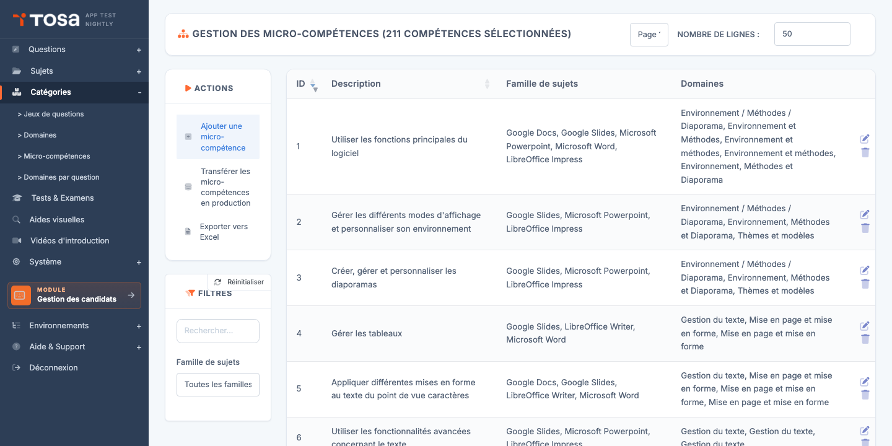
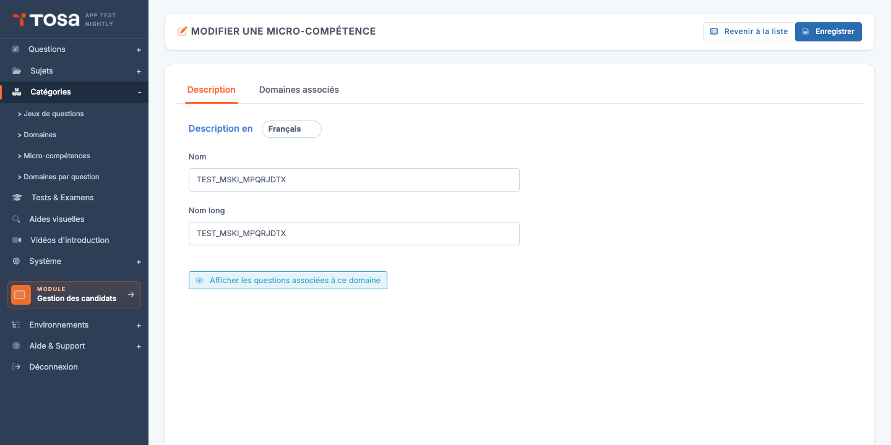
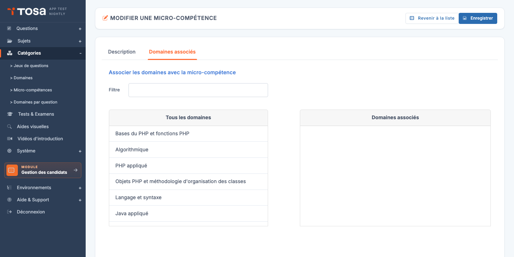

# Micro-compétences

Une **micro-compétence** est une compétence fine, transverse à plusieurs domaines de niveau 1. Là où un *domaine* est un grand chapitre (« Formules de calcul »), une micro-compétence est un item beaucoup plus précis (« Maîtrise des fonctions de date », « Utilisation des références absolues »).

Les micro-compétences servent à :

- **Tagger** finement les questions, indépendamment du découpage en domaines.
- Produire des analyses transversales : *« Sur quelles micro-compétences précises ce candidat a-t-il échoué ? »*
- Identifier des **trous de couverture** dans le référentiel — par exemple repérer les micro-compétences qui n'ont pas (ou peu) de questions rédigées.

Accédez à la page via le menu **Module Questions → Catégories → Micro-compétences**, ou directement à `/domains/AdminMicroSkillsWithTable`.

Le tableau liste toutes les micro-compétences, avec leur **identifiant**, leur **description**, la **famille de sujets** des domaines auxquels elles sont associées, et la liste des **domaines** rattachés.

## Différence entre domaine et micro-compétence {#difference-domaine-microskill}

Cette distinction est subtile et mérite d'être clarifiée :

| | **Domaine** | **Micro-compétence** |
|---|---|---|
| Granularité | Grande (chapitre) | Fine (item précis) |
| Rattachement | Un sujet par domaine | Plusieurs domaines (transverse) |
| Présence dans le rapport | Score par domaine | Pas affichée au candidat |
| Utilisation | Découpage pédagogique | Tag de traçabilité |
| Hiérarchie | Jusqu'à 3 niveaux (L1/L2/L3) | Plate |

> 💡 **Quand utiliser l'un ou l'autre ?** — Utilisez un **domaine** quand vous voulez un découpage visible dans le rapport candidat. Utilisez une **micro-compétence** pour les besoins d'analyse interne et de pilotage de la couverture du référentiel.

## Créer une micro-compétence {#creer-une-microskill}

La création est **directe** — pas de modal de pré-création, contrairement aux sujets ou aux domaines.

1. Depuis la page **Gestion des micro-compétences**, cliquez sur **Ajouter une micro-compétence** dans la barre d'actions.

2. La plateforme crée immédiatement un enregistrement vide et vous amène sur sa fiche d'édition (`MicroSkillUpdate?is_create=1&mic_ski_id=<new_id>`).

3. Remplissez les onglets — voir [Onglets de la fiche](#onglets-de-la-fiche) ci-dessous.

## Onglets de la fiche {#onglets-de-la-fiche}

La fiche d'édition d'une micro-compétence présente **deux onglets** :

### Onglet « Description »

Pour chaque langue (sélecteur **« Description en »** en haut de l'onglet), deux champs :

- **Nom** — libellé concis qui apparaît dans la liste et dans les filtres de questions. Choisissez un titre parlant en une dizaine de mots maximum.
- **Nom long** — texte explicatif détaillant le périmètre de la micro-compétence. Sert de documentation pour les rédacteurs de questions et pour les contrôleurs qualité.

Un bouton **Afficher les questions associées à ce domaine** ouvre la liste des questions actuellement taguées avec cette micro-compétence — utile pour vérifier la couverture en un clic.

### Onglet « Domaines associés »

C'est l'onglet structurellement le plus important : il détermine **dans quel(s) domaine(s)** la micro-compétence peut être utilisée pour tagger des questions.

L'onglet propose deux listes côte à côte :

- **Domaines disponibles** (`#unused`) — tous les domaines de niveau 1 non encore associés à cette micro-compétence.
- **Domaines associés** (`#used`) — les domaines actuellement rattachés.

**Pour associer** : glissez-déposez un domaine de **disponibles** vers **associés**. L'inverse pour désassocier. Cliquez **Enregistrer** en haut à droite pour persister.

> 💡 **Filtrer la liste** — Un champ de filtre au-dessus de chaque liste permet de retrouver rapidement un domaine quand le référentiel devient volumineux. Indispensable sur les comptes avec plusieurs centaines de domaines.

> ⚠️ **Domaines de niveau 1 uniquement** — Seuls les **domaines L1** apparaissent dans les listes. Les L2 et L3 héritent automatiquement de la micro-compétence par leur parent. Cela évite la combinatoire ingérable d'associer une micro-compétence à des dizaines de sous-niveaux.

## Saisie multilingue {#saisie-multilingue}

Comme pour les domaines, la description d'une micro-compétence est multilingue : le sélecteur **« Description en »** en haut de l'onglet Description permet de basculer entre les langues actives. Renseignez au moins la langue par défaut de votre compte ; les autres langues peuvent rester vides si vous n'avez pas le temps de traduire — la micro-compétence reste utilisable, mais affichera son libellé dans la langue par défaut.

## Filtres {#filtres}

Le panneau **Filtres** propose deux contrôles :

- **Rechercher** — texte libre sur l'ID ou la description courte.
- **Famille de sujets** — restreint la liste aux micro-compétences associées à au moins un domaine d'un sujet de la famille choisie.

Le tri est disponible sur chaque colonne en cliquant sur l'en-tête.

## Supprimer une micro-compétence {#supprimer-une-microskill}

1. Sur la ligne de la micro-compétence, cliquez sur l'icône **Supprimer**.
2. Confirmez sur la page de confirmation via **Supprimer**.

> 💡 **Tag perdu** — Contrairement aux domaines, les micro-compétences peuvent être supprimées **même si des questions y sont taguées** : les questions perdent simplement le tag, mais restent intactes. Avant de supprimer une micro-compétence largement utilisée, ouvrez la liste des questions associées pour vérifier l'impact.

## Exporter la liste {#exporter-la-liste}

Le bouton **Exporter vers Excel** dans la barre d'actions génère un fichier `.xlsx` listant toutes les micro-compétences actuellement filtrées, avec leurs domaines associés. Précieux pour les audits du référentiel et pour communiquer la cartographie complète à des contributeurs externes.
