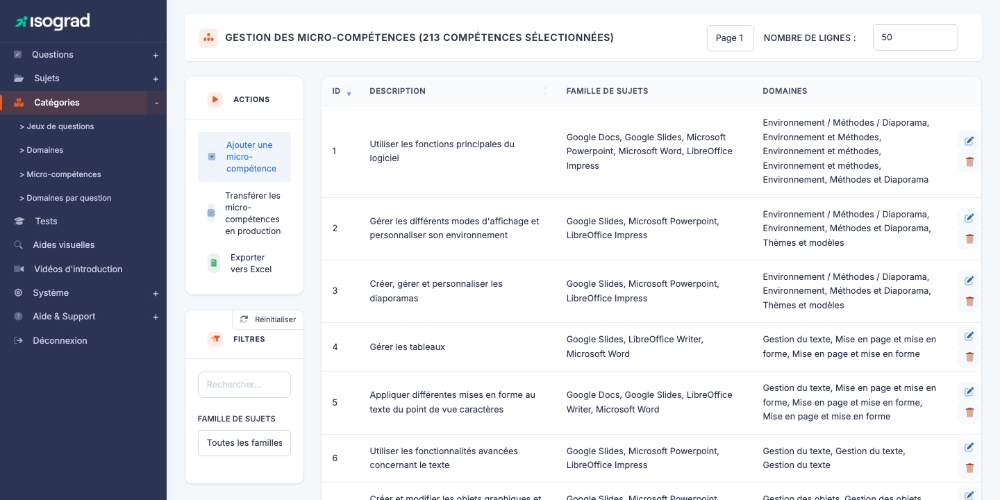
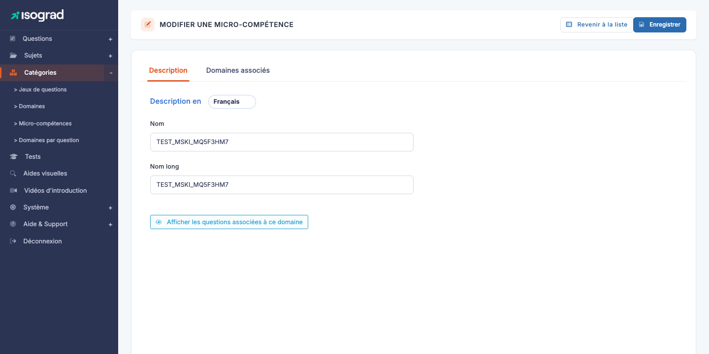

# Sous-domaine

Le sous-domaine est une compétence fine, transverse à plusieurs domaines de niveau 1. Là où un *domaine* est un grand chapitre (« Formules de calcul »), une micro-compétence est un item beaucoup plus précis (« Maîtrise des fonctions de date », « Utilisation des références absolues »).

Les micro-compétences servent à :

- **Tagger** finement les questions, indépendamment du découpage en domaines.
- Produire des analyses transversales : *« Sur quelles micro-compétences précises ce candidat a-t-il échoué ? »*
- Identifier des **trous de couverture** dans le référentiel — par exemple repérer les micro-compétences qui n'ont pas (ou peu) de questions rédigées.

Accédez à la page via le menu **Module Questions → Catégories → Micro-compétences**, ou directement à `/domains/AdminMicroSkillsWithTable`.

Le tableau liste toutes les micro-compétences, avec leur **identifiant**, leur **description**, la **famille de sujets** des domaines auxquels elles sont associées, et la liste des **domaines** rattachés.

## Différence entre domaine et micro-compétence {#difference-domaine-microskill}

Cette distinction est subtile et mérite d'être clarifiée :

| | **Domaine** | **Sous-domaine** |
|---|---|---|
| Granularité | Grande (chapitre) | Fine (item précis) |
| Rattachement | Un sujet par domaine | Plusieurs domaines (transverse) |
| Présence dans le rapport | Score par domaine | Pas affichée au candidat |
| Utilisation | Découpage pédagogique | Tag de traçabilité |
| Hiérarchie | Jusqu'à 3 niveaux (L1/L2/L3) | Plate |

> 💡 **Quand utiliser l'un ou l'autre ?** — Utilisez un **domaine** quand vous voulez un découpage visible dans le rapport candidat. Utilisez une **micro-compétence** pour les besoins d'analyse interne et de pilotage de la couverture du référentiel.

## Créer une micro-compétence {#creer-une-microskill}

La création est **directe** — pas de modal de pré-création, contrairement aux sujets ou aux domaines.

1. Depuis la page **Catégories**, cliquez sur **Domaines** dans la barre d'actions, puis sur **Ajouter un domaine**.
2. Décochez **Ce domaine n'est pas un sous-domaine**
2. Choisissez le domaine parent depuis la liste.
3. Remplissez les onglets — voir [Onglets de la fiche](#onglets-de-la-fiche) ci-dessous.

### Caractéristiques générales {#onglets-de-la-fiche}

Pour chaque langue (sélecteur **« Description en »** en haut de l'onglet), deux champs :

- **Nom** — libellé concis qui apparaît dans la liste et dans les filtres de questions. Choisissez un titre parlant en une dizaine de mots maximum.
- **Description textuelle** — texte explicatif détaillant le périmètre de la micro-compétence. Sert de documentation pour les rédacteurs de questions et pour les contrôleurs qualité.
- **Domaine parent**

Un bouton **Afficher les questions associées à ce domaine** ouvre la liste des questions actuellement taguées avec cette micro-compétence — utile pour vérifier la couverture en un clic.

### Onglet **Niveaux de compétence**

C'est l'onglet où vous ajoutez les descriptions des niveaux. 

### Onglet **Recommandations pour progresser**

## Supprimer sous-domaine {#supprimer-une-microskill}

1. Sur la ligne de la micro-compétence, cliquez sur l'icône **Supprimer**.
2. Confirmez sur la page de confirmation via **Supprimer**.

> 💡 **Tag perdu** — Contrairement aux domaines, les micro-compétences peuvent être supprimées **même si des questions y sont taguées** : les questions perdent simplement le tag, mais restent intactes. Avant de supprimer une micro-compétence largement utilisée, ouvrez la liste des questions associées pour vérifier l'impact.

## Exporter la liste {#exporter-la-liste}

Le bouton **Exporter vers Excel** dans la barre d'actions génère un fichier `.xlsx` listant toutes les micro-compétences actuellement filtrées, avec leurs domaines associés. Précieux pour les audits du référentiel et pour communiquer la cartographie complète à des contributeurs externes.
