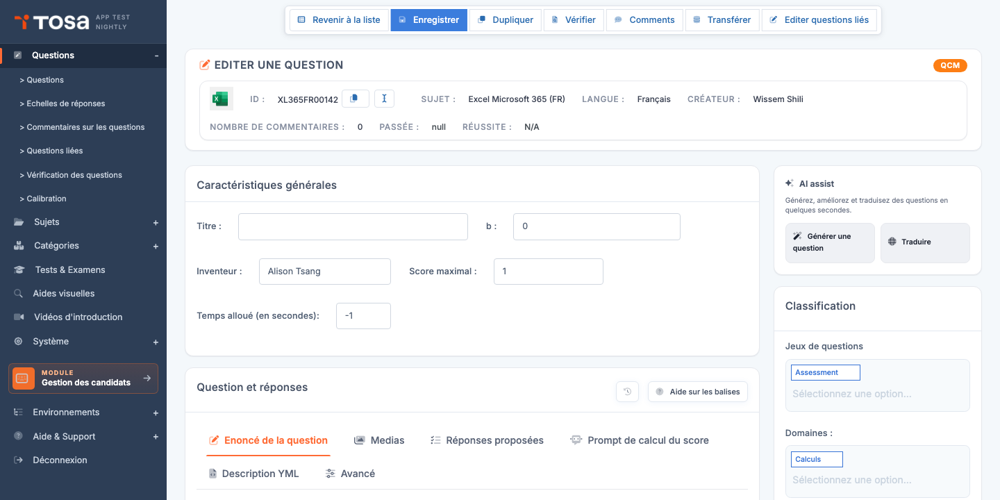
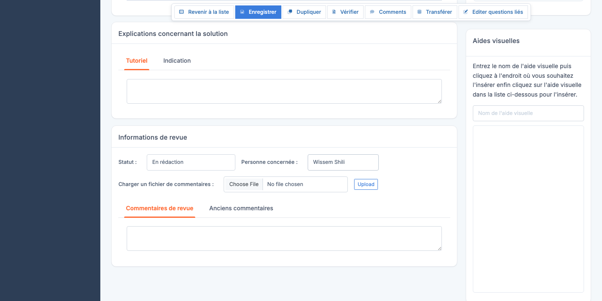

# Éditeur de questions

L'**éditeur de questions** est l'outil le plus utilisé du module Questions — c'est ici qu'on écrit les énoncés, qu'on définit les options de réponse, qu'on ajoute les illustrations et aides visuelles, et qu'on tague chaque question dans la cartographie de compétences. Tout administrateur qui produit du contenu pour la plateforme passe la majorité de son temps sur cette page.

Accédez à l'éditeur via l'icône **Modifier** (crayon) sur la ligne d'une question dans la page **[Questions](/ai/question-module/questions/)**, ou directement à l'URL `/questions/QuestionUpdate?que_str_id=<id>`.

> 💡 **Type de réponse et interface** — L'éditeur **adapte son interface** au **type de réponse** de la question. Une question QCM affichera une zone de saisie de propositions ; une question Code aura un éditeur de code à coloration syntaxique ; une question glisser-déposer aura un éditeur d'items à glisser. Ce chapitre couvre l'organisation commune **et** les spécificités par type.

## Vue d'ensemble {#vue-d-ensemble}

La page d'édition (titre **EDITER UNE QUESTION**) est organisée en plusieurs zones, avec un badge en haut à droite indiquant le **type de réponse** de la question courante (QCM, Code, Cliquer sur zone, etc.) :

1. **Barre d'actions globales** (au-dessus de l'en-tête) :
    - **Revenir à la liste** — retour à la page Questions.
    - **Enregistrer** — sauvegarde toutes les modifications.
    - **Dupliquer** — crée une copie de la question.
    - **Vérifier** — lance le diagnostic éditorial sur cette seule question (titre vide, énoncé manquant, options non marquées correctes, etc.).
    - **Transférer** — passe la question de préproduction à production.
    - **Editer questions liés** — accède aux questions liées éventuelles.

2. **Bandeau d'identité** :
    - Icône du sujet + **ID** (par exemple `XL365FR00142`) avec un bouton **Copier** et un bouton **Renommer l'identifiant**.
    - **Sujet**, **Langue**, **Créateur** (administrateur initial de la question).
    -  **Passée** (nombre de passages), **Réussite** (taux de succès).

3. **Section « Caractéristiques générales »** :
    - **Titre**, **b** (paramètre IRT de difficulté, **modifiable** pour ajustement manuel après calibration).
    - **Inventeur** (nom de l'auteur originel de la question, distinct du créateur du compte).
    - **Score maximal** (par défaut 1).
    - **Temps alloué** (en secondes ; `-1` signifie « pas de limite »).

4. **Section « Question et réponses »** — c'est le cœur de l'édition, organisé en onglets (voir [Onglets de l'édition](#onglets-edition)).

5. **Volet « AI assist »** sur la droite — boutons de génération par IA (voir [Génération par IA](#generation-ia)).

6. **Volet « Classification »** sur la droite — jeux de questions et domaines de rattachement de la question (avec des tags Choices.js).

> 💡 **Tout sur une seule page** — Contrairement à d'autres entités de la plateforme, l'éditeur ne navigue pas entre plusieurs pages. Toutes les modifications se font ici et sont enregistrées en un clic via le bouton **Enregistrer** en haut.

## Onglets de l'édition de la question {#onglets-edition}

La section **Question et réponses** est organisée en onglets propres au contenu de la question :

| Onglet | Contenu |
|---|---|
| **Énoncé de la question** | Le texte affiché au candidat (Markdown / HTML enrichi). |
| **Médias** | Insertion et gestion des aides visuelles attachées à l'énoncé. |
| **Réponses proposées** | Propositions de réponse (varie selon le type de réponse — voir sections par type). |
| **Prompt de calcul du score** | Pour les questions à correction IA ou semi-automatique : instructions données à l'IA pour calculer la note. |
| **Description YML** | Vue brute YAML de la configuration de la question — pour les administrateurs avancés qui veulent éditer la structure de données directement. |
| **Avancé** | Options avancées : ordre des propositions, comportement spécifique, métadonnées techniques. |

Deux boutons d'aide en haut à droite de cette section :

- **Historique** (icône horloge) — historique des modifications de la question.
- **Aide sur les balises** — référence des balises Markdown et templating disponibles dans l'éditeur.

## Champs communs à tous les types {#champs-communs}

### Métadonnées

- **Sujet** — sujet auquel la question est rattachée. Détermine le pool de candidats qui verront la question.
- **Domaine** — domaine de compétence évalué (compétence principale de la question). Pour la cartographie du rapport candidat.
- **Sous-domaines** — tags transversaux supplémentaires (voir [Micro-compétences](/ai/question-module/microskills/)).
- **Jeu de questions** — si la question fait partie d'un bloc cohérent (voir [Jeux de questions](/ai/question-module/question-sets/)).
- **Statut** — *En rédaction*, *À vérifier*, *Production* etc.
- **Personne concernée** — personne qui intervient/doit intervenir sur la question.
- **Langue** — fixée à la création, non modifiable. Une question = une langue.

### Titre

Le **Titre** (`tit`) est un libellé court qui apparaît dans la colonne *Titre* de la liste et dans les rapports de compétences et il représente la compétence testée dans la question. **Pas affiché au candidat.** Choisissez un titre **descriptif et unique** : *« Faire une somme»* est meilleur que *« Excel - question 17 »*.

### Texte de la question

Le **Texte** est l'énoncé affiché au candidat. Vous le saisissez dans un éditeur riche qui supporte :

- **Markdown** — gras, italique, listes, liens, blocs de code. Le rendu est immédiat dans la prévisualisation.
- **Formatage HTML** pour les cas avancés (tableaux, classes CSS spécifiques).
- **Insertion d'aides visuelles** via le bouton dédié (voir [Aides visuelles](#aides-visuelles)).
- **Insertion d'illustrations directes** (image à la question — voir [Illustration](#illustration)).

> 💡 **Format Markdown vs HTML** — Privilégiez Markdown pour l'écriture courante. Réservez le HTML aux cas où Markdown ne suffit pas (tableaux complexes, mise en forme spécifique).

### Illustration

Une **illustration** est une image attachée **directement à la question** (par opposition à une aide visuelle, qui peut être partagée entre plusieurs questions). C'est l'image principale qui accompagne l'énoncé.

- Pour **ajouter** une illustration, cliquez sur le bouton d'upload et choisissez votre fichier (PNG/JPG/SVG).
- Pour **modifier** le texte alternatif (alt text), saisissez-le dans le champ dédié — important pour l'accessibilité et pour les lecteurs d'écran.
- Pour **supprimer** l'illustration, cliquez sur le bouton **Supprimer le média**.

> 💡 **Quand illustration, quand aide visuelle ?** — Une **illustration** est propre à la question, idéale pour une image jamais réutilisée. Une **[aide visuelle](/ai/question-module/visual-aids/)** est mutualisée entre plusieurs questions, idéale pour un tableau Excel ou un code source partagé sur 10 questions du même module.

### Tutoriel

Le **Tutoriel** est une explication détaillée affichée au candidat **après** sa réponse, en mode de révision. C'est le moment pédagogique : expliquer pourquoi la bonne réponse est la bonne, comment l'identifier, quelle erreur courante éviter. Format identique au texte (Markdown / HTML).

### Aides visuelles {#aides-visuelles}

Vous pouvez insérer une ou plusieurs **aides visuelles** dans l'énoncé ou dans les réponses. Voir le chapitre [Aides visuelles](/ai/question-module/visual-aids/) pour la création et la gestion. Dans l'éditeur de question :

- Cliquez sur le bouton **Insérer une aide visuelle** dans l'éditeur de texte.
- Choisissez l'aide visuelle dans la liste filtrée par sujet et langue.
- Validez : la référence est insérée dans le texte. Le rendu à l'affichage candidat sera l'image/PDF complet.

Deux variantes existent :

- **Aide visuelle standard** — image (sous une loupe) ou document directement intégré dans le flux.
- **Aide visuelle clavier** — image présentée comme un encart pour les questions de touches clavier ou d'interface, généralement plus petite.

## Génération par IA {#generation-ia}

Selon la configuration de votre compte, l'éditeur propose un volet latéral **AI assist** à droite de la page, avec deux boutons principaux :

- **Générer une question** — propose un énoncé complet (texte, propositions de réponse, bonne réponse) à partir des métadonnées de la question (sujet, domaine, niveau de difficulté).
- **Traduire** — traduit le contenu de la question vers une autre langue, utile pour décliner rapidement un sujet en plusieurs versions linguistiques.

Selon votre version d'interface, d'autres boutons de génération IA peuvent apparaître, ciblant le **titre** ou le **tutoriel** spécifiquement.

> ⚠️ **L'IA propose, vous décidez** — Le contenu généré est un **point de départ**, pas un livrable final. Relisez systématiquement et corrigez avant d'enregistrer. La qualité dépend du modèle IA configuré au niveau du compte (voir [Options par défaut](/ai/default-options/#parametres-generaux)).

## Types de réponse — vue d'ensemble {#types-de-reponse}

La plateforme propose une vingtaine de types de réponse, regroupables en familles :

| Famille | Types | Cas d'usage |
|---|---|---|
| **Choix multiple** | QCM texte, échelle de réponse | Évaluation classique des connaissances. |
| **Choix de réponse** | Texte à compléter avec listes déroulantes| Quand les choix proposés sont trop révélateurs. |
| **Questions interactives** | Glisser-déposer (`DRAG_AND_DROP`), Trier (`SORTABLE`), Relier (`LINK`), Cliquer sur zone (`CLICK_IN_AREA`) | Tests interactifs et engageants. |
| **Code** | Code, Optimisation de code | Évaluation de compétences en programmation. |
| **Questions de saisie** | Questions de saisie à correction automatique ou réalisée par l'IA, Dictée, Questions de saisie à correction manuelle | Évaluation de connaissances ou des mises en situation. |
| **Correction automatique de document ou d'audio** | Soumission avec notation automatique | Soumission de fichiers évalués par IA. |
| **Spécifiques** | Page de transition (`NOANSWER`) | Cas particuliers (pages de transition entre deux parties d'un test). |

Les sections suivantes détaillent les types **les plus courants**.

## QCM — choix multiple texte {#qcm}

Le type **QCM texte** est le type le plus utilisé sur la plateforme. Le candidat voit une question et plusieurs propositions de réponse, parmi lesquelles **une ou plusieurs** sont correctes.

### Édition des propositions

L'éditeur QCM expose une liste de propositions, chacune avec :

- Un champ **texte de la proposition**.
- Une case à cocher **Correcte** indiquant si la proposition est une bonne réponse.
- Un bouton **Supprimer cette proposition**.

Un bouton **Ajouter une proposition** en bas de la liste permet d'étendre le nombre d'options. Vous pouvez avoir entre 2 et 8 propositions par question (5 est le standard recommandé).

> 💡 **Une ou plusieurs bonnes réponses ?** — Cochez **une seule** case **Correcte** pour un QCM à choix unique (le candidat ne peut sélectionner qu'une réponse). Cochez **plusieurs** cases pour un QCM à choix multiples (le candidat peut en sélectionner plusieurs, et doit toutes les trouver pour avoir la question juste). Ou **une parmi n** (il y a plusieurs réponses correctes, mais il suffit que le candidat en choisisse une pour que la réponse soit considérée correcte)
> 
### Ordre des propositions

Par défaut, les propositions sont présentées au candidat dans un **ordre aléatoire** à chaque passage. Si vous voulez forcer un ordre fixe (par exemple pour une question logique où l'ordre des choix porte du sens), cochez l'option **Ne pas mélanger les réponses** dans les options avancées de la question.

## Question d'échelle (Vrai/Faux, Likert) {#question-echelle}

Le type **Échelle** présente au candidat une question accompagnée d'une **échelle de réponse** réutilisable — par exemple une échelle Likert *« Pas du tout d'accord / Plutôt pas d'accord / Plutôt d'accord / Tout à fait d'accord »*, ou une simple échelle Vrai/Faux. 

### Édition

- **Sélectionnez l'échelle** dans la liste déroulante (voir [Échelles de réponse](/ai/question-module/answer-scales/) pour gérer les échelles disponibles).
- L'éditeur affiche les options de l'échelle sélectionnée et vous laisse cocher la **bonne réponse** (une seule case cochée). Si vous souhaitez ajouter une nouvelle échelle, vous devez aller dans le menu de la page principale, à gauche **Échelles de réponses** >> ensuite **Ajouter une échelle de réponses**
  
> 💡 Pour les questions où la notion de bonne ou de mauvaise réponse n'existe pas, cochez l'option **Pas de notion de bonne réponse (formulaire, test de personnalité...)**

## Texte à trous (Multi-input) {#texte-a-trous}

Le type **Texte à trous** présente un texte avec un ou plusieurs **champs de saisie** que le candidat doit remplir.

### Édition

Dans le texte de la question, vous insérez des **marqueurs de champ** (typiquement `[input_1]`, `[input_2]`, etc.). L'éditeur expose ensuite, pour chaque marqueur, un bloc de configuration :

- **Réponse correcte** — texte exact attendu.
- **Variantes acceptées** — autres orthographes ou formulations également comptées correctes.
- **Sensibilité à la casse** — si la comparaison doit être sensible aux majuscules/minuscules.

### Texte à compléter avec sélection (Text-with-select)

Une variante propose au candidat une **liste déroulante** plutôt qu'un champ de saisie libre. Pour chaque trou, vous définissez la liste des options et l'option correcte.

## Code — questions de programmation {#code}

Le type **Code** présente au candidat un éditeur de code (Ace) où il doit écrire un programme dans un langage donné (Python, JavaScript, etc.).

### Édition

L'éditeur de question Code expose deux blocs de code distincts :

- **Code de vérification** (`question_programming_code`) — code exécuté côté serveur **avant** ou **après** la soumission du candidat pour valider sa réponse. Permet de définir des cas de test (par exemple : *« si la fonction du candidat retourne 42 pour l'entrée [1,2,3,4,5,6,7,8,9,10], la question est juste »*).
- **Solution** (`solution_code`) — code de référence qui résout correctement la question. Sert de modèle pour la correction et pour la prévisualisation candidat.

### Langage

Le **langage de programmation** est choisi via un sélecteur. Il détermine la syntaxe colorée de l'éditeur Ace et l'environnement d'exécution serveur (Docker container avec l'interpréteur correspondant).

### Variante avec stdin

Le type **Code avec stdin** (`STDINCODE_ANS_TYP_ID=6`) ajoute la possibilité de fournir une **entrée standard** au programme du candidat (utile pour les questions d'algorithmique où l'entrée est lue depuis `stdin`).

### Variante optimisation

Le type **Optimisation de code** (`OPTIMIZATION_CODE`) demande au candidat non seulement de fournir une solution correcte, mais aussi **performante** (par exemple en complexité algorithmique). L'évaluation inclut des métriques de temps d'exécution.

## Glisser-déposer {#drag-and-drop}

Le type **Glisser-déposer** présente au candidat des **items** à glisser-déposer dans des **zones cibles**.

### Édition

- Définissez la liste des **items** (texte, image, ou les deux).
- Définissez les **zones cibles** dans l'illustration de fond (généralement une image avec des emplacements numérotés).
- Pour chaque item, précisez la **zone cible correcte**.

## Trier — ordonnancement {#sortable}

Le type **Trier** présente au candidat une liste d'items à **réordonner** pour les mettre dans l'ordre correct.

### Édition

- Définissez la liste des items dans l'ordre **correct**.
- À la présentation au candidat, ils seront automatiquement mélangés.
- Le candidat doit les remettre dans le bon ordre.

## Link — appariement {#link}

Le type **Relier** propose au candidat deux colonnes d'items qu'il doit **apparier** par paires.

### Édition

- Définissez deux listes : la **colonne A** et la **colonne B**.
- Indiquez quelles paires sont les bonnes associations.
- Vous pouvez avoir des correspondances 1-vers-1 ou des correspondances 1-vers-plusieurs selon votre configuration.

## Cliquer sur zone {#click-in-area}

Le type **Cliquer sur zone** présente au candidat une **image** sur laquelle il doit cliquer à un endroit précis (un bouton dans une capture d'écran, une zone d'un schéma…).

### Édition

- Téléversez l'image cible.
- Définissez la ou les **zones correctes** par coordonnées rectangulaires.
- Le candidat clique : le clic est considéré juste s'il tombe dans une zone correcte.

## Notation manuelle (Manual marking) {#manual-marking}

Le type **Notation manuelle** présente au candidat une question à réponse **libre** (rédaction, code, schéma) qui sera **notée à la main** par un correcteur après la soumission.

### Variantes

- **Sans soumission de document** — le candidat saisit sa réponse dans un champ de texte simple.
- **Avec soumission de document** — le candidat upload un ou plusieurs documents (audio, vidéo, fichier). Le type de document autorisé est configurable.

### Édition

- Définissez le **prompt** (la consigne) dans le texte de la question.
- Si soumission de document : précisez les **formats acceptés** et le **nombre maximum** de fichiers.
- Définissez le barème ou les critères d'évaluation — pour guider les correcteurs humains (**la grille d'évaluation** sera visible aux correcteurs qui pourront noter chaque critère préalablement établi).

Voir aussi la section [Noter un test](/ai/results/#noter-un-test) du manuel administrateur pour le workflow de correction côté évaluateur.

## Correction automatique de document ou d'audio {#upload-auto-grading}

Le type **Correction automatique de document ou d'audio** permet au candidat d'**soumettre un fichier** (typiquement un document Word/Excel ou une capture d'écran) qui est ensuite **analysé par IA** pour produire automatiquement une note.

### Édition

- Précisez le **format de fichier attendu**.
- Rédigez un **prompt d'analyse** qui guide l'IA dans sa notation : *« Vérifier que le document contient un tableau avec au moins 5 lignes, que la première colonne s'appelle 'Nom', et que la mise en forme est cohérente »*.
- Choisissez le **mode d'analyse** : strict (notation binaire) ou nuancé (note sur 100 avec commentaire).

> ⚠️ **Notation IA non-déterministe** — Les notes IA peuvent légèrement varier d'un passage à l'autre. Réservez ce type aux **évaluations formatives**, pas aux certifications à fort enjeu. Pour une notation rigoureuse, utilisez **[Notation manuelle](#manual-marking)** avec un correcteur humain.

## Sauvegarder, prévisualiser, supprimer {#actions-finales}

### Enregistrer

Le bouton **Enregistrer** en haut à droite de l'éditeur sauvegarde l'ensemble des modifications. La sauvegarde est **AJAX** — pas de rechargement de page, mais une notification de succès en haut à droite.

> ⚠️ **Verrouillage éditorial** — Pendant que vous éditez, la question est **verrouillée** : aucun autre administrateur ne peut la modifier en parallèle. Le verrou se libère automatiquement quand vous quittez la page ou enregistrez. Si vous fermez le navigateur sans enregistrer, le verrou peut persister quelques minutes — utilisez l'action de masse **Déverrouiller** depuis la liste des questions pour le forcer.

### Prévisualiser

Le bouton **Prévisualiser** ouvre la question telle qu'elle apparaîtra à un candidat (énoncé rendu, options affichées, illustrations chargées). C'est l'étape obligatoire avant toute mise en production : un titre qui semble clair en édition peut être ambigu une fois rendu côté candidat.

### Naviguer entre questions

Les boutons **Précédente** et **Suivante** en haut de la page permettent de passer à la question suivante du sujet courant **sans repasser par la liste**. Pratique pour les revues éditoriales en masse.

### Supprimer

Le bouton **Supprimer** (poubelle) supprime la question. Refusée si la question a déjà été **passée par des candidats** — la trace historique des passages doit être préservée.

> 💡 **Préférer le statut « Désactivée » à la suppression** — Pour retirer une question de la circulation sans perdre l'historique, **changez son statut** à *Désactivée* plutôt que de la supprimer. La question reste en base, ses passages historiques restent analysables, mais elle ne sera plus tirée pour de nouveaux candidats.

## Bonnes pratiques de rédaction {#bonnes-pratiques}

- **Un énoncé court et net** — visez ≤ 3 phrases pour la question. Si l'énoncé devient long, vérifiez si une **aide visuelle** ne serait pas plus claire.
- **Cinq propositions pour les QCM** — c'est le nombre qui maximise la difficulté discriminante sans surcharger cognitivement le candidat.
- **Éviter les pièges artificiels** — pas de doubles négations, pas de différences subtiles d'orthographe entre les options. Un candidat doit échouer parce qu'il ne connaît pas la réponse, pas parce qu'il a mal lu.
- **Documenter le tutoriel** — le tutoriel est la **valeur pédagogique** de la question. C'est ce qui distingue une simple évaluation d'un outil d'apprentissage.
- **Tester avant de publier** — passez la question à un collègue (ou à vous-même via la prévisualisation) avant de la passer en statut *Production*. Les questions cassées en prod dégradent la qualité perçue.
- **Calibrer puis stabiliser** — laissez les nouvelles questions en statut *En revue* pendant quelques centaines de passages pour calibrer leur difficulté. Une fois la calibration stable, passez-les en *Production*.
