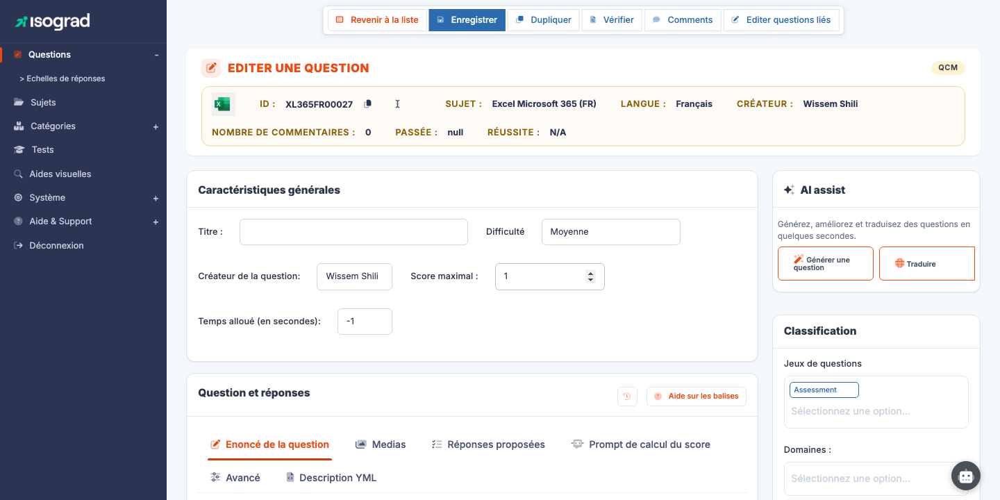
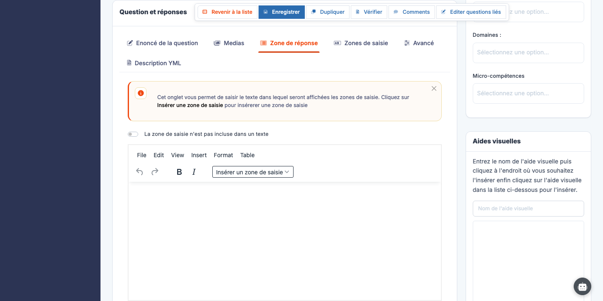
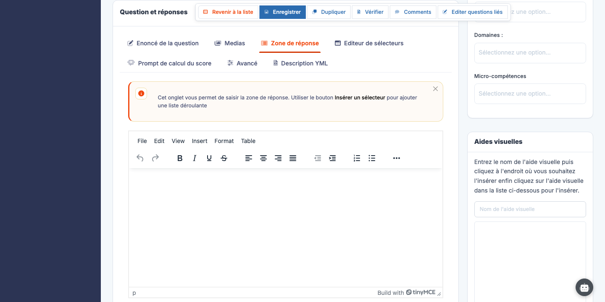
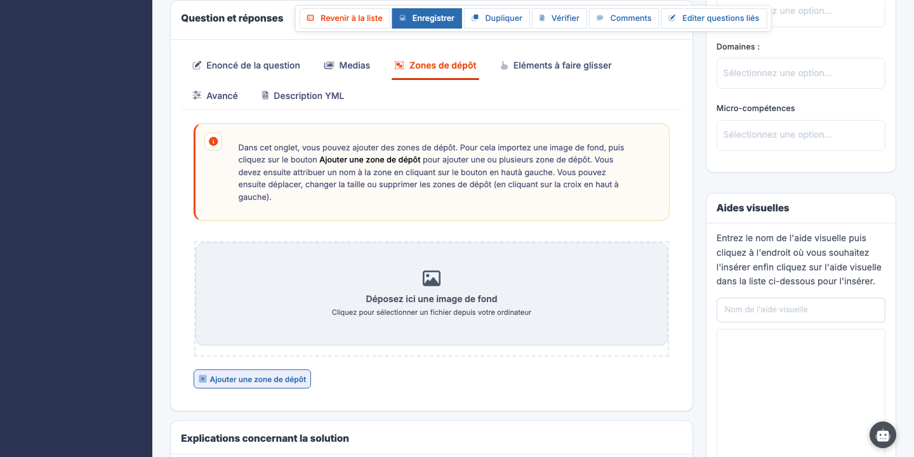
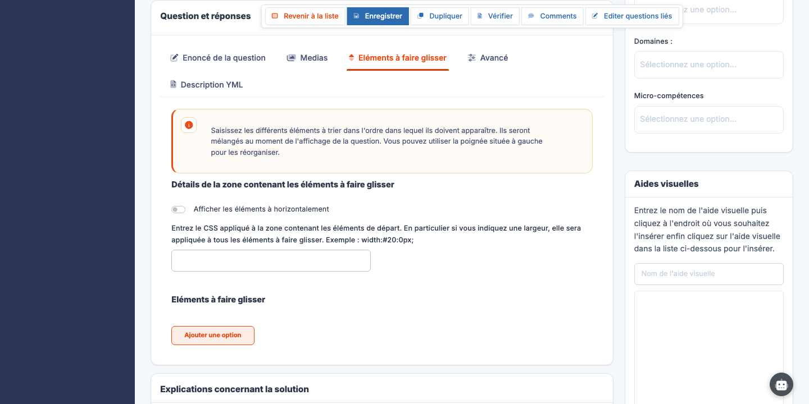
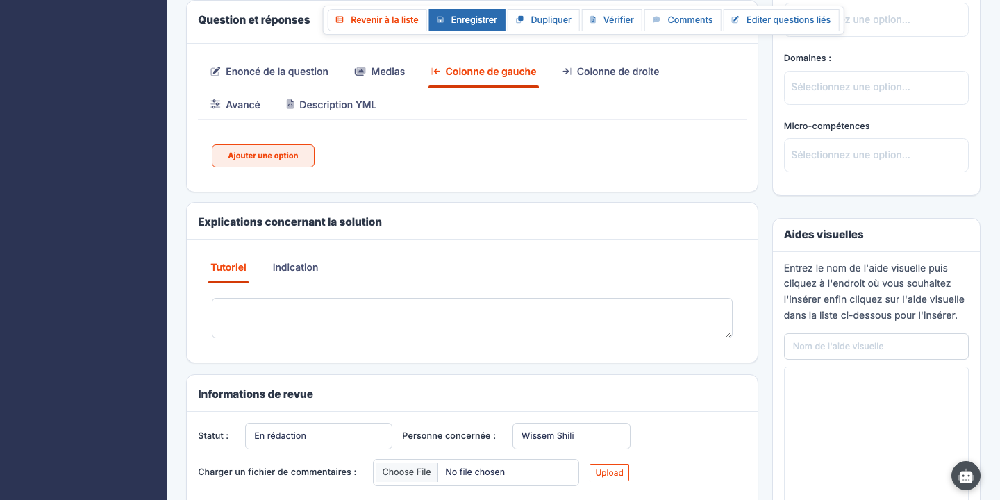
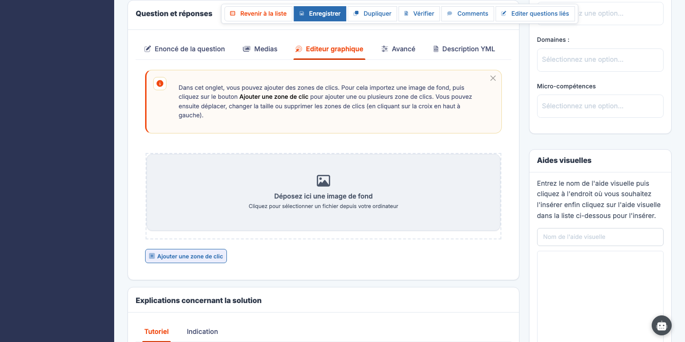
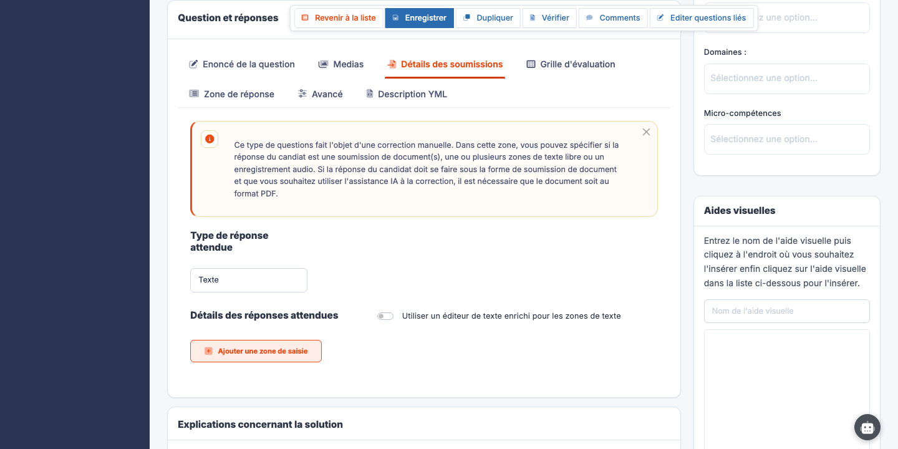
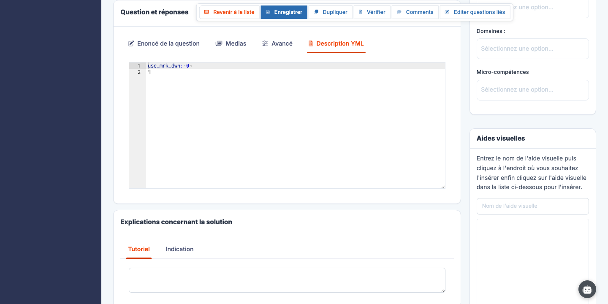
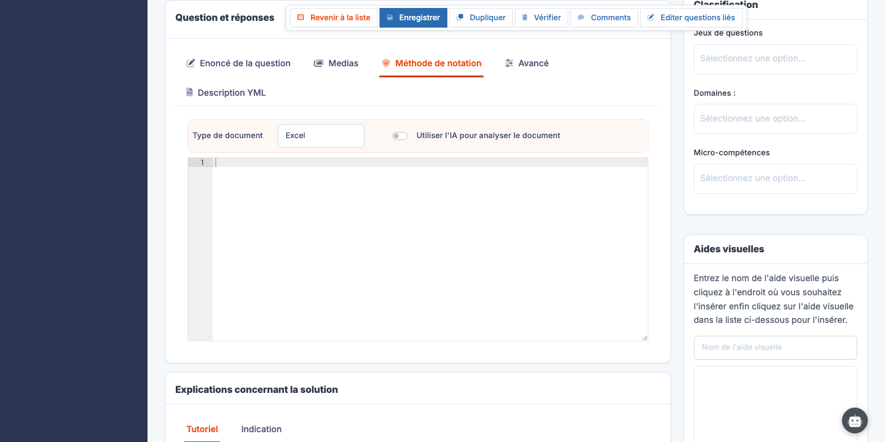

# Éditeur de questions

L'**éditeur de questions** est l'outil le plus utilisé du module Questions — c'est ici qu'on écrit les énoncés, qu'on définit les options de réponse, qu'on ajoute les illustrations et aides visuelles, et qu'on tague chaque question dans la cartographie de compétences. Tout administrateur qui produit du contenu pour la plateforme passe la majorité de son temps sur cette page.

Accédez à l'éditeur via l'icône **Modifier** (crayon) sur la ligne d'une question dans la page **[Questions](/ai/fr/question-module/questions/)**, ou en cliquant sur **Ajouter une question** sur cette même page.

> 💡 **Type de réponse et interface** — L'éditeur **adapte son interface** au **type de réponse** de la question. Une question QCM affichera une zone de saisie de propositions ; une question glisser-déposer aura un éditeur d'items à glisser ; une question à notation manuelle aura une grille d'évaluation. Ce chapitre couvre l'organisation commune **et** les spécificités par type.

## Vue d'ensemble {#vue-d-ensemble}

La page d'édition (titre **Éditer une question**) est organisée en plusieurs zones, avec un badge en haut indiquant le **type de réponse** de la question courante (QCM, Cliquer sur zone, etc.) :

1. **Barre d'outils** (au-dessus de l'en-tête) :
    - **Précédente** / **Suivante** — passe à la question précédente ou suivante de la liste courante sans repasser par celle-ci.
    - **Revenir à la liste** — retour à la page Questions.
    - **Enregistrer** — sauvegarde toutes les modifications.
    - **Dupliquer** — crée une copie de la question.
    - **Vérifier** — lance le diagnostic éditorial sur cette question (titre vide, énoncé manquant, options non marquées correctes, etc.).
    - **Comments** — ouvre la liste des commentaires laissés par les candidats sur cette question pendant les tests.
    - **Aperçu** — ouvre la question telle qu'un candidat la verra.
    - **Déverrouiller** — affiché sur une question au statut *Production* aux administrateurs disposant du privilège adéquat ; repasse la question *En rédaction* en un clic (voir [Enregistrer, prévisualiser, supprimer](#actions-finales)).

2. **Bandeau d'identité** :
    - Icône du sujet + **ID** (par exemple `S12Q0042`) avec un bouton **Copier**.
    - **Sujet**, **Langue**, **Créateur** (administrateur qui a créé la question).
    - **Nombre de commentaires**, **Passée** (nombre de passages), **Réussite** (taux de succès).

3. **Section « Caractéristiques générales »** :
    - **Titre**.
    - **Difficulté** — *Facile*, *Moyenne* ou *Difficile*, fixée par l'auteur. Affichée dans la liste des questions et utilisée à la composition des tests.
    - **Créateur de la question** (personne créditée pour la question, distincte du créateur affiché dans le bandeau).
    - **Score maximal** (par défaut 1).
    - **Temps alloué** (en secondes ; `-1` signifie « pas de limite »).

4. **Section « Question et réponses »** — c'est le cœur de l'édition, organisé en onglets (voir [Onglets de l'édition](#onglets-edition)).

5. **Section « Tutoriel »** — l'explication affichée au candidat après sa réponse (voir [Tutoriel](#tutoriel)).

6. **Bloc de revue** — le **Statut** de la question et la **Personne concernée**, plus un fichier et des commentaires pour les échanges de relecture entre auteurs.

7. **Volet « AI assist »** sur la droite — boutons de génération par IA (voir [Génération par IA](#generation-ia)).

8. **Volet « Classification »** sur la droite — jeux de questions et domaines de rattachement de la question.

> 💡 **Tout sur une seule page** — Contrairement à d'autres entités de la plateforme, l'éditeur ne navigue pas entre plusieurs pages. Toutes les modifications se font ici et sont enregistrées en un clic via le bouton **Enregistrer** en haut.

## Onglets de l'édition de la question {#onglets-edition}

La section **Question et réponses** est organisée en onglets propres au contenu de la question :

| Onglet | Contenu |
|---|---|
| **Énoncé de la question** | Le texte affiché au candidat (éditeur de texte enrichi). |
| **Médias** | Documents de référence, fichiers média et génération audio attachés à l'énoncé. |
| **Réponses proposées** (libellé variable selon le type) | Propositions de réponse ou paramètres propres au type — voir les sections par type. |
| **Prompt de calcul du score** | Pour les questions à correction IA : instructions données à l'IA pour calculer la note. |
| **Avancé** | Options avancées : **Réponse obligatoire dans les tests avec navigation**, et pour les questions à saisie libre **Verrouiller le copier/coller et la sélection**. |

Deux boutons d'aide en haut à droite de cette section :

- **Historique** (icône horloge) — historique des modifications de la question.
- **Aide sur les balises** — référence des balises de mise en forme disponibles dans l'éditeur.

> 💡 **Onglet Description YML** — Une vue YAML brute de la question existe pour quelques types de réponse (par exemple Trier). Pour les autres types elle n'est pas affichée : utilisez **Exporter en YML** sur la page Questions pour obtenir le YAML de vos questions.

## Champs communs à tous les types {#champs-communs}

### Métadonnées

- **Sujet** — sujet auquel la question est rattachée. Fixé à la création.
- **Domaines** — domaine(s) de compétence évalué(s), dans le volet **Classification**. Pour la cartographie du rapport candidat.
- **Jeux de questions** — les jeux auxquels la question appartient (voir [Jeux de questions](/ai/fr/question-module/question-sets/)), dans le volet **Classification**.
- **Statut** — *En rédaction*, *Production*, etc., dans le bloc de revue. Détermine si la question peut être posée aux candidats.
- **Personne concernée** — administrateur en charge de la question, dans le bloc de revue.
- **Langue** — fixée à la création, non modifiable. Une question = une langue.

### Titre

Le **Titre** est un libellé court qui apparaît dans la colonne *Titre* de la liste et dans les rapports de compétences : il représente la compétence testée dans la question. **Pas affiché au candidat.** Choisissez un titre **descriptif et unique** : *« Faire une somme »* est meilleur que *« Excel - question 17 »*.

### Texte de la question

Le **Texte** est l'énoncé affiché au candidat. Vous le saisissez dans un éditeur riche qui supporte :

- **Markdown** — gras, italique, listes, liens, blocs de code. Le rendu est immédiat dans la prévisualisation.
- **Formatage HTML** pour les cas avancés (tableaux, classes CSS spécifiques).
- **Insertion d'aides visuelles** via la zone de recherche dédiée (voir [Aides visuelles](#aides-visuelles)).
- **Insertion d'illustrations directes** (image à la question — voir [Illustration](#illustration)).

> 💡 **Format Markdown vs HTML** — Privilégiez Markdown pour l'écriture courante. Réservez le HTML aux cas où Markdown ne suffit pas (tableaux complexes, mise en forme spécifique).

### Illustration {#illustration}

Une **illustration** est une image attachée **directement à la question** (par opposition à une aide visuelle, qui peut être partagée entre plusieurs questions). C'est l'image principale qui accompagne l'énoncé.

- Pour **ajouter** une illustration, cliquez sur le bouton d'upload et choisissez votre fichier (PNG/JPG/SVG).
- Pour **modifier** le texte alternatif (alt text), saisissez-le dans le champ dédié — important pour l'accessibilité et pour les lecteurs d'écran.
- Pour **supprimer** l'illustration, cliquez sur le bouton **Supprimer le média**.

> 💡 **Quand illustration, quand aide visuelle ?** — Une **illustration** est propre à la question, idéale pour une image jamais réutilisée. Une **[aide visuelle](/ai/fr/question-module/visual-aids/)** est mutualisée entre plusieurs questions, idéale pour un tableau Excel ou un code source partagé sur 10 questions du même module.

### Tutoriel {#tutoriel}

La section **Tutoriel** contient l'explication affichée au candidat **après** sa réponse, en mode de révision : une **indication** et des **explications concernant la solution**. C'est le moment pédagogique : expliquer pourquoi la bonne réponse est la bonne, comment l'identifier, quelle erreur courante éviter. Format identique au texte.

### Aides visuelles {#aides-visuelles}

Vous pouvez insérer une ou plusieurs **aides visuelles** dans l'énoncé ou dans les réponses. Voir le chapitre [Aides visuelles](/ai/fr/question-module/visual-aids/) pour la création et la gestion. Dans l'éditeur de question :

- Saisissez au moins trois caractères du nom de l'aide visuelle dans la zone de **recherche d'aides visuelles** à droite.
- Choisissez l'aide visuelle dans les résultats, filtrés par le sujet et la langue de la question.
- La balise de référence est insérée dans le texte. Le rendu à l'affichage candidat sera l'image ou le document complet.

Trois variantes existent :

- **Document de référence** — document directement intégré dans la question ou sous forme d'un lien (option à activer en cochant **Afficher le document de référence de type PDF sous forme de lien**).
- **Aide visuelle affichée par un clic** — image qui apparaît sous une loupe (dans l'énoncé ou dans les réponses).
- **Aide visuelle affichée dans le texte** — image présentée comme un encart, généralement plus petite, typiquement pour les questions de touches clavier ou d'interface.

## Génération par IA {#generation-ia}

L'éditeur propose un volet latéral **AI assist** à droite de la page. Sur une question qui vient d'être créée, il comporte deux boutons :

- **Générer une question** — propose un énoncé complet (texte, propositions de réponse, bonne réponse) à partir des métadonnées de la question (sujet, domaine, titre). Proposé pour les types de réponse qui supportent la génération.
- **Traduire** — traduit le contenu de la question vers une autre langue, utile pour décliner rapidement un sujet en plusieurs versions linguistiques.

Une fois la question enregistrée une première fois, d'autres boutons apparaissent :

- **Améliorer la question** — reformule et resserre l'énoncé et les propositions existants.
- **Générer un titre** — propose un titre à partir de l'énoncé.
- **Obsolescence** — évalue si le contenu de la question risque d'être dépassé.
- **Générer un tutoriel** — rédige l'explication affichée au candidat après sa réponse.

Pour les soumissions notées par IA, un bouton **Générer le code de vérification** rédige le code de vérification à partir de l'énoncé.

> ⚠️ **L'IA propose, vous décidez** — Le contenu généré est un **point de départ**, pas un livrable final. Relisez systématiquement et corrigez avant d'enregistrer : la sortie de l'IA remplace les champs à l'écran mais n'est enregistrée qu'au clic sur **Enregistrer**. La qualité dépend du modèle d'IA choisi dans le menu **Système → Sélectionner une IA**.

## Types de réponse — vue d'ensemble {#types-de-reponse}

La plateforme propose une gamme de types de réponse, regroupables en familles. La liste exacte proposée à la création d'une question dépend de la configuration de votre plateforme.

| Famille | Types | Cas d'usage |
|---|---|---|
| **Choix multiple** | QCM texte, échelle de réponse | Évaluation classique des connaissances. |
| **Choix de réponse** | Texte à compléter avec listes déroulantes | Quand la saisie libre serait ambiguë à corriger. |
| **Questions interactives** | Glisser-déposer, Trier, Relier, Cliquer sur zone | Tests interactifs et engageants. |
| **Questions de saisie** | Texte à trous à correction automatique ou par l'IA, Dictée, Questions de saisie à correction manuelle | Évaluation de connaissances ou mises en situation. |
| **Correction automatique de document ou d'audio** | Soumission avec notation automatique | Soumission de fichiers évalués par IA. |
| **Spécifiques** | Page de transition | Cas particuliers (page entre deux parties d'un test). |

Les sections suivantes détaillent les types **les plus courants**.

## QCM — choix multiple texte {#qcm}

Le type **QCM texte** est le type le plus utilisé sur la plateforme. Le candidat voit une question et plusieurs propositions de réponse, parmi lesquelles **une ou plusieurs** sont correctes.

### Édition des propositions

L'éditeur QCM expose une liste de propositions, chacune avec :

- Un champ **texte de la proposition**.
- Une case à cocher **Correcte** indiquant si la proposition est une bonne réponse.
- Un bouton **Supprimer cette proposition**.

Un bouton **Ajouter une proposition** en bas de la liste permet d'étendre le nombre d'options. Vous pouvez avoir entre 2 et 8 propositions par question (5 est le standard recommandé).

> 💡 **Une ou plusieurs bonnes réponses ?** — Cochez **une seule** case **Correcte** pour un QCM à choix unique (le candidat ne peut sélectionner qu'une réponse). Cochez **plusieurs** cases pour un QCM à choix multiples (le candidat peut en sélectionner plusieurs, et doit toutes les trouver pour avoir la question juste). Ou utilisez **une parmi n** (plusieurs réponses sont correctes, mais il suffit que le candidat en choisisse une pour que la réponse soit considérée correcte).

### Ordre des propositions

Par défaut, les propositions sont présentées au candidat dans un **ordre aléatoire** à chaque passage. Si vous voulez forcer un ordre fixe (par exemple pour une question logique où l'ordre des choix porte du sens), cochez l'option **Ne pas mélanger les réponses** dans les options avancées de la question.

## Question d'échelle (Vrai/Faux, Likert) {#question-echelle}

Le type **Échelle** présente au candidat une question accompagnée d'une **échelle de réponse** réutilisable — par exemple une échelle Likert *« Pas du tout d'accord / Plutôt pas d'accord / Plutôt d'accord / Tout à fait d'accord »*, ou une simple échelle Vrai/Faux.

### Édition

- **Sélectionnez l'échelle** dans la liste déroulante (voir [Échelles de réponse](/ai/fr/question-module/answer-scales/) pour gérer les échelles disponibles).
- L'éditeur affiche les options de l'échelle sélectionnée et vous laisse cocher la **bonne réponse** (une seule case cochée). Pour ajouter une nouvelle échelle, allez dans le menu **Questions → Echelles de réponses**, puis **Ajouter une échelle de réponses**.

> 💡 Pour les questions où la notion de bonne ou de mauvaise réponse n'existe pas, cochez l'option **Pas de notion de bonne réponse (formulaire, test de personnalité...)**.

## Texte à trous {#texte-a-trous}

Le type **Texte à trous** présente un texte avec un ou plusieurs **champs de saisie** que le candidat doit remplir.

### Édition

Dans le texte de la question, vous insérez des **zones de saisie** avec le bouton **Insérer une zone de saisie**. L'éditeur expose ensuite, pour chaque zone, un bloc de configuration :

- **Réponse correcte** — texte exact attendu.
- **Variantes acceptées** — autres orthographes ou formulations également comptées correctes.
- **Sensibilité à la casse** — si la comparaison doit être sensible aux majuscules/minuscules.

### Texte à compléter avec listes déroulantes

Une variante propose au candidat une **liste déroulante** plutôt qu'un champ de saisie libre. Pour chaque trou, vous définissez la liste des options et l'option correcte.

## Glisser-déposer {#drag-and-drop}

Le type **Glisser-déposer** présente au candidat des **items** à glisser-déposer dans des **zones cibles**.

### Édition

- Définissez la liste des **items** (texte, image, ou les deux).
- Définissez les **zones cibles** dans l'illustration de fond (généralement une image avec des emplacements numérotés).
- Pour chaque item, précisez la **zone cible correcte**.

## Trier — ordonnancement {#sortable}

Le type **Trier** présente au candidat une liste d'items à **réordonner** pour les mettre dans l'ordre correct.

### Édition

- Définissez la liste des items dans l'ordre **correct**.
- À la présentation au candidat, ils seront automatiquement mélangés.
- Le candidat doit les remettre dans le bon ordre.

## Relier — appariement {#link}

Le type **Relier** propose au candidat deux colonnes d'items qu'il doit **apparier** par paires.

### Édition

- Définissez deux listes : la **colonne A** et la **colonne B**.
- Indiquez quelles paires sont les bonnes associations.
- Vous pouvez avoir des correspondances 1-vers-1 ou des correspondances 1-vers-plusieurs selon votre configuration.

## Cliquer sur zone {#click-in-area}

Le type **Cliquer sur zone** présente au candidat une **image** sur laquelle il doit cliquer à un endroit précis (un bouton dans une capture d'écran, une zone d'un schéma…).

### Édition

- Téléversez l'image cible.
- Définissez la ou les **zones correctes** par coordonnées rectangulaires.
- Le candidat clique : le clic est considéré juste s'il tombe dans une zone correcte.

## Notation manuelle (Manual marking) {#manual-marking}

Le type **Notation manuelle** présente au candidat une question à réponse **libre** (rédaction, schéma, enregistrement) qui sera **notée à la main** par un correcteur après la soumission.

### Variantes

- **Sans soumission de document** — le candidat saisit sa réponse dans un champ de texte simple.
- **Avec soumission de document** — le candidat upload un ou plusieurs documents (audio, vidéo, fichier). Le type de document autorisé est configurable.

### Édition

- Définissez le **prompt** (la consigne) dans le texte de la question.
- Si soumission de document : précisez les **formats acceptés** et le **nombre maximum** de fichiers.
- Définissez la **grille d'évaluation** ou les critères d'évaluation — pour guider les correcteurs humains (la **grille d'évaluation** est visible des correcteurs, qui notent chaque critère préalablement établi).

Voir aussi la section [Noter un test](/ai/fr/results/#noter-un-test) du manuel administrateur pour le workflow de correction côté évaluateur.

## Test de saisie {#typing}

Les types **Test de saisie** et **Test de saisie avec correction** évaluent la **vitesse et la précision de frappe** du candidat.

### Édition

- Saisissez le **texte de référence** que le candidat devra recopier.
- Configurez la **durée du test** (en secondes).
- Le score est calculé à partir du nombre de caractères corrects par minute, avec une pénalité pour les erreurs.

La variante **avec correction** permet au candidat de **revenir en arrière et corriger** ses erreurs ; sans correction, chaque frappe est définitive.

## Correction automatique de document ou d'audio {#upload-auto-grading}

Le type **Correction automatique de document ou d'audio** permet au candidat de **soumettre un fichier** (typiquement un document Word/Excel, une capture d'écran ou un enregistrement audio) qui est ensuite **analysé par IA** pour produire automatiquement une note.

### Édition

- Précisez le **format de fichier attendu**.
- Rédigez un **prompt d'analyse** qui guide l'IA dans sa notation : *« Vérifier que le document contient un tableau avec au moins 5 lignes, que la première colonne s'appelle 'Nom', et que la mise en forme est cohérente »*.
- Choisissez le **mode d'analyse** : strict (notation binaire) ou nuancé (note sur 100 avec commentaire).

> ⚠️ **Notation IA non-déterministe** — Les notes IA peuvent légèrement varier d'un passage à l'autre. Réservez ce type aux **évaluations formatives**, pas aux certifications à fort enjeu. Pour une notation rigoureuse, utilisez **[Notation manuelle](#manual-marking)** avec un correcteur humain.

## Sauvegarder, prévisualiser, supprimer {#actions-finales}

### Enregistrer

Le bouton **Enregistrer** en haut de l'éditeur sauvegarde l'ensemble des modifications. La sauvegarde se fait sans rechargement de page : une notification de succès apparaît en haut à droite.

> ⚠️ **Les questions en Production sont en lecture seule** — Dès que le **Statut** d'une question est passé à *Production* et enregistré, le contenu de l'éditeur devient en lecture seule : la question est posée aux candidats et doit rester stable. Seul le **bloc de revue** reste modifiable. Pour modifier la question, repassez-y son **Statut** à *En rédaction* et cliquez sur **Enregistrer** : la page se recharge déverrouillée, et la question cesse d'être posée jusqu'à son retour en *Production*. Les administrateurs disposant du privilège adéquat peuvent aussi cliquer sur **Déverrouiller** dans la barre d'outils, qui fait la même chose et leur attribue la question.

### Vérifier

Le bouton **Vérifier** lance le diagnostic éditorial de la question : titre ou énoncé vide, aucune proposition marquée correcte, média manquant, etc. Lancez-le avant de passer le statut à *Production*.

### Prévisualiser

Le bouton **Aperçu** ouvre la question telle qu'elle apparaîtra à un candidat (énoncé rendu, options affichées, illustrations chargées). C'est l'étape obligatoire avant toute mise en production : un énoncé qui semble clair en édition peut être ambigu une fois rendu côté candidat.

### Naviguer entre questions

Les boutons **Précédente** et **Suivante** en haut de la page permettent de passer aux questions voisines de la liste courante **sans repasser par la liste**. Pratique pour les revues éditoriales en masse.

### Supprimer

L'icône **Supprimer** sur la ligne de la question dans la liste supprime la question après confirmation. La suppression est refusée si la question fait partie de la liste fixe de questions d'un **test**.

> 💡 **Préférer le statut « À supprimer » à la suppression** — Pour retirer une question de la circulation sans perdre l'historique, **changez son statut** à *À supprimer* plutôt que de la supprimer. La question quitte la liste par défaut (un filtre permet de la réafficher), ses passages historiques restent analysables, et elle n'est plus posée aux nouveaux candidats.

## Bonnes pratiques de rédaction {#bonnes-pratiques}

- **Un énoncé court et net** — visez 3 phrases au plus pour la question. Si l'énoncé devient long, vérifiez si une **aide visuelle** ne serait pas plus claire.
- **Cinq propositions pour les QCM** — c'est le nombre qui maximise la difficulté discriminante sans surcharger cognitivement le candidat.
- **Éviter les pièges artificiels** — pas de doubles négations, pas de différences subtiles d'orthographe entre les options. Un candidat doit échouer parce qu'il ne connaît pas la réponse, pas parce qu'il a mal lu.
- **Documenter le tutoriel** — le tutoriel est la **valeur pédagogique** de la question. C'est ce qui distingue une simple évaluation d'un outil d'apprentissage.
- **Tester avant de publier** — passez la question à un collègue (ou à vous-même via l'aperçu) avant de la passer en statut *Production*. Les questions cassées en production dégradent la qualité perçue.
