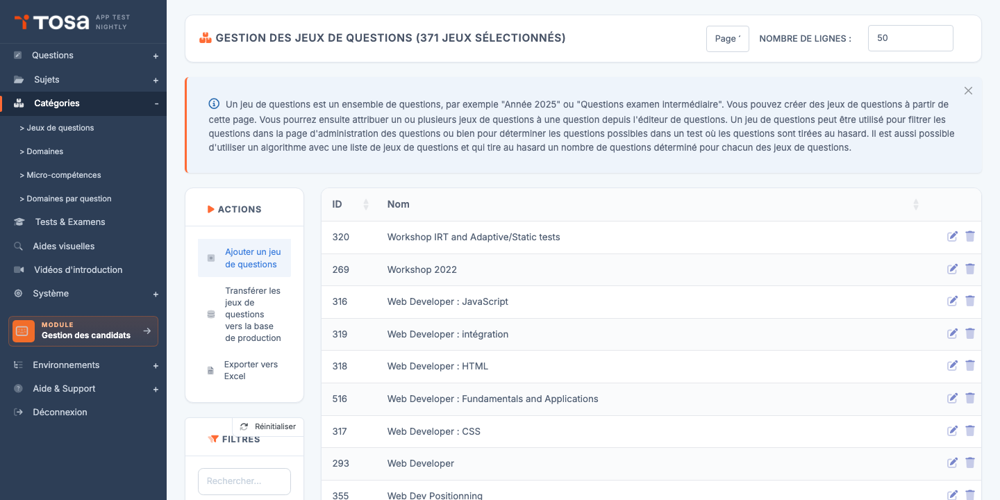
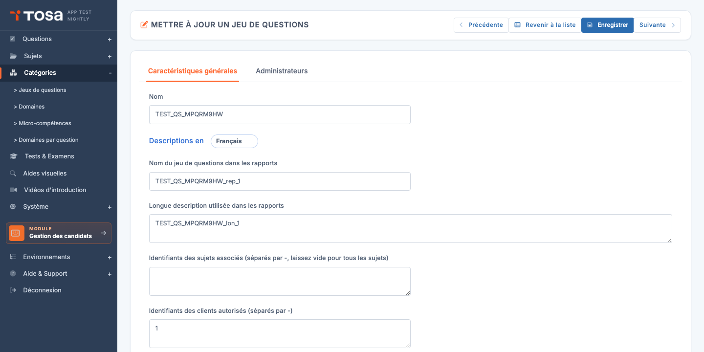

# Jeux de questions

Un **jeu de questions** (« question set ») regroupe un ensemble de questions cohérentes que vous voulez **garder ensemble** lors de la composition des formulaires de test : un exercice multi-questions sur un même contexte, une série de questions héritées d'un fournisseur tiers, un module thématique réutilisable d'un formulaire à l'autre.

Accédez à la page via le menu **Module Questions → Catégories → Jeux de questions**, ou directement à `/questionsets/AdminQuestionSetsWithTable`.

Le tableau liste tous les jeux définis, avec leur **identifiant** et leur **nom**. Les filtres permettent de cibler par texte ou d'inclure les jeux archivés.

## Pourquoi utiliser un jeu de questions ? {#pourquoi-utiliser}

Les jeux de questions répondent à plusieurs besoins :

- **Cohérence de présentation** — un jeu de questions sur un même tableau Excel doit être montré comme un bloc cohérent au candidat, pas dispersé entre des questions sans lien.
- **Réutilisabilité** — un module thématique préparé une fois peut être ré-injecté dans plusieurs formulaires de test (évaluation, certification, positionnement) sans dupliquer les questions.
- **Origine éditoriale** — un jeu peut représenter une **commande externe** (questions achetées à un partenaire), avec son propre cycle de vie indépendant.
- **Maintenance groupée** — modifier le commentaire ou la description d'un jeu se propage à toutes ses questions.

> 💡 **Jeu vs domaine** — Un *domaine* est un découpage **pédagogique** (compétences évaluées). Un *jeu* est un découpage **organisationnel** (regroupement éditorial). Une question appartient à un seul domaine mais peut faire partie d'aucun ou d'un seul jeu.

## Créer un jeu de questions {#creer-un-jeu}

La création est **directe** — pas de modal de pré-création.

1. Depuis la page **Gestion des jeux de questions**, cliquez sur **Créer un jeu de questions** dans la barre d'actions.

2. La plateforme crée un enregistrement vide et vous amène sur la fiche d'édition (`QuestionSetUpdate?que_set_id=<new_id>`).

3. Remplissez les onglets et enregistrez — voir [Onglets de la fiche](#onglets-de-la-fiche) ci-dessous.

## Onglets de la fiche {#onglets-de-la-fiche}

La fiche d'édition (titre **METTRE À JOUR UN JEU DE QUESTIONS**) propose **deux onglets** :

### Onglet « Caractéristiques générales »

- **Nom** — libellé interne du jeu, affiché dans la liste et utilisé pour le retrouver lors de la composition d'un formulaire.

Sous ce champ, un bloc multilingue (sélecteur **« Descriptions en »** en haut, avec la langue courante) avec deux champs par langue :

- **Nom du jeu de questions dans les rapports** — libellé court qui apparaît dans le rapport du candidat pour signaler les questions appartenant à ce jeu. Par exemple *« Exercice : Synthèse de données ventes »*.
- **Longue description utilisée dans les rapports** — texte plus développé, affiché dans le rapport en regard du nom.

Plus bas, deux champs de **rattachement** :

- **Identifiants des sujets associés** — texte libre de la forme `12-45-89` (identifiants séparés par des tirets). **Laissez vide** pour rendre le jeu utilisable sur **tous** les sujets ; renseignez une liste pour le restreindre à certains sujets.
- **Identifiants des clients autorisés** — texte libre de la forme `1-2-3` (identifiants de comptes clients). Permet de **réserver** ce jeu à un ou plusieurs comptes clients spécifiques — utile pour les modules confidentiels ou commandés par un client précis. Mettez `1` pour le compte courant uniquement.

Et plus bas encore (selon la résolution d'écran, vous devrez peut-être faire défiler) :

- **Archivé** — commutateur. Un jeu archivé reste utilisable dans les formulaires existants mais n'apparaît plus dans la liste par défaut ni dans les sélecteurs de composition.
- **Commentaire** — texte libre d'usage interne. Documentation pour les rédacteurs : *« Jeu commandé à XYZ Consulting, livraison juin 2025 »*.

### Onglet « Administrateurs »

Liste des administrateurs habilités à voir et modifier ce jeu — même logique que l'onglet du même nom dans la fiche d'un [sujet](/ai/question-module/subjects/#administrateurs-autorises) :

- Cochez les administrateurs autorisés.
- Décochez pour révoquer.
- Utilisez le champ **Filtrer** pour retrouver rapidement un administrateur dans une longue liste.

> 💡 **Cloisonnement éditorial** — Utile quand vous voulez réserver l'édition d'un jeu sensible (par exemple un module sous NDA d'un partenaire) à une équipe restreinte.

## Ajouter des questions à un jeu {#ajouter-des-questions}

Contrairement aux domaines, les questions **ne se rattachent pas** à un jeu depuis la fiche du jeu. Le rattachement se fait depuis la **fiche d'une question** : ouvrez l'éditeur d'une question, et dans son onglet de classification, sélectionnez le jeu auquel elle doit appartenir.

Une question peut appartenir à **un seul jeu** (ou à aucun). Pour transférer une question d'un jeu à un autre, modifiez son rattachement depuis sa fiche.

> 💡 **Vérifier le contenu d'un jeu** — Depuis la liste des jeux, un lien **Voir les questions associées** ouvre la page **AdminQuestionsWithTable** pré-filtrée sur le jeu courant. C'est la façon la plus rapide de vérifier d'un coup d'œil quelles questions composent un jeu.

## Filtres {#filtres}

Le panneau **Filtres** propose :

- **Rechercher** — texte libre sur le nom du jeu.
- **Inclure les archivés** — commutateur (`filter_is_arc`). Désactivé par défaut, à activer pour faire apparaître les jeux marqués comme archivés.

Le tri est disponible sur chaque colonne en cliquant sur l'en-tête.

## Archiver vs supprimer {#archiver-vs-supprimer}

Pour retirer un jeu de la circulation sans perdre son contenu, vous avez deux options :

- **Archiver** (`is_arc=1`) — recommandé pour les jeux obsolètes mais référencés dans des formulaires en production. Le jeu disparaît de la liste par défaut et des sélecteurs de composition, mais reste fonctionnel pour les formulaires qui l'utilisent. Réversible à tout moment.
- **Supprimer** — irréversible. Possible uniquement si **aucune question** n'est rattachée au jeu. Si des questions y sont liées, la plateforme bloque la suppression et affiche un message d'erreur (`qset_cantdel`).

### Procédure de suppression

1. Sur la ligne du jeu, cliquez sur l'icône **Supprimer**.
2. Confirmez via le bouton **Supprimer** sur la page de confirmation.

> ⚠️ **Préférer l'archivage** — Sauf si vous savez que le jeu est créé par erreur et non utilisé, **archivez plutôt que supprimer**. Vous gardez la possibilité de réactiver le jeu et de retracer son historique éditorial.
