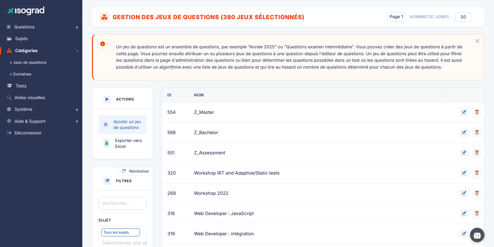
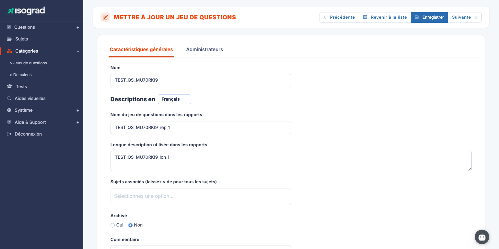

# Jeux de questions

Un **jeu de questions** regroupe un ensemble cohérent de questions que l'on souhaite **garder ensemble** lors de la composition des tests : un exercice à plusieurs questions sur le même contexte, une série de questions issue d'un fournisseur tiers, un module thématique réutilisable d'un test à l'autre.

Accédez à la page via le menu **Catégories → Jeux de questions**.

Le tableau liste tous les jeux définis, avec leur **identifiant** et leur **nom**. Les jeux archivés apparaissent grisés lorsqu'ils sont affichés.

## Pourquoi utiliser un jeu de questions ? {#pourquoi-utiliser}

Les jeux de questions répondent à plusieurs besoins :

- **Composition des tests** — lorsqu'un test tire ses questions au hasard, les jeux de questions font partie des critères disponibles pour définir le vivier.
- **Réutilisabilité** — un module thématique préparé une fois peut être réinjecté dans plusieurs tests sans dupliquer les questions.
- **Origine éditoriale** — un jeu peut représenter une **commande externe** (questions achetées à un partenaire), avec son cycle de vie propre.
- **Rapports** — le nom et la description « rapport » du jeu peuvent être affichés dans le rapport du candidat à côté des questions qu'il contient.

> 💡 **Jeu vs domaine** — Un *domaine* est un découpage **pédagogique** (compétences évaluées). Un *jeu* est un découpage **organisationnel** (regroupement éditorial). Une question appartient à un domaine mais peut faire partie de plusieurs jeux.

## Créer un jeu de questions {#creer-un-jeu}

La création est **directe** — pas de fenêtre préalable.

1. Depuis la page **Gestion des jeux de questions**, cliquez sur **Ajouter un jeu de questions** dans la barre d'actions.

2. La plateforme crée un enregistrement vide et vous amène sur la fiche d'édition (page **Mettre à jour un jeu de questions**).

3. Renseignez les onglets et enregistrez — voir [Onglets de la fiche](#onglets-de-la-fiche) ci-dessous.

> ⚠️ **Jeux vides** — Le jeu existe dès le clic sur le bouton. Si vous quittez la fiche sans enregistrer, un jeu sans nom reste dans la liste.

## Onglets de la fiche {#onglets-de-la-fiche}

### Onglet « Caractéristiques générales »

- **Nom** — libellé interne du jeu, affiché dans la liste et utilisé pour le retrouver lors de la composition d'un test.

Sous ce champ, un bloc multilingue (sélecteur **« Descriptions en »** en haut, avec la langue courante) avec deux champs par langue de rapport :

- **Nom du jeu de questions dans les rapports** — libellé court qui apparaît dans le rapport du candidat pour signaler les questions appartenant à ce jeu. Par exemple *« Exercice : synthèse des données de vente »*.
- **Longue description utilisée dans les rapports** — texte plus détaillé, affiché dans le rapport à côté du nom.

Plus bas :

- **Sujets associés (laissez vide pour tous les sujets)** — sélection multiple. **Laissez vide** pour que le jeu soit utilisable sur **tous** les sujets ; choisissez des sujets pour le restreindre. Une question ne peut être ajoutée qu'à un jeu dont les sujets incluent celui de la question.
- **Archivé** (Oui / Non) — un jeu archivé reste utilisable dans les tests existants mais n'apparaît plus dans la liste par défaut.
- **Commentaire** — texte libre à usage interne, par exemple l'origine du jeu ou sa date de livraison.
- **Attribuer ce jeu à des questions** — bouton affiché aux administrateurs principaux, voir [Ajouter des questions au jeu](#ajouter-des-questions).
- **Afficher les questions utilisant ce jeu de questions** — lien ouvrant la page **Questions** pré-filtrée sur ce jeu, dans un nouvel onglet.

### Onglet « Administrateurs »

Il liste les administrateurs du compte qui travaillent dans le module Questions sans disposer du privilège de voir **tous** les jeux ; cochez ceux autorisés à voir et modifier ce jeu :

- Cochez les administrateurs autorisés.
- Décochez pour révoquer.
- Utilisez le champ **Filtrer** pour retrouver rapidement un administrateur dans une longue liste.

Vous n'apparaissez pas dans cette liste : le jeu reste visible pour vous tant que vous l'avez créé.

> 💡 **Cloisonnement éditorial** — Utile quand vous voulez restreindre l'édition d'un jeu sensible (par exemple un module sous NDA d'un partenaire) à une petite équipe.

## Ajouter des questions au jeu {#ajouter-des-questions}

Il existe deux façons de rattacher des questions à un jeu :

- **Depuis l'éditeur de questions** — dans le volet **Classification** d'une question, choisissez le ou les jeux auxquels elle appartient dans le champ **Jeux de questions**. C'est la méthode courante.
- **Depuis la fiche du jeu** (administrateurs principaux) — cliquez sur **Attribuer ce jeu à des questions**, collez les **identifiants des questions séparés par des espaces** dans la fenêtre, puis enregistrez. Chaque question doit appartenir à l'un des sujets du jeu, sinon la plateforme la refuse.

> 💡 **Vérifier le contenu d'un jeu** — Depuis la fiche du jeu, le lien **Afficher les questions utilisant ce jeu de questions** ouvre la page **Questions** pré-filtrée sur le jeu courant. C'est le moyen le plus rapide de voir d'un coup d'œil les questions qui le composent.

## Filtres {#filtres}

Le panneau **Filtres** propose :

- **Rechercher** — texte libre sur le nom du jeu.
- **Sujet** — restreint la liste aux jeux associés au(x) sujet(s) sélectionné(s).
- **Afficher les jeux de questions archivés** — commutateur, désactivé par défaut ; activez-le pour afficher les jeux marqués comme archivés.

Le tri est disponible sur chaque colonne en cliquant sur l'en-tête.

## Archiver vs supprimer {#archiver-vs-supprimer}

Pour retirer un jeu de la circulation sans perdre son contenu, deux options :

- **Archiver** — recommandé pour les jeux obsolètes encore référencés dans des tests. Passez **Archivé** à *Oui* sur la fiche du jeu. Le jeu disparaît de la liste par défaut mais reste fonctionnel pour les tests qui l'utilisent. Réversible à tout moment.
- **Supprimer** — irréversible. Possible uniquement si **aucune question** n'est attachée au jeu. Si des questions sont liées, la plateforme bloque la suppression et affiche le message « Vous ne pouvez pas supprimer ce jeu de questions car il est utilisé par des questions ».

### Procédure de suppression

1. Sur la ligne du jeu, cliquez sur l'icône **Supprimer**.
2. Confirmez via le bouton **Supprimer** de la page qui s'ouvre.

> ⚠️ **Préférer l'archivage** — Sauf si vous savez que le jeu a été créé par erreur et n'est pas utilisé, **archivez plutôt que supprimer**. Vous conservez la possibilité de réactiver le jeu et de tracer son historique éditorial.
