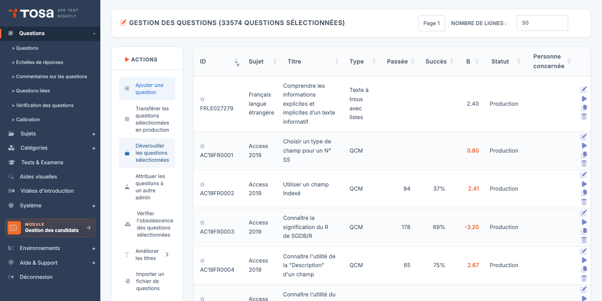
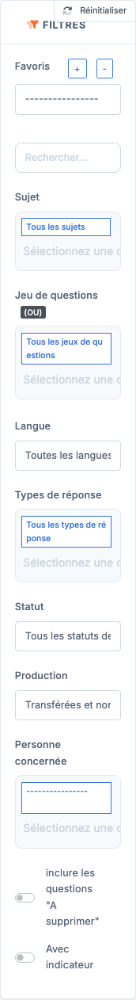
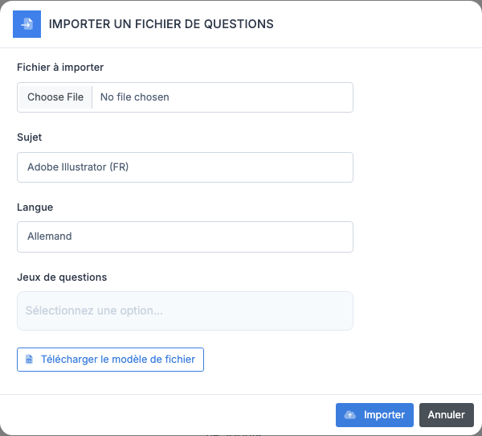
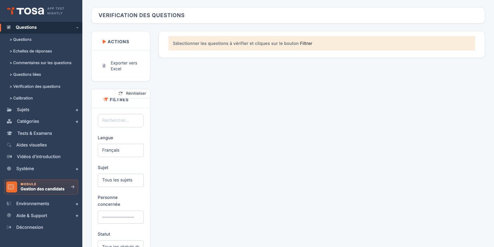

# Questions

La page **Gestion des questions** est le **centre névralgique** du module Questions : c'est ici que vous retrouvez toutes les questions rédigées sur la plateforme, que vous filtrez selon plusieurs dimensions (sujet, domaine, statut, responsable…), et d'où vous lancez l'**éditeur** pour créer ou modifier une question.

Le fonctionnement détaillé de l'éditeur lui-même est couvert dans le chapitre [Éditeur de questions](/ai/question-module/question-editor/).

Accédez à la page via le menu **Module Questions → Questions**, ou directement à `/questions/AdminQuestionsWithTable`.

Le tableau présente les colonnes suivantes :

| Colonne | Contenu |
|---|---|
| **ID** | Identifiant texte de la question (`que_str_id`, par exemple `AC19FR0001`). Le ☆ devant l'ID est le bouton d'étoile/favori. |
| **Sujet** | Sujet auquel la question est rattachée. |
| **Titre** | Libellé court de la question. |
| **Type** | Type de réponse : QCM, Texte à trous, Code, Manipulation, etc. |
| **Passée** | Nombre de fois où la question a déjà été posée à des candidats. |
| **Succès** | Taux de succès (%) — pourcentage de candidats ayant correctement répondu. |
| **B** | **Indice de difficulté** issu du modèle IRT (Item Response Theory) — plus la valeur est haute, plus la question est difficile. Une valeur **négative** indique une question facile, **positive** une question difficile. |
| **Statut** | État éditorial : *Brouillon*, *En revue*, *Production*, etc. |
| **Personne concernée** | Administrateur en charge de la maintenance de la question. |

> 💡 **Sous-pages du menu Questions** — Le menu **Questions** dans la barre latérale donne aussi accès à : **Échelles de réponses**, **Commentaires sur les questions**, **Questions liées**, **Vérification des questions** et **Calibration**. Ces sous-pages sont documentées dans leurs chapitres dédiés.

## Filtres {#filtres}

Le panneau **Filtres** est très complet — c'est l'outil principal pour explorer un référentiel volumineux (plusieurs milliers de questions par sujet).

### Filtres de base

- **Recherche** — texte libre (sur l'ID de la question, le titre, ou des fragments de contenu).
- **Sujet** — Choices.js multi-sélection. Restreindre à un ou plusieurs sujets.
- **Langue** — la langue de la question.
- **Type de réponse** — QCM (choix unique / multiple), Code, Manipulation, Vrai/Faux, Rédaction, etc.
- **Statut question** — *Brouillon*, *En revue*, *Active*, *Désactivée*. Permet de filtrer le pipeline éditorial.

### Filtres avancés

Ces filtres ne deviennent utilisables qu'**après avoir sélectionné un sujet** (ils nécessitent le contexte d'un sujet pour proposer leurs options) :

- **Domaine** — restreindre aux questions rattachées à un domaine donné du sujet sélectionné.
- **Jeu de questions** — restreindre aux questions appartenant à un jeu donné.
- **Responsable** — restreindre aux questions sous la responsabilité d'un administrateur donné.

### Réinitialiser

Le bouton **Réinitialiser** en haut du panneau remet tous les filtres à leurs valeurs par défaut et recharge le tableau complet.

## Favoris de recherche {#favoris-de-recherche}

Les **favoris** vous permettent de mémoriser une **combinaison de filtres** souvent utilisée pour la rappeler en un clic — par exemple *« Toutes les questions Excel 365 en statut Brouillon assignées à moi »*.

### Créer un favori

1. Appliquez les filtres souhaités (sujet, statut, responsable…).
2. Cliquez sur **Sauvegarder comme favori** dans la barre des favoris.
3. Saisissez un nom pour le favori (par exemple `Excel-Brouillons-Marie`).
4. Validez. Le favori apparaît dans le sélecteur déroulant des favoris.

### Utiliser un favori

Dans le sélecteur **Favoris**, choisissez le favori souhaité. La page se recharge avec les filtres mémorisés appliqués automatiquement.

### Supprimer un favori

Sélectionnez le favori, puis cliquez sur **Supprimer le favori**. Le favori est retiré du sélecteur.

> 💡 **Favoris personnels** — Les favoris sont **propres à votre compte administrateur** : ils ne sont pas partagés avec les autres rédacteurs. Si vous voulez partager une vue, communiquez-en simplement l'URL — les filtres appliqués sont reflétés dans la query string.

## Étoiler une question {#etoiler-une-question}

Sur la colonne **Titre** de chaque ligne, une **icône étoile** vous permet de marquer une question pour la retrouver rapidement plus tard :

- **Cliquez sur l'étoile** pour ajouter la question à vos favoris personnels (l'étoile passe à un état actif/plein).
- **Cliquez à nouveau** pour la retirer.

Les questions étoilées peuvent ensuite être filtrées via un filtre dédié (ou retrouvées d'un coup d'œil à leur étoile pleine dans n'importe quelle liste).

> 💡 **Différence avec les favoris de recherche** — Étoiler **une question** sauvegarde une **question individuelle**. Un **favori de recherche** sauvegarde une **combinaison de filtres**. Les deux mécanismes sont complémentaires.

## Actions sur une ligne {#actions-sur-une-ligne}

Chaque ligne du tableau présente plusieurs boutons d'action en bout de ligne :

- **Éditer** (crayon) — ouvre la page d'édition de la question. Voir [Éditeur de questions](/ai/question-module/question-editor/).
- **Prévisualiser** (icône Play) — ouvre la **prévisualisation** de la question telle qu'elle apparaîtra à un candidat (énoncé, options, aide visuelle). Permet de valider visuellement sans démarrer un vrai test.
- **Dupliquer** — crée une copie de la question, ouvre sa fiche d'édition. La copie hérite de tout (énoncé, réponses, paramètres) mais a un nouvel `id`.
- **Supprimer** — supprime la question. Refusée si la question a déjà été passée par des candidats.

## Actions de masse (panneau ACTIONS) {#actions-de-masse}

Le panneau **ACTIONS** à gauche de la page propose plusieurs opérations applicables à **plusieurs questions** à la fois (sélectionnées via les cases en début de ligne) :

- **Ajouter une question** — ouvre l'éditeur pour créer une nouvelle question.
- **Transférer les questions sélectionnées en production** — promeut les questions sélectionnées de l'environnement de préproduction vers la production. Réservé aux opérations stratégiques (refonte d'un sujet, nouvelle vague de questions calibrées).
- **Déverrouiller les questions sélectionnées** — libère le verrou éditorial posé par un autre administrateur sur les questions sélectionnées (utile quand quelqu'un est parti en congé en laissant des questions verrouillées).
- **Attribuer les questions à un autre admin** — change le responsable (« Personne concernée ») d'un coup pour plusieurs questions. Pratique lors d'un transfert de portefeuille éditorial.
- **Vérifier l'obsolescence des questions sélectionnées** — lance un diagnostic automatique pour détecter les questions trop anciennes, jamais passées, ou avec un taux d'échec aberrant.
- **Améliorer les titres** — outil semi-automatique pour reformuler ou normaliser les titres de plusieurs questions à la fois (par IA générative selon votre configuration).
- **Importer un fichier de questions** — voir [Importer des questions](#importer-des-questions) ci-dessous.

> ⚠️ **Le transfert en production est irréversible** — Vérifiez minutieusement les questions sélectionnées avant de déclencher le transfert : une fois en production, elles sont immédiatement disponibles aux comptes clients réels.

## Importer des questions {#importer-des-questions}

L'import vous permet de créer plusieurs questions en une seule opération via un fichier Excel.

1. Cliquez sur **Importer un fichier de questions** dans la barre d'actions.

    

2. Renseignez :

    - **Sujet** auquel les questions importées seront rattachées.
    - **Langue** des questions.
    - **Jeu de questions** (facultatif) — le jeu auquel rattacher toutes les questions importées en bloc.
    - **Fichier Excel** — sélectionnez votre fichier au format attendu.

3. Cliquez sur **Importer**. Le serveur traite le fichier et redirige vers la liste des questions, en signalant le nombre de questions créées et les éventuelles erreurs ligne par ligne.

> 💡 **Modèle de fichier** — Téléchargez le **modèle Excel** via le lien dans la fenêtre d'import. Il indique les colonnes attendues : énoncé, options de réponse, bonne réponse, domaine, niveau, etc. Le format dépend du type de questions à importer.

## Exporter vers Excel {#exporter-vers-excel}

Le bouton **Exporter vers Excel** dans la barre d'actions génère un fichier `.xlsx` listant toutes les questions actuellement filtrées. Pratique pour les audits du référentiel, les revues éditoriales ou la communication à des contributeurs externes.

## Prévisualiser une question {#previsualiser-une-question}

Le bouton **Prévisualiser** (icône Play) sur chaque ligne ouvre la question telle qu'elle sera présentée au candidat :

- L'**énoncé** rendu (HTML, math, code, image…).
- Les **options de réponse** ou la zone de saisie selon le type de question.
- Toute **aide visuelle** (image, PDF) attachée.

Vous pouvez interagir avec la question (cliquer des options, saisir du code, manipuler) pour vérifier le comportement. **Aucun résultat n'est enregistré** — c'est un test à blanc.

> 💡 **Quand l'utiliser ?** — Toujours prévisualiser après modification d'une question pour vérifier le rendu côté candidat. C'est aussi indispensable lors de la revue éditoriale pour valider la qualité avant de passer le statut à *Active*.

## Vérification des questions {#verification-des-questions}

La page **Vérification des questions** (URL : `/questions/CheckAllQuestionsWithTable`) est un **outil de diagnostic** qui identifie les questions présentant des anomalies éditoriales sur un sujet donné — par exemple : aucune bonne réponse marquée, options manquantes, traduction incomplète, fichier d'aide visuelle référencé mais introuvable, etc.

### Utilisation

1. Accédez à la page via un lien dédié ou directement à l'URL ci-dessus.
2. Sélectionnez le **sujet** dans le filtre.
3. Cliquez sur le bouton de vérification : le serveur scanne toutes les questions du sujet et liste celles qui présentent un problème.
4. Le tableau affiche pour chaque question problématique : **ID**, **Titre**, **Auteur**, **Diagnostic** (la nature du problème).

5. Cliquez sur l'**ID** ou le **Titre** pour ouvrir l'éditeur de la question et corriger.

> 💡 **Routine de qualité** — Lancez cette vérification **à chaque revue éditoriale majeure** ou avant un transfert en production. C'est l'outil le plus efficace pour rattraper les oublis (option non marquée comme correcte, traduction manquante).

### Exporter le rapport

Le bouton **Exporter vers Excel** permet de récupérer la liste complète des problèmes détectés pour distribution à votre équipe de rédacteurs.

## Bonnes pratiques {#bonnes-pratiques}

- **Filtrez avant d'agir** — sur un référentiel volumineux, manipuler la liste complète est inutile. Réduisez d'abord la portée avec les filtres (sujet + statut + responsable au minimum).
- **Utilisez les favoris pour les vues récurrentes** — sauf les « brouillons à terminer » qu'on consulte chaque semaine vaut un favori dédié.
- **Préférez la prévisualisation à l'ouverture de l'éditeur** quand vous voulez juste *vérifier* une question : l'éditeur prend plus de temps à charger.
- **Lancez la vérification avant publication** — un sujet transféré en production avec des questions cassées dégrade la qualité perçue de la plateforme.
