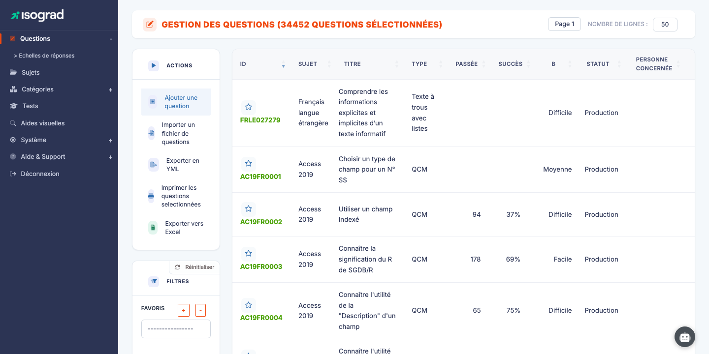
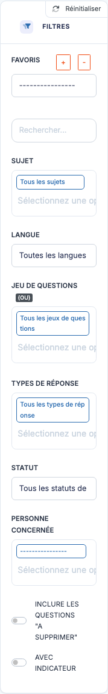

# Questions

La page **Gestion des questions** est le **centre nerveux** du module Questions : c'est ici que vous retrouvez toutes les questions rédigées sur votre plateforme, que vous les filtrez selon plusieurs dimensions (sujet, domaine, statut, personne concernée, etc.), et depuis laquelle vous lancez l'**éditeur** pour créer ou modifier une question.

Le comportement détaillé de l'éditeur lui-même est couvert dans le chapitre [Éditeur de questions](/ai/fr/question-module/question-editor/).

Accédez à la page via le menu **Questions**.

Le tableau présente les colonnes suivantes :

| Colonne | Contenu |
|---|---|
| **ID** | Identifiant textuel de la question (par exemple `S12Q0001`). L'étoile ☆ devant l'identifiant est le bouton indicateur. Les questions au statut *Production* sont mises en évidence. |
| **Sujet** | Sujet auquel la question est rattachée. |
| **Titre** | Libellé court de la question. |
| **Type** | Type de réponse : QCM, Texte à trous, Glisser-déposer, etc. |
| **Passée** | Nombre de fois où la question a déjà été posée à des candidats. |
| **Succès** | Taux de réussite (%) — pourcentage de candidats ayant répondu correctement. |
| **B** | Le niveau de difficulté fixé par l'auteur : *Facile*, *Moyenne* ou *Difficile*. |
| **Statut** | État éditorial de la question — voir [Statuts d'une question](#statuts). |
| **Personne concernée** | Administrateur en charge de la question. |

> ⚠️ **Aucun sujet ?** — Si aucun sujet ne vous est accessible, la page ouvre une fenêtre *« Pas de sujet disponible »* : vous devez créer au moins un sujet avant de créer des questions. Le bouton de la fenêtre vous conduit à la page **Sujets**.

## Statuts d'une question {#statuts}

Chaque question porte un **statut** qui régit son cycle de vie :

- **En rédaction** — statut de toute nouvelle question (créée, dupliquée ou importée). La question est librement modifiable et **n'est pas** posée aux candidats.
- Des statuts intermédiaires de relecture (par exemple *À vérifier*) permettent d'organiser la relecture entre auteurs.
- **Production** — la question est **disponible pour les candidats** dans les tests qui la sélectionnent. Une question en Production est en **lecture seule** dans l'éditeur.

Le statut se change depuis le **bloc de revue** en bas de l'éditeur (champ **Statut**), puis s'enregistre. Pour modifier à nouveau une question en Production, repassez son statut à *En rédaction* dans ce bloc et enregistrez ; le bloc de revue reste modifiable sur une question verrouillée. Les administrateurs disposant du privilège adéquat peuvent aussi la **déverrouiller** depuis la barre d'outils de l'éditeur.

## Filtres {#filtres}

Le panneau **Filtres** est très complet — c'est l'outil principal pour explorer une base de questions volumineuse.

### Filtres de base

- **Favoris** — sélecteur des combinaisons de filtres enregistrées, voir [Favoris de recherche](#favoris-de-recherche).
- **Rechercher** — texte libre (sur l'identifiant, le titre ou des fragments de contenu).
- **Sujet** — sélection multiple. Restreint à un ou plusieurs sujets.
- **Langue** — langue de la question.
- **Jeu de questions** — sélection multiple. Le badge à côté du champ bascule entre **(OU)** (questions dans l'un des jeux sélectionnés) et **(ET)** (questions dans tous).
- **Type de réponse** — QCM, Texte à trous, Glisser-déposer, Notation manuelle, etc.
- **Statut** — *En rédaction*, *Production*, etc. Permet de filtrer le pipeline éditorial.
- **Personne concernée** — restreint aux questions sous la responsabilité d'un administrateur donné.
- **Inclure les questions « À supprimer »** — commutateur, désactivé par défaut.
- **Avec indicateur** — commutateur ; n'affiche que les questions que vous avez étoilées.

### Filtre Domaine

Le filtre **Domaine** n'apparaît qu'**après la sélection d'un seul sujet** : il a besoin du sujet pour lister ses domaines.

### Réinitialiser

Le bouton **Réinitialiser** en haut du panneau remet tous les filtres à leur valeur par défaut et recharge le tableau complet.

## Favoris de recherche {#favoris-de-recherche}

Les **favoris** permettent de mémoriser une **combinaison de filtres** utilisée souvent et de la rappeler en un clic — par exemple *« Toutes les questions Excel en rédaction qui me sont attribuées »*.

### Créer un favori

1. Appliquez les filtres voulus (sujet, statut, personne concernée, etc.).
2. Cliquez sur le bouton **+** à côté du sélecteur **Favoris**.
3. Saisissez un nom pour le favori (par exemple `Excel-Brouillons-Marie`).
4. Validez. Le favori apparaît dans le sélecteur.

### Utiliser un favori

Dans le sélecteur **Favoris**, choisissez le favori voulu. La page se recharge avec les filtres mémorisés appliqués automatiquement.

### Supprimer un favori

Sélectionnez le favori, puis cliquez sur le bouton **−**. Le favori est retiré du sélecteur.

> 💡 **Favoris personnels** — Les favoris sont **propres à votre compte administrateur** : ils ne sont pas partagés avec les autres auteurs.

## Étoiler une question {#etoiler-une-question}

Dans la colonne **ID** de chaque ligne, une **icône étoile** permet de marquer une question pour la retrouver rapidement :

- **Cliquez sur l'étoile** pour marquer la question (l'étoile passe à l'état plein).
- **Cliquez à nouveau** pour retirer l'indicateur.

Les questions étoilées se listent ensuite avec le filtre **Avec indicateur**.

> 💡 **Différence avec les favoris de recherche** — Étoiler **une question** marque une **question individuelle**. Un **favori de recherche** enregistre une **combinaison de filtres**. Les deux mécanismes sont complémentaires.

## Actions sur une ligne {#actions-sur-une-ligne}

Chaque ligne du tableau présente plusieurs boutons d'action en fin de ligne :

- **Modifier** (crayon) — ouvre la page d'édition de la question. Voir [Éditeur de questions](/ai/fr/question-module/question-editor/).
- **Aperçu** (icône Play) — ouvre la question telle qu'elle apparaîtra au candidat (énoncé, options, médias). Permet de valider visuellement sans lancer un vrai test.
- **Dupliquer** — ouvre une fenêtre où vous choisissez le **sujet**, le **type de réponse** et la **langue** de la copie, puis la crée et ouvre sa page d'édition. La copie démarre au statut *En rédaction*.
- **Supprimer** — supprime la question. Affiché aux administrateurs autorisés à modifier la question. Refusé si la question figure dans la liste fixe de questions d'un **test**.

## Barre d'actions {#actions-de-masse}

La barre d'actions en haut de la page propose :

- **Ajouter une question** — ouvre une fenêtre demandant le **sujet**, le **type de réponse** et la **langue**, puis crée la question et ouvre l'éditeur.
- **Importer un fichier de questions** — voir [Importer des questions](#importer-des-questions) ci-dessous.
- **Exporter en YML** — télécharge les questions actuellement filtrées sous forme de fichier YAML (500 questions au plus ; au-delà de 100 questions, le téléchargement est une archive zip découpée en parties). Utile pour les sauvegardes ou pour travailler les questions avec un assistant IA.
- **Imprimer les questions sélectionnées** — génère une version imprimable des questions cochées dans le tableau (100 au maximum).
- **Exporter vers Excel** — voir [Exporter vers Excel](#exporter-vers-excel).

## Importer des questions {#importer-des-questions}

L'import permet de créer plusieurs questions en une seule opération.

1. Cliquez sur **Importer un fichier de questions** dans la barre d'actions.

    

2. Renseignez :

    - Le **sujet** auquel rattacher les questions importées.
    - La **langue** des questions.
    - Le ou les **jeux de questions** auxquels chaque question importée sera rattachée.
    - Le **fichier à importer** — un fichier Excel au format attendu. Téléchargez le **modèle de fichier** via le lien de la fenêtre : une ligne par question à choix multiple avec son titre, son énoncé, jusqu'à dix propositions, les numéros des propositions correctes, ses domaines et son score maximal.

3. Cliquez sur **Importer**. Le serveur traite le fichier, puis la liste est filtrée sur le sujet, la langue et les jeux importés et indique le nombre de questions créées.

> 💡 **Fichiers YAML** — Activez **Fichier YML** dans la fenêtre pour importer un document YAML au lieu d'un fichier Excel, par exemple produit avec un assistant IA suivant le format de question de la plateforme. L'importateur YAML gère tous les types de réponse. Une question déjà en *Production* ne peut pas être écrasée par un import.

Toutes les questions importées démarrent au statut **En rédaction**.

## Exporter vers Excel {#exporter-vers-excel}

Le bouton **Exporter vers Excel** de la barre d'actions génère un fichier `.xlsx` listant toutes les questions actuellement filtrées, avec leurs domaines. Pratique pour les audits de base, les revues éditoriales ou le partage avec des contributeurs externes.

## Prévisualiser une question {#previsualiser-une-question}

Le bouton **Aperçu** (icône Play) de chaque ligne ouvre la question telle qu'elle sera présentée au candidat :

- L'**énoncé** rendu (mise en forme, images, médias).
- Les **propositions de réponse** ou la zone de saisie, selon le type de question.
- Les éventuelles **aides visuelles** ou **documents de référence** attachés.

Vous pouvez interagir avec la question (cliquer sur des options, saisir du texte, manipuler) pour vérifier le comportement. **Aucun résultat n'est enregistré** — c'est un essai à blanc.

> 💡 **Quand l'utiliser ?** — Prévisualisez systématiquement après avoir modifié une question pour vérifier le rendu côté candidat. C'est aussi indispensable lors des revues éditoriales pour valider la qualité avant de passer le statut à *Production*.

## Bonnes pratiques {#bonnes-pratiques}

- **Filtrer avant d'agir** — sur une base volumineuse, manipuler la liste complète n'a pas de sens. Restreignez d'abord le périmètre avec les filtres (sujet + statut + personne concernée au minimum).
- **Utiliser les favoris pour les vues récurrentes** — la vue « brouillons à terminer » consultée chaque semaine mérite son favori.
- **Préférer l'aperçu à l'ouverture de l'éditeur** quand vous voulez simplement *vérifier* une question : l'éditeur est plus long à charger.
- **Vérifier avant de publier** — utilisez le bouton **Vérifier** de l'éditeur sur chaque question avant de la passer en *Production* : il détecte les oublis courants (proposition non marquée correcte, énoncé vide).
