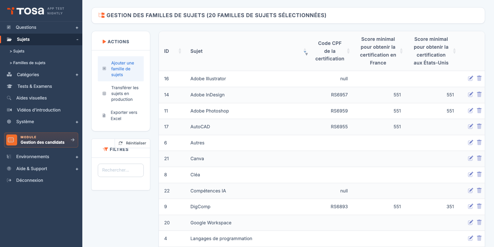
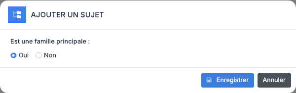
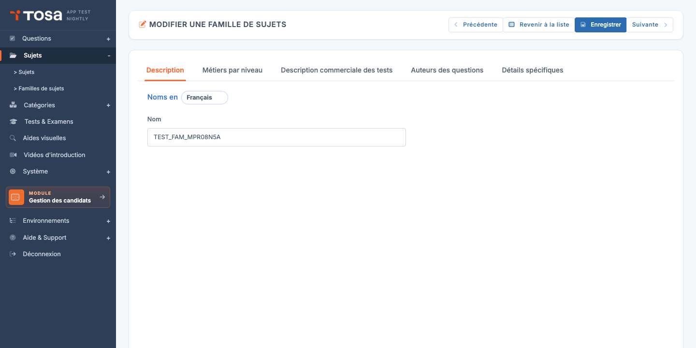

# Familles de sujets

Une **famille de sujets** regroupe plusieurs sujets sous une même bannière. Par exemple, la famille *Microsoft Excel* regroupe *Excel 2016*, *Excel 2019*, *Excel 365* ; la famille *Adobe Illustrator* regroupe les différentes versions du logiciel. C'est l'unité organisationnelle parente du sujet.

Accédez à la page via le menu **Module Questions → Sujets → Familles de sujets**, ou directement à `/subjects/AdminSubjectFamiliesWithTable`.

Le tableau liste toutes les familles définies, avec leur **identifiant**, leur **nom**, leur **code CPF** (le cas échéant) et leurs **scores minimum de certification** pour la France et les États-Unis.

## Familles principales et familles secondaires {#familles-principales-et-secondaires}

La plateforme distingue **deux types** de familles, identifiés par l'indicateur `is_pri` :

- **Famille secondaire** (`is_pri=0`) — un simple regroupement de sujets. Une seule chose à configurer : le **nom** dans chaque langue.
- **Famille principale** (`is_pri=1`) — une famille pivot qui **partage ses paramètres** avec tous ses sujets enfants : métiers par niveau, descriptions commerciales des tests, crédits d'auteurs, et paramètres de certification (code CPF, score minimum, badges Credly, mention « Test de Haut Niveau »).

Le choix entre principale et secondaire dépend de la nature des sujets regroupés. Une famille de **certifications officielles** (Tosa Excel, Tosa Word) est typiquement **principale** car tous ses sujets enfants partagent le même code CPF et la même grille de niveau. Une famille **purement organisationnelle** (« Tests internes RH »), qui ne fait que ranger des sujets indépendants, est **secondaire**.

> 💡 **Comment savoir si une famille est principale ?** — Ouvrez sa fiche d'édition : une famille principale présente **5 onglets** (Description, Métiers, Tests, Experts, Spécifiques) ; une famille secondaire n'a qu'un seul onglet **Description**.

## Créer une famille {#creer-une-famille}

1. Depuis la page **Gestion des familles de sujets**, cliquez sur **Ajouter une famille** dans la barre d'actions.

    

2. Saisissez :

    - Le **Nom** de la famille (mono- ou multilingue selon vos besoins).
    - Le commutateur **Famille principale** pour basculer en famille principale si vous voulez les onglets supplémentaires.

3. Validez. La famille est créée et vous êtes redirigé vers sa fiche d'édition.

> ⚠️ **Changer le type plus tard** — Le statut principale/secondaire **peut être modifié après création**, mais cela affecte la cohérence des sujets enfants : passer en secondaire détruit les paramètres partagés (métiers, descriptions commerciales). À l'inverse, passer en principale demande de remplir tous ces paramètres pour activer leur application aux sujets enfants.

## Onglets de la fiche famille {#onglets-de-la-fiche-famille}

### Famille secondaire — un seul onglet

Une famille secondaire n'a que l'onglet **Description** : Nom (mono- ou multilingue) et Nom long. Validez l'enregistrement et c'est terminé.

### Famille principale — cinq onglets

La page d'édition (titre **MODIFIER UNE FAMILLE DE SUJETS**) présente les onglets suivants :

| Onglet | Contenu |
|---|---|
| **Description** | Nom et Nom long de la famille (un sélecteur de langue **« Noms en »** en haut permet de basculer entre les langues actives). |
| **Métiers par niveau** | Pour chaque niveau (1 à 5) × chaque langue, liste des métiers correspondant. Cette information **se propage à tous les sujets enfants** : pas besoin de la redéfinir au niveau de chaque sujet. |
| **Description commerciale des tests** | Pour chaque langue, trois textes (carte courte, description longue, description courte) utilisés sur les pages publiques et dans les catalogues. **Partagés par tous les sujets enfants**. |
| **Auteurs des questions** | Crédit des auteurs et experts pour la famille — apparaît dans le rapport de chaque candidat ayant passé un sujet de la famille. **Partagé par tous les sujets enfants**. |
| **Détails spécifiques** | Paramètres de certification : code CPF (Mon Compte Formation), score minimum certifiant pour la France et les États-Unis, mention « Test de Haut Niveau » (HGH), captures d'écran de présentation, badges Credly. |

> 💡 **Pourquoi à la famille et pas au sujet ?** — Plutôt que de dupliquer les descriptions commerciales sur Excel 2016, Excel 2019, Excel 365, on les centralise sur la famille *Microsoft Excel* — un seul endroit à maintenir quand le wording change.

## Code CPF et certification {#code-cpf-et-certification}

L'onglet **Spécifiques** d'une famille principale propose les champs liés à la certification officielle :

- **Code CPF** — code unique attribué par France Compétences à la certification. C'est le code que les utilisateurs de **Mon Compte Formation** retrouvent dans le catalogue. Sans code CPF, la famille ne peut pas être présentée comme éligible CPF.
- **Score minimum certifiant — France** — note minimale (sur 1000) en-dessous de laquelle le candidat n'obtient pas la certification, en application des règles France Compétences. Par exemple, 351/1000.
- **Score minimum certifiant — USA** — équivalent pour le marché américain.
- **Test de Haut Niveau** — bascule la famille en certification de haut niveau, ce qui modifie le diplôme émis (mention spéciale, design renforcé).
- **Badges Credly** — identifiants des badges digitaux émis sur la plateforme Credly pour les candidats certifiés. Un badge par niveau (Basique, Opérationnel, Avancé, Expert).
- **Capture d'écran de présentation** — image utilisée sur les pages catalogue pour illustrer la famille.

> ⚠️ **Modifier après mise en production** — Modifier le code CPF ou les scores minimum après que la famille a déjà délivré des certifications **n'invalide pas** les certifications passées. Les futurs candidats sont en revanche jugés selon les nouvelles règles.

## Supprimer une famille {#supprimer-une-famille}

1. Sur la ligne de la famille, cliquez sur l'icône **Supprimer**.
2. Confirmez.

> ⚠️ **Famille avec sujets** — Une famille qui contient au moins un **sujet** ne peut pas être supprimée. La plateforme bloque l'opération avec un message d'erreur. Avant suppression, **retirez ou déplacez** les sujets enfants vers une autre famille.

## Transférer en production {#transferer-en-production}

Comme pour les sujets, le bouton **Transférer les familles en production** dans la barre d'actions permet de promouvoir une famille de la préproduction vers la production. Tout l'ensemble — la famille et ses sujets, questions, formulaires de test — est transféré en une seule opération.

Réservé aux modifications stratégiques (création d'une nouvelle certification CPF, refonte d'un référentiel). Pour les ajustements ponctuels (ajout d'une question), passez par le transfert au niveau du sujet.
