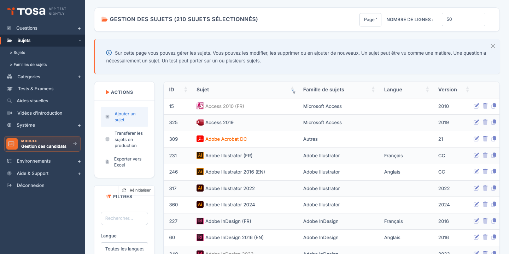
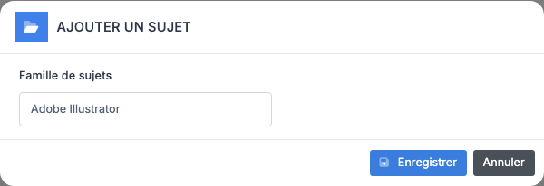
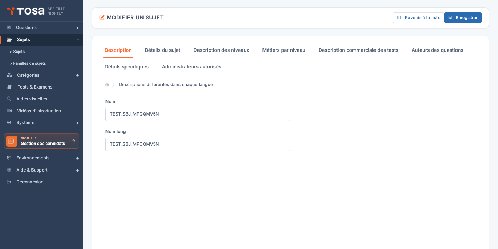
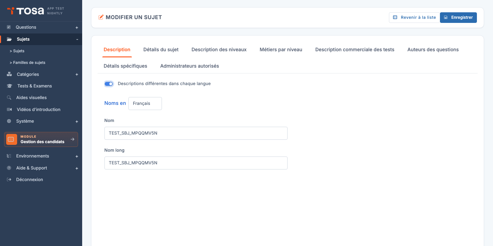
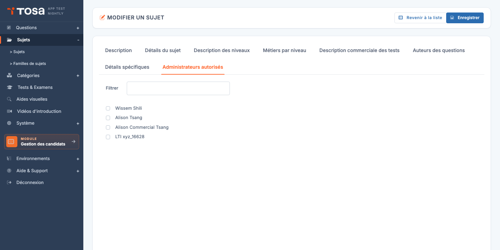

# Sujets

Un **sujet** est la matière évaluable centrale de la plateforme : *Excel 2016*, *Python*, *Anglais B2*. Toutes les questions, tous les domaines, tous les formulaires de test sont attachés à un sujet. Ce chapitre couvre la liste des sujets, leur création, et la fiche d'édition multi-onglets qui permet de tout paramétrer — du nom commercial du test aux administrateurs autorisés à voir le sujet.

Accédez à la page via le menu **Module Questions → Sujets**, ou directement à `/subjects/AdminSubjectsWithTable`.

Le tableau liste tous les sujets disponibles, avec leur **identifiant**, leur **nom**, leur **famille de sujets**, leur **langue** et leur **version**. Les filtres en haut de page permettent de cibler par texte libre, langue ou famille.

## Créer un sujet {#creer-un-sujet}

La création d'un sujet se fait en deux étapes : une fenêtre minimale pour choisir la **famille de sujets**, puis la fiche d'édition pour configurer le reste.

### Étape 1 — Choisir la famille

1. Depuis la page **Gestion des sujets**, cliquez sur **Ajouter un sujet** dans la barre d'actions.

    

2. Dans la fenêtre qui s'ouvre, sélectionnez la **famille de sujets** à laquelle le nouveau sujet appartient (Bureautique, Programmation, etc.).

3. Validez. La plateforme crée un sujet vide et vous amène directement sur sa fiche d'édition.

### Étape 2 — Renseigner les champs essentiels

Sur la fiche d'édition (page **SubjectUpdate**), commencez par renseigner :

- Le **nom** du sujet (onglet **Description**).
- Les **détails du sujet** (onglet **Détails du sujet**) : type de sujet, langue de référence, statut public/archivé, version.

Le sujet apparaît dans la liste dès que vous enregistrez. Vous pouvez ensuite revenir compléter les autres onglets au fil de l'eau.

> 💡 **Sujet vide vs publié** — Un sujet créé sans questions ni paramètres complets reste **non publié** par défaut (case **Public** décochée). Les candidats et les administrateurs de compte client ne le verront pas tant que vous ne l'aurez pas explicitement publié.

## Onglets de la fiche sujet {#onglets-de-la-fiche-sujet}

La fiche d'édition (page **MODIFIER UN SUJET**) est organisée en **huit onglets** :

| Onglet | Contenu |
|---|---|
| **Description** | Nom du sujet et Nom long (mono- ou multilingue selon le commutateur). |
| **Détails du sujet** | Type (Standard, Programming, Remote, …), groupe TOS et ITS, langue de référence, statut Public/Archivé, présence de micro-compétences, version, icône. |
| **Description des niveaux** | Pour chaque niveau de 1 à 5 et chaque langue, descriptif de ce que sait faire un candidat de ce niveau. |
| **Métiers par niveau** | Pour chaque niveau × langue, liste des métiers correspondant à ce niveau de compétence. Sert à proposer des passerelles dans les rapports candidats. |
| **Description commerciale des tests** | Pour chaque langue, trois textes (carte courte, description longue, description courte) utilisés sur les pages publiques et dans les catalogues. |
| **Auteurs des questions** | Crédit des auteurs et experts du sujet, affiché dans les rapports — un texte par langue. |
| **Détails spécifiques** | Champs visibles uniquement pour certains types : par exemple, langage de programmation associé pour les sujets Programming, ou commande d'application distante pour les sujets Remote. |
| **Administrateurs autorisés** | Liste des administrateurs autorisés à voir et modifier ce sujet. |

> ⚠️ **Enregistrer entre les onglets** — Le bouton **Enregistrer** en haut à droite sauvegarde **l'ensemble** de la fiche. Vous pouvez donc remplir plusieurs onglets puis enregistrer une seule fois. En revanche, **changer d'onglet sans enregistrer perd les modifications non sauvegardées** — pensez à valider avant de passer à un autre sujet.

## Multilingue {#multilingue}

Pour chaque sujet, vous choisissez si le **nom** et la **description** doivent être identiques dans toutes les langues du compte, ou personnalisés par langue.

Le commutateur **Descriptions différentes dans chaque langue** (`has_mul_nam`) bascule entre les deux modes :

- **Désactivé (par défaut)** — un seul champ **Nom** et un seul champ **Nom long**, partagés par toutes les langues.
- **Activé** — un bloc par langue (FR / EN / DE / NL / ES / IT / EL / AR selon votre offre) avec un champ Nom et un champ Nom long spécifiques à chaque langue.

> 💡 **Quand activer ?** — Le mode multilingue est utile pour les sujets dont le nom commercial diffère selon le pays (par exemple un test certifiant qui a un acronyme local différent). Pour la grande majorité des sujets techniques (Excel, Python), un seul nom suffit.

Les **autres onglets** (Description des niveaux, Métiers par niveau, Description commerciale, Auteurs) sont **toujours multilingues** : vous remplissez une description par langue, indépendamment du réglage `has_mul_nam`.

## Niveaux et métiers par niveau {#niveaux-et-metiers}

La plateforme Tosa note les candidats sur une **échelle de 5 niveaux** (Initial / Basique / Opérationnel / Avancé / Expert, selon le sujet). Deux onglets vous permettent de documenter ces niveaux :

### Description des niveaux

L'onglet **Description des niveaux** propose, pour chaque langue, un texte par niveau (de 1 à 5) qui décrit ce qu'un candidat de ce niveau **sait faire**. Ces descriptions apparaissent dans le rapport de chaque candidat : *« Niveau 3 — Le candidat sait construire des tableaux croisés dynamiques simples… »*.

Soignez ces descriptions : elles sont la principale information que reçoit le candidat sur ce que signifie son score.

### Métiers par niveau

L'onglet **Métiers par niveau** propose, pour chaque langue et chaque niveau, une liste de **métiers** correspondants : *« Niveau 4 — Contrôleur de gestion, Analyste financier junior »*. Cette information est affichée dans les rapports pour donner au candidat une projection professionnelle.

Format conseillé : une liste de métiers séparés par des virgules, en cohérence avec les référentiels métier de votre marché.

## Description commerciale des tests {#description-commerciale}

L'onglet **Description commerciale des tests** fournit trois textes par langue, utilisés sur les pages publiques du catalogue (`isograd.com`, `tosa.org`) et dans les emails d'invitation :

- **Description carte** (`its_tst_des[car]`) — quelques mots pour la vignette de catalogue.
- **Description longue** (`its_tst_des[lon]`) — paragraphe descriptif détaillé.
- **Description courte** (`its_tst_des[sho]`) — phrase d'accroche.

Renseignez ces textes uniquement si le sujet est destiné à être vendu via les catalogues publics. Pour un sujet interne ou propriétaire, ils peuvent rester vides.

## Auteurs des questions {#auteurs-des-questions}

L'onglet **Auteurs des questions** contient un seul champ libre par langue : le **crédit des auteurs et experts** qui ont conçu le sujet. Ce texte apparaît au pied du rapport de chaque candidat : *« Sujet conçu par Pr. Jean Dupont, Université de Paris »*.

Utile pour la traçabilité éditoriale et la valorisation des contributeurs externes.

## Détails spécifiques selon le type {#details-specifiques}

L'onglet **Détails spécifiques** affiche des champs **dépendants du type de sujet** (`typ_id`) configuré dans l'onglet *Détails du sujet* :

- **Programming** (`typ_id=1`) — affiche le champ **Langage de programmation associé** (Python, JavaScript, …). Détermine l'environnement d'exécution des questions de code.
- **Remote** (`typ_id=2`) — affiche le champ **Commande d'application distante** (chemin d'invocation de l'application contrôlée à distance, par exemple Excel ou Word installés sur un VDI).
- **Standard** (`typ_id=3` ou `4`) — l'onglet est vide ; aucun paramètre spécifique requis.

Le changement de type **masque ou révèle dynamiquement** les champs : pas besoin de recharger la page.

## Administrateurs autorisés {#administrateurs-autorises}

L'onglet **Administrateurs** liste tous les administrateurs habilités à voir et modifier ce sujet. Par défaut, un nouveau sujet est visible par les administrateurs disposant du privilège **Lecture/écriture de tous les sujets**.

- Cochez la case devant un nom pour **autoriser** cet administrateur sur le sujet.
- Décochez pour **révoquer** son accès.
- Utilisez le champ **Filtrer** en haut de la liste pour retrouver rapidement un administrateur dans une longue liste.

> 💡 **Cloisonnement éditorial** — Cette fonctionnalité est utile quand vous avez plusieurs équipes de production : chacune ne voit que ses sujets. La décocher pour tous les admins externes garantit qu'un sujet en cours de rédaction n'est pas visible avant validation.

## Dupliquer un sujet {#dupliquer-un-sujet}

La duplication crée un **nouveau sujet** à partir d'un existant, en copiant toutes ses configurations (nom, descriptions, niveaux, métiers, etc.). C'est l'outil le plus rapide pour démarrer un sujet voisin (par exemple une nouvelle version d'Excel à partir de la précédente).

1. Sur la ligne du sujet source dans la liste, cliquez sur l'icône **Dupliquer**.
2. Confirmez. La plateforme crée une copie portant le suffixe « (copie) » et vous amène sur sa fiche d'édition.
3. **Renommez** immédiatement la copie pour éviter la confusion, puis adaptez les champs nécessaires.

> ⚠️ **Les questions ne sont pas dupliquées** — La duplication d'un sujet **copie sa configuration** mais **pas les questions** qui lui sont attachées. Le sujet dupliqué démarre donc avec zéro question — c'est à vous de les rédiger ou de les transférer ensuite.

## Supprimer un sujet {#supprimer-un-sujet}

1. Sur la ligne du sujet, cliquez sur l'icône **Supprimer** (poubelle).
2. Confirmez la suppression dans la fenêtre qui s'affiche.

> ⚠️ **Sujets avec questions** — Un sujet qui contient au moins une **question** ne peut pas être supprimé. La plateforme affiche un message d'erreur (« Impossible de supprimer ce sujet car il contient des questions ») et la suppression est annulée. Avant de supprimer, retirez ou archivez les questions attachées au sujet.

> 💡 **Préférer l'archivage** — Pour un sujet obsolète mais dont on veut préserver l'historique, ne le supprimez pas : **archivez-le** via l'onglet *Détails du sujet* (case **Archivé**). Le sujet disparaît des listes par défaut mais reste consultable, et les anciens rapports continuent de fonctionner.

## Exporter la liste {#exporter-la-liste}

Le bouton **Exporter vers Excel** dans la barre d'actions génère un fichier `.xlsx` listant tous les sujets actuellement filtrés à l'écran. Utile pour les bilans périodiques ou pour communiquer la liste à des contributeurs externes.

## Transférer les sujets en production {#transferer-en-production}

Le bouton **Transférer les sujets en production** dans la barre d'actions ouvre un assistant qui permet de **promouvoir** un sujet de l'environnement de préproduction vers la production publique. C'est l'étape qui rend le sujet (et ses questions, ses formulaires de test) accessible aux comptes clients réels.

Suivez l'assistant pour sélectionner le ou les sujets à transférer, confirmer les vérifications préalables (présence d'un nombre minimum de questions calibrées, description complète dans chaque langue active, etc.), puis valider le transfert.

> ⚠️ **Action sensible** — Un sujet transféré en production est immédiatement visible par les comptes clients. Vérifiez méticuleusement avant de valider : un sujet incomplet ou non relu peut atteindre des candidats.
