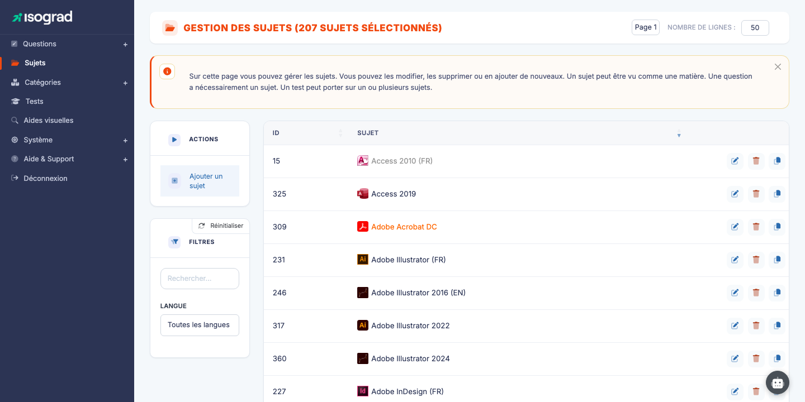
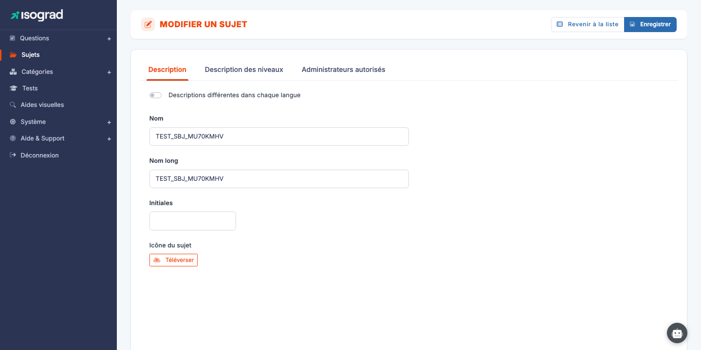
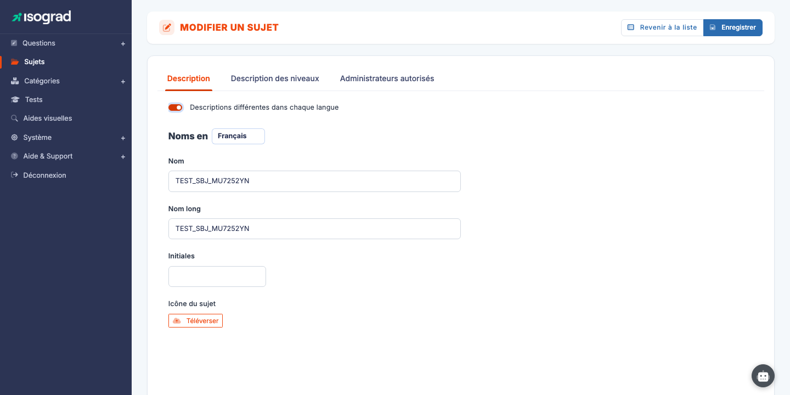
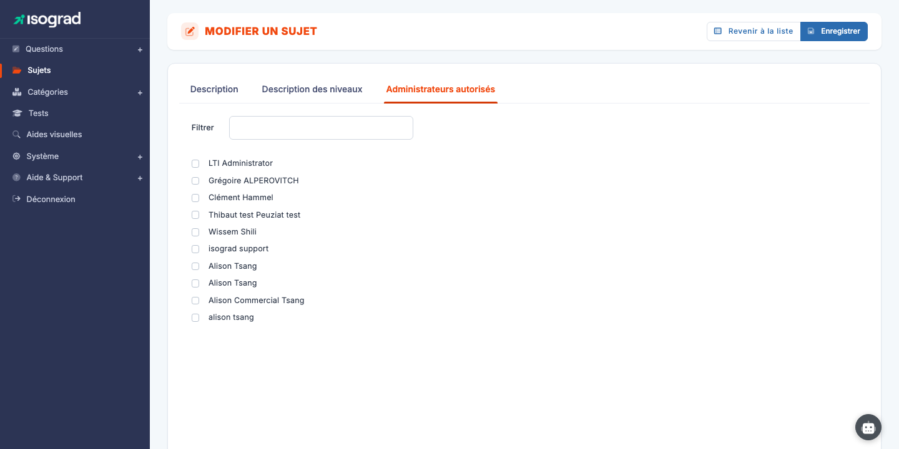

# Sujets

Un **sujet** est la matière évaluable centrale de votre plateforme : *Excel*, *Python*, *Procédures internes de sécurité*. Toutes les questions, tous les domaines et tous les tests sont attachés à un sujet. Ce chapitre couvre la liste des sujets, leur création, et la fiche d'édition à trois onglets qui permet de nommer le sujet, de décrire ses niveaux de compétence et de choisir les administrateurs autorisés à y travailler.

Accédez à la page via le menu **Sujets**.

Le tableau liste tous les sujets que vous êtes autorisé à voir, avec leur **identifiant** et leur **nom**, précédé de leur icône (ou d'initiales colorées si aucune icône n'a été téléversée). Le filtre **Rechercher** à gauche permet de cibler un sujet par son nom ; le filtre **Langue** peut rester sur *Toutes les langues*, les sujets n'étant pas rattachés à une langue sur votre plateforme.

> 💡 **Qui voit quels sujets ?** — Un administrateur principal voit tous les sujets du compte. Les autres administrateurs ne voient que les sujets sur lesquels ils ont été habilités (voir [Administrateurs autorisés](#administrateurs-autorises)), ainsi que les sujets qu'ils ont créés eux-mêmes.

## Créer un sujet {#creer-un-sujet}

1. Depuis la page **Gestion des sujets**, cliquez sur **Ajouter un sujet** dans la barre d'actions.

2. La plateforme crée immédiatement un sujet vide et ouvre sa fiche d'édition (page **Modifier un sujet**).

3. Renseignez au minimum le **nom** dans l'onglet **Description**, puis cliquez sur **Enregistrer** en haut à droite.

Le sujet apparaît dans la liste dès sa création. Vous pouvez revenir compléter les autres onglets plus tard.

> ⚠️ **Sujets vides** — Le sujet est créé dès le clic sur **Ajouter un sujet**, avant toute saisie. Si vous quittez la fiche sans enregistrer, un sujet sans nom reste dans la liste : ouvrez-le pour le nommer, ou supprimez-le depuis la liste.

> 💡 **Visibilité** — Un sujet est utilisable immédiatement : dès qu'il existe, il peut recevoir des questions et être choisi à la création d'un test. Il n'y a pas d'étape de publication distincte.

## Onglets de la fiche sujet {#onglets-de-la-fiche-sujet}

La fiche d'édition est organisée en **trois onglets** :

| Onglet | Contenu |
|---|---|
| **Description** | Nom et nom long du sujet (mono- ou multilingue selon le commutateur), initiales et icône. |
| **Description des niveaux** | Pour chaque niveau de 1 à 5 et chaque langue de rapport, descriptif de ce que sait faire un candidat de ce niveau. |
| **Administrateurs autorisés** | Liste des administrateurs habilités à voir et modifier ce sujet. |

> ⚠️ **Enregistrer entre les onglets** — Le bouton **Enregistrer** en haut à droite sauvegarde **l'ensemble** de la fiche. Vous pouvez donc remplir plusieurs onglets et n'enregistrer qu'une fois. En revanche, quitter la page sans enregistrer perd les modifications en cours — pensez à enregistrer avant de passer à un autre sujet.

## Description, mode multilingue et icône {#multilingue}

L'onglet **Description** porte l'identité du sujet.

### Nom et nom long

Le commutateur **Descriptions différentes dans chaque langue** bascule entre deux modes :

- **Désactivé (par défaut)** — un seul champ **Nom** et un seul champ **Nom long**, communs à toutes les langues de votre compte.
- **Activé** — un bloc par langue de votre compte (titre **Noms en**, avec un sélecteur de langue), avec un Nom et un Nom long propres à chaque langue.

Les langues proposées sont celles activées sur votre compte (voir le chapitre *Gestion du compte* du manuel administrateur).

> 💡 **Quand l'activer ?** — Le mode multilingue est utile lorsque les candidats passent des tests dans plusieurs langues et que le sujet doit être nommé dans chacune d'elles. Pour un sujet utilisé dans une seule langue, un nom unique suffit.

### Initiales

Le champ **Initiales** (deux caractères au maximum) définit les lettres affichées sur la pastille colorée du sujet dans les listes et les rapports lorsqu'aucune icône n'a été téléversée. Laissé vide, la plateforme utilise les deux premières lettres du nom.

### Icône du sujet

Le bloc **Icône du sujet** permet de téléverser une image (PNG, JPG, GIF ou SVG) qui remplace la pastille d'initiales partout où le sujet est affiché. Cliquez sur **Téléverser** et choisissez le fichier ; un aperçu apparaît une fois le téléversement terminé. Le bouton de suppression à côté de l'aperçu retire l'icône et rétablit les initiales.

## Description des niveaux {#description-des-niveaux}

La plateforme peut positionner les candidats sur une **échelle à 5 niveaux**. L'onglet **Description des niveaux** propose, pour chaque langue de rapport, un texte par niveau (1 à 5) décrivant ce qu'un candidat de ce niveau **sait faire**.

Ces descriptions sont facultatives. Lorsqu'elles sont renseignées, elles apparaissent dans le rapport du candidat comme synthèse du niveau atteint : *« Niveau 3 — Le candidat sait construire des tableaux croisés dynamiques simples… »*.

Soignez ces descriptions : c'est la principale information que reçoit le candidat sur la signification de son score.

> 💡 **Niveaux par domaine** — Vous pouvez affiner ces descriptions domaine par domaine dans l'onglet **Niveaux de compétence** de chaque [domaine](/ai/fr/question-module/domains/#onglets-de-la-fiche-domaine).

## Administrateurs autorisés {#administrateurs-autorises}

L'onglet **Administrateurs autorisés** liste les administrateurs de votre compte qui travaillent dans le module Questions sans disposer du privilège de voir **tous** les sujets. Cochez ceux qui sont autorisés à voir et modifier ce sujet.

- Cochez la case devant un nom pour **autoriser** cet administrateur sur le sujet.
- Décochez pour **révoquer** son accès.
- Utilisez le champ **Filtrer** en haut de la liste pour retrouver rapidement un administrateur dans une longue liste.
- Les administrateurs dont la connexion a été désactivée apparaissent grisés.

> 💡 **Cloisonnement éditorial** — Cette fonctionnalité est utile quand vous avez plusieurs équipes de rédaction : chacune ne voit que ses sujets. Les administrateurs principaux et ceux qui disposent du privilège « tous les sujets » ne figurent pas dans cette liste, car ils voient toujours l'ensemble des sujets.

> 💡 **Votre propre accès** — Vous n'apparaissez pas dans cette liste : l'enregistrement ne retire jamais votre propre accès au sujet.

## Dupliquer un sujet {#dupliquer-un-sujet}

La duplication crée un **nouveau sujet** à partir d'un existant, en copiant sa configuration (noms, noms longs, initiales, icône et descriptions des niveaux). C'est l'outil le plus rapide pour démarrer un sujet voisin.

1. Sur la ligne du sujet source dans la liste, cliquez sur l'icône **Dupliquer**.
2. La plateforme crée la copie et vous amène sur sa fiche d'édition.
3. **Renommez** immédiatement la copie : elle porte le même nom que l'original, ce qui prête à confusion dans les listes.

> ⚠️ **Les questions et les administrateurs ne sont pas dupliqués** — La duplication d'un sujet **copie sa configuration** mais **pas les questions** qui lui sont attachées, ni la liste des administrateurs autorisés. Le sujet dupliqué démarre donc avec zéro question.

## Supprimer un sujet {#supprimer-un-sujet}

1. Sur la ligne du sujet, cliquez sur l'icône **Supprimer** (poubelle).
2. Sur la page qui s'ouvre, cliquez sur le bouton **Supprimer** pour confirmer.

> ⚠️ **Sujets avec questions** — Un sujet qui contient au moins une **question** ne peut pas être supprimé. La plateforme affiche un message d'erreur (« Ce sujet ne peut pas être supprimé car il est utilisé par des questions ») et la suppression est annulée. Avant de supprimer, retirez les questions attachées au sujet.

> 💡 **Qui peut supprimer ?** — Un sujet peut être supprimé par un administrateur principal ou par un administrateur habilité sur ce sujet.
