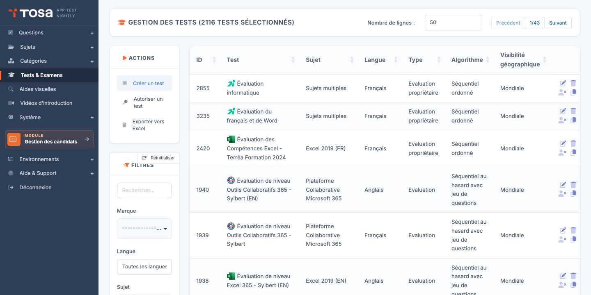
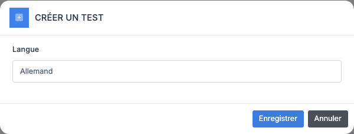
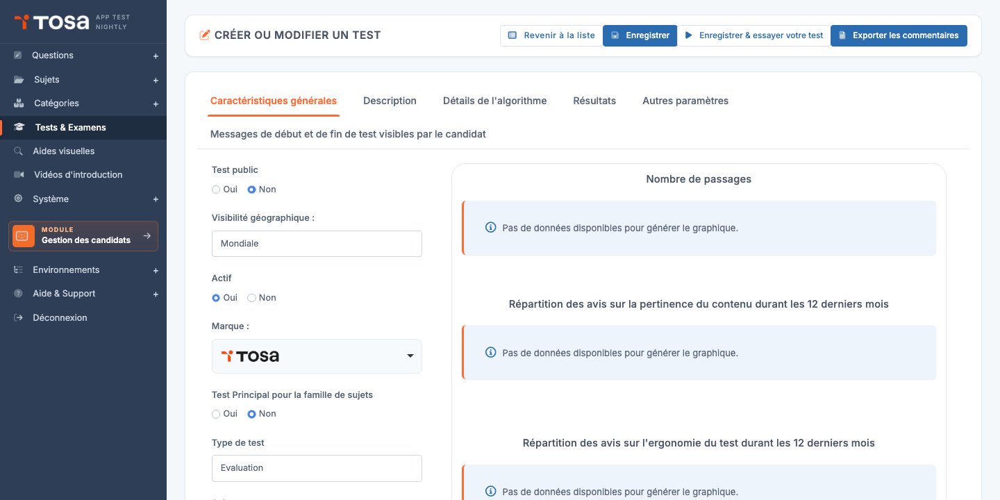

# Tests (formulaires de test)

Un **test** — appelé techniquement *« formulaire de test »* (`test_form`) dans le code et les rapports d'audit — est l'assemblage final qui devient passable par un candidat. C'est le point de jonction où vous prenez une **sélection de questions** d'un sujet, vous y appliquez un **algorithme de tirage**, vous fixez des **paramètres** (durée, nombre de questions, surveillance, etc.) et vous obtenez un livrable utilisable par un compte client.

Tout test inscrit à un candidat sur la plateforme — qu'il s'agisse d'une évaluation, d'une certification ou d'un positionnement — est défini par un de ces formulaires.

Accédez à la page via le menu **Module Questions → Tests & Examens**, ou directement à `/testforms/AdminTestFormsWithTable`.

Le tableau (titre **GESTION DES TESTS**) liste tous les tests, avec leur **identifiant**, leur **nom**, leur **sujet**, leur **langue**, leur **type**, leur **algorithme** et leur **visibilité géographique** (Mondiale par défaut, ou restreinte à certains pays/régions).

## Concepts {#concepts}

### Types de formulaires

Chaque formulaire a un **type** (`typ_id`) qui détermine son usage :

| Type | Usage |
|---|---|
| **Évaluation** | Test d'évaluation continue, sans valeur certifiante. C'est le format le plus courant. |
| **Certification** | Test sanctionnant officiellement un niveau. Soumis aux règles de France Compétences si éligible CPF. |
| **Certification propriétaire** | Variante de la certification avec des règles spécifiques au compte. |
| **Certification sans sujet** | Certification transversale qui ne se rattache pas à un sujet particulier. |
| **Positionnement** | Test diagnostique passé en début de formation pour évaluer le niveau initial. |

Le type conditionne le comportement de la plateforme côté candidat (présentation, génération du diplôme) et côté administrateur (limitations sur le passage, options disponibles).

### Algorithme de tirage

Un formulaire ne contient pas directement la liste des questions à poser — il définit **un algorithme** qui sélectionne les questions au démarrage de chaque session. Les algorithmes courants :

- **Adaptatif** — l'algorithme ajuste la difficulté des questions en fonction des réponses du candidat. C'est l'algorithme phare de Tosa.
- **CEFR / niveau** — sélection ciblée d'un niveau de référence (A1-C2 pour les langues).
- **Tirage simple** — N questions tirées au hasard parmi un pool.

Chaque algorithme a ses propres paramètres (longueur, pool de domaines, distribution des niveaux) configurés sur l'onglet **Algorithme**.

### Mode avancé vs mode client

L'interface du formulaire bascule entre deux modes selon les privilèges et le contexte :

- **Mode avancé** (utilisé par les contenus Isograd) — 6 onglets, toutes les options éditoriales et techniques.
- **Mode client** — interface simplifiée à 4 onglets pour les administrateurs d'un compte qui personnalisent un formulaire existant.

Le mode est déterminé par le drapeau `is_advanced_test_form` du formulaire et par votre profil utilisateur.

## Créer un formulaire {#creer-un-formulaire}

La création se fait via un modal de pré-sélection (sujet, langue, type), suivi de la fiche d'édition.

1. Depuis la page **Gestion des formulaires de test**, cliquez sur **Créer un formulaire** dans la barre d'actions.

    

2. Choisissez :

    - **Sujet** — la matière que le formulaire évalue.
    - **Langue** — langue de présentation au candidat.
    - **Type** — Évaluation, Certification, etc. (voir [Types de formulaires](#concepts)).

3. Validez. La plateforme crée le formulaire et vous amène sur sa fiche d'édition.

## Onglets de la fiche en mode avancé {#onglets-mode-avance}

La fiche d'édition (titre **CRÉER OU MODIFIER UN TEST**) propose cinq onglets en mode avancé :

| Onglet | Contenu |
|---|---|
| **Caractéristiques générales** | Test public (Oui/Non), Visibilité géographique, statut Actif, Marque, Test principal pour la famille de sujets, Type de test, plus les messages de début et de fin visibles par le candidat. La fiche embarque aussi un panneau de statistiques (nombre de passages, avis sur la pertinence et l'ergonomie). |
| **Description** | Descriptions commerciales par langue : carte courte, description longue, description courte. Reprises dans les catalogues publics. |
| **Détails de l'algorithme** | Choix de l'algorithme et paramètres : pool de domaines évalués, distribution des niveaux, contraintes de tirage, équilibrage des questions par domaine. |
| **Résultats** | Configuration de l'analyse : seuils de niveau, formule de notation, structure du rapport. |
| **Autres paramètres** | Surveillance à distance, plein écran, sauvegarde automatique, comportement en cas d'interruption, options techniques diverses. |

> 💡 **Boutons d'action** — En plus du bouton **Enregistrer**, l'en-tête propose **Enregistrer & essayer votre test** (lance le test pour vous-même comme prévisualisation) et **Exporter les commentaires** (récupère les commentaires laissés par les candidats sur les questions de ce test).

> 💡 **Mode allégé** — Dans certains environnements (`is_cus_env`), l'onglet **Description** n'apparaît pas séparément : ses champs sont inlinés dans l'onglet **Caractéristiques générales**.

## Onglets de la fiche en mode client {#onglets-mode-client}

Pour un administrateur de compte client qui personnalise un formulaire fourni par Isograd, l'interface est plus simple :

| Onglet | Contenu |
|---|---|
| **Général** | Paramètres modifiables : nom local, statut, sujet (lecture seule). |
| **Time** | Durée du test (peut être ajustée localement). |
| **Intro & Feedback** | Personnalisation des messages d'intro et de fin. |
| **Statistiques** | Tableau récapitulatif des passages du formulaire sur ce compte. |

> 💡 **Pourquoi cette restriction ?** — En mode client, vous ne pouvez **pas** modifier l'algorithme ou le pool de questions, car ces paramètres sont contrôlés par Isograd pour garantir la cohérence des résultats entre tous les comptes utilisant le même formulaire. Vous pouvez en revanche personnaliser l'**enrobage** (intro, feedback, durée).

## Modifier un formulaire {#modifier-un-formulaire}

1. Sur la ligne du formulaire, cliquez sur l'icône **Modifier** (crayon).
2. Naviguez entre les onglets et ajustez les valeurs souhaitées.
3. Cliquez sur **Enregistrer** en haut à droite.

> ⚠️ **Formulaires en production** — Modifier un formulaire **déjà utilisé** par des candidats actifs peut affecter leur expérience. Pour les changements profonds (algorithme, structure), créez plutôt un **nouveau formulaire** ou **dupliquez** l'existant pour conserver une trace de la version utilisée historiquement.

## Dupliquer un formulaire {#dupliquer-un-formulaire}

La duplication est l'outil le plus rapide pour créer une variante d'un formulaire existant (autre langue, ajustement local, version « light »).

1. Sur la ligne du formulaire à dupliquer, cliquez sur l'icône **Dupliquer**.
2. La plateforme crée une copie avec le suffixe « (copie) » et vous amène sur sa fiche d'édition.
3. **Renommez** la copie pour éviter la confusion et adaptez les paramètres.

> 💡 **La duplication conserve** — la sélection d'algorithme, les paramètres de surveillance, les descriptions, les messages d'intro et de feedback. Elle ne duplique pas les **questions** elles-mêmes (les formulaires les référencent par filtre, pas par liste fixe).

## Supprimer un formulaire {#supprimer-un-formulaire}

1. Sur la ligne du formulaire, cliquez sur l'icône **Supprimer**.
2. Confirmez sur la page de confirmation.

> ⚠️ **Formulaire utilisé par des candidats** — Un formulaire référencé par des **inscriptions de tests** (terminées ou en cours) ne peut pas être supprimé. Préférez l'**archivage** via le statut sur l'onglet Général : le formulaire devient invisible pour les nouvelles inscriptions mais reste fonctionnel pour les tests historiques.

## Filtres {#filtres}

Le panneau **Filtres** propose :

- **Rechercher** — texte libre sur le nom ou l'ID.
- **Langue** — par langue du formulaire.
- **Sujet** — par sujet associé.

Le tri par colonne est disponible en cliquant sur les en-têtes.

## Autoriser un formulaire pour un compte {#autoriser-formulaire}

Sur la liste, en plus du bouton **Créer**, vous trouverez un bouton **Autoriser** qui ouvre une interface permettant d'attribuer un formulaire existant à un ou plusieurs **comptes clients**. Cette opération règle les conditions d'accès :

- Le formulaire devient visible et utilisable par les comptes ciblés.
- Les autres comptes ne le voient pas dans leurs sélections.

Utile pour les formulaires propriétaires commandés par un client précis, ou pour les certifications pilotes destinées à un groupe restreint d'utilisateurs.

## Exporter la liste {#exporter-la-liste}

Le bouton **Exporter vers Excel** dans la barre d'actions génère un fichier `.xlsx` listant tous les formulaires actuellement filtrés. Précieux pour les revues périodiques du catalogue de tests.
